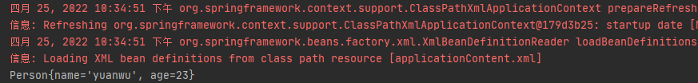
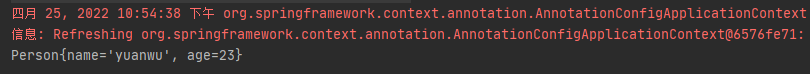
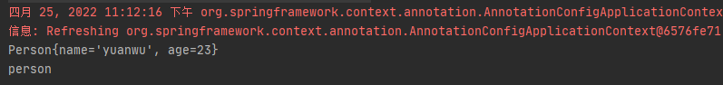
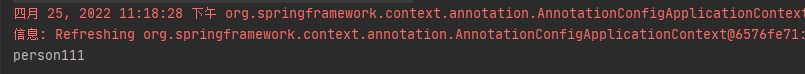

# 第1章：@Configuration和@Bean给容器中注册组件
> There is no fate but what we make for ourselves.
## 是什么
@Configuration 是一个类级别的注解，用来代替xml的配置类组件， 如果在一个类上标注了 `@Configuration` 注解， 相当于xml配置中的 `<beans></beans>` 标签，即配置类==配置文件。

@Bean 是一个方法级别的注解, 与 @Configuration 注解配合使用, 默认用方法名作为id 相当于xml配置中的 `<bean></bean>` 标签.

@Configuration、@Bean 都是Spring 3.0 引入的。

## 能干嘛

## 去哪下

官方文档：https://docs.spring.io/spring-framework/docs/current/javadoc-api/org/springframework/context/annotation/Configuration.html

## 怎么玩

### 工程结构

```java
section01
└── src
│   ├── main
│   │   ├── java
│   │   │   └── cn.taspile.section01
│   │   │       │── bean
│   │   │       │	└── Person.java
│   │   │       │── config
│   │   │       │	└── BeanConfig.java
│   │   │       └── App.java
│   │   └── resources	
│   │       └── applicationContent.xml
│   └── test
│        └── java
└── pom.xm
```

### 通过XML配置文件的方式注入 JavaBean

1. 在 `pom.xml` 配置文件中添加Spring依赖

```xml
<dependencies>
    <dependency>
        <groupId>org.springframework</groupId>
        <artifactId>spring-context</artifactId>
        <version>4.3.12.RELEASE</version>
    </dependency>
</dependencies>
```

2.  在 `cn.taspile.section01.bean` 包下创建一个名为Person类的文件

```java
package cn.taspile.section01.bean;

/**
 * @author cristina
 */
public class Person {

    private String name;
    private int age;

    public Person() {
    }

    public Person(String name, int age) {
        this.name = name;
        this.age = age;
    }

    public String getName() {
        return name;
    }

    public void setName(String name) {
        this.name = name;
    }

    public int getAge() {
        return age;
    }

    public void setAge(int age) {
        this.age = age;
    }

    @Override
    public String toString() {
        return "Person{" +
                "name='" + name + '\'' +
                ", age=" + age +
                '}';
    }
}
```

3.  在 `src/main/resources` 目录下创建一个名为 applicationContent.xml 的配置文件

```xml
<?xml version="1.0" encoding="UTF-8"?>
<beans xmlns="http://www.springframework.org/schema/beans"
       xmlns:context="http://www.springframework.org/schema/context" xmlns:p="http://www.springframework.org/schema/p"
       xmlns:aop="http://www.springframework.org/schema/aop"
       xmlns:xsi="http://www.w3.org/2001/XMLSchema-instance"
       xsi:schemaLocation="http://www.springframework.org/schema/beans
                        http://www.springframework.org/schema/beans/spring-beans-4.2.xsd">

    <!-- 向Spring容器中注册组件 -->
    <bean id="person" class="cn.taspile.section01.bean.Person">
        <property name="name" value="yuanwu"/>
        <property name="age" value="23"/>
    </bean>
</beans>
```

4.  在 `cn.taspile.section01` 包下创建一个名为App类的文件

```java
package cn.taspile.section01;

import cn.taspile.section01.bean.Person;
import org.springframework.context.ApplicationContext;
import org.springframework.context.support.ClassPathXmlApplicationContext;

/**
 * @author cristina
 */
public class App {

    public static void main(String[] args) {
        ApplicationContext context = new ClassPathXmlApplicationContext("applicationContent.xml");
        Person person = (Person) context.getBean("person");
        System.out.println(person);
    }
}
```

6.  运行测试



至此，向Spring容器中注册组件就结束了。Person类通过在 applicationContent.xml 配置文件的配置后，已经被注入到Spring IOC 容器中了。

### 通过注解的方式注入 JavaBean

1. 在 `cn.taspile.section01.config` 包下创建一个名为BeanConfig类的文件

```java
package cn.taspile.section01.config;

import cn.taspile.section01.bean.Person;
import org.springframework.context.annotation.Bean;
import org.springframework.context.annotation.Configuration;

/**
 * applicationContent.xml的方式被替换成配置类(JavaConfig), 配置类==配置文件
 * @author cristina
 */
// 这个配置类也是一个组件
// 告诉Spring这是一个配置类
@Configuration
public class BeanConfig {

    // @Bean 注解用来给IOC容器中注册一个bean, (class="")类型为返回值类型, id默认为方法名
    @Bean
    public Person person() {
        return new Person("yuanwu", 23);
    }
}
```
2. 修改App类中的 main() 方法

```java
package cn.taspile.section01;

import cn.taspile.section01.bean.Person;
import cn.taspile.section01.config.BeanConfig;
import org.springframework.context.ApplicationContext;
import org.springframework.context.annotation.AnnotationConfigApplicationContext;
import org.springframework.context.support.ClassPathXmlApplicationContext;

/**
 * @author cristina
 */
public class App {

    public static void main(String[] args) {
//        ApplicationContext context = new ClassPathXmlApplicationContext("applicationContent.xml");
        ApplicationContext context = new AnnotationConfigApplicationContext(BeanConfig.class);
        
        Person person = context.getBean(Person.class);
        System.out.println(person);
    }
}
```

3. 运行测试



也可以通过注解的方式向Spring容器中注入组件。

我们可以得出：通过xml配置文件和注解两种方式都可以向Spring IOC 容器中注入Bean。可是，注入到 IOC 容器中的Bean的名称默认真的是方法名作为 id 吗？感兴趣的小伙伴可以自行测试，得到的答案确实如此。修改一处地方：1、BeanConfig类中将方法名更改为 person01。	

我们可以在 main 方法中添加打印 IOC 容器中bena名称的逻辑。

```java
package cn.taspile.section01;

import cn.taspile.section01.bean.Person;
import cn.taspile.section01.config.BeanConfig;
import org.springframework.context.ApplicationContext;
import org.springframework.context.annotation.AnnotationConfigApplicationContext;
import org.springframework.context.support.ClassPathXmlApplicationContext;

/**
 * @author cristina
 */
public class App {

    public static void main(String[] args) {
//        ApplicationContext context = new ClassPathXmlApplicationContext("applicationContent.xml");
        ApplicationContext context = new AnnotationConfigApplicationContext(BeanConfig.class);
        Person person = context.getBean(Person.class);
        System.out.println(person);
        // 根据类型获取beanName
        String[] beanNames = context.getBeanNamesForType(Person.class);
        for (String beanName : beanNames) {
            System.out.println(beanName);
        }
    }
}
```

运行测试



在使用注解注入Bean时，bean在IOC容器中的名称就是使用了@Bean注解标注的方法名称。我们也可以为bean指定名称。只需在@Bean注解中指明名称即可。`@Bean("person")`

修改 BeanConfig 类的逻辑如下:

```java
package cn.taspile.section01.config;

import cn.taspile.section01.bean.Person;
import org.springframework.context.annotation.Bean;
import org.springframework.context.annotation.Configuration;

/**
 * @author cristina
 */
@Configuration
public class BeanConfig {

    @Bean("person111")
    public Person person() {
        return new Person("yuanwu", 23);
    }
}

```

运行main方法测试




## 总结

本篇介绍了@Configuration和@Bean注解的使用，在使用注解的方式向Spring容器中注入Bean时，可以使用@Bean为Bean指定名称。如果没有指定，bean名称默认为方法名称。
