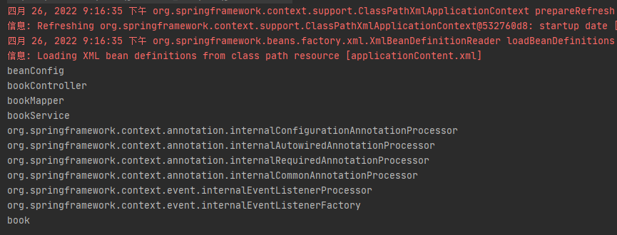
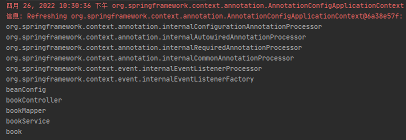
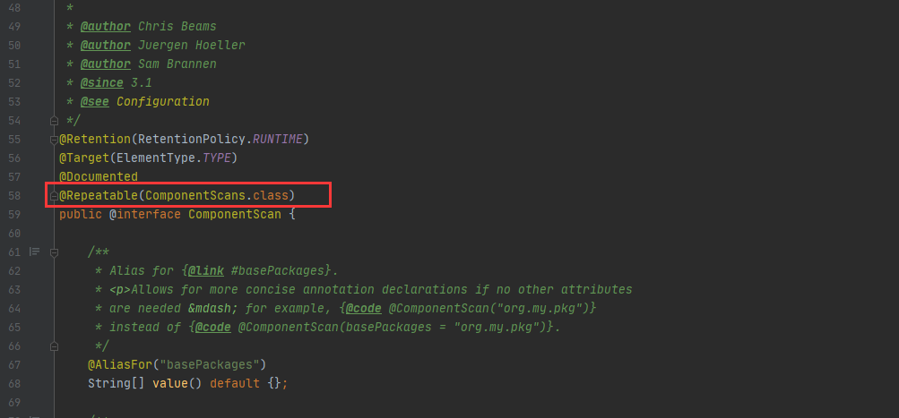
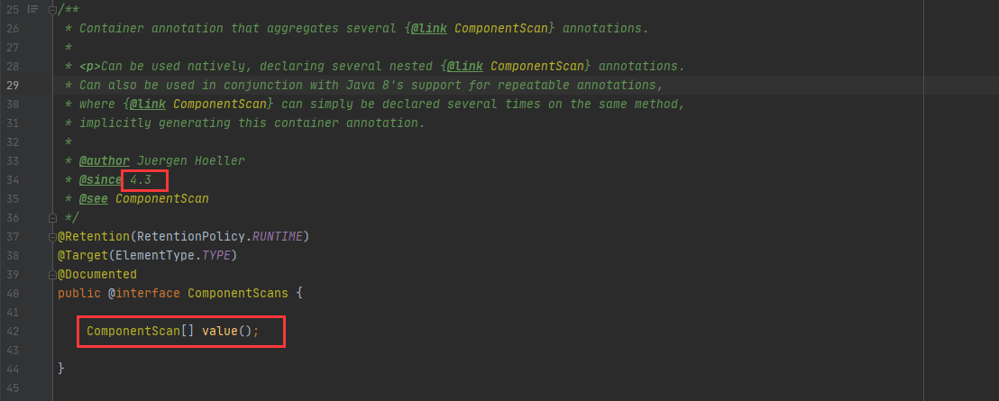

# 第二章：@ComponentScan-自动扫描组件&指定扫描规则

> One has to adapt to survive.

## 是什么
`@ComponentScan` 是一个类级别的注解，一般和 `@Configuration` 注解一起使用。 主要做的事情就是告诉Spring从哪里找到bean。根据定义的扫描路径，把符合扫描规则的类装配到Spring容器中。`@ComponentScan` 注解相当于xml配置中的 `<context:component-scan/>` 标签。Spring 3.1 引入的。

## 能干嘛
针对指定的包及其子包中标注了 `@Controller`、`@Service`、`@Repository`、`@Component` 的类都可以被Spring扫描到IOC容器中，然后交由Spring进行统一管理。
## 去哪下
官方文档：https://docs.spring.io/spring-framework/docs/current/reference/html/core.html#beans-java-instantiating-container-scan
## 怎么玩

### 工程结构

```java
section02
└── src
│   ├── main
│   │   ├── java
│   │   │   └── cn.taspile.section02
│   │   │       │── bean
│   │   │       │	└── Book.java
│   │   │       │── config
│   │   │       │	└── BeanConfig.java
│   │   │ 		│── controller
│   │   │       │	└── BookController.java
│   │   │		│── mapper
│   │   │       │	└── BookMapper.java
│   │   │		└── service
│   │   │       	└── BookService.java
│   │   └── resources	
│   │       └── applicationContent.xml
│   └── test
│        └── java
│   		 └── cn.taspile.section02
│  			 	 └──AppTest.java
└── pom.xml
```


###  使用XML配置包扫描

1. 添加依赖

```xml
<dependencies>
    <dependency>
        <groupId>org.springframework</groupId>
        <artifactId>spring-context</artifactId>
        <version>4.3.12.RELEASE</version>
    </dependency>

    <dependency>
        <groupId>junit</groupId>
        <artifactId>junit</artifactId>
        <version>4.12</version>
        <scope>test</scope>
    </dependency>
</dependencies>
```

2. 创建一个名为 Book 类的文件

```java
package cn.taspile.section02.bean;

/**
 * @author cristina
 */
public class Book {

    private String bookName;

    private int price;

    public Book() {
    }

    public Book(String bookName, int price) {
        this.bookName = bookName;
        this.price = price;
    }

    public String getBookName() {
        return bookName;
    }

    public void setBookName(String bookName) {
        this.bookName = bookName;
    }

    public int getPrice() {
        return price;
    }

    public void setPrice(int price) {
        this.price = price;
    }

    @Override
    public String toString() {
        return "Book{" +
                "bookName='" + bookName + '\'' +
                ", price=" + price +
                '}';
    }
}
```

3. 创建名为 applicationContent 的xml文件

```xml
<?xml version="1.0" encoding="UTF-8"?>
<beans xmlns="http://www.springframework.org/schema/beans"
       xmlns:context="http://www.springframework.org/schema/context" xmlns:p="http://www.springframework.org/schema/p"
       xmlns:aop="http://www.springframework.org/schema/aop"
       xmlns:xsi="http://www.w3.org/2001/XMLSchema-instance"
       xsi:schemaLocation="http://www.springframework.org/schema/beans
						http://www.springframework.org/schema/beans/spring-beans-4.2.xsd
						http://www.springframework.org/schema/context
						http://www.springframework.org/schema/context/spring-context-4.2.xsd">

    <!-- 包扫描：只要是标注了我们熟悉的@Controller、@Service、@Repository、@Component这四个注解中的任何一个的组件，它就会被自动扫描，并加进容器中 -->
    <!--添加包扫描标签-->
    <context:component-scan base-package="cn.taspile.section02"></context:component-scan>

    <!-- 向Spring容器中注册组件 -->
    <bean id="book" class="cn.taspile.section02.bean.Book">
        <property name="bookName" value="forbearance.cn"></property>
        <property name="price" value="49"></property>
    </bean>

</beans>
```

这样，只要 `cn.taspile.section02` 包下以及子包下的类标注了@Controller、@Service、@Repository、@Component这四个注解中的任何一个的组件，它就会被自动扫描，并加进容器中

4. 创建名为 BookController、BookMapper、BookService 类的文件

```java
package cn.taspile.section02.mapper;

import org.springframework.stereotype.Repository;

/**
 * @author cristina
 */
@Repository
public class BookMapper {
}
```

```java
package cn.taspile.section02.service;

import org.springframework.stereotype.Service;

/**
 * @author cristina
 */
@Service
public class BookService {
}
```

```java
package cn.taspile.section02.controller;

import org.springframework.stereotype.Controller;

/**
 * @author cristina
 */
@Controller
public class BookController {
}
```

beanName 默认是类名首字母小写。

5. 测试

```java
package cn.taspile.section02;

import org.junit.Test;
import org.springframework.context.ApplicationContext;
import org.springframework.context.support.ClassPathXmlApplicationContext;

/**
 * @author cristina
 */
public class AppTest {

    @SuppressWarnings("resource")
    @Test
    public void test01() {
        ApplicationContext context = new ClassPathXmlApplicationContext("applicationContent.xml");
        // 获取 Spring 容器中定义的所有 JavaBean 的名称
        String[] beanNames = context.getBeanDefinitionNames();
        for (String beanName : beanNames) {
            System.out.println(beanName);
        }
    }
}
```

测试结果如下：

 

除了我们创建的bean以外，还包含Spring内部使用的一些重要的bean。

###  使用注解配置包扫描

将 applicationContent.xml 配置文件中的配置先注释掉。

1. 在 BeanConfig 类上添加 `@ComponentScan` 注解

```java
package cn.taspile.section02.config;

import cn.taspile.section02.bean.Book;
import org.springframework.context.annotation.Bean;
import org.springframework.context.annotation.Configuration;
import org.springframework.context.annotation.ComponentScan;

/**
 * @author cristina
 */
@ComponentScan(value = "cn.taspile.section02") // value 指定要扫描的包
@Configuration
public class BeanConfig {

    @Bean
    public Book book() {
        return new Book("forbearance.cn", 49);
    }
}
```

1. 测试

```java
public class AppTest {

    @SuppressWarnings("resource")
    @Test
    public void test01() {
        ApplicationContext context = new AnnotationConfigApplicationContext(BeanConfig.class);
        // 获取 Spring 容器中定义的所有 JavaBean 的名称
        String[] beanNames = context.getBeanDefinitionNames();
        for (String beanName : beanNames) {
            System.out.println(beanName);
        }
    }
}
```

测试结果如下：

 

使用注解同样也能够将 JavaBean 添加到IOC容器中。


### 关于@ComponentScan注解

查看 @ComponentScan注解源码，去掉了注释。如下所示：

```java
package org.springframework.context.annotation;

import java.lang.annotation.Documented;
import java.lang.annotation.ElementType;
import java.lang.annotation.Repeatable;
import java.lang.annotation.Retention;
import java.lang.annotation.RetentionPolicy;
import java.lang.annotation.Target;

import org.springframework.beans.factory.support.BeanNameGenerator;
import org.springframework.core.annotation.AliasFor;
import org.springframework.core.type.filter.TypeFilter;

/**
 * Configures component scanning directives for use with @{@link Configuration} classes.
 * Provides support parallel with Spring XML's {@code <context:component-scan>} element.
 *
 * <p>Either {@link #basePackageClasses} or {@link #basePackages} (or its alias
 * {@link #value}) may be specified to define specific packages to scan. If specific
 * packages are not defined, scanning will occur from the package of the
 * class that declares this annotation.
 *
 * <p>Note that the {@code <context:component-scan>} element has an
 * {@code annotation-config} attribute; however, this annotation does not. This is because
 * in almost all cases when using {@code @ComponentScan}, default annotation config
 * processing (e.g. processing {@code @Autowired} and friends) is assumed. Furthermore,
 * when using {@link AnnotationConfigApplicationContext}, annotation config processors are
 * always registered, meaning that any attempt to disable them at the
 * {@code @ComponentScan} level would be ignored.
 *
 * <p>See {@link Configuration @Configuration}'s Javadoc for usage examples.
 *
 * @author Chris Beams
 * @author Juergen Hoeller
 * @author Sam Brannen
 * @since 3.1
 * @see Configuration
 */
@Retention(RetentionPolicy.RUNTIME)
@Target(ElementType.TYPE)
@Documented
@Repeatable(ComponentScans.class)
public @interface ComponentScan {

	@AliasFor("basePackages")
	String[] value() default {};

	@AliasFor("value")
	String[] basePackages() default {};

	Class<?>[] basePackageClasses() default {};

	Class<? extends BeanNameGenerator> nameGenerator() default BeanNameGenerator.class;

	Class<? extends ScopeMetadataResolver> scopeResolver() default AnnotationScopeMetadataResolver.class;

	ScopedProxyMode scopedProxy() default ScopedProxyMode.DEFAULT;

	String resourcePattern() default ClassPathScanningCandidateComponentProvider.DEFAULT_RESOURCE_PATTERN;

	boolean useDefaultFilters() default true;

	Filter[] includeFilters() default {};

	Filter[] excludeFilters() default {};

	boolean lazyInit() default false;

	@Retention(RetentionPolicy.RUNTIME)
	@Target({})
	@interface Filter {

		FilterType type() default FilterType.ANNOTATION;

		@AliasFor("classes")
		Class<?>[] value() default {};

		@AliasFor("value")
		Class<?>[] classes() default {};

		String[] pattern() default {};

	}

}
```

其中有两个方法需要我们注意一下，按照规则扫描组件时会用到。

```java
// 扫描的时候按照规则只需要包含哪些组件
Filter[] includeFilters() default {};

// 扫描的时候按照规则只需要排除哪些组件
Filter[] excludeFilters() default {};
```

includeFilters() 方法指定Spring扫描的时候按照规则只需要包含哪些组件，而 excludeFilters() 方法则指定Spring扫描的时候按照规则只需要排除哪些组件。返回值都是 Filter[] 数组，这个 Filter 类型在ComponentScan注解类的内部。


#### 扫描时包含注解标注的类

使用 includeFilters() 方法来指定Spring在包扫描时只包含哪些注解标注的类。

但是，在我们使用 includeFilters() 方法来指定只包含哪些注解标注的类时，需要禁用掉默认的过滤规则 `use-default-filters="false"`，默认的过滤规则时扫描所有，只有禁用掉默认配置，定义的只包含才会生效。

xml文件配置如下：

```xml
<context:component-scan base-package="cn.taspile.section02" use-default-filters="false"></context:component-scan>
```

注解配置如下：

```java
@ComponentScan(value = "cn.taspile.section02", includeFilters = {
        /*
         * type: 指定要排除的规则，按照注解进行排除、or 按照给定的类型进行配出、等等...
         * classes: Spring在扫描时，只包含指定注解标注的类
         */
        @Filter(type = FilterType.ANNOTATION, classes = {Controller.class})
}, useDefaultFilters = false)
```

运行AppTest#test01()方法：

 

打印结果也确实与配置的只包含一致。并没有输出@Service和@Repository注解标注的组件名称。也会输出Spring内部的组件名称。

#### 扫描时排除注解标注的类

使用 excludeFilters() 方法来指定Spring在包扫描时排除哪些注解标注的类。

```java
@ComponentScan(value = "cn.taspile.section02", excludeFilters = {
        /*
         * type: 指定要排除的规则，按照注解进行排除、or 按照给定的类型进行配出、等等...
         * classes: Spring在扫描时，排除指定注解标注的类
         */
        @Filter(type = FilterType.ANNOTATION, classes = {Controller.class, Service.class})
})
```

运行AppTest#test01()方法：

 

从打印结果看，Spring进行包扫描时，确实将@Controller和@Service注解标注的类给排除了。


#### 可重复注解

查看 @ComponentScan 注解源码的时候，会发现注解类上还有一个注解，`@Repeatable` 翻译过来就是 可重复的。

 

掀开 @ComponentScans 注解的真面目：

 

在其内部声明了一个 ComponentScan[] 数组的 value() 方法。这在 jdk1.8 中是一个可重复注解。即：如果使用 Java 8，@ComponentScan 是一个可重复注解，可以在一个类上多次标注 @ComponentScan 注解。

```java
@ComponentScan(value = "cn.taspile.section02", includeFilters = {
        /*
         * type: 指定要排除的规则，按照注解进行排除、or 按照给定的类型进行配出、等等...
         * classes: Spring在扫描时，只包含指定注解标注的类
         */
        @Filter(type = FilterType.ANNOTATION, classes = {Service.class}),
}, useDefaultFilters = false)
@ComponentScan(value = "cn.taspile.section02", excludeFilters = {
        /*
         * type: 指定要排除的规则，按照注解进行排除、or 按照给定的类型进行配出、等等...
         * classes: Spring在扫描时，排除指定注解标注的类
         */
        @Filter(type = FilterType.ANNOTATION, classes = {Controller.class, Repository.class})
})
@Configuration
```

包含 @Service 注解标注的类，排除 @Controller和@Repository 标注的类，如下：

 


如果使用的是 Java 8 之前的版本，无法直接在类上标注多个 @ComponentScan ，但是可以使用 @ComponentScans 注解，同样也可以指定多个 @ComponentScan。

```java
@ComponentScans(value = {
        @ComponentScan(value = "cn.taspile.section02", includeFilters = {
                /*
                 * type: 指定要排除的规则，按照注解进行排除、or 按照给定的类型进行配出、等等...
                 * classes: Spring在扫描时，只包含指定注解标注的类
                 */
                @Filter(type = FilterType.ANNOTATION, classes = {Service.class}),
        }, useDefaultFilters = false),
        @ComponentScan(value = "cn.taspile.section02", excludeFilters = {
                /*
                 * type: 指定要排除的规则，按照注解进行排除、or 按照给定的类型进行配出、等等...
                 * classes: Spring在扫描时，排除指定注解标注的类
                 */
                @Filter(type = FilterType.ANNOTATION, classes = {Controller.class, Repository.class})
        })
})
```

测试结果如下：

 

效果与使用多个@ComponentScan注解相同。

## 总结

使用@ComponentScan注解来指定Spring扫描哪些包，可以使用excludeFilters()方法来指定扫描时排除哪些组件，也可以使用includeFilters()方法来指定扫描时只包含哪些组件。当使用includeFilters()方法指定只包含哪些组件时，需要禁用掉默认的过滤规则。