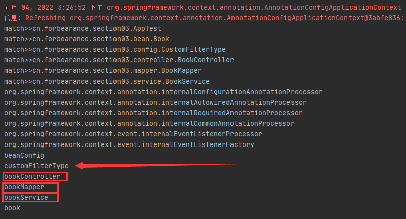

# 第三章：自定义TypeFilter指定过滤规则

## 是什么
默认情况下，使用`@Component`、`@Repository`、`@Service`、`@Controller`、`@Configuration`标注的类，或者用`@Component`标注的自定义注解能够被Spring扫描到容器中，除此之外，也可以通过自定义过滤器来修改或扩展指定包含排除的Bean的过滤规则。
## 能干嘛
## 去哪下
官方文档：https://docs.spring.io/spring-framework/docs/current/reference/html/core.html#beans-scanning-filters
## 怎么玩
### TypeFilter常用规则
在使用 `@ComponentScan`注解实现包扫描时，可以通过 `@Filter` 指定过滤规则。在 `@Filter` 中通过type属性来指定过滤规则，而type属性是一个FilterType类型的枚举，其源码如下：
```java
package org.springframework.context.annotation;

/**
 * Enumeration of the type filters that may be used in conjunction with
 * {@link ComponentScan @ComponentScan}.
 *
 * @author Mark Fisher
 * @author Juergen Hoeller
 * @author Chris Beams
 * @since 2.5
 * @see ComponentScan
 * @see ComponentScan#includeFilters()
 * @see ComponentScan#excludeFilters()
 * @see org.springframework.core.type.filter.TypeFilter
 */
public enum FilterType {

	/**
	 * Filter candidates marked with a given annotation.
	 * @see org.springframework.core.type.filter.AnnotationTypeFilter
	 */
	ANNOTATION,

	/**
	 * Filter candidates assignable to a given type.
	 * @see org.springframework.core.type.filter.AssignableTypeFilter
	 */
	ASSIGNABLE_TYPE,

	/**
	 * Filter candidates matching a given AspectJ type pattern expression.
	 * @see org.springframework.core.type.filter.AspectJTypeFilter
	 */
	ASPECTJ,

	/**
	 * Filter candidates matching a given regex pattern.
	 * @see org.springframework.core.type.filter.RegexPatternTypeFilter
	 */
	REGEX,

	/** Filter candidates using a given custom
	 * {@link org.springframework.core.type.filter.TypeFilter} implementation.
	 */
	CUSTOM

}
```

#### ANNOTATION: 按照注解进行包含或者排除
在使用 `@ComponentScan` 注解进行包扫描时，如果需要按照注解只包含标注了 `@Service` 注解的bean，写法如下：
```java
@ComponentScan(value = "cn.forbearance.section03", includeFilters = {
        @Filter(type = FilterType.ANNOTATION, classes = {Service.class})
}, useDefaultFilters = false)
```
value: 指定要扫描的包。<br/>
type: 指定要排除的规则。按照注解、按照给定的类型或者自定义规则排除等等...<br/>
classes: 属性是一个数组，说明可以写多个注解类。当Spring扫描包时，只会包含 `@Controller` 注解标注的类

#### ASSIGNABLE_TYPE: 按照给定的类型将那些包含或者排除
如果需要按照给定的类型只包含BookService类(接口)或其子类(实现类或子接口)的bean，写法如下：
```java
@ComponentScan(value = "cn.forbearance.section03", includeFilters = {
        @Filter(type = FilterType.ASSIGNABLE_TYPE, classes = {BookService.class})
}, useDefaultFilters = false)
```
只要是 BookService 类型的组件都会被加载到容器中，即使是子类或实现类。

#### ASPECTJ: 按照ASPECTJ表达式进行包含或者排除
```java
@ComponentScan(value = "cn.forbearance.section03", includeFilters = {
        @Filter(type = FilterType.ASPECTJ, classes = {AspectJTypeFilter.class})
}, useDefaultFilters = false)
```
按照 ASPECTJ 切面表达式进行过滤。这种过滤规则使用少。

#### REGEX: 按照正则表达式进行包含或者排除
```java
@ComponentScan(value = "cn.forbearance.section03", includeFilters = {
        @Filter(type = FilterType.REGEX, classes = {RegexPatternTypeFilter.class})
}, useDefaultFilters = false)
```
按照正则表达式进行过程。这种过滤规则使用少。

#### CUSTOM: 按照自定义规则进行包含或者排除
自定义规则的类型必须是 `org.springframework.core.type.filter.TypeFilter` 接口的实现类。并实现接口方法。
```java
public class CustomFilterType implements TypeFilter {

    @Override
    public boolean match(MetadataReader metadataReader,
                         MetadataReaderFactory metadataReaderFactory) throws IOException {
        // 暂时返回false.
        return false;
    }
}
```
TypeFilter 接口有一个 match() 方法，返回值为 boolean 类型，当返回true时，标识符合规则，会包含在Spring容器中；反之返回false，表示不符合规则，则不会加载到Spring容器中。match() 方法有两个参数，MetadataReader类型和MetadataReaderFactory类型的参数，作用：
- metadataReader: 当前正在扫描的类的信息 。
- metadataReaderFactory: 能够获取到其他任何类的信息的工厂。

进行包扫描配置:
```java
@ComponentScan(value = "cn.forbearance.section03", includeFilters = {
        @Filter(type = FilterType.CUSTOM, classes = {CustomFilterType.class})
}, useDefaultFilters = false)
```
FilterType.CUSTOM 规则适用于当 FilterType 枚举中的类型无法满足业务需求时，可以通过实现 TypeFilter 接口来自定义过滤规则。

## 实现自定义过滤规则
改造一下 CustomFilterType：
```java
public class CustomFilterType implements TypeFilter {

    @Override
    public boolean match(MetadataReader metadataReader,
                         MetadataReaderFactory metadataReaderFactory) throws IOException {
        // 获取当前类注解的信息
        AnnotationMetadata annotationMetadata = metadataReader.getAnnotationMetadata();
        // 获取当前正在扫描的类的类信息，比如它的类型，实现的接口等等
        ClassMetadata classMetadata = metadataReader.getClassMetadata();
        // 获取当前类的资源新，类路径等等
        Resource resource = metadataReader.getResource();
        // 正在扫描的类的类名
        String className = classMetadata.getClassName();
        System.out.println("match>>" + className);
        if (className.contains("er")) {
            // 匹配成功，包含
            return true;
        }
        // 匹配不成功，排除
        return false;
    }
}
```
进行包扫描配置:
```java
@ComponentScan(value = "cn.forbearance.section03", includeFilters = {
        @Filter(type = FilterType.CUSTOM, classes = {CustomFilterType.class})
}, useDefaultFilters = false)
```
测试：
```java
    public void test01() {
        ApplicationContext context = new AnnotationConfigApplicationContext(BeanConfig.class);
        // 获取 Spring 容器中定义的所有 JavaBean 的名称
        String[] beanNames = context.getBeanDefinitionNames();
        for (String beanName : beanNames) {
            System.out.println(beanName);
        }
    }
```


输出结果中还输出了 customFilterType，这是为什么呢？原因是我们扫描的是 cn.forbearance.section03 包，该包下的每一个类都会在自定义规则中进行匹配。CustomFilterType 也包括在内。
## 小结