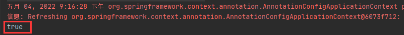
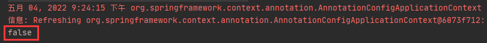
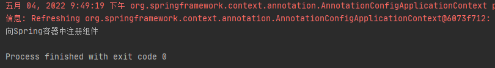
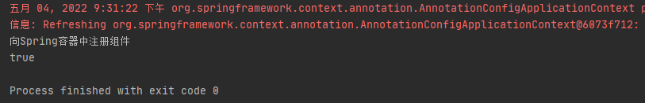
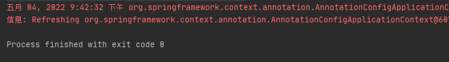
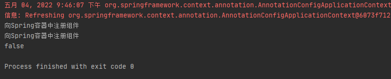
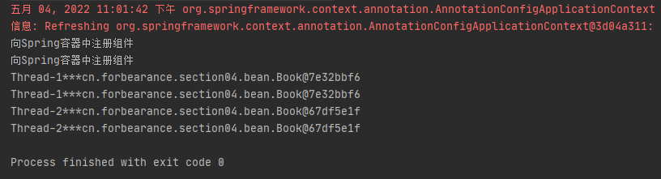

# 第四章：@Scope-设置组件作用域

## 是什么
`@Scope` 注解用来指定组件的作用域。<br/>
Spring IOC容器具有的作用域：singleton(全局有且仅有一个实例)、prototype(每次获取Bean的时候会有一个新的实例)、request(bean在当前HTTP request内有效)、session(bean在当前HTTP session内有效)、globalsession(在基于portlet的web应用中才有意义)。
## 能干嘛
## 去哪下
官方文档：https://docs.spring.io/spring-framework/docs/current/reference/html/core.html#beans-scanning-scope-resolver
## 怎么玩
### @Scope注解概述
```java
package org.springframework.context.annotation;

import java.lang.annotation.Documented;
import java.lang.annotation.ElementType;
import java.lang.annotation.Retention;
import java.lang.annotation.RetentionPolicy;
import java.lang.annotation.Target;

import org.springframework.beans.factory.config.ConfigurableBeanFactory;
import org.springframework.core.annotation.AliasFor;

/**
 * When used as a type-level annotation in conjunction with
 * {@link org.springframework.stereotype.Component @Component},
 * {@code @Scope} indicates the name of a scope to use for instances of
 * the annotated type.
 *
 * <p>When used as a method-level annotation in conjunction with
 * {@link Bean @Bean}, {@code @Scope} indicates the name of a scope to use
 * for the instance returned from the method.
 *
 * <p>In this context, <em>scope</em> means the lifecycle of an instance,
 * such as {@code singleton}, {@code prototype}, and so forth. Scopes
 * provided out of the box in Spring may be referred to using the
 * {@code SCOPE_*} constants available in the {@link ConfigurableBeanFactory}
 * and {@code WebApplicationContext} interfaces.
 *
 * <p>To register additional custom scopes, see
 * {@link org.springframework.beans.factory.config.CustomScopeConfigurer
 * CustomScopeConfigurer}.
 *
 * @author Mark Fisher
 * @author Chris Beams
 * @author Sam Brannen
 * @since 2.5
 * @see org.springframework.stereotype.Component
 * @see org.springframework.context.annotation.Bean
 */
@Target({ElementType.TYPE, ElementType.METHOD})
@Retention(RetentionPolicy.RUNTIME)
@Documented
public @interface Scope {

	/**
	 * Alias for {@link #scopeName}.
	 * @see #scopeName
	 */
	@AliasFor("scopeName")
	String value() default "";

	/**
	 * Specifies the name of the scope to use for the annotated component/bean.
	 * <p>Defaults to an empty string ({@code ""}) which implies
	 * {@link ConfigurableBeanFactory#SCOPE_SINGLETON SCOPE_SINGLETON}.
	 * @since 4.2
	 * @see ConfigurableBeanFactory#SCOPE_PROTOTYPE
	 * @see ConfigurableBeanFactory#SCOPE_SINGLETON
	 * @see org.springframework.web.context.WebApplicationContext#SCOPE_REQUEST
	 * @see org.springframework.web.context.WebApplicationContext#SCOPE_SESSION
	 * @see #value
	 */
	@AliasFor("value")
	String scopeName() default "";

	/**
	 * Specifies whether a component should be configured as a scoped proxy
	 * and if so, whether the proxy should be interface-based or subclass-based.
	 * <p>Defaults to {@link ScopedProxyMode#DEFAULT}, which typically indicates
	 * that no scoped proxy should be created unless a different default
	 * has been configured at the component-scan instruction level.
	 * <p>Analogous to {@code <aop:scoped-proxy/>} support in Spring XML.
	 * @see ScopedProxyMode
	 */
	ScopedProxyMode proxyMode() default ScopedProxyMode.DEFAULT;

}
```
从源码看到， `@Scope` 注解的 scopeName 属性可以设置如下值：
1. ConfigurableBeanFactory#SCOPE_PROTOTYPE
2. ConfigurableBeanFactory#SCOPE_SINGLETON
3. org.springframework.web.context.WebApplicationContext#SCOPE_REQUEST
4. org.springframework.web.context.WebApplicationContext#SCOPE_SESSION

这四个常量就是 Spring IOC 容器中 Bean 的作用域。
#### @Scope注解中的取值
##### singleton
组件在 Spring IOC 容器中是单例的，默认值。也就是说，Spring在启动的时候将组件加载到容器中，之后每次从Spring容器中获取组件时，直接将缓存的实例对象返回，而不用再次实例化对象。
##### prototype
组件在 Spring IOC 容器中是多例的。即Spring在启动的时候不会对组件进行实例化，而是在每次从Spring容器中获取组件对象时，都会创建一个新的实例对象并返回。
##### request
每次请求都会创建一个新的实例对象，但是同一次请求只会创建一个实例对象。该作用域在web环境有效。
##### session
在同一个session范围内，创建一个新的实例对象。该作用域在web环境有效。
##### application
全局web应用级别的作用域，在web环境中使用。一个web应用对应一个bean实例，一个web应用程序对应一个bean实例。一般的，应用陈虚谷对应一个Spring容器，但是一个应用程序是能够创建多个Spring容器的，
而且不同的容器中可以存在同名的bean。但是当作用域为application时，不管应用程序中有多少个Spring容器，这个应用程序中同名的bean只有一个。

### 单实例作用域
配置类：
```java
@Configuration
public class BeanConfig {

    @Bean
    public Book book() {
        return new Book("forbearance.cn", 49);
    }
}
```
测试类
```java
    public void test01() {
        ApplicationContext context = new AnnotationConfigApplicationContext(BeanConfig.class);
        Book book1 = (Book) context.getBean("book");
        Book book2 = (Book) context.getBean("book");
        System.out.println(book1 == book2);
    }
```

对象在Spring容器中默认是单实例的。多次获取的对象都是同一个对象，即在容器启动时就会将实例对象加载到容器中。之后每次获取从容器中取出即可。
### 多实例作用域
配置类：
```java
    @Scope(value = "prototype")
    @Bean
    public Book book() {
        return new Book("forbearance.cn", 49);
    }
```
如果是使用xml配置文件的方式：添加 `scope="prototype"` 属性
```xml
    <bean id="book" class="cn.forbearance.section04.bean.Book" scope="prototype">
        <property name="bookName" value="forbearance.cn"></property>
        <property name="price" value="49"></property>
    </bean>
```
运行测试类：

此时会发现，两次获取的对象不是同一个对象。因为bean的作用域被改变了。每次获取对象都会创建一个对象实例。
### 单实例bean何时创建对象
配置类：
```java
@Configuration
public class BeanConfig {

    @Scope
    @Bean
    public Book book() {
        System.out.println("向Spring容器中注册组件");
        return new Book("forbearance.cn", 49);
    }
}
```
测试类1：


Spring容器在创建的时候，就将单实例bean的组件进行了实例化，并加载到Spring容器中。

测试类2：

单实例bean的加载发生在Spring容器启动的时候。且实例对象只会实例化一次。之后每次获取都是从容器中直接获取。而不必创建新的对象。
### 多实例bean何时创建对象
配置类：
```java
@Configuration
public class BeanConfig {

    @Scope(value = "prototype")
    @Bean
    public Book book() {
        System.out.println("向Spring容器中注册组件");
        return new Book("forbearance.cn", 49);
    }
}
```
测试类1：
```java
    @Test
    public void test01() {
        ApplicationContext context = new AnnotationConfigApplicationContext(BeanConfig.class);
    }
```
<br/>
在Spring容器启动时，并不会实例化和加载多实例对象。那是什么时候进行对象实例化的呢？

测试类2：
```java
    @Test
    public void test01() {
        ApplicationContext context = new AnnotationConfigApplicationContext(BeanConfig.class);
        Book book1 = (Book) context.getBean("book");
        Book book2 = (Book) context.getBean("book");
        System.out.println(book1 == book2);
    }
```

当从Spring容器中获取bean时，Spring容器才会去实例化对象。且每次获取时都会创建一个新的对象并返回。

### 单实例bean注意事项
大部分时候我们并没有在项目中使用多线程，所以很少有人会关注这个问题。单实例 bean 存在线程安全问题，当多个线程操作同一个对象的时候会存在资源竞争。
比如在 Controller 中创建了一个成员变量，那么这个变量就会变成共享的，Controller 可能会被多个线程同时访问，会出现同时操作这个变量的情况，导致数据错乱。

### 多实例bean注意事项
多实例bean每次获取都会重新创建对象，而如果这个bean比较复杂，创建时间较长，则会影响系统性能。
### 自定义Scope作用域
当Spring内置的集中scope作用域无法满足业务时，可以通过自定义bean的作用域来实现。

#### 如何实现自定义Scope作用域
自定义Scope主要分为三个步骤
1. 第一步：实现 Scope 接口
```java
package org.springframework.beans.factory.config;

import org.springframework.beans.factory.ObjectFactory;

public interface Scope {

	/**
	 * 返回当前作用域中name对应的bean对象
	 * @param name 需要检索的bean对象的名称
	 * @param objectFactory 如果name对应的bean对象在当前作用域中没有找到，可以使用objectFactory来创建这个对象
	 */
	Object get(String name, ObjectFactory<?> objectFactory);

	/**
	 * 将name对应的bean对象从当前作用域中移除
	 */
	Object remove(String name);

	/**
	 * 用于注册销毁回调，若想要销毁相应的对象，由Spring容器注册相应的销毁回调，由自定义作用域选择是不是需要销毁相应的对象
	 */
	void registerDestructionCallback(String name, Runnable callback);

	/**
	 * 用于解析相应的上下文数据，比如request作用域将返回request中属性
	 */
	Object resolveContextualObject(String key);

	/**
	 * 作用域的会话标识，比如seesion作用域的会话标识是sessionId
	 */
	String getConversationId();

}
```
2. 第二步：将自定义 Scope 注册到容器中，需要使用 `org.springframework.beans.factory.config.ConfigurableBeanFactory#registerScope` 方法
```java
package org.springframework.beans.factory.config;

public interface ConfigurableBeanFactory extends HierarchicalBeanFactory, SingletonBeanRegistry {
      ... ...
	/**
	 * 向容器中注册自定义的Scope
	 * @param scopeName 作用域名称
	 * @param scope 作用域对象
	 */
	void registerScope(String scopeName, Scope scope);
	... ...
}
```   
3. 第三步：使用自定义的作用域
#### 案例
示例：实现一个线程级别的bean作用域，即在同一个线程下同名的bean是同一个示例对象。bean在同一个线程中是共享的，可以通过 ThreadLocal 来实现，ThreadLocal 可以实现线程中数据的共享。
1. 自定义scope
```java
public class CustomThreadScope implements Scope {

    public static final String THREAD_SCOPE = "thread";

    private ThreadLocal<Map<String, Object>> beanMaps = new ThreadLocal(){
        @Override
        protected Object initialValue() {
            return new HashMap<>(16);
        }
    };

    @Override
    public Object get(String name, ObjectFactory<?> objectFactory) {
        Object bean = beanMaps.get().get(name);
        if (Objects.isNull(bean)) {
            bean = objectFactory.getObject();
            beanMaps.get().put(name, bean);
        }
        return bean;
    }

    @Override
    public Object remove(String name) {
        return beanMaps.get().remove(name);
    }

    @Override
    public void registerDestructionCallback(String name, Runnable callback) {
        System.out.println(name);
    }

    @Override
    public Object resolveContextualObject(String key) {
        return null;
    }

    @Override
    public String getConversationId() {
        return Thread.currentThread().getName();
    }
}
```
2. 配置类
```java
@Configuration
public class BeanConfig {

    @Scope(value = "thread")
    @Bean
    public Book book() {
        System.out.println("向Spring容器中注册组件");
        return new Book("forbearance.cn", 49);
    }
}
```
3. 测试类
```java
    @Test
    public void test01() throws InterruptedException {
        AnnotationConfigApplicationContext context = new AnnotationConfigApplicationContext(BeanConfig.class);
        context.getBeanFactory().registerScope(CustomThreadScope.THREAD_SCOPE, new CustomThreadScope());
        for (int i = 0; i < 2; i++) {
            new Thread(() -> {
                System.out.println(Thread.currentThread().getName() + "***" + context.getBean("book"));
                System.out.println(Thread.currentThread().getName() + "***" + context.getBean("book"));
            }).start();
        }
        TimeUnit.SECONDS.sleep(1);
    }
```
运行结果：
