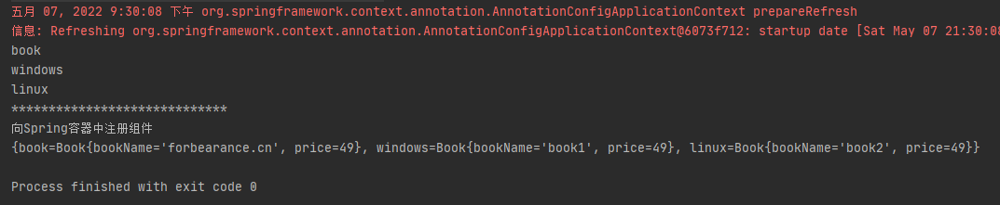
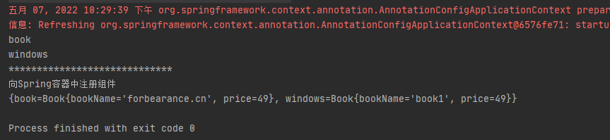
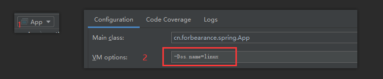
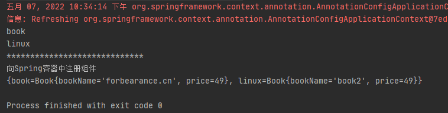

# 第六章：@Conditional，按照条件注册bean

## 是什么
### @Conditional 概述
`@Conditional` 注解可以按照条件进行判断，满足条件就向容器中注册bean，不满足条件就不注册。组件只有在所有指定条件都匹配时才有资格注册。
```java
package org.springframework.context.annotation;

import java.lang.annotation.Documented;
import java.lang.annotation.ElementType;
import java.lang.annotation.Retention;
import java.lang.annotation.RetentionPolicy;
import java.lang.annotation.Target;

/**
 * 组件只有在所有指定条件都匹配时才有资格注册
 */
@Target({ElementType.TYPE, ElementType.METHOD})
@Retention(RetentionPolicy.RUNTIME)
@Documented
public @interface Conditional {

	/**
	 * All {@link Condition}s that must {@linkplain Condition#matches match}
	 * in order for the component to be registered.
	 */
	Class<? extends Condition>[] value();

}
```
`@Conditional` 注解可以标注在类和方法上。它有一个 Condition 类型或其子类型的 Class 对象数组。Condition是一个接口，
在使用 `@Conditional` 注解时，需要传入实现了 Condition 接口的类，并实现接口方法。然后可以使用在 `@Conditional` 注解中定义的类来检测。
```java
public interface Condition {

	/**
	 * 确定该条件是否匹配
	 * @param context the condition context
	 * @param metadata metadata of the {@link org.springframework.core.type.AnnotationMetadata class}
	 * or {@link org.springframework.core.type.MethodMetadata method} being checked.
	 * @return {@code true} if the condition matches and the component can be registered
	 * or {@code false} to veto registration.
	 */
	boolean matches(ConditionContext context, AnnotatedTypeMetadata metadata);
}
```
## 能干嘛
### 应用场景
1. 可以作为类级别的注解直接或间接与`@Component`相关联，包括`@Configuration`注解。
2. 可以作为元注解，用于自动编写构造性注解。
3. 作为方法级别的注解，作用在任何`@Bean`方上。
## 去哪下
官方文档：https://docs.spring.io/spring-framework/docs/5.3.19/javadoc-api/org/springframework/context/annotation/Conditional.html
## 怎么玩
### 向Spring容器注册bean
#### 不带条件注册bean
配置类：
```java
package cn.forbearance.spring.config;

import cn.forbearance.spring.bean.Book;
import org.springframework.context.annotation.Bean;
import org.springframework.context.annotation.Configuration;
import org.springframework.context.annotation.Lazy;
import org.springframework.context.annotation.Scope;

/**
 * @author cristina
 */
@Configuration
public class BeanConfig {

    @Lazy
    @Bean
    public Book book() {
        System.out.println("向Spring容器中注册组件");
        return new Book("forbearance.cn", 49);
    }

    @Bean(value = "windows")
    public Book book1() {
        return new Book("book1", 49);
    }

    @Bean(value = "linux")
    public Book book2() {
        return new Book("book2", 49);
    }
}
```
测试类：
```java
public void test01() {
    AnnotationConfigApplicationContext context = new AnnotationConfigApplicationContext(BeanConfig.class);
    // 按照类型查找bean
    String[] beanNames = context.getBeanNamesForType(Book.class);
    for (String beanName : beanNames) {
        System.out.println(beanName);
    }
    System.out.println("*****************************");
    // 按照类型将所有匹配的类型转换成Map
    Map<String, Book> beanTypes = context.getBeansOfType(Book.class);
    System.out.println(beanTypes);
}
```
运行测试类：



可以清楚地看到注册到容器中的bean实例对象的详细信息。

#### 带条件注册bean
需求：如果当前操作系统为Windows，向Spring容器注册名称为`windows`的对象。如果当前操作系统为Linux，向Spring容器中注册名称为`linux`的对象。
定义两个类，分别实现`Condition`接口

LinuxCondition

```java
package cn.forbearance.spring.condition;

import org.springframework.beans.factory.config.ConfigurableListableBeanFactory;
import org.springframework.beans.factory.support.BeanDefinitionRegistry;
import org.springframework.context.annotation.Condition;
import org.springframework.context.annotation.ConditionContext;
import org.springframework.core.env.Environment;
import org.springframework.core.type.AnnotatedTypeMetadata;

/**
 * @author cristina
 */
public class LinuxCondition implements Condition {

    /**
     * @param context 上下文(环境)
     * @param metadata 当前标注了@Condition注解的注释信息
     */
    @Override
    public boolean matches(ConditionContext context, AnnotatedTypeMetadata metadata) {
        // 获取bean的创建工厂，创建对象以及装配对象的工厂
        ConfigurableListableBeanFactory beanFactory = context.getBeanFactory();
        // 获取当前环境信息。运行时环境信息、虚拟机变量、环境变量等
        Environment environment = context.getEnvironment();
        // 获取bean定义的注册类
        BeanDefinitionRegistry registry = context.getRegistry();

        // 还可以做更多的判断，容器中是否包含某个bean，如果包含则执行什么样的逻辑
        boolean definition = registry.containsBeanDefinition("org.springframework.context.annotation.internalConfigurationAnnotationProcessor");

        String property = environment.getProperty("os.name");
        if (property.contains("linux")) {
            return true;
        }
        return false;
    }
}
```
<br/>
WindowsCondition

```java
package cn.forbearance.spring.condition;

import org.springframework.beans.factory.config.ConfigurableListableBeanFactory;
import org.springframework.beans.factory.support.BeanDefinitionRegistry;
import org.springframework.context.annotation.Condition;
import org.springframework.context.annotation.ConditionContext;
import org.springframework.core.env.Environment;
import org.springframework.core.type.AnnotatedTypeMetadata;

/**
 * @author cristina
 */
public class WindowsCondition implements Condition {

    /**
     * @param context 上下文(环境)
     * @param metadata 当前标注了@Condition注解的注释信息
     */
    @Override
    public boolean matches(ConditionContext context, AnnotatedTypeMetadata metadata) {
        // 获取bean的创建工厂，创建对象以及装配对象的工厂
        ConfigurableListableBeanFactory beanFactory = context.getBeanFactory();
        // 获取当前环境信息。运行时环境信息、虚拟机变量、环境变量等
        Environment environment = context.getEnvironment();
        // 获取bean定义的注册类
        BeanDefinitionRegistry registry = context.getRegistry();

        // 还可以做更多的判断，容器中是否包含某个bean，如果包含则执行什么样的逻辑
        boolean definition = registry.containsBeanDefinition("org.springframework.context.annotation.internalConfigurationAnnotationProcessor");

        String property = environment.getProperty("os.name");
        if (property.contains("Windows")) {
            return true;
        }
        return false;
    }
}
```
配置类：添加注解`@Conditional`
```java
package cn.forbearance.spring.config;

import cn.forbearance.spring.bean.Book;
import cn.forbearance.spring.condition.LinuxCondition;
import cn.forbearance.spring.condition.WindowsCondition;
import org.springframework.context.annotation.*;

/**
 * @author cristina
 */
@Configuration
// @Conditional(WindowsCondition.class)
public class BeanConfig {

    @Lazy
    @Bean
    public Book book() {
        System.out.println("向Spring容器中注册组件");
        return new Book("forbearance.cn", 49);
    }

    @Conditional(WindowsCondition.class)
    @Bean(value = "windows")
    public Book book1() {
        return new Book("book1", 49);
    }

    @Conditional(LinuxCondition.class)
    @Bean(value = "linux")
    public Book book2() {
        return new Book("book2", 49);
    }
}
```
如果是Windows操作系统，则直接运行测试类：



如果测试linux环境，则按如下步骤操作：



接着执行测试类：



`@Conditional`注解不仅可以标注在方法上，也可以标注在类上，标注在类上表示：只有满足当前条件，这个配置了中的所以bean注册才会生效，对配置类中的组件进行统一管理设置。

这里涉及到了一个名为BeanDefinitionRegistry的对象，`context.getRegistry()`方法获取到的是bean定义的注册对象。查看一下源码去看看它是什么。
```java
package org.springframework.beans.factory.support;

import org.springframework.beans.factory.BeanDefinitionStoreException;
import org.springframework.beans.factory.NoSuchBeanDefinitionException;
import org.springframework.beans.factory.config.BeanDefinition;
import org.springframework.core.AliasRegistry;

/**
 * 为保存bean定义的注册表提供的接口
 * Spring容器中所以的bean都是通过BeanDefinitionRegistry对象来进行注册的.通过它可以查看容器中注册了哪些bean
 */
public interface BeanDefinitionRegistry extends AliasRegistry {

	/**
	 * 在此注册表中注册一个新的bean定义。向Spring容器中注册一个bean
	 */
	void registerBeanDefinition(String beanName, BeanDefinition beanDefinition)
			throws BeanDefinitionStoreException;

	/**
	 * 从Spring容器中移除一个bean
	 */
	void removeBeanDefinition(String beanName) throws NoSuchBeanDefinitionException;

	/**
	 * 返回给定的bean名称的Bean定义
	 */
	BeanDefinition getBeanDefinition(String beanName) throws NoSuchBeanDefinitionException;

	/**
	 * 检查此注册表是否包含具有给定名称的bean定义。容器中是否包含给定名称的bean定义
	 */
	boolean containsBeanDefinition(String beanName);
	... ...
}
```
Spring容器中所有的bean都可以通过BeanDefinitionRegistry对象来进行注册。

### @Conditional扩展注解

| 扩展注解                        | 描述                                                         | 处理类                    | 使用                                                         |
| ------------------------------- | ------------------------------------------------------------ | ------------------------- | ------------------------------------------------------------ |
| @ConditionalOnBean              | 当容器中至少存在一个指定name或class的Bean时，进行实例化      | OnBeanCondition           | @ConditionalOnBean(CacheManager.class)                       |
| @ConditionalOnMissingBean       | 当容器中指定name或class的Bean都不存在时，进行实例化          | OnBeanCondition           | @ConditionalOnMissingBean(CacheManager.class)                |
| @ConditionalOnClass             | 当类路径下至少存在一个指定的class时，进行实例化              | OnClassCondition          | @ConditionalOnClass({Aspect.class, Advice.class })           |
| @ConditionalOnMissingClass      | 当容器中指定class都不存在时，进行实例化                      | OnClassCondition          | @ConditionalOnMissingClass(“org.thymeleaf.templatemode.TemplateMode”) |
| @ConditionalOnSingleCandidate   | 当指定的Bean在容器中只有一个，或者有多个但是指定了首选的Bean时触发实例化 | OnBeanCondition           | @ConditionalOnSingleCandidate(DataSource.class)              |
| @ConditionalOnProperty          | 当指定的属性有指定的值时进行实例化                           | OnPropertyCondition       | @ConditionalOnProperty(prefix = “spring.aop”, name = “auto”) |
| @ConditionalOnResource          | 当类路径下有指定的资源时触发实例化                           | OnResourceCondition       | @ConditionalOnResource(resources = “classpath:META-INF/build.properties”) |
| @ConditionalOnExpression        | 基于SpEL表达式的条件判断,当为true的时候进行实例化            | OnExpressionCondition     | @ConditionalOnExpression(“true”)                             |
| @ConditionalOnWebApplication    | 当项目是一个Web项目时进行实例化                              | OnWebApplicationCondition | @ConditionalOnWebApplication                                 |
| @ConditionalOnNotWebApplication | 当项目不是一个Web项目时进行实例化                            | OnWebApplicationCondition | @ConditionalOnNotWebApplication                              |
| @ConditionalOnJava              | 当JVM版本为指定的版本范围时触发实例化                        | OnJavaCondition           | @ConditionalOnJava(ConditionalOnJava.JavaVersion.EIGHT)      |
| @ConditionalOnJndi              | 在JNDI存在的条件下触发实例化                                 | OnJndiCondition           | @ConditionalOnJndi({ “java:comp/TransactionManager”})        |

### @Conditional和@Profile的差异
两者都是用来检查`if...then...else`的语义。

但Spring4.0之后的@Conditional注解用法比@Profile注解更高级。@Profile注解用来加载应用程序的环境，仅限于根据预定义属性编写条件检查。

Spring3.0中的@Profile注解仅用于编写基于Environment变量的条件检查。配置文件可用于基于环境来加载应用程序配置。

Spring4.0以后的@Conditional注解允许开发者为条件检查自定义策略。可用于条件bean注册。

## 小结