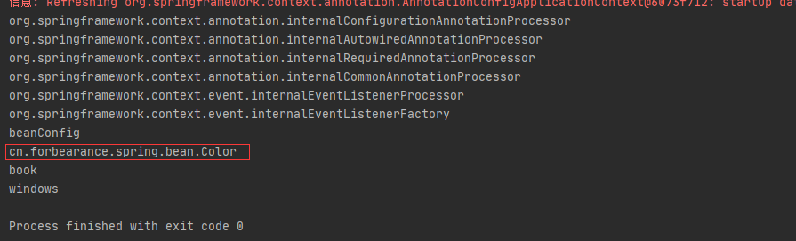
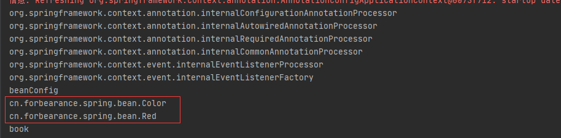

# 第7章：@Import-给容器中快速导入一个组件
## 是什么
### 概述
`@Import`注解允许`@Bean`从另一个配置类加载定义。即`@Import`注解是用来导入配置类或者导入需要前置加载的类。

查看源码看一下：
```java
package org.springframework.context.annotation;

import java.lang.annotation.Documented;
import java.lang.annotation.ElementType;
import java.lang.annotation.Retention;
import java.lang.annotation.RetentionPolicy;
import java.lang.annotation.Target;

/**
 * 指定要导入的一个或多个配置类
 */
@Target(ElementType.TYPE)
@Retention(RetentionPolicy.RUNTIME)
@Documented
public @interface Import {

	/**
	 * {@link Configuration}, {@link ImportSelector}, {@link ImportBeanDefinitionRegistrar}
	 * or regular component classes to import.
	 */
	Class<?>[] value();

}
```
`@Import`注解可以配合`@Configuration`、`ImportSelector`以及`ImportBeanDefinitionRegistrar`来使用，也可以当成普通的bean来使用。

**`@Import`注解只能标注在类上。**

## 能干嘛
### 注册bean的方式
1. 包扫描+Spring内置注解（`@Controller`、`@Service`、`@Repository`、`@Component`）。
2. `@Configuration`注解+`@Bean`注解，通常用于导入第三方包的组件。
3. `@Import`注解，快速向容器中导入一个组件
4. 使用FactoryBean注册组件

## 去哪下
官方文档：https://docs.spring.io/spring-framework/docs/current/reference/html/core.html#beans-java-using-import
## 怎么玩
### @Import注解的使用方式
1. 直接填写Class数组的方式
2. ImportSelector接口的方式，能够批量导入
3. ImportBeanDefinitionRegistrar接口的方式，手动注册bean到容器中

### 示例
定义一个名为`Color`的类：
```java
package cn.forbearance.spring.bean;

/**
 * @author cristina
 */
public class Color {
}
```
配置类添加@Import注解，导入Color：
```java
package cn.forbearance.spring.config;

import cn.forbearance.spring.bean.Book;
import cn.forbearance.spring.bean.Color;
import cn.forbearance.spring.condition.LinuxCondition;
import cn.forbearance.spring.condition.WindowsCondition;
import org.springframework.context.annotation.*;

/**
 * @author cristina
 */
@Configuration
@Import(Color.class) // @Import向容器中导入一个组件，id默认是组件的全类名
public class BeanConfig {

    @Lazy
    @Bean
    public Book book() {
        System.out.println("向Spring容器中注册组件");
        return new Book("forbearance.cn", 49);
    }

    @Conditional(WindowsCondition.class)
    @Bean(value = "windows")
    public Book book1() {
        return new Book("book1", 49);
    }

    @Conditional(LinuxCondition.class)
    @Bean(value = "linux")
    public Book book2() {
        return new Book("book2", 49);
    }
}
```
测试类：
```java
    @Test
    public void test01() {
        AnnotationConfigApplicationContext context = new AnnotationConfigApplicationContext(BeanConfig.class);
        String[] beanNames = context.getBeanNamesForType(Book.class);
        for (String beanName : beanNames) {
            System.out.println(beanName);
        }
    }
```
运行测试类：



输出结果打印了`cn.forbearance.spring.bean.Color`，说明使用`@Import`注解导入组件时，容器会自动注册这个组件，id默认是组件的全类名。

`@Import`注解还支持同时导入多个类：
定义一个`Red`的类
```java
package cn.forbearance.spring.bean;

/**
 * @author cristina
 */
public class Red {
}
```
在配置类中将Red类添加到@Import注解上：
```java
package cn.forbearance.spring.config;

import cn.forbearance.spring.bean.Book;
import cn.forbearance.spring.bean.Color;
import cn.forbearance.spring.bean.Red;
import cn.forbearance.spring.condition.LinuxCondition;
import cn.forbearance.spring.condition.WindowsCondition;
import org.springframework.context.annotation.*;

/**
 * @author cristina
 */
@Configuration
@Import({Color.class, Red.class}) // @Import向容器中导入一个组件，id默认是组件的全类名
public class BeanConfig {

    @Lazy
    @Bean
    public Book book() {
        System.out.println("向Spring容器中注册组件");
        return new Book("forbearance.cn", 49);
    }

    @Conditional(WindowsCondition.class)
    @Bean(value = "windows")
    public Book book1() {
        return new Book("book1", 49);
    }

    @Conditional(LinuxCondition.class)
    @Bean(value = "linux")
    public Book book2() {
        return new Book("book2", 49);
    }
}
```
运行测试类：


## 小结