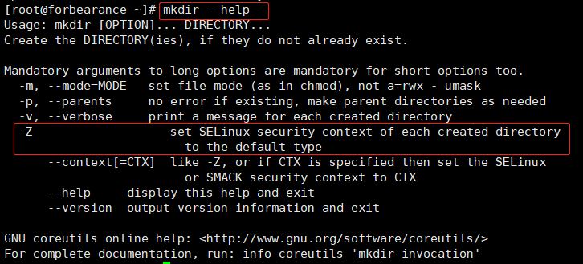

# 第3章：mkdir-创建目录文件
`mkdir`全称 make directories，其功能是用来创建目录文件。如果要创建的目标目录已存在，则会提示已存在且不会继续创建。如果目录不存在，但存在嵌套的关系，比如 `/a/b/c/d/e`。要想一次性创建需要使用到`-p`参数，进行递归操作。

## 语法格式
`mkdir [参数] [目录]`
## 可选参数
|  可选参数   | 作用  |
|  ----  | ----  |
| `-p` | 递归创建多级目录 |
| `-m` | 建立目录的同时设置目录的权限 |
| `-Z` | 设置安全上下文（将每个创建的目录的SELinux 安全环境设置为CTX） |
| `-v` | 显示目录的创建过程 |



## 参考案例
在当前工作目录中，创建一个目录文件：
```shell
[root@forbearance ~]# mkdir dir1
```
在当前工作目录中，创建一个目录文件并设置700权限（只有拥有者拥有读、写、执行权限）
```shell
[root@forbearance ~]# mkdir -m 700 dir2
```
在当前工作目录中，一次性创建多个目录文件：
```shell
[root@forbearance ~]# mkdir dir3 dir4 dir5
```
一次性创建多个有嵌套关系的目录文件，默认从根目录开始：
```shell
[root@forbearance ~]# mkdir -p /dir1/dir/
```
