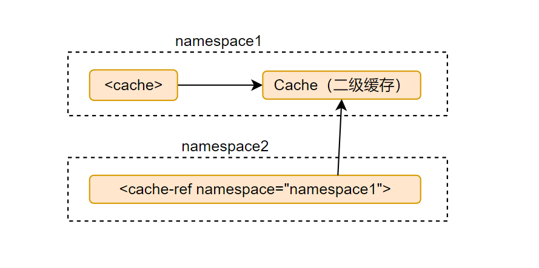
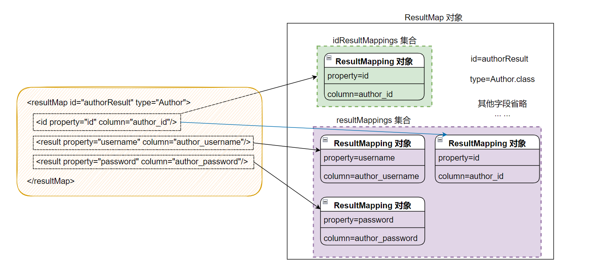
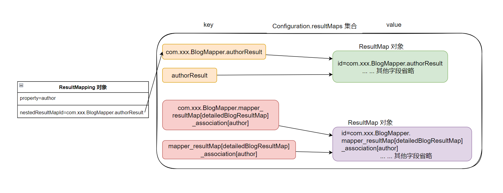
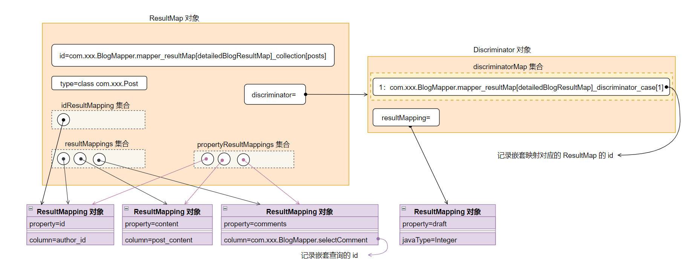
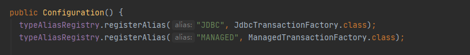
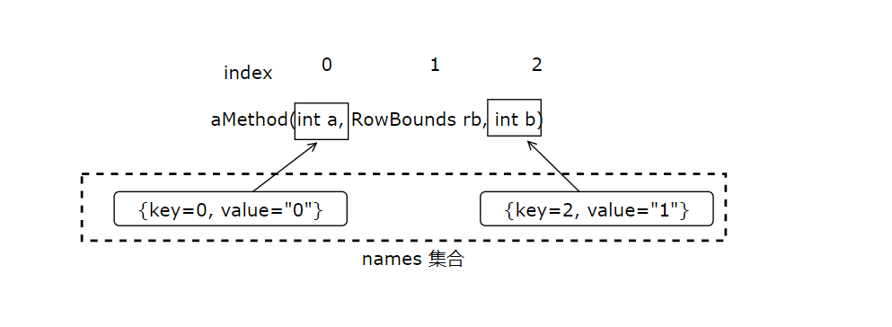
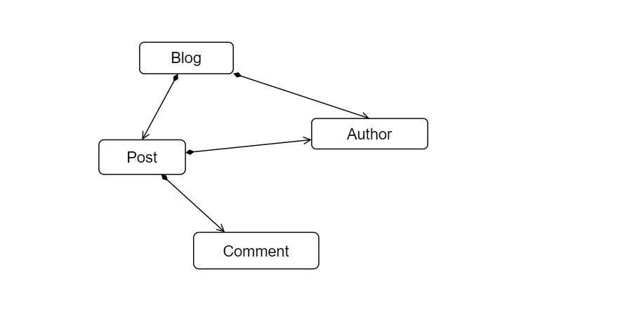

# MyBatis 原理
使用示例
```java
public void test05() {
    try {
        // 读取配置文件
        InputStream inputStream = Resources.getResourceAsStream("mybatis-config.xml");
        // 1.SqlSessionFactory 的初始化
        SqlSessionFactory sqlSessionFactory = new SqlSessionFactoryBuilder().build(inputStream);
        // 2.获取 SqlSession 对象
        SqlSession sqlSession = sqlSessionFactory.openSession();
        // 3.获取接口的代理对象
        Object mapper = sqlSession.getMapper(Object.class);
        // 4. 查询实现
        User user = mapper.selectById(1);
    } catch (IOException e) {
        e.printStackTrace();
    }
}
```
从上述测试示例中，我们可以大致猜测到 MyBatis 做了哪些步骤。
1. 读取`mybatis-config.xml`配置文件并装载，获取输入流。
2. 解析输入流，将配置文件中相关配置解析、校验并保存。
3. 创建`SqlSessionFactory`对象，session 就是一次会话，可以理解`SqlSessionFactory`是一个工厂类（单例）。
4. 创建`SqlSession`，`SqlSession`保存了配置文件内容信息以及执行数据库相关操作。
5. 获取接口代理对象，使用动态代理创建代理对象。
6. 存在一个专门映射的类，将接口中的方法与 SQL 映射。使用接口全路径+方法名称，确保方法和 SQL 关联。
7. 底层调用 JDBC 去操作数据库。
8. 会用到缓存，用来存储每次查询的数据。
## SqlSessionFactory 的初始化
MyBatis 初始化的主要工作是加载并解析`mybatis-config.xml`配置文件、映射配置文件以及相关的注解信息。MyBatis 初始化入口是`SqlSessionFactoryBuilder().build(()`方法。

定位`org.apache.ibatis.session.SqlSessionFactoryBuilder#build`，63：
```java
public SqlSessionFactory build(InputStream inputStream) {
    return build(inputStream, null, null);
}

// 方法重载，75
public SqlSessionFactory build(InputStream inputStream, String environment, Properties properties) {
    try {
      // 读取配置文件并封装到 XMLConfigBuilder 对象
      XMLConfigBuilder parser = new XMLConfigBuilder(inputStream, environment, properties);
      // 解析配置文件得到 Configuration 对象，创建 DefaultSqlSessionFactory 对象
      return build(parser.parse());
    } catch (Exception e) {
      throw ExceptionFactory.wrapException("Error building SqlSession.", e);
    } finally {
      // 关闭输入流对象
      ErrorContext.instance().reset();
      try {
        inputStream.close();
      } catch (IOException e) {
        // Intentionally ignore. Prefer previous error.
      }
    }
}
```
`XMLConfigBuilder`是用来解析 MyBatis 配置文件的。

### 入口
定位`org.apache.ibatis.builder.xml.XMLConfigBuilder#parse`：
```java
public Configuration parse() {
    // 根据 parsed 遍历的值，判断是否以及完成了对 mybatis-config.xml 配置文件的解析
    if (parsed) {
      throw new BuilderException("Each XMLConfigBuilder can only be used once.");
    }
    parsed = true;
    // 在 mybatis-config.xml 配置文件中查找一级标签（<configuration>），并开始解析
    parseConfiguration(parser.evalNode("/configuration"));
    return configuration;
}
```
定位`org.apache.ibatis.builder.xml.XMLConfigBuilder#parseConfiguration`：
```java
private void parseConfiguration(XNode root) {
    try {
      // 解析<properties> 节点
      propertiesElement(root.evalNode("properties"));
      // 解析<settings> 节点
      Properties settings = settingsAsProperties(root.evalNode("settings"));
      // 设置 vfsImpl、logImpl 字段
      loadCustomVfs(settings);
      loadCustomLogImpl(settings);
      // 解析<typeAliases> 节点
      typeAliasesElement(root.evalNode("typeAliases"));
      // 解析<plugins> 节点
      pluginElement(root.evalNode("plugins"));
      // 解析<objectFactory> 节点
      objectFactoryElement(root.evalNode("objectFactory"));
      // 解析<objectWrapperFactory> 节点
      objectWrapperFactoryElement(root.evalNode("objectWrapperFactory"));
      // 解析<reflectorFactory> 节点
      reflectorFactoryElement(root.evalNode("reflectorFactory"));
      // 将 settings 节点信息设置到 Configuration 中
      settingsElement(settings);
      // 解析<environments> 节点
      environmentsElement(root.evalNode("environments"));
      // 解析<databaseIdProvider> 节点
      databaseIdProviderElement(root.evalNode("databaseIdProvider"));
      // 解析<typeHandlers> 节点
      typeHandlerElement(root.evalNode("typeHandlers"));
      // 解析<mappers> 节点
      mapperElement(root.evalNode("mappers"));
    } catch (Exception e) {
      throw new BuilderException("Error parsing SQL Mapper Configuration. Cause: " + e, e);
    }
}
```
`parseConfiguration()`方法的代码还是比较整洁的，XMLConfigBuilder 将`mybatis-config.xml`配置文件中每个节点的解析过程封装成了一个对应的方法。

### \<properties\>节点

### \<mappers\>节点
在 MyBatis 初始化时，除了加载`mybatis-config.xml`配置文件，还会加载全部的映射文件，`mybatis-config.xml`配置文件中的`<mappers>`节点会告诉 MyBatis 去哪些位置查找映射文件以及使用了注解标识的接口。

`XMLConfigBuilder#mapperElement()`方法负责解析`<mappers>`节点，它会创建 XMLMapperBuilder 对象来加载映射文件，如果映射配置文件存在相应的 Mapper 接口，也会加载相应的 Mapper 接口，解析其中的注解并完成向 MapperRegistry 的注册。

定位`org.apache.ibatis.builder.xml.XMLConfigBuilder#mapperElement`：
```java
private void mapperElement(XNode parent) throws Exception {
    if (parent != null) {
      // 处理 <mappers> 的子节点
      for (XNode child : parent.getChildren()) {
        // <package> 子节点
        if ("package".equals(child.getName())) {
          String mapperPackage = child.getStringAttribute("name");
          // 扫描指定的包，并向 MapperRegistry 注册 Mapper 接口
          configuration.addMappers(mapperPackage);
        } else {
          // 获取 <mapper> 节点的 resource、url、class 属性，这三个属性互斥
          String resource = child.getStringAttribute("resource");
          String url = child.getStringAttribute("url");
          String mapperClass = child.getStringAttribute("class");
          // 如果 <mapper> 节点指定了 resource 或是 url 属性，则创建 XMLMapperBuilder 对象
          // 并通过该对象解析 resource 或是 url 属性指定的 Mapper 配置文件
          if (resource != null && url == null && mapperClass == null) {
            ErrorContext.instance().resource(resource);
            InputStream inputStream = Resources.getResourceAsStream(resource);
            // 创建 XMLMapperBuilder 对象，解析映射配置文件
            XMLMapperBuilder mapperParser = new XMLMapperBuilder(inputStream, configuration, resource, configuration.getSqlFragments());
            mapperParser.parse();
          } else if (resource == null && url != null && mapperClass == null) {
            ErrorContext.instance().resource(url);
            InputStream inputStream = Resources.getUrlAsStream(url);
            // 创建 XMLMapperBuilder 对象，解析映射配置文件
            XMLMapperBuilder mapperParser = new XMLMapperBuilder(inputStream, configuration, url, configuration.getSqlFragments());
            mapperParser.parse();
          } else if (resource == null && url == null && mapperClass != null) {
            // 如果 <mapper> 节点指定了 class 属性，则向 MapperRegistry 注册该接口
            Class<?> mapperInterface = Resources.classForName(mapperClass);
            configuration.addMapper(mapperInterface);
          } else {
            throw new BuilderException("A mapper element may only specify a url, resource or class, but not more than one.");
          }
        }
      }
    }
}
```
通过对`mapperElement()`的介绍，可以得知`XMLMapperBuilder`负责解析映射配置文件，继承自`BaseBuilder`抽象类，也是具体建造者的角色。

`XMLMapperBuilder#parse`方法是解析映射文件的入口。定位`org.apache.ibatis.builder.xml.XMLMapperBuilder#parse`：
```java
public void parse() {
    // 判断是否已经加载过该映射文件
    if (!configuration.isResourceLoaded(resource)) {
      // 处理 <mapper> 节点
      configurationElement(parser.evalNode("/mapper"));
      // 将 resource 添加到 loadedResources 集合中，其记录了已经加载过的映射文件
      configuration.addLoadedResource(resource);
      // 注册 Mapper 接口，（为命名空间绑定映射器）
      bindMapperForNamespace();
    }
    // 处理 configurationElement 方法中解析失败的 <resultMap> 节点
    parsePendingResultMaps();
    // 处理 configurationElement 方法中解析失败的 <cache-ref> 节点
    parsePendingCacheRefs();
    // 处理 configurationElement 方法中解析失败的 SQL 语句节点
    parsePendingStatements();
}
```
XMLMapperBuilder 也是将每个节点的解析过程封装成了一个方法，而这些方法由`XMLMapperBuilder#configurationElement`方法调用实现。

定位`org.apache.ibatis.builder.xml.XMLMapperBuilder#configurationElement`：
```java
private void configurationElement(XNode context) {
    try {
      // 获取 <mapper> 节点的 namespace 属性
      String namespace = context.getStringAttribute("namespace");
      if (namespace == null || namespace.isEmpty()) {
        // 如果没有设置 namespace 属性，则抛异常
        throw new BuilderException("Mapper's namespace cannot be empty");
      }
      // 设置 MapperBuilderAssistant 的 currentNamespace 属性，记录当前命名空间
      builderAssistant.setCurrentNamespace(namespace);
      // 解析 <cache-ref> 节点
      cacheRefElement(context.evalNode("cache-ref"));
      // 解析 <cache/> 节点
      cacheElement(context.evalNode("cache"));
      // 解析 <parameterMap> 节点，但已废弃，不推荐使用
      parameterMapElement(context.evalNodes("/mapper/parameterMap"));
      // 解析 <resultMap> 节点
      resultMapElements(context.evalNodes("/mapper/resultMap"));
      // 解析 <sql> 接待你
      sqlElement(context.evalNodes("/mapper/sql"));
      // 解析 <select>、<insert>、<update>、<delete> SQL 节点
      buildStatementFromContext(context.evalNodes("select|insert|update|delete"));
    } catch (Exception e) {
      throw new BuilderException("Error parsing Mapper XML. The XML location is '" + resource + "'. Cause: " + e, e);
    }
}
```
#### 解析\<cache\>节点
MyBatis 拥有非常强大的二级缓存功能，默认情况下没有开启二级缓存。如果需要为某个命名空间开启二级缓存功能，则需要在相应的映射配置文件中添加`<cache/>`标签，还可以通过配置其相关属性，为二级缓存配置相应的特性（本质上就是添加相应的装饰器）。

定位`org.apache.ibatis.builder.xml.XMLMapperBuilder#cacheElement`：
```java
private void cacheElement(XNode context) {
    if (context != null) {
      // 获取 <cache/> 节点的 type 属性，默认值是 PERPETUAL
      String type = context.getStringAttribute("type", "PERPETUAL");
      // 查找 type 属性对应的 Cache 接口实现
      Class<? extends Cache> typeClass = typeAliasRegistry.resolveAlias(type);
      // 获取 <cache/> 节点的 eviction 属性，默认值是 LRU
      String eviction = context.getStringAttribute("eviction", "LRU");
      // 解析 eviction 属性指定的 Cache 装饰器类型
      Class<? extends Cache> evictionClass = typeAliasRegistry.resolveAlias(eviction);
      // 获取 <cache/> 节点的 flushInterval 属性
      Long flushInterval = context.getLongAttribute("flushInterval");
      // 获取 <cache/> 节点的 size 属性
      Integer size = context.getIntAttribute("size");
      // 获取 <cache/> 节点的 readOnly 属性，默认值是 false
      boolean readWrite = !context.getBooleanAttribute("readOnly", false);
      // 获取 <cache/> 节点的 blocking 属性，默认值是 false
      boolean blocking = context.getBooleanAttribute("blocking", false);
      // 获取 <cache/> 节点下的子节点，将用于初始化二级缓存
      Properties props = context.getChildrenAsProperties();
      // 通过 MapperBuilderAssistant 创建 Cache 对象，并添加到 caches 集合中保存
      builderAssistant.useNewCache(typeClass, evictionClass, flushInterval, size, readWrite, blocking, props);
    }
}
```
`MapperBuilderAssistant`是一个辅助类，其`useNewCache()`方法负责创建 Cache 对象，并将其添加到`Configuration.caches`集合中保存。`caches`是 StrictMap 类型的集合，它记录 Cache 的 id（默认是映射文件的 namespace） 与 Cache 对象（二级缓存）之间的对应关系。StrictMap 继承自 HashMap，并在其基础上进行了少许修改，这里重点关注`StrictMap.put()`方法，如果检测到重复的 key 则抛异常，如果没有重复的 key 则添加 key 以及 value，同时会根据 key 产生 shortKey，其实现如下：
```java
@Override
@SuppressWarnings("unchecked")
public V put(String key, V value) {
  if (containsKey(key)) {
    throw new IllegalArgumentException(name + " already contains value for " + key
        + (conflictMessageProducer == null ? "" : conflictMessageProducer.apply(super.get(key), value)));
  }
  if (key.contains(".")) {
    final String shortKey = getShortName(key);
    if (super.get(shortKey) == null) {
      super.put(shortKey, value);
    } else {
      super.put(shortKey, (V) new Ambiguity(shortKey));
    }
  }
  return super.put(key, value);
}
```
TODO-未完待续

介绍完 StrictMap 之后，继续分析`useNewCache()`方法的实现，定位`org.apache.ibatis.builder.MapperBuilderAssistant#useNewCache`：
```java
public Cache useNewCache(Class<? extends Cache> typeClass,
  Class<? extends Cache> evictionClass,
  Long flushInterval,
  Integer size,
  boolean readWrite,
  boolean blocking,
  Properties props) {
    // 创建 Cache 对象，这里使用了创造者模式，CacheBuilder 是创造者的角色，而 Cache 是生成的产品
    Cache cache = new CacheBuilder(currentNamespace)
        .implementation(valueOrDefault(typeClass, PerpetualCache.class))
        .addDecorator(valueOrDefault(evictionClass, LruCache.class))
        .clearInterval(flushInterval)
        .size(size)
        .readWrite(readWrite)
        .blocking(blocking)
        .properties(props)
        .build();
    // 将 Cache 对象添加到 caches 集合中保存，currentNamespace 作为 key，而 Cache 对象本身作为 value
    configuration.addCache(cache);
    currentCache = cache;
    return cache;
}
```
#### 解析\<cache-ref\>节点
前面通过对`<cache/>`节点解析过程可以知道，`XMLMapperBuilder#cacheElement`方法会为每个 namespace 创建一个对应的 Cache 对象（如果设置了 `<cache/>` 标签才会创建），并在`caches`集合中记录 namespace 与 Cache 对象之间的对应关系，如果相要在多个 namespace 共用同一个二级缓存，即同一个 Cache 对象，则可以使用`<cache-ref>`节点进行配置。

`XMLMapperBuilder#cacheRefElement`方法负责解析`<cache-ref>`节点，这里需要强调的是`Configuration.cacheRefMap`集合，其 key 为`<ache-ref>`节点所在的 namespace，value 是`<cache-ref>`节点的`namespace`属性指定的 namespace，共用同一个 Cache 对象，如图所示：



定位`org.apache.ibatis.builder.xml.XMLMapperBuilder#cacheRefElement`：
```java
private void cacheRefElement(XNode context) {
    if (context != null) {
      // 将当前 namespace 与被引用的 Cache 所在的 namespace 之间的对应关系，记录到 cacheRefMap 集合中
      configuration.addCacheRef(builderAssistant.getCurrentNamespace(), context.getStringAttribute("namespace"));
      // 创建 CacheRefResolver 对象
      CacheRefResolver cacheRefResolver = new CacheRefResolver(builderAssistant, context.getStringAttribute("namespace"));
      try {
        // 解析 Cache 引用，该过程主要是设置 MapperBuilderAssistant 中的 currentCache 和 unresolvedCacheRef 属性
        cacheRefResolver.resolveCacheRef();
      } catch (IncompleteElementException e) {
        // 如果解析失败，则添加到 incompleteCacheRefs 集合，稍后再解析
        configuration.addIncompleteCacheRef(cacheRefResolver);
      }
    }
}
```
`CacheRefResolver`是一个简单的 Cache 引用解析器，其封装了被引用的 namespace 以及当前`XMLMapperBuilder`对应的`MapperBuilderAssistant`对象，`CacheRefResolver#resolveCacheRef`方法会调用`MapperBuilderAssistant#useCacheRef`方法，而在`MapperBuilderAssistant#useCacheRef`方法中会通过 namespace 查找被引用的 Cache 对象。

定位`org.apache.ibatis.builder.MapperBuilderAssistant#useCacheRef`：
```java
public Cache useCacheRef(String namespace) {
    // 如果 namespace 为空，抛异常
    if (namespace == null) {
      throw new BuilderException("cache-ref element requires a namespace attribute.");
    }
    try {
      // 标识未成功解析 Cache 引用
      unresolvedCacheRef = true;
      // 获取 namespace 对应的 Cache 对象
      Cache cache = configuration.getCache(namespace);
      if (cache == null) {
        throw new IncompleteElementException("No cache for namespace '" + namespace + "' could be found.");
      }
      // 记录当前命名空间使用的 Cache 对象
      currentCache = cache;
      // 标识已成功解析的 Cache 引用
      unresolvedCacheRef = false;
      return cache;
    } catch (IllegalArgumentException e) {
      throw new IncompleteElementException("No cache for namespace '" + namespace + "' could be found.", e);
    }
}
```
另一个需要了解的是`Configuration.incompleteCacheRefs`集合，`incompleteCacheRefs`是`LinkedList<CacheRefResolver>`类型的集合，其记录了当前解析出现异常的 CacheRefResolver 对象。

#### 解析\<resultMap\>节点
select 语句查询得到的结果集是一张二维表，水平方向看是一个个字段，垂直方向上看是一条条记录。而 Java 是面向对象的程序设计语言，对象是根据类定义创建的，类之间的引用关系可以认为是嵌套的结构。在 JDBC 编程中，为了将结果集中的数据映射成对象，我们需要自己写代码从结果集中获取数据，然后封装成对应的对象并设置对象之间的关系，这显然是大量且重复性的工作。MyBatis 使用`<resultMap>`标签定义了结果集与结果对象（JavaBean 对象）之间的映射规则，`<resultMap>`可以满足大部分的映射需求，减少重复性工作，提高开发效率。

先来说一下该过程中的数据结构，每个 ResultMapping 对象记录了结果集中的一列与 JavaBean 中的一个属性之间的映射关系。`<resultMap>`节点下除了`<discriminator>`子节点外，其他子节点都会被解析成对应的 ResultMapping 对象。ResultMapping 核心字段如下：
```java
public class ResultMapping {

    // Configuration 对象
    private Configuration configuration;
    
    // 对应节点的 property 属性，表示与该列进行映射的属性
    private String property;
    
    // 对应节点 column 属性，表示从数据库中得到的列名或别名
    private String column;
    
    // 对应节点的 javaType 属性，表示一个 JavaBean 的全限定类名，或类型别名
    private Class<?> javaType;
    
    // 对应节点的 javaType 属性，表示进行映射的列的 JDBC 类型
    private JdbcType jdbcType;
    
    // 对应节点的 typeHandler 属性，类型处理器，它会覆盖默认的类型处理器
    private TypeHandler<?> typeHandler;
    
    // 对应节点的 resultMap 属性（嵌套查询），
    // 该属性通过 id 引用了另一个 <resultMap> 节点定义，它负责将结果集中的一部分映射成其他关联的结果对象。
    // 这样就可以通过 join 方式进行关联查询，然后直接映射成多个对象，并同时设置这些对象之间的组合关系
    private String nestedResultMapId;
    
    // 对应节点的 nestedQueryId 属性（联合查询）
    // 该属性通过 id 引用另一个 <select> 节点定义，它会把指定列的值传入 select 属性指定的 select 语句中作为参数进行查询。
    // 使用 select 属性可能会导致 N+1 问题
    private String nestedQueryId;
    
    //对应节点的 notNullColumns 属性拆分后的结果
    private Set<String> notNullColumns;
    
    // 对应节点的 columnPrefix 属性
    private String columnPrefix;
    
    // 处理后的标志，ID 和 CONSTRUCT
    private List<ResultFlag> flags;
    
    // 对应节点的 column 属性拆分后生成的结果，composites.size() > 0 会使 column 为 null
    private List<ResultMapping> composites;
    
    // 对应节点的 resultSet 属性
    private String resultSet;
    
    // 对应节点的 foreignColumn 属性
    private String foreignColumn;
    
    // 是否延迟加载，对应节点的 fetchType 属性
    private boolean lazy;
}
```
ResultMapping 中定义了一个内部 Builder 类，使用了建造者模式，该类主要用于数据整理和数据校验，实现比较简单，不再赘述。

另一个比较重要的类是 ResultMap，每个`resultMap>`节点都会被解析成一个 ResultMap 对象，而其中的每个节点所定义的映射关系，则使用 ResultMapping 对象表示，如图所示：



ResultMap 核心字段：
```java
public class ResultMap {
    private Configuration configuration;
    
    // <resultMap> 节点的 id 属性
    private String id;
    
    // <resultMap> 节点的 type 属性
    private Class<?> type;
    
    // 记录了 <discriminator> 节点之外的其他映射关系。（ResultMapping 对象集合） 
    private List<ResultMapping> resultMappings;
    
    // 记录了映射关系中带有 ID 标志的映射关系，如 <id>、<idArg>（<constructor> 节点的子节点）
    private List<ResultMapping> idResultMappings;
    
    // 记录了映射关系中带有 Constructor 标志的映射关系，如 <constructor> 的所有子元素
    private List<ResultMapping> constructorResultMappings;
    
    // 记录了映射关系中不带有 Constructor 标志的映射关系
    private List<ResultMapping> propertyResultMappings;
    
    // 记录了所有映射关系中涉及的 column 属性的集合
    private Set<String> mappedColumns;
    
    private Set<String> mappedProperties;
    
    // 鉴别器，对应 <discriminator> 节点
    private Discriminator discriminator;
    
    // 是否含有嵌套的结果映射，如果某个映射关系中存在 resultMap 属性，且不存在 resultSet 属性，则为 true
    private boolean hasNestedResultMaps;
    
    // 是否含有嵌套查询，若某个属性映射存在 select 属性，则为 true
    private boolean hasNestedQueries;
    
    // 是否开启自动映射
    private Boolean autoMapping;
}
```
ResultMap 中也定义了一个 Builder 类，其主要用于创建 ResultMap 对象，应用了创建者模式。

在了解 ResultMapping 和 ResultMap 中记录的信息之后，接下来开始分析`<resultMap>`节点的解析过程。为了更直观的理解接解析过程，将基于示例进行分析，示例请前往附录中进行查阅。

`XMLMapperBuilder#resultMapElements`方法用于解析映射配置文件中的`<resultMap>`标签，该方法会循环调用`resultMapElement()`方法处理每个`<resultMap>`节点，定位`org.apache.ibatis.builder.xml.XMLMapperBuilder#resultMapElements`：
```java
private void resultMapElements(List<XNode> list) {
    for (XNode resultMapNode : list) {
      try {
        resultMapElement(resultMapNode);
      } catch (IncompleteElementException e) {
        // ignore, it will be retried
      }
    }
}

private ResultMap resultMapElement(XNode resultMapNode) {
    return resultMapElement(resultMapNode, Collections.emptyList(), null);
}

private ResultMap resultMapElement(XNode resultMapNode, List<ResultMapping> additionalResultMappings, Class<?> enclosingType) {
    ErrorContext.instance().activity("processing " + resultMapNode.getValueBasedIdentifier());
    
    // 获取 <resultMap> 节点的 type 属性，结果集将被映射成 type 指定类型的对象，注意其默认值 
    String type = resultMapNode.getStringAttribute("type",
        resultMapNode.getStringAttribute("ofType",
            resultMapNode.getStringAttribute("resultType",
                resultMapNode.getStringAttribute("javaType"))));
    // 解析 type 类型
    Class<?> typeClass = resolveClass(type);
    if (typeClass == null) {
      typeClass = inheritEnclosingType(resultMapNode, enclosingType);
    }
    Discriminator discriminator = null;
    // 用于记录解析的结果
    List<ResultMapping> resultMappings = new ArrayList<>(additionalResultMappings);
    // 处理 <resultMap> 的子节点
    List<XNode> resultChildren = resultMapNode.getChildren();
    for (XNode resultChild : resultChildren) {
      if ("constructor".equals(resultChild.getName())) {
        // 处理 <constructor> 节点
        processConstructorElement(resultChild, typeClass, resultMappings);
      } else if ("discriminator".equals(resultChild.getName())) {
        // 处理 <discriminator> 节点
        discriminator = processDiscriminatorElement(resultChild, typeClass, resultMappings);
      } else {
        // 处理 <id>、<result>、<association>、<collection> 等节点
        List<ResultFlag> flags = new ArrayList<>();
        if ("id".equals(resultChild.getName())) {
          // 如果是 <id> 节点，则向 flags 集合中添加 ResultFlag.ID
          flags.add(ResultFlag.ID);
        }
        // 创建 ResultMapping 对象，并添加到 resultMappings 集合中保存
        resultMappings.add(buildResultMappingFromContext(resultChild, typeClass, flags));
      }
    }
    // 获取 <resultMap> 节点的 id 属性，默认值会拼接所有父节点的 id 或 value 或 Property 属性值
    String id = resultMapNode.getStringAttribute("id",
            resultMapNode.getValueBasedIdentifier());
    // 获取 <resultMap> 节点的 extends 属性，该属性指定了该 <resultMap> 节点的继承关系
    String extend = resultMapNode.getStringAttribute("extends");
    // 获取 <resultMap> 节点的 autoMapping 属性，该属性设置为 true 时表示开启自动映射功能，即自动查找与列名同名的属性名，并调用 setter 方法
    // 若设置为 false，则需要在 <resultMap> 节点中明确注明映射关系才会调用对应的 setter 方法
    Boolean autoMapping = resultMapNode.getBooleanAttribute("autoMapping");
    ResultMapResolver resultMapResolver = new ResultMapResolver(builderAssistant, id, typeClass, extend, discriminator, resultMappings, autoMapping);
    try {
      // 创建 ResultMap 对象，并添加到 resultMaps 集合中，集合类型为 StrictMap
      return resultMapResolver.resolve();
    } catch (IncompleteElementException e) {
      configuration.addIncompleteResultMap(resultMapResolver);
      throw e;
    }
}
```
首先来分析`<id>`标签的处理过程，通过`XMLMapperBuilder#buildResultMappingFromContext`方法为`<result>`节点创建对应的 ResultMapping 对象。

定位`org.apache.ibatis.builder.xml.XMLMapperBuilder#buildResultMappingFromContext`：
```java
private ResultMapping buildResultMappingFromContext(XNode context, Class<?> resultType, List<ResultFlag> flags) {
    String property;
    // 获取 property 的属性值
    if (flags.contains(ResultFlag.CONSTRUCTOR)) {
      property = context.getStringAttribute("name");
    } else {
      property = context.getStringAttribute("property");
    }
    // 获取 column、javaType、jdbcType、select 等属性值
    String column = context.getStringAttribute("column");
    String javaType = context.getStringAttribute("javaType");
    String jdbcType = context.getStringAttribute("jdbcType");
    String nestedSelect = context.getStringAttribute("select");
    String nestedResultMap = context.getStringAttribute("resultMap", () ->
        processNestedResultMappings(context, Collections.emptyList(), resultType));
    String notNullColumn = context.getStringAttribute("notNullColumn");
    String columnPrefix = context.getStringAttribute("columnPrefix");
    String typeHandler = context.getStringAttribute("typeHandler");
    String resultSet = context.getStringAttribute("resultSet");
    String foreignColumn = context.getStringAttribute("foreignColumn");
    boolean lazy = "lazy".equals(context.getStringAttribute("fetchType", configuration.isLazyLoadingEnabled() ? "lazy" : "eager"));
    // 解析 javaType、typeHandler 和 jdbcType 
    Class<?> javaTypeClass = resolveClass(javaType);
    Class<? extends TypeHandler<?>> typeHandlerClass = resolveClass(typeHandler);
    JdbcType jdbcTypeEnum = resolveJdbcType(jdbcType);
    // 创建 ResultMapping 对象
    return builderAssistant.buildResultMapping(resultType, property, column, javaTypeClass, jdbcTypeEnum, nestedSelect, nestedResultMap, notNullColumn, columnPrefix, typeHandlerClass, flags, resultSet, foreignColumn, lazy);
}
```
定位`org.apache.ibatis.builder.MapperBuilderAssistant#buildResultMapping`，411：
```java
public ResultMapping buildResultMapping(
  Class<?> resultType,
  String property,
  String column,
  Class<?> javaType,
  JdbcType jdbcType,
  String nestedSelect,
  String nestedResultMap,
  String notNullColumn,
  String columnPrefix,
  Class<? extends TypeHandler<?>> typeHandler,
  List<ResultFlag> flags,
  String resultSet,
  String foreignColumn,
  boolean lazy) {
    // 解析 <resultType> 节点指定的 property 属性的类型
    Class<?> javaTypeClass = resolveResultJavaType(resultType, property, javaType);
    // 获取 typeHandler 指定 TypeHandler 对象，底层依赖于 typeHandlerRegistry
    TypeHandler<?> typeHandlerInstance = resolveTypeHandler(javaTypeClass, typeHandler);
    
    // 解析 column 属性值，当 column 值是 "{prop1=col1,prop2=col2}" 时，会解析成 ResultMapping 对象集合
    // column 的这种形式主要用于嵌套查询的参数传递
    List<ResultMapping> composites;
    if ((nestedSelect == null || nestedSelect.isEmpty()) && (foreignColumn == null || foreignColumn.isEmpty())) {
      composites = Collections.emptyList();
    } else {
      composites = parseCompositeColumnName(column);
    }
    // 创建 ResultMapping 对象，并设置其属性
    return new ResultMapping.Builder(configuration, property, column, javaTypeClass)
        .jdbcType(jdbcType)
        .nestedQueryId(applyCurrentNamespace(nestedSelect, true))
        .nestedResultMapId(applyCurrentNamespace(nestedResultMap, true))
        .resultSet(resultSet)
        .typeHandler(typeHandlerInstance)
        .flags(flags == null ? new ArrayList<>() : flags)
        .composites(composites)
        .notNullColumns(parseMultipleColumnNames(notNullColumn))
        .columnPrefix(columnPrefix)
        .foreignColumn(foreignColumn)
        .lazy(lazy)
        .build();
    }
```
得到 ResultMapping 对象之后，会调用`ResultMapResolver#resolve`方法，该方法会调用`MapperBuilderAssistant#addResultMap`方法创建 ResultMap 对象，并将 ResultMap 对象添加到`resultMaps`集合中。

定位`org.apache.ibatis.builder.ResultMapResolver#resolve`：
```java
public ResultMap resolve() {
    return assistant.addResultMap(this.id, this.type, this.extend, this.discriminator, this.resultMappings, this.autoMapping);
}

public ResultMap addResultMap(
  String id,
  Class<?> type,
  String extend,
  Discriminator discriminator,
  List<ResultMapping> resultMappings,
  Boolean autoMapping) {
    // ResultMap 完整的 id 格式是 namespace.id
    id = applyCurrentNamespace(id, false);
    // 获取被继承的 ResultMap 的完整 id，也就是父 ResultMap 对象的完整 id
    extend = applyCurrentNamespace(extend, true);
    
    // 针对 extends 属性的处理
    if (extend != null) {
      // 检测 resultMaps 集合中是否存在被继承的 ResultMap 对象
      if (!configuration.hasResultMap(extend)) {
        throw new IncompleteElementException("Could not find a parent resultmap with id '" + extend + "'");
      }
      // 获取需要被继承的 ResultMap 对象，也就是父 ResultMap 对象
      ResultMap resultMap = configuration.getResultMap(extend);
      // 获取父 ResultMap 对象中记录的 ResultMapping 集合
      List<ResultMapping> extendedResultMappings = new ArrayList<>(resultMap.getResultMappings());
      // 删除需要覆盖的 ResultMapping 对象
      extendedResultMappings.removeAll(resultMappings);
      // Remove parent constructor if this resultMap declares a constructor.
      // 如果当前 <resultMap> 节点中定义了 <constructor> 节点，
      // 则不需要使用父 ResultMap 对象中定义的 <constructor> 节点信息，则将其对应的 ResultMapping 对象删除
      boolean declaresConstructor = false;
      for (ResultMapping resultMapping : resultMappings) {
        if (resultMapping.getFlags().contains(ResultFlag.CONSTRUCTOR)) {
          declaresConstructor = true;
          break;
        }
      }
      if (declaresConstructor) {
        extendedResultMappings.removeIf(resultMapping -> resultMapping.getFlags().contains(ResultFlag.CONSTRUCTOR));
      }
      // 添加需要被继承下来的 ResultMapping 对象集合
      resultMappings.addAll(extendedResultMappings);
    }
    // 创建 ResultMap 对象，并添加到 ResultMap 集合中保存
    ResultMap resultMap = new ResultMap.Builder(configuration, id, type, resultMappings, autoMapping)
        .discriminator(discriminator)
        .build();
    configuration.addResultMap(resultMap);
    return resultMap;
}
```
经过上述方法的处理，id 为 authorResult 的`<resultMap>`节点会被解析为如图所示的 ResultMap 对象。可以清楚地看到，resultMappings 集合和 propertyResultMappings 集合中记录了`<id>`节点和`<result>`节点对应的 ResultMapping 对象，idResultMappings 集合中记录了`<id>`节点对应的 ResultMapping 对象。


下面继续分析 id 为 detailedBlogResultMap 的`<resultMap>`节点的解析过程，首先会涉及到`<constructor>`节点的解析。该过程由`XMLMapperBuilder#processConstructorElement`方法实现。具体实现如下，`org.apache.ibatis.builder.xml.XMLMapperBuilder#processConstructorElement`：
```java
private void processConstructorElement(XNode resultChild, Class<?> resultType, List<ResultMapping> resultMappings) {
    // 获取 <constructor> 节点的子节点
    List<XNode> argChildren = resultChild.getChildren();
    for (XNode argChild : argChildren) {
      List<ResultFlag> flags = new ArrayList<>();
      // 添加 CONSTRUCTOR 标识
      flags.add(ResultFlag.CONSTRUCTOR);
      if ("idArg".equals(argChild.getName())) {
        // 对于 <idArg> 节点，添加 ID 标识
        flags.add(ResultFlag.ID);
      }
      // 创建 ResultMapping 对象，并添加到 resultMappings 集合中
      resultMappings.add(buildResultMappingFromContext(argChild, resultType, flags));
    }
}
```
`<constructor>`解析过程中生成的 ResultMapping 对象与前面类似，不再重复描述。

之后会解析`<association>`节点，正如前面对`XMLMapperBuilder#resultMapElement`方法的介绍，`<association>`节点也是在`XMLMapperBuilder#buildResultMappingFromContext`方法中完成解析的，具体代码如下：
```java
private ResultMapping buildResultMappingFromContext(XNode context, Class<?> resultType, List<ResultFlag> flags) {
    ... ... 
    /*
     * 如果没有指定 <association> 节点的 resultMap 属性，则是匿名的嵌套映射，
     * 需要通过 processNestedResultMappings() 方法解析该匿名的嵌套映射
     */
    String nestedResultMap = context.getStringAttribute("resultMap", () ->
        processNestedResultMappings(context, Collections.emptyList(), resultType));
    ... ...
}

// processNestedResultMappings 方法的实现如下：
private String processNestedResultMappings(XNode context, List<ResultMapping> resultMappings, Class<?> enclosingType) {
    // 只会处理 <association>、<collection> 和 <case> 三种节点，如果指定了 select 属性，则不会生成嵌套的 ResultMap 对象
    if (Arrays.asList("association", "collection", "case").contains(context.getName())
        && context.getStringAttribute("select") == null) {
      validateCollection(context, enclosingType);
      ResultMap resultMap = resultMapElement(context, resultMappings, enclosingType);
      return resultMap.getId();
    }
    return null;
}
```
`<association>`节点解析后产生的 ResultMapping 对象以及在`Configuration.resultMaps`集合中的状态如图所示。需要注意的是，在`resultMaps`集合中每个 ResultMap 对象都对应两个 key，一个简单 id，另一个以 namespace 开头的完整 id。



然后来分析对`<collection>`节点的解析过程，在解析其中的`<collection>`节点时，除了上述已经分析过的步骤外，还需要特别关注`processNestedResultMappings()`方法对其中匿名的嵌套映射的处理。该方法会调用`resultMapElement()`方法解析`<collection>`节点的子节点，创建相应的 ResultMap 对象并添加到`resultMaps`集合中，其具体实现前面已经介绍过了。

另外，还涉及到`<discriminator>`节点的解析，该解析过程由`XMLMapperBuilder#processDiscriminatorElement`方法完成，具体实现如下：
```java
private Discriminator processDiscriminatorElement(XNode context, Class<?> resultType, List<ResultMapping> resultMappings) {
    // 获取 column、javaType、jdbcType、typeHandler 属性
    String column = context.getStringAttribute("column");
    String javaType = context.getStringAttribute("javaType");
    String jdbcType = context.getStringAttribute("jdbcType");
    String typeHandler = context.getStringAttribute("typeHandler");
    Class<?> javaTypeClass = resolveClass(javaType);
    Class<? extends TypeHandler<?>> typeHandlerClass = resolveClass(typeHandler);
    JdbcType jdbcTypeEnum = resolveJdbcType(jdbcType);
    // 处理 <discriminator> 节点的子节点
    Map<String, String> discriminatorMap = new HashMap<>();
    for (XNode caseChild : context.getChildren()) {
      String value = caseChild.getStringAttribute("value");
      // 调用 processNestedResultMappings() 方法创建嵌套的 ResultMap 对象
      String resultMap = caseChild.getStringAttribute("resultMap", processNestedResultMappings(caseChild, resultMappings, resultType));
      // 记录该列值与对应选择的 ResultMap 的 id
      discriminatorMap.put(value, resultMap);
    }
    // 创建 Discriminator 对象
    return builderAssistant.buildDiscriminator(resultType, column, javaTypeClass, jdbcTypeEnum, typeHandlerClass, discriminatorMap);
}
```
而示例中`<collection>`节点解析后得到的 ResultMap 对象如图所示。



至此，`<resulrMap>`节点的核心解析过程就分析完了，未涉及的子节点和属性的解析过程并不是很复杂，就不再赘述了。最后，通过下图所示从更高的视角来看附录中的示例的全部`<resulrMap>`节点解析后的结果。

#### 解析\<sql\>节点
在映射配置文件中，可以使用`<sql>`标签定义可重用的 SQL 语句片段，当需要重用`<sql>`节点中定义的 SQL 语句片段时，只需要使用`<include>`节点引入相应的片段即可。

`XMLMapperBuilder#sqlElement`方法负责解析映射配置文件中定义的全部`<sql>`标签，其实现如下：
```java
// org.apache.ibatis.builder.xml.XMLMapperBuilder#sqlElement，338行

private void sqlElement(List<XNode> list) {
    if (configuration.getDatabaseId() != null) {
      sqlElement(list, configuration.getDatabaseId());
    }
    sqlElement(list, null);
}

// 方法重载，345
private void sqlElement(List<XNode> list, String requiredDatabaseId) {
    // 遍历 <sql> 节点
    for (XNode context : list) {
      // 获取 databaseId 属性
      String databaseId = context.getStringAttribute("databaseId");
      // 获取 id 属性
      String id = context.getStringAttribute("id");
      // 为 id 添加命名空间
      id = builderAssistant.applyCurrentNamespace(id, false);
      // 检查 <sql> 的 databaseId 与当前 Configuration 记录的 databaseId 是否一致
      if (databaseIdMatchesCurrent(id, databaseId, requiredDatabaseId)) {
        // 记录到 sqlFragments 集合中保存
        sqlFragments.put(id, context);
      }
    }
}
```

#### 解析 SQL 语句节点
除了上面介绍的节点外，还有一类需要解析的节点，也就是 SQL 节点，这些 SQL 节点主要用于定义 SQL 语句，但它们不再由 XMLMapperBuilder 进行解析，而是由 XMLStatementBuilder 负责解析。

MyBatis 使用 SqlSource 接口表示映射文件注解中定义的 SQL 语句。但它表示的 SQL 语句并不能直接被数据库执行，因为其中可能含有动态 SQL 语句相关的节点或是占位符等需要解析的元素。其接口定义如下：
```java
public interface SqlSource {

  // 该方法会根据映射文件或注解描述的 SQL 语句，以及传入的参数，返回可执行的 SQL
  BoundSql getBoundSql(Object parameterObject);

}
```
MyBatis 使用 MappedStatement 表示映射文件中定义的 SQL 语句，该对象包含了这些节点的可定义的属性，比较重要的属性如下：
```java
public final class MappedStatement {
    // 节点中的 id 属性（包括命名空间前缀）
    private String resource;
    
    // 一个 SqlSource 对象对应一条 SQL 语句
    private SqlSource sqlSource;
    
    // SQL 的类型，UNKNOWN, INSERT, UPDATE, DELETE, SELECT, FLUSH
    private SqlCommandType sqlCommandType;
}
```
了解 XMLStatementBuilder 中涉及的数据结构后，接下来开始分析其解析 SQL 相关节点的过程。入口`org.apache.ibatis.builder.xml.XMLMapperBuilder#buildStatementFromContext`，127：
```java
private void buildStatementFromContext(List<XNode> list) {
    if (configuration.getDatabaseId() != null) {
      buildStatementFromContext(list, configuration.getDatabaseId());
    }
    buildStatementFromContext(list, null);
}

// 方法重载
private void buildStatementFromContext(List<XNode> list, String requiredDatabaseId) {
    for (XNode context : list) {
      final XMLStatementBuilder statementParser = new XMLStatementBuilder(configuration, builderAssistant, context, requiredDatabaseId);
      try {
        statementParser.parseStatementNode();
      } catch (IncompleteElementException e) {
        configuration.addIncompleteStatement(statementParser);
      }
    }
}

// 真正的实现入口：org.apache.ibatis.builder.xml.XMLStatementBuilder#parseStatementNode
public void parseStatementNode() {
    // 获取 SQL 节点的 id 和 databaseId 属性
    // 若其 databaseId 属性值与当前使用的 数据库不匹配，则不加载该 SQL 节点；
    // 若存在相同 id 且 databaseId 不为空的 SQL 节点，则不再加载该 SQL 节点
    String id = context.getStringAttribute("id");
    String databaseId = context.getStringAttribute("databaseId");
    
    if (!databaseIdMatchesCurrent(id, databaseId, this.requiredDatabaseId)) {
      return;
    }
    
    // 根据 SQL 节点的名称决定其 SqlCommandType。<insert>、<delete>、<update>、<select>
    String nodeName = context.getNode().getNodeName();
    SqlCommandType sqlCommandType = SqlCommandType.valueOf(nodeName.toUpperCase(Locale.ENGLISH));
    boolean isSelect = sqlCommandType == SqlCommandType.SELECT;
    
    // 获取 SQL 节点的可定义的属性，具体含义在官方文档有详细介绍
    boolean flushCache = context.getBooleanAttribute("flushCache", !isSelect);
    boolean useCache = context.getBooleanAttribute("useCache", isSelect);
    boolean resultOrdered = context.getBooleanAttribute("resultOrdered", false);
    
    // 在解析 SQL 语句之前，先处理 <include> 节点，可重用的 sql 片段
    XMLIncludeTransformer includeParser = new XMLIncludeTransformer(configuration, builderAssistant);
    includeParser.applyIncludes(context.getNode());
    
    String parameterType = context.getStringAttribute("parameterType");
    Class<?> parameterTypeClass = resolveClass(parameterType);
    
    String lang = context.getStringAttribute("lang");
    LanguageDriver langDriver = getLanguageDriver(lang);
    
    // 处理 <selectKey> 节点，insert 和 update 可使用该节点定义
    processSelectKeyNodes(id, parameterTypeClass, langDriver);
    
    // Parse the SQL (pre: <selectKey> and <include> were parsed and removed)
    KeyGenerator keyGenerator;
    // 获取 <selectKey> 节点对应的 SelectKeyGenerator 的 id
    String keyStatementId = id + SelectKeyGenerator.SELECT_KEY_SUFFIX;
    keyStatementId = builderAssistant.applyCurrentNamespace(keyStatementId, true);
    
    // 检查 SQL 节点中是否配置了 <selectKey> 节点、SQL 节点的 useGeneratedKeys 属性、
    // mybatis-config.xml 中配置的全局的 useGeneratedKeys 属性，以及是否为 insert 语句
    // 来决定使用哪一个 KeyGenerator 接口实现
    if (configuration.hasKeyGenerator(keyStatementId)) {
      keyGenerator = configuration.getKeyGenerator(keyStatementId);
    } else {
      keyGenerator = context.getBooleanAttribute("useGeneratedKeys",
          configuration.isUseGeneratedKeys() && SqlCommandType.INSERT.equals(sqlCommandType))
          ? Jdbc3KeyGenerator.INSTANCE : NoKeyGenerator.INSTANCE;
    }
    
    // 调用 LanguageDriver#createSqlSource() 方法创建 SqlSource 对象
    SqlSource sqlSource = langDriver.createSqlSource(configuration, context, parameterTypeClass);
    
    // 获取 SQL 节点的可定义的属性，具体含义在官方文档有详细介绍
    StatementType statementType = StatementType.valueOf(context.getStringAttribute("statementType", StatementType.PREPARED.toString()));
    Integer fetchSize = context.getIntAttribute("fetchSize");
    Integer timeout = context.getIntAttribute("timeout");
    String parameterMap = context.getStringAttribute("parameterMap");
    String resultType = context.getStringAttribute("resultType");
    Class<?> resultTypeClass = resolveClass(resultType);
    String resultMap = context.getStringAttribute("resultMap");
    String resultSetType = context.getStringAttribute("resultSetType");
    ResultSetType resultSetTypeEnum = resolveResultSetType(resultSetType);
    if (resultSetTypeEnum == null) {
      resultSetTypeEnum = configuration.getDefaultResultSetType();
    }
    
    // 获取 keyProperty、keyColumn、resultSets 三个属性
    String keyProperty = context.getStringAttribute("keyProperty");
    String keyColumn = context.getStringAttribute("keyColumn");
    String resultSets = context.getStringAttribute("resultSets");
    
    // 通过 MapperBuilderAssistant 创建 MappedStatement 对象，并添加到 Configuration.mappedStatements 集合中
    builderAssistant.addMappedStatement(id, sqlSource, statementType, sqlCommandType,
        fetchSize, timeout, parameterMap, parameterTypeClass, resultMap, resultTypeClass,
        resultSetTypeEnum, flushCache, useCache, resultOrdered,
        keyGenerator, keyProperty, keyColumn, databaseId, langDriver, resultSets);
}
```
到此为止，解析映射文件的核心流程就以及分析完了。
### 绑定 Mapper 接口
每个映射配置文件的命名空间可以绑定一个 Mapper 接口，并注册到 MapperRegistry 中。在`XMLMapperBuilder#bindMapperForNamespace`方法中，完成了映射配置文件与对应 Mapper 接口的绑定，其实现如下`org.apache.ibatis.builder.xml.XMLMapperBuilder#bindMapperForNamespace`：
```java
private void bindMapperForNamespace() {
    // 获取映射文件的命名空间
    String namespace = builderAssistant.getCurrentNamespace();
    if (namespace != null) {
      Class<?> boundType = null;
      try {
        // 解析命名空间对应的类型
        boundType = Resources.classForName(namespace);
      } catch (ClassNotFoundException e) {
        // ignore, bound type is not required
      }
      // 是否已经加载了 boundType 接口
      if (boundType != null && !configuration.hasMapper(boundType)) {
        // 追加 namespace: 前缀，并添加到 loadedResources 集合中 
        configuration.addLoadedResource("namespace:" + namespace);
        // 调用 MapperRegistry#addMapper 方法，注册 boundType 接口
        configuration.addMapper(boundType);
      }
    }
}

// org.apache.ibatis.session.Configuration#addMapper
public <T> void addMapper(Class<T> type) {
    mapperRegistry.addMapper(type);
}

// org.apache.ibatis.binding.MapperRegistry#addMapper
public <T> void addMapper(Class<T> type) {
    if (type.isInterface()) {
      if (hasMapper(type)) {
        throw new BindingException("Type " + type + " is already known to the MapperRegistry.");
      }
      boolean loadCompleted = false;
      try {
        knownMappers.put(type, new MapperProxyFactory<>(type));
        // It's important that the type is added before the parser is run
        // otherwise the binding may automatically be attempted by the
        // mapper parser. If the type is already known, it won't try.
        MapperAnnotationBuilder parser = new MapperAnnotationBuilder(config, type);
        parser.parse();
        loadCompleted = true;
      } finally {
        if (!loadCompleted) {
          knownMappers.remove(type);
        }
      }
    }
}
  
```
`addMapper()`方法除了会向 knownMappers 集合注册指定的 Mapper 接口，还会调用`org.apache.ibatis.builder.annotation.MapperAnnotationBuilder#parse`方法解析 Mapper 接口中的注解信息。
```java
public void parse() {
    String resource = type.toString();
    // 判断是否已经加载过该接口
    if (!configuration.isResourceLoaded(resource)) {
      // 若未加载，则创建 XMLMapperBuilder 对象解析对应的映射文件，该过程就是前面提到的映射文件解析过程
      loadXmlResource();
      configuration.addLoadedResource(resource);
      assistant.setCurrentNamespace(type.getName());
      
      // 解析 @CacheNamespace 注解
      parseCache();
      // 解析 @CacheNamespaceRef 注解
      parseCacheRef();
      for (Method method : type.getMethods()) {
        if (!canHaveStatement(method)) {
          continue;
        }
        if (getAnnotationWrapper(method, false, Select.class, SelectProvider.class).isPresent()
            && method.getAnnotation(ResultMap.class) == null) {
          parseResultMap(method);
        }
        try {
          // 解析 @SelectKey、@ResultMap、@Options 注解，并创建 MappedStatement 对象
          parseStatement(method);
        } catch (IncompleteElementException e) {
          // 如果出现 IncompleteElementException 异常，可能是引用了未解析的注解
          // 将出现异常的方法添加到 Configuration.incompleteMethods 集合中暂存，稍后再解析一次
          configuration.addIncompleteMethod(new MethodResolver(this, method));
        }
      }
    }
    // 遍历 Configuration.incompleteMethods 集合中记录的解析失败的方法，并重新进行解析
    parsePendingMethods();
}
```
### 处理 incomplete 解析异常集合
`XMLMapperBuilder#configurationElement`方法解析映射配置文件时，是按照文件从头到尾的顺序解析的，但是有时候再解析一个节点时，会引用定义在该节点之后的、还未解析的节点，这样就会导致解析失败并抛 IncompleteElementException 异常。

根据抛出异常的节点不同，MyBatis 会创建不同的 `*Resolver` 对象，并添加到 `incomplete*` 集合中。

在`XMLMapperBuilder#parse`方法中会调用三个`parsePending*()`方法处理 Configuration 中对应的三个`incomplete*`集合。所有`parsePending*()`方法的逻辑基本都是类似的，这里以`parsePendingStatements()`方法为例进行分析。
```java
private void parsePendingStatements() {
    // 获取 incompleteStatements 集合
    Collection<XMLStatementBuilder> incompleteStatements = configuration.getIncompleteStatements();
    // 加锁同步
    synchronized (incompleteStatements) {
      // 遍历 incompleteStatements 集合
      Iterator<XMLStatementBuilder> iter = incompleteStatements.iterator();
      while (iter.hasNext()) {
        try {
          // 重新解析 SQL 节点
          iter.next().parseStatementNode();
          // 处理成功则移除 XMLStatementBuilder 对象
          iter.remove();
        } catch (IncompleteElementException e) {
          // 如果还是无法解析，则忽略该节点
          // Statement is still missing a resource...
        }
      }
    }
}
```
至此，MyBatis 的初始化过程就介绍完了，其中分析了 mybatis-config.xml 配置文件的解析过程、映射文件的解析过程以及 Mapper 接口中相关注解的解析过程

SqlSource

## 获取 SqlSession 对象
获取 SqlSession 对象的逻辑相较于 MyBatis 初始化逻辑还是简单的。

入口函数是`org.apache.ibatis.session.defaults.DefaultSqlSessionFactory#openSession`，46：
```java
@Override
public SqlSession openSession() {
    return openSessionFromDataSource(configuration.getDefaultExecutorType(), null, false);
}
// protected ExecutorType defaultExecutorType = ExecutorType.SIMPLE;

private SqlSession openSessionFromDataSource(ExecutorType execType, TransactionIsolationLevel level, boolean autoCommit) {
    Transaction tx = null;
    try {
      // 获取 mybatis-config.xml 配置文件中配置的 Environment 对象
      final Environment environment = configuration.getEnvironment();
      // 获取 TransactionFactory 对象（事务工厂）。比如 <transactionManager type="JDBC"/> 对应 JdbcTransactionFactory
      final TransactionFactory transactionFactory = getTransactionFactoryFromEnvironment(environment);
      // 创建 Transaction 对象（事务）
      tx = transactionFactory.newTransaction(environment.getDataSource(), level, autoCommit);
      // 根据配置创建 Executor 对象
      // execType 默认是 ExecutorType.SIMPLE，默认情况下会创建 SimpleExecutor 对象，用于执行 SQL
      final Executor executor = configuration.newExecutor(tx, execType);
      // 创建 DefaultSqlSession 对象
      return new DefaultSqlSession(configuration, executor, autoCommit);
    } catch (Exception e) {
      // 关闭 Transaction
      closeTransaction(tx); // may have fetched a connection so lets call close()
      throw ExceptionFactory.wrapException("Error opening session.  Cause: " + e, e);
    } finally {
      ErrorContext.instance().reset();
    }
}
```
### 获取事务工厂
定位`org.apache.ibatis.session.defaults.DefaultSqlSessionFactory#getTransactionFactoryFromEnvironment`：
```java
private TransactionFactory getTransactionFactoryFromEnvironment(Environment environment) {
    if (environment == null || environment.getTransactionFactory() == null) {
      // 默认事务工厂
      return new ManagedTransactionFactory();
    }
    // 如果配置了则使用已配置的事务工厂
    return environment.getTransactionFactory();
}
```
获取事务工厂的逻辑比较简单，如果没有配置`<transactionManager>`标签，则使用默认的事务工厂 ManagedTransactionFactory，否则使用指定的事务工厂。

### 创建事务
```java
tx = transactionFactory.newTransaction(environment.getDataSource(), level, autoCommit);
```
TransactionFactory 接口继承结构：


默认事务工厂类型：



默认的事务工厂类型可以配置为 JDBC 类型或者 MANAGED 类型。（也可以自定义类型，1、需实现 TransactionFactory 接口；2、`<transactionManager>`标签的 type 属性值为自定义类的全限定类名）
- JdbcTransactionFactory 生产 JdbcTransaction
- ManagedTransactionFactory 生产 ManagedTransaction

如果配置的是 JDBC，会使用 Connection 对象的`commit()`、`rollback()`、`close()`方法来管理事务。如果配置的是 MANAGED，则会把事务交给容器来管理，比如 JBoss、Weblogic 等 Web 应用服务器。但是如果在本地运行 MyBatis 程序，则不会有任何事务。

而如果 Spring+MyBatis 整合，则不用配置。原因是会在 Spring 配置文件中配置数据源和事务管理器，会覆盖 MyBatis 的配置。

### 创建 Executor
```java
final Executor executor = configuration.newExecutor(tx, execType);

// org.apache.ibatis.session.Configuration#newExecutor，667
public Executor newExecutor(Transaction transaction, ExecutorType executorType) {
    executorType = executorType == null ? defaultExecutorType : executorType;
    executorType = executorType == null ? ExecutorType.SIMPLE : executorType;
    Executor executor;
    // 1、根据 executorType 类型创建执行器
    if (ExecutorType.BATCH == executorType) {
      executor = new BatchExecutor(this, transaction);
    } else if (ExecutorType.REUSE == executorType) {
      executor = new ReuseExecutor(this, transaction);
    } else {
      executor = new SimpleExecutor(this, transaction);
    }
    // 2、缓存装饰，默认为 true，（二级缓存）
    if (cacheEnabled) {
      // 如果 cacheEnabled 为 true，则使用 CachingExecutor（装饰器）对象封装 executor 对象。应用于装饰器模式
      executor = new CachingExecutor(executor);
    }
    // 3、 插件代理，会对 executor 对象植入插件逻辑，比如分页插件
    executor = (Executor) interceptorChain.pluginAll(executor);
    return executor;
}
```
至此，SqlSession 对象的获取已经介绍完了，其中 DefaultSqlSession 对象中包含两个重要的属性：configuration（全局配置信息） 和 executor（执行器）。

## 获取接口的代理对象

### MapperRegistry

MapperRegistry 是 Mapper 接口及其对应的代理对象工厂的注册中心。在需要执行某 SQL 语句时，会先调用`MapperRegistry#getMapper`方法获取 Mapper 接口的代理对象。MyBatis 是通过 JDK 动态代理为 Mapper 接口生成的代理对象。

MapperRegistry 中字段的含义：
```java
  // MyBatis 全局唯一的配置对象，包含了所有的配置信息
  private final Configuration config;
  
  // 记录了 Mapper 接口的与对应的 MapperProxyFactory 代理对象之间的关系
  private final Map<Class<?>, MapperProxyFactory<?>> knownMappers = new HashMap<>();
```

入口函数`org.apache.ibatis.session.defaults.DefaultSqlSession#getMapper`：
```java
@Override
    public <T> T getMapper(Class<T> type) {
    return configuration.getMapper(type, this);
}

// org.apache.ibatis.session.Configuration#getMapper
public <T> T getMapper(Class<T> type, SqlSession sqlSession) {
    return mapperRegistry.getMapper(type, sqlSession);
}

// org.apache.ibatis.binding.MapperRegistry#getMapper
@SuppressWarnings("unchecked")
public <T> T getMapper(Class<T> type, SqlSession sqlSession) {
    // 查找指定 type 对应的 MapperProxyFactory 代理对象
    final MapperProxyFactory<T> mapperProxyFactory = (MapperProxyFactory<T>) knownMappers.get(type);
    if (mapperProxyFactory == null) {
      throw new BindingException("Type " + type + " is not known to the MapperRegistry.");
    }
    try {
      // 创建实现了 type 接口的代理对象
      return mapperProxyFactory.newInstance(sqlSession);
    } catch (Exception e) {
      throw new BindingException("Error getting mapper instance. Cause: " + e, e);
    }
}
```
### MapperProxyFactory

MapperProxyFactory 主要负责创建代理对象（`MapperProxy`），其核心字段含义如下：

```java
    // 目标接口对象（JDK 动态代理，代理的是接口 interface），也就是 Mapper 接口对应的 Class 对象，
    private final Class<T> mapperInterface;
    
    // 缓存，key 是 mapperInterface 接口章某个方法对应的 Method 对象,
    // value 是对应的 MapperMethod 对象
    private final Map<Method, MapperMethodInvoker> methodCache = new ConcurrentHashMap<>();
```
`MapperProxyFactory#newInstance`方法实现了根据 mapperInterface 接口创建代理对象的功能。其实现如下`org.apache.ibatis.binding.MapperProxyFactory#newInstance`，51：
```java
public T newInstance(SqlSession sqlSession) {
    // 创建 MapperProxy 对象，每次调用都会创建新的 MapperProxy 对象
    final MapperProxy<T> mapperProxy = new MapperProxy<>(sqlSession, mapperInterface, methodCache);
    return newInstance(mapperProxy);
}

// 方法重载
@SuppressWarnings("unchecked")
protected T newInstance(MapperProxy<T> mapperProxy) {
    // 使用 JDK 动态代理创建实现了 mapperInterface 接口的代理对象
    return (T) Proxy.newProxyInstance(mapperInterface.getClassLoader(), new Class[] { mapperInterface }, mapperProxy);
}
```


## 查询实现

### MapperProxy

MapperProxy 实现了 InvocationHandler 接口，InvocationHandler 接口的实现是代理对象的核心逻辑。MapperProxy 核心字段如下：

```java
    // 记录了关联的 SqlSession 对象
    private final SqlSession sqlSession;
    
    // Mapper 接口的 Class 对象
    private final Class<T> mapperInterface;
    
    // 用于缓存 MapperMethod 对象，其中 key 是 Mapper 接口中方法对应的 Method 对象
    // value 是 MapperMethod 对象。MapperMethod 对象会完成参数转换以及 SQL 语句的执行功能
    // MapperMethod 中并不会记录任何状态相关的信息，所以可以在多个代理对象之间共享
    private final Map<Method, MapperMethodInvoker> methodCache;
```
`MapperProxy#invoke`方法是代理对象执行的主要逻辑。定位`org.apache.ibatis.binding.MapperProxy#invoke`：
```java
@Override
public Object invoke(Object proxy, Method method, Object[] args) throws Throwable {
    try {
      // 如果目标方法继承自 Object，则直接调用目标方法
      if (Object.class.equals(method.getDeclaringClass())) {
        return method.invoke(this, args);
      } else {
        // 从缓存中获取 MapperMethod 对象，如果缓存中没有，则创建新的 MapperMethod 对象并添加到缓存中
        // 调用 MapperMethod#execute 方法执行 SQL 语句
        return cachedInvoker(method).invoke(proxy, method, args, sqlSession);
      }
    } catch (Throwable t) {
      throw ExceptionUtil.unwrapThrowable(t);
    }
}
```

`MapperProxy#cachedInvoker`方法主要负责维护 methodCache 这个缓存集合。定位`org.apache.ibatis.binding.MapperProxy#cachedInvoker`。

```java
private MapperMethodInvoker cachedInvoker(Method method) throws Throwable {
    try {
      // 从缓存中查找 MapperMethod
      MapperMethodInvoker invoker = methodCache.get(method);
      if (invoker != null) {
        return invoker;
      }

      // computeIfAbsent 在 Java8 会存在阻塞 bug，详情参见：https://blog.csdn.net/ttaannkkee/article/details/121427280
      return methodCache.computeIfAbsent(method, m -> {
        // 接口中 default 方法，针对 Java7 以上版本对动态类型语言的支持
        if (m.isDefault()) {
          try {
            if (privateLookupInMethod == null) {
              return new DefaultMethodInvoker(getMethodHandleJava8(method));
            } else {
              return new DefaultMethodInvoker(getMethodHandleJava9(method));
            }
          } catch (IllegalAccessException | InstantiationException | InvocationTargetException
              | NoSuchMethodException e) {
            throw new RuntimeException(e);
          }
        } else {
          // 一般会执行这个构造器  
          return new PlainMethodInvoker(new MapperMethod(mapperInterface, method, sqlSession.getConfiguration()));
        }
      });
    } catch (RuntimeException re) {
      Throwable cause = re.getCause();
      throw cause == null ? re : cause;
    }
}
```

### MapperMethod
MapperMethod 中封装了 Mapper 接口中对应方法的信息，以及对应的 SQL 语句的信息。可以将 MapperMethod 看作是连接 Mapper 接口和映射文件中定义的 SQL 语句的桥梁。其字段信息如下：
```java
    // 记录了 SQL 语句的名称和类型
    private final SqlCommand command;
    
    // Mapper 接口中对应方法的相关信息
    private final MethodSignature method;
    
    public MapperMethod(Class<?> mapperInterface, Method method, Configuration config) {
        this.command = new SqlCommand(config, mapperInterface, method);
        this.method = new MethodSignature(config, mapperInterface, method);
    }
```

#### SqlCommand
SqlCommand 类是 MapperMethod 类中定义的内部类，它使用`name`字段记录了 SQL 语句的名称（接口全类名.方法名），使用`type`字段（SqlCommandType 类型）记录了 SQL 语句的类型。SqlCommandType 是枚举类，其有效取值如下：
```java
public enum SqlCommandType {
    UNKNOWN, INSERT, UPDATE, DELETE, SELECT, FLUSH
}
```
SqlCommand 的构造函数会初始化`name`字段和`type`字段，定位`org.apache.ibatis.binding.MapperMethod.SqlCommand#SqlCommand`：
```java
public SqlCommand(Configuration configuration, Class<?> mapperInterface, Method method) {
    // 获取 Mapper 接口全类名
    final String methodName = method.getName();
    final Class<?> declaringClass = method.getDeclaringClass();
    // 获取 MappedStatement 对象
    MappedStatement ms = resolveMappedStatement(mapperInterface, methodName, declaringClass,
      configuration);
    if (ms == null) {
        // 处理 @Flush 注解，@Flush 是为批量操作准备的
        if (method.getAnnotation(Flush.class) != null) {
          name = null;
          type = SqlCommandType.FLUSH;
        } else {
          throw new BindingException("Invalid bound statement (not found): "
              + mapperInterface.getName() + "." + methodName);
        }
    } else {
        // 初始化 name 和 type
        name = ms.getId();
        type = ms.getSqlCommandType();
        if (type == SqlCommandType.UNKNOWN) {
          throw new BindingException("Unknown execution method for: " + name);
        }
    }
}

private MappedStatement resolveMappedStatement(Class<?> mapperInterface, String methodName,
    // SQL 语句的名称由 Mapper 接口全类名与对应方法名称组成的
    Class<?> declaringClass, Configuration configuration) {
      String statementId = mapperInterface.getName() + "." + methodName;
      // 检测是否已经存在 SQL 语句名称对应的 MappedStatement 对象
      if (configuration.hasStatement(statementId)) {
        // 从 Configuration.mappedStatements 集合中查找对应的 MappedStatement 对象
        // MappedStatement 对象中封装了 SQL 语句相关的信息
        return configuration.getMappedStatement(statementId);
      } else if (mapperInterface.equals(declaringClass)) {
        return null;
      }
      // 如果指定方法是在父接口中定义的，则在此进行继承结构的处理
      for (Class<?> superInterface : mapperInterface.getInterfaces()) {
        if (declaringClass.isAssignableFrom(superInterface)) {
          // 递归调用，将父接口传入 resolveMappedStatement() 方法
          MappedStatement ms = resolveMappedStatement(superInterface, methodName,
              declaringClass, configuration);
          if (ms != null) {
            return ms;
          }
        }
      }
      return null;
    }
}
```
#### MethodSignature
在介绍 MethodSignature 之前，先来分析 ParamNameResolver，ParamNameResolver 是用来解析 Mapper 接口方法参数列表的解析器。ParamNameResolver 使用`names`字段记录了参数在参数列表中的位置索引与参数名称之间的对应关系，key 表示参数在参数列表中的索引位置，value 表示参数名称。参数名称可以通过`@Param`注解指定，若没有指定`@Param`注解，则使用参数索引作为其名称，如果参数列表中包含`RowBounds`或`ResultHandler`类型的参数，则这两种参数不会被记录大 names 集合中，这样会导致参数的索引与名称不一致。比如：
```java
aMethod(int a, RowBounds rb, int b) -> {{0, "0"}, {2, "1"}}
```



ParamNameResolver 使用`hasParamAnnotation`字段记录方法的参数列表中是否使用了`@Param`注解。

在 ParamNameResolver 的构造方法中，会通过反射的方式获取 Mapper 接口中对应方法的信息，并初始化上述两个字段，其实现如下`org.apache.ibatis.reflection.ParamNameResolver#ParamNameResolver`：
```java
public ParamNameResolver(Configuration config, Method method) {
    this.useActualParamName = config.isUseActualParamName();
    // 获取参数列表中每个参数的类型
    final Class<?>[] paramTypes = method.getParameterTypes();
    // 获取参数列表上的注解
    final Annotation[][] paramAnnotations = method.getParameterAnnotations();
    // 记录参数索引与参数名称的对应关系
    final SortedMap<Integer, String> map = new TreeMap<>();
    int paramCount = paramAnnotations.length;
    // get names from @Param annotations
    for (int paramIndex = 0; paramIndex < paramCount; paramIndex++) {
      if (isSpecialParameter(paramTypes[paramIndex])) {
        // 如果参数是 RowBounds 类型或 ResultHandler 类型，则跳过对该参数的解析
        continue;
      }
      String name = null;
      // 遍历参数注解集合
      for (Annotation annotation : paramAnnotations[paramIndex]) {
        if (annotation instanceof Param) {
          hasParamAnnotation = true;
          // 获取 @Param 注解指定的参数名称
          name = ((Param) annotation).value();
          break;
        }
      }
      
      // 这个 if 块解释了上诉示例中 names 集合项的 value 为什么是 "0"和"1"
      if (name == null) {
        // 该参数没有标注 @Param 注解，则根据配置决定是否使用参数实际名称作为其名称
        if (useActualParamName) {
          name = getActualParamName(method, paramIndex);
        }
        if (name == null) {
          // 使用参数索引作为其名称
          name = String.valueOf(map.size());
        }
      }
      // 记录到 map 集合中
      map.put(paramIndex, name);
    }
    // 初始化 names 集合
    names = Collections.unmodifiableSortedMap(map);
}

// org.apache.ibatis.reflection.ParamNameResolver#isSpecialParameter
// 该方法用来过滤 RowBounds 和 RowBounds 类型的参数
private static boolean isSpecialParameter(Class<?> clazz) {
    return RowBounds.class.isAssignableFrom(clazz) || RowBounds.class.isAssignableFrom(clazz);
}
```
介绍完 ParamNameResolver 的功能，回到 MethodSignature 继续分析。MethodSignature 也是 MapperMethod 中定义的内部类，其封装了 Mapper 接口中定义的方法的相关信息（入参、返回值），MethodSignature 核心字段含义如下：
```java
    // 返回值类型是否为 Collection 类型或是数组类型
    private final boolean returnsMany;
    
    // 返回值类型是否为 Map 类型。（this.returnsMap = this.mapKey != null）
    private final boolean returnsMap;
    
    //  返回值类型是否为 void
    private final boolean returnsVoid;
    
    // 返回值类型是否为 Cursor 类型（游标类型）
    private final boolean returnsCursor;
    
    // 返回值类型是否为 Optional 类型
    private final boolean returnsOptional;
    
    // 返回值类型
    private final Class<?> returnType;
    
    // 如果返回值类型是 Map。则该字段记录了作为 key 的列名
    // eg：@MapKey("id")，其具体含义参照源码：org.apache.ibatis.annotations.MapKey
    private final String mapKey;
    
    // 用来标记该方法参数列表中 ResultHandler 类型参数的索引位置
    private final Integer resultHandlerIndex;
    
    // 用来标记该方法参数列表中 RowBounds 类型参数的位置
    private final Integer rowBoundsIndex;
    
    // 该方法的参数解析器
    private final ParamNameResolver paramNameResolver;
```
在 MethodSignature 的构造函数中会解析相应 Method 对象，并初始化上述字段，其实现如下`org.apache.ibatis.binding.MapperMethod.MethodSignature#MethodSignature`：
```java
public MethodSignature(Configuration configuration, Class<?> mapperInterface, Method method) {
    // 解析方法的返回值类型
    Type resolvedReturnType = TypeParameterResolver.resolveReturnType(method, mapperInterface);
    if (resolvedReturnType instanceof Class<?>) {
        this.returnType = (Class<?>) resolvedReturnType;
    } else if (resolvedReturnType instanceof ParameterizedType) {
        this.returnType = (Class<?>) ((ParameterizedType) resolvedReturnType).getRawType();
    } else {
        this.returnType = method.getReturnType();
    }
    // 初始化 returnsVoid、returnsMany、returnsCursor、returnsOptional 等字段
    this.returnsVoid = void.class.equals(this.returnType);
    this.returnsMany = configuration.getObjectFactory().isCollection(this.returnType) || this.returnType.isArray();
    this.returnsCursor = Cursor.class.equals(this.returnType);
    this.returnsOptional = Optional.class.equals(this.returnType);
    // 如果方法的返回值是 Map 类型，且标注了 @MapKey 注解，则使用 getMapKey() 方法处理
    this.mapKey = getMapKey(method);
    this.returnsMap = this.mapKey != null;
    // 初始化 RowBounds 和 ResultHandler 字段
    this.rowBoundsIndex = getUniqueParamIndex(method, RowBounds.class);
    this.resultHandlerIndex = getUniqueParamIndex(method, ResultHandler.class);
    this.paramNameResolver = new ParamNameResolver(configuration, method);
}
```
`getUniqueParamIndex()`方法的主要功能是查找指定类型的参数在参数列表中的索引位置。
```java
// org.apache.ibatis.binding.MapperMethod.MethodSignature#getUniqueParamIndex
private Integer getUniqueParamIndex(Method method, Class<?> paramType) {
    Integer index = null;
    final Class<?>[] argTypes = method.getParameterTypes();
    // 遍历参数列表
    for (int i = 0; i < argTypes.length; i++) {
        if (paramType.isAssignableFrom(argTypes[i])) {
          if (index == null) {
            // 记录 paramType 类型参数在参数列表中的位置索引
            index = i;
          } else {
            // RowBounds 和 ResultHandler 类型的参数只能有一个，不能重复出现，且一个方法也只能有一个
            throw new BindingException(method.getName() + " cannot have multiple " + paramType.getSimpleName() + " parameters");
          }
        }
    }
    return index;
}
```
再说一下`convertArgsToSqlCommandParam()`这个辅助方法。
```java
// org.apache.ibatis.binding.MapperMethod.MethodSignature#convertArgsToSqlCommandParam
public Object convertArgsToSqlCommandParam(Object[] args) {
    // 负责将 args[] 数组转换成 SQL 语句对应的参数列表，args[] 是用户传入的实参列表
    return paramNameResolver.getNamedParams(args);
}
```
`names`集合主要在`ParamNameResolver#getNamedParams`方法中使用，该方法接收的参数是用户传入的实参列表，并将实参列表与其对应名称进行关联。
```java
// org.apache.ibatis.reflection.ParamNameResolver#getNamedParams
public Object getNamedParams(Object[] args) {
    final int paramCount = names.size();
    // 空参方法，返回 null
    if (args == null || paramCount == 0) {
        return null;
    } else if (!hasParamAnnotation && paramCount == 1) {
        // 没有使用 @Param，且只有一个参数
        Object value = args[names.firstKey()];
        return wrapToMapIfCollection(value, useActualParamName ? names.get(0) : null);
    } else {    // 处理使用 @Param 注解指定参数名称或有多个参数的情况
    
        // param 集合中记录了参数名称与实参之间的对应关系
        final Map<String, Object> param = new ParamMap<>();
        int i = 0;
        for (Map.Entry<Integer, String> entry : names.entrySet()) {
            // 将参数名与实参的对应关系记录到 param 中 
            param.put(entry.getValue(), args[entry.getKey()]);
            
            // add generic param names (param1, param2, ...)
            // 为参数创建 "param+索引" 的默认参数名称，比如 param1、param2，并添加到 param 集合中
            final String genericParamName = GENERIC_NAME_PREFIX + (i + 1);
            
            // ensure not to overwrite parameter named with @Param
            // 如果 names 集合中已经存在参数名称是 "param+索引" 格式的，则不需要再添加
            if (!names.containsValue(genericParamName)) {
              param.put(genericParamName, args[entry.getKey()]);
            }
            i++;
        }
        return param;
    }
}
```
#### execute()

介绍完 MapperMethod 中定义的内部类，回到 MapperProxy#invoke 方法中，`cachedInvoker(method)`方法返回值是 PlainMethodInvoker 类型，会调用`PlainMethodInvoker#invoke`方法，该方法又会调用`MapperMethod#execute`方法，`execute()`方法是 MapperMethod 中最核心的方法，它会根据 SQL 语句的类型调用 SqlSession 对应的方法完成数据库操作。SqlSession 是 MyBatis 的核心组件之一，用于负责完成数据库操作。`MapperMethod#execute`实现如下`org.apache.ibatis.binding.MapperMethod#execute`：

```java
public Object execute(SqlSession sqlSession, Object[] args) {
    Object result;
    // 根据 SQL 语句的类型调用 SqlSession 对应的方法
    switch (command.getType()) {
      case INSERT: {
        // 使用 ParamNameResolver 参数处理器处理 args[]（用户传入的实参列表），将用户传入的实参与指定参数名称关联起来
        Object param = method.convertArgsToSqlCommandParam(args);
        // 调用 SqlSession#insert() 方法操作数据库
        // 而 rowCountResult() 方法会根据 method 字段中记录的方法返回值类型对结果进行转换
        result = rowCountResult(sqlSession.insert(command.getName(), param));
        break;
      }
      // UPDATE 和 DELETE 处理逻辑类似，唯一区别就是调用的 SqlSession 的方法不同 update()、delete()
      case UPDATE: {
        Object param = method.convertArgsToSqlCommandParam(args);
        result = rowCountResult(sqlSession.update(command.getName(), param));
        break;
      }
      case DELETE: {
        Object param = method.convertArgsToSqlCommandParam(args);
        result = rowCountResult(sqlSession.delete(command.getName(), param));
        break;
      }
      case SELECT:
        // 处理返回值为 void 且存在参数类型是 ResultHandler 的方法
        if (method.returnsVoid() && method.hasResultHandler()) {
          executeWithResultHandler(sqlSession, args);
          result = null;
        } else if (method.returnsMany()) {
          // 处理返回值是集合或数组的方法
          result = executeForMany(sqlSession, args);
        } else if (method.returnsMap()) {
          // 处理返回值是 Map 的方法
          result = executeForMap(sqlSession, args);
        } else if (method.returnsCursor()) {
          // 处理返回值是 Cursor（游标）的方法
          result = executeForCursor(sqlSession, args);
        } else {
          // 处理返回值是单一对象的方法
          Object param = method.convertArgsToSqlCommandParam(args);
          result = sqlSession.selectOne(command.getName(), param);
          if (method.returnsOptional()
              && (result == null || !method.getReturnType().equals(result.getClass()))) {
            result = Optional.ofNullable(result);
          }
        }
        break;
      case FLUSH:
        result = sqlSession.flushStatements();
        break;
      default:
        throw new BindingException("Unknown execution method for: " + command.getName());
    }
    // 边界检查
    if (result == null && method.getReturnType().isPrimitive() && !method.returnsVoid()) {
      throw new BindingException("Mapper method '" + command.getName()
          + " attempted to return null from a method with a primitive return type (" + method.getReturnType() + ").");
    }
    return result;
}
```
当执行 INSERT、UPDATE、DELETE 类型的 SQL 语句时，都需要经过`rowCountResult()`方法处理。SqlSession 中的`insert()`等方法返回的是 int 值，`rowCountResult()`方法会将该 int 值转换成 Mapper 接口中对应方法的返回值。
```java
private Object rowCountResult(int rowCount) {
    final Object result;
    // Mapper 接口中对应方法的返回值是 void
    if (method.returnsVoid()) {
      result = null;
    } else if (Integer.class.equals(method.getReturnType()) || Integer.TYPE.equals(method.getReturnType())) {
      // Mapper 接口中对应方法的返回值是 int 或 Integer
      result = rowCount;
    } else if (Long.class.equals(method.getReturnType()) || Long.TYPE.equals(method.getReturnType())) {
      // Mapper 接口中对应方法的返回值是 long 或 Long
      result = (long) rowCount;
    } else if (Boolean.class.equals(method.getReturnType()) || Boolean.TYPE.equals(method.getReturnType())) {
      // Mapper 接口中对应方法的返回值是 boolean 或 Boolean
      result = rowCount > 0;
    } else {
      // 以上条件都不成立，抛异常
      throw new BindingException("Mapper method '" + command.getName() + "' has an unsupported return type: " + method.getReturnType());
    }
    return result;
}
```
当执行 SELECT 类型的 SQL 语句时，如果 Mapper 接口中定义的方法准备使用 ResultHandler 处理查询结果集，则通过`MapperMethod#executeWithResultHandler`方法进行处理。
```java
private void executeWithResultHandler(SqlSession sqlSession, Object[] args) {
    // 获取 SQL 语句对应的 MappedStatement 对象，MappedStatement 中记录了 SQL 语句相关信息
    MappedStatement ms = sqlSession.getConfiguration().getMappedStatement(command.getName());
    // 当使用 ResultHandler 处理结果集时，必须指定 resultMap 或 resultType 
    if (!StatementType.CALLABLE.equals(ms.getStatementType())
        && void.class.equals(ms.getResultMaps().get(0).getType())) {
      throw new BindingException("method " + command.getName()
          + " needs either a @ResultMap annotation, a @ResultType annotation,"
          + " or a resultType attribute in XML so a ResultHandler can be used as a parameter.");
    }
    // 转换实参列表
    Object param = method.convertArgsToSqlCommandParam(args);
    // 判断参数列表中是否有 RowBounds 类型的参数
    if (method.hasRowBounds()) {
      // 获取 RowBound 对象
      RowBounds rowBounds = method.extractRowBounds(args);
      // 执行查询，由指定的 ResultHandler 处理结果集
      sqlSession.select(command.getName(), param, rowBounds, method.extractResultHandler(args));
    } else {
      sqlSession.select(command.getName(), param, method.extractResultHandler(args));
    }
}
```
当执行 SELECT 类型的 SQL 语句时，如果 Mapper 接口中对应方法的返回值是数组或集合时，则通过`MapperMethod#executeForMany`方法进行处理。
```java
private <E> Object executeForMany(SqlSession sqlSession, Object[] args) {
    List<E> result;
    // 参数列表转换
    Object param = method.convertArgsToSqlCommandParam(args);
    // 检测是否指定了 RowBounds 参数
    if (method.hasRowBounds()) {
      RowBounds rowBounds = method.extractRowBounds(args);
      // 完成查询
      result = sqlSession.selectList(command.getName(), param, rowBounds);
    } else {
      result = sqlSession.selectList(command.getName(), param);
    }
    // 将结果集转换为数组或者集合
    if (!method.getReturnType().isAssignableFrom(result.getClass())) {
      if (method.getReturnType().isArray()) {
        return convertToArray(result);
      } else {
        return convertToDeclaredCollection(sqlSession.getConfiguration(), result);
      }
    }
    return result;
}
```
`convertToArray()`方法和`convertToDeclaredCollection()`方法的功能类似，主要负责将结果对象转换成数组对象或者集合对象。
```java
// org.apache.ibatis.binding.MapperMethod#convertToArray
private <E> Object convertToArray(List<E> list) {
    // 获取数组元素的类型
    Class<?> arrayComponentType = method.getReturnType().getComponentType();
    // 创建数组对象
    Object array = Array.newInstance(arrayComponentType, list.size());
    if (arrayComponentType.isPrimitive()) {
      // 将 list 中每一项都添加到数组中
      for (int i = 0; i < list.size(); i++) {
        Array.set(array, i, list.get(i));
      }
      return array;
    } else {
      return list.toArray((E[]) array);
    }
}

// org.apache.ibatis.binding.MapperMethod#convertToDeclaredCollection
private <E> Object convertToDeclaredCollection(Configuration config, List<E> list) {
    // 使用 ObjectFactory 对象工厂，通过反射方式创建集合对象
    Object collection = config.getObjectFactory().create(method.getReturnType());
    // 创建 MetaObject 对象
    MetaObject metaObject = config.newMetaObject(collection);
    // 实际调用的时 Collection.addAll() 方法
    metaObject.addAll(list);
    return collection;
}
```
当执行 SELECT 类型的 SQL 语句时，如果 Mapper 接口中对应方法的返回值是 Map 类型且对应方法使用`@MapKey`注解标识，则通过`MapperMethod#executeForMap`方法进行处理。
```java
private <K, V> Map<K, V> executeForMap(SqlSession sqlSession, Object[] args) {
    Map<K, V> result;
    // 转换实参列表
    Object param = method.convertArgsToSqlCommandParam(args);
    if (method.hasRowBounds()) {
      RowBounds rowBounds = method.extractRowBounds(args);
      // 完成查询操作
      result = sqlSession.selectMap(command.getName(), param, method.getMapKey(), rowBounds);
    } else {
      result = sqlSession.selectMap(command.getName(), param, method.getMapKey());
    }
    return result;
}
```
`executeForCursor()`方法与`executeForMap()`方法类似，唯一的区别就是`executeForCursor()`方法调用的是`SqlSession#selectCursor`方法进行处理，这里不再赘述。

当执行 SELECT 类型的 SQL 语句时，如果 Mapper 接口中对应方法的返回值是单一对象（非 Collection 类型）时，会调用`DefaultSqlSession#selectOne`方法进行处理。
```java
// org.apache.ibatis.session.defaults.DefaultSqlSession#selectOne，74
@Override
public <T> T selectOne(String statement, Object parameter) {
    // Popular vote was to return null on 0 results and throw exception on too many.
    List<T> list = this.selectList(statement, parameter);
    if (list.size() == 1) {
      return list.get(0);
    } else if (list.size() > 1) {
      throw new TooManyResultsException("Expected one result (or null) to be returned by selectOne(), but found: " + list.size());
    } else {
      return null;
    }
}

@Override
public <E> List<E> selectList(String statement, Object parameter) {
    // 与 executeForMany() 方法调用 sqlSession.selectList() 是同一个方法
    return this.selectList(statement, parameter, RowBounds.DEFAULT);
}
```
到这里，MyBatis 从初始化到查询实现的源码就分析完了。最后调用都是 JDBC 提供的接口。


## 总结

## 附录

### `<mappers>`节点定义的方式
1.
```java
<mappers>
  <package name="cn.forbearance.spring"/>
</mappers>
```
2.
 ```java
<mappers>
  <mapper resource="org/forbearance/spring/UserMapper.xml"/>
</mappers>
 ```
3.
 ```java
<mappers>
  <mapper url="file:///usr/mappers/UserMapper.xml"/>
</mappers>
 ```
4.
 ```java
<mappers>
  <mapper class="cn.forbearance.spring.UserMapper"/>
</mappers>
 ```

### 映射配置文件
> 原文出处：MyBatis 技术内幕，P185

JavaBean 之间的对应关系图：

> UML 菱形是组合关系




在解析`<resultMap>`节点时，会基于此配置文件进行分析。
```xml
<?xml version="1.0" encoding="UTF-8" ?>
<!DOCTYPE mapper PUBLIC "-//mybatis.org//DTD Mapper 3.0//EN" "http://mybatis.org/dtd/mybatis-3-mapper.dtd" >
<mapper namespace="com.xxx.BlogMapper">

    <resultMap id="authorResult" type="Author">
        <id property="id" column="author_id"/>
        <result property="username" column="author_username"/>
        <result property="password" column="author_password"/>
        <result property="email" column="author_email"/>
    </resultMap>

    <select id="findById" resultMap="authorResult">
        select id, content from comment where post_id = #{post_id}
    </select>

    <resultMap id="detailedBlogResultMap" type="Blog">
        <constructor>
            <idArg column="blog_id" javaType="int"/>
        </constructor>
        <result property="title" column="blog_title"/>
        <association property="auhtor" resultMap="authorResult"/>
        <collection property="posts" ofType="Post">
            <id property="id" column="post_id"/>
            <result property="content" column="post_content"/>
            <collection property="comments" column="post_id" javaType="arraylist" ofType="Post" select="findById"/>
            <discriminator javaType="int" column="draft">
                <case value="1" resultType="DraftPost"></case>
            </discriminator>
        </collection>
    </resultMap>

    <select id="findBlogDetailsById" resultMap="detailedBlogResultMap">
        select
        B.id blog_id, B.title blog_title, B.author_id blog_author_id,
        A.id author_id, A,username author_username, A.password author_password, A.email author_email,
        P.id post_id, P.blog_id post_blog_id, P.content post_content, P.draft
        from Blog B
        left outer join Author A on B.author_id = A.id
        left outer join Post P on B.id = P.blog_id
        where B.id = #{id}
    </select>
</mapper>
```

### ResultHandler 的用法
Mapper 接口中的方法如果指定了参数为 ResultHandler 类型，则方法返回值必须是 void。
```java
publil cinterface UserMapper {
    void findById(Long id, ResultHandler<User> resuleHandler);
}
```
```java
public class ResultHandlerTest {
    @Autowired
    private UserMapper userMapper;
    
    @Test
    public void test01() {
        userMapper.findById(1L, new ResultHandler<User>() {
            @Override
            public void handleResult(ResultContext<? extends Users> resultContext) {
                // 执行自定义处理结果集逻辑
                Users resultObject = resultContext.getResultObject();
                String userId = resultObject.getUserId();
                System.out.println(userId);
            }
        });
    }
}
```
