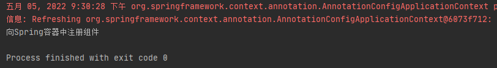
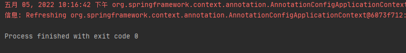
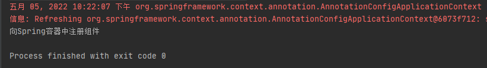
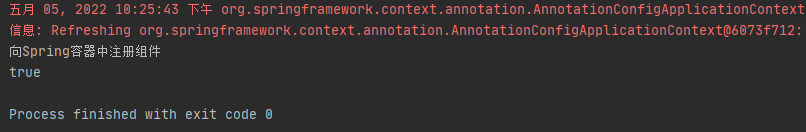
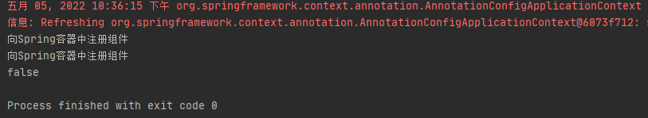

# 第5章：@Lazy-bean的懒加载
## 是什么
`@Lazy` 注解可以延迟加载bean对象，即在使用时才去初始化。避免一些无谓的性能开销。
## 能干嘛
能够一定程度减少Spring容器启动时的加载时间，也可以解决bean的循环依赖问题。
## 去哪下
## 怎么玩
### 非懒加载
配置类：
```java
@Configuration
public class BeanConfig {

    @Bean
    public Book book() {
        System.out.println("向Spring容器中注册组件");
        return new Book("forbearance.cn", 49);
    }
}
```
测试类：
```java
public class AppTest {

    @SuppressWarnings("resource")
    @Test
    public void test01() {
        AnnotationConfigApplicationContext context = new AnnotationConfigApplicationContext(BeanConfig.class);
    }
}
```
运行结果：



非懒加载模式下，单实例bean在Spring容器启动的时候就会被初始化。
### 懒加载
加上关键注解 `@Lazy`
配置类
```java
@Configuration
public class BeanConfig {

    @Lazy
    @Bean
    public Book book() {
        System.out.println("向Spring容器中注册组件");
        return new Book("forbearance.cn", 49);
    }
}
```
运行测试类：



加上懒加载注解 `@Lazy` 后，在Spring容器启动时没有初始化单实例bean对象。那么是何时初始化的呢？

测试类修改如下：
```java
public class AppTest {

    @SuppressWarnings("resource")
    @Test
    public void test01() {
        AnnotationConfigApplicationContext context = new AnnotationConfigApplicationContext(BeanConfig.class);
        Book book = (Book) context.getBean("book");
    }
}
```
运行测试类：



很明显，加了懒加载注解后，单实例bean的初始化延迟到了获取bean对象的时候，在获取bean对象的时候才会初始化bean。

思考：懒加载获取bean，多次获取会是同一个对象吗？
测试类：
```java
@Test
    public void test01() {
        AnnotationConfigApplicationContext context = new AnnotationConfigApplicationContext(BeanConfig.class);
        Book book1 = (Book) context.getBean("book");
        Book book2 = (Book) context.getBean("book");
        System.out.println(book1 == book2);
    }
```
运行：



使用 `@Lazy` 注解标注后，单实例bean只有在第一次从Spring容器中获取时才被创建，以后每次获取bean对象时，直接返回被缓存的对象。

### 多示例bean的懒加载是否有效?
测试类：
```java
@Configuration
public class BeanConfig {

    @Lazy
    @Bean
    @Scope(value = "prototype")
    public Book book() {
        System.out.println("向Spring容器中注册组件");
        return new Book("forbearance.cn", 49);
    }
}
```
运行：



由此得知，懒加载只对单实例bean生效。多实例bean每次获取bean都会重新创建对象，也相当于是懒加载了，只有在需要的时候才创建对象。

## 小结
懒加载，通俗点讲即延时加载，**仅对单实例bean生效**。将bean的初始化延迟到使用该bean的时候初始化。即在真正需要数据的时候，
才真正执行数据的加载操作。