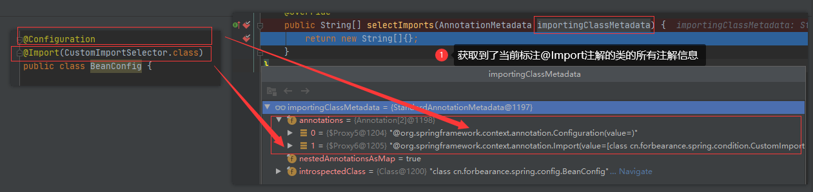
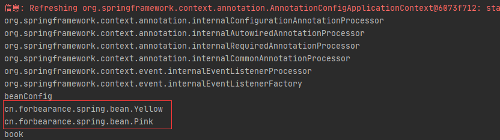

# 第8章：@Import-使用ImportSelector
## 是什么
`ImportSelector`是`@Import`导入组件的第二种方式
### 概述
`ImportSelector`接口是Spring导入外部配置的核心接口。在SpringBoot的自动配置和`@EnableXXX`(功能性注解) 都有它的存在。来看一下源码：
```java
package org.springframework.context.annotation;

import org.springframework.core.type.AnnotationMetadata;

/**
 * 由类型实现的接口，这些类型根据给定的选择标准（通常是一个或多个类）确定应该导入哪个配置类。
 *
 * Interface to be implemented by types that determine which @{@link Configuration}
 * class(es) should be imported based on a given selection criteria, usually one or more
 * annotation attributes.
 *
 * <p>An {@link ImportSelector} may implement any of the following
 * {@link org.springframework.beans.factory.Aware Aware} interfaces, and their respective
 * methods will be called prior to {@link #selectImports}:
 * <ul>
 * <li>{@link org.springframework.context.EnvironmentAware EnvironmentAware}</li>
 * <li>{@link org.springframework.beans.factory.BeanFactoryAware BeanFactoryAware}</li>
 * <li>{@link org.springframework.beans.factory.BeanClassLoaderAware BeanClassLoaderAware}</li>
 * <li>{@link org.springframework.context.ResourceLoaderAware ResourceLoaderAware}</li>
 * </ul>
 *
 * <p>ImportSelectors are usually processed in the same way as regular {@code @Import}
 * annotations, however, it is also possible to defer selection of imports until all
 * {@code @Configuration} classes have been processed (see {@link DeferredImportSelector}
 * for details).
 *
 * @author Chris Beams
 * @since 3.1
 * @see DeferredImportSelector
 * @see Import
 * @see ImportBeanDefinitionRegistrar
 * @see Configuration
 */
public interface ImportSelector {

	/**
	 * Select and return the names of which class(es) should be imported based on
	 * the {@link AnnotationMetadata} of the importing @{@link Configuration} class.
	 */
	String[] selectImports(AnnotationMetadata importingClassMetadata);

}
```
`ImportSelector`主要的作用是按照给定的选择标准确定应该导入哪些配置类。selectImports() 方法的返回值就是向Spring容器中导入的类的全类名。
如果该接口的实现类同时实现了`EnvironmentAware`、`BeanFactoryAware`、`BeanClassLoaderAware`或者`ResourceLoaderAware`，
在调用selectImports()方法之前会调用上述接口中的对应方法。如果需要在所有`@Configuration`处理完再导入，则可以实现`DeferredImportSelector`接口。

`AnnotationMetadata`类型的参数能够获取到当前标注了`@Import`注解的类的所有信息，除了能够获取到`@Import`注解外，还可以获取到其他注解的信息。
## 能干嘛
## 去哪下
## 怎么玩
### 案例
定义一个名为`CustomImportSelector`的类并实现`ImportSelector`接口：
```java
package cn.forbearance.spring.condition;

import org.springframework.context.annotation.ImportSelector;
import org.springframework.core.type.AnnotationMetadata;

/**
 * @author cristina
 */
public class CustomImportSelector implements ImportSelector {

    @Override
    public String[] selectImports(AnnotationMetadata importingClassMetadata) {
        return new String[]{}; // 这里先暂时返回一个空数组，如果返回null会跑空指针异常.
    }
}
```
`debug` 调试：



验证为什么不能返回null数组：查看`org.springframework.context.annotation.ConfigurationClassParser#processImports()`方法源码：
```java
private void processImports(ConfigurationClass configClass, SourceClass currentSourceClass,
        Collection<SourceClass> importCandidates, boolean checkForCircularImports) throws IOException {

    if (importCandidates.isEmpty()) {
        return;
    }

    if (checkForCircularImports && isChainedImportOnStack(configClass)) {
        this.problemReporter.error(new CircularImportProblem(configClass, this.importStack));
    }
    else {
        this.importStack.push(configClass);
        try {
            for (SourceClass candidate : importCandidates) {
                if (candidate.isAssignable(ImportSelector.class)) {
                    // Candidate class is an ImportSelector -> delegate to it to determine imports
                    Class<?> candidateClass = candidate.loadClass();
                    ImportSelector selector = BeanUtils.instantiateClass(candidateClass, ImportSelector.class);
                    ParserStrategyUtils.invokeAwareMethods(
                            selector, this.environment, this.resourceLoader, this.registry);
                    if (this.deferredImportSelectors != null && selector instanceof DeferredImportSelector) {
                        this.deferredImportSelectors.add(
                                new DeferredImportSelectorHolder(configClass, (DeferredImportSelector) selector));
                    }
                    else {
                        // 看这里，会执行我们自定义的ImportSelector实现类的selectImports()方法
                        String[] importClassNames = selector.selectImports(currentSourceClass.getMetadata());
                        // 点进去asSourceClasses()方法查看
                        Collection<SourceClass> importSourceClasses = asSourceClasses(importClassNames);
                        processImports(configClass, currentSourceClass, importSourceClasses, false);
                    }
                }
                else if (candidate.isAssignable(ImportBeanDefinitionRegistrar.class)) {
                    // Candidate class is an ImportBeanDefinitionRegistrar ->
                    // delegate to it to register additional bean definitions
                    Class<?> candidateClass = candidate.loadClass();
                    ImportBeanDefinitionRegistrar registrar =
                            BeanUtils.instantiateClass(candidateClass, ImportBeanDefinitionRegistrar.class);
                    ParserStrategyUtils.invokeAwareMethods(
                            registrar, this.environment, this.resourceLoader, this.registry);
                    configClass.addImportBeanDefinitionRegistrar(registrar, currentSourceClass.getMetadata());
                }
                else {
                    // Candidate class not an ImportSelector or ImportBeanDefinitionRegistrar ->
                    // process it as an @Configuration class
                    this.importStack.registerImport(
                            currentSourceClass.getMetadata(), candidate.getMetadata().getClassName());
                    processConfigurationClass(candidate.asConfigClass(configClass));
                }
            }
        }
        catch (BeanDefinitionStoreException ex) {
            throw ex;
        }
        catch (Throwable ex) {
            throw new BeanDefinitionStoreException(
                    "Failed to process import candidates for configuration class [" +
                    configClass.getMetadata().getClassName() + "]", ex);
        }
        finally {
            this.importStack.pop();
        }
    }
}
```
`org.springframework.context.annotation.ConfigurationClassParser#asSourceClasses()`方法源码：

该方法的第一行会获取selectImports()方法返回的全类名数组长度，这也是为什么如果返回null，会抛空指针异常。
```java
private Collection<SourceClass> asSourceClasses(String[] classNames) throws IOException {
    List<SourceClass> annotatedClasses = new ArrayList<SourceClass>(classNames.length);
    for (String className : classNames) {
        annotatedClasses.add(asSourceClass(className));
    }
    return annotatedClasses;
}
```
第一步：配置类
```java
package cn.forbearance.spring.config;

import cn.forbearance.spring.bean.Book;
import cn.forbearance.spring.bean.Color;
import cn.forbearance.spring.bean.Red;
import cn.forbearance.spring.condition.CustomImportSelector;
import cn.forbearance.spring.condition.LinuxCondition;
import cn.forbearance.spring.condition.WindowsCondition;
import org.springframework.context.annotation.*;

/**
 * @author cristina
 */
@Configuration
@Import(CustomImportSelector.class) //
public class BeanConfig {

    @Lazy
    @Bean
    public Book book() {
        System.out.println("向Spring容器中注册组件");
        return new Book("forbearance.cn", 49);
    }

    @Conditional(WindowsCondition.class)
    @Bean(value = "windows")
    public Book book1() {
        return new Book("book1", 49);
    }

    @Conditional(LinuxCondition.class)
    @Bean(value = "linux")
    public Book book2() {
        return new Book("book2", 49);
    }
}
```
第二步：定义`Yellow`,`Pink`类

Yellow
```java
package cn.forbearance.spring.bean;

/**
 * @author cristina
 */
public class Yellow {
}
```
Pink
```java
package cn.forbearance.spring.bean;

/**
 * @author cristina
 */
public class Pink {
}
```
第三步：修改`CustomImportSelector#selectImports()`返回为定义的两个类的全类名
```java
package cn.forbearance.spring.condition;

import org.springframework.context.annotation.ImportSelector;
import org.springframework.core.type.AnnotationMetadata;

/**
 * @author cristina
 */
public class CustomImportSelector implements ImportSelector {

    @Override
    public String[] selectImports(AnnotationMetadata importingClassMetadata) {
        return new String[]{"cn.forbearance.spring.bean.Yellow", "cn.forbearance.spring.bean.Pink"};
    }
}
```
测试类：
```java
@Test
public void test01() {
    AnnotationConfigApplicationContext context = new AnnotationConfigApplicationContext(BeanConfig.class);
    String[] beanNames = context.getBeanDefinitionNames();
    for (String beanName : beanNames) {
        System.out.println(beanName);
    }
}
```
运行测试类：



## 小结