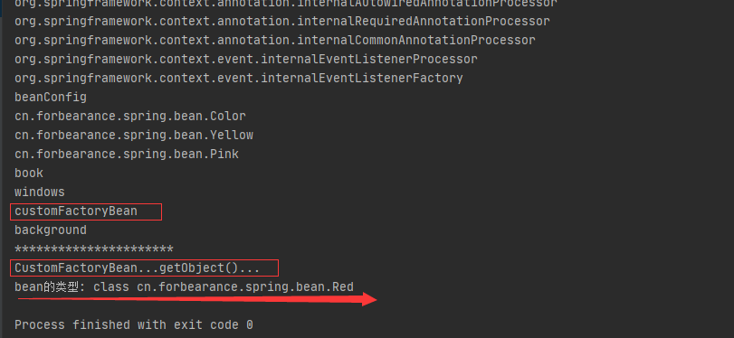
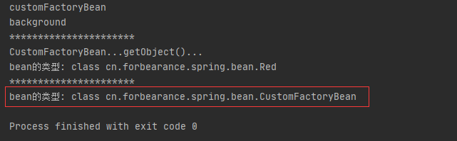
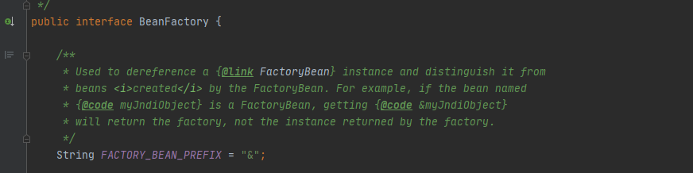

# 第10章：使用FactoryBean注册组件
## 是什么
源码：
```java
package org.springframework.beans.factory;

public interface FactoryBean<T> {

	/**
	 * 返回此工厂管理的对象的实例（可能是共享的或独立的）。
	 */
	T getObject() throws Exception;

	/**
	 * 返回此 FactoryBean 创建的对象的类型，找不到返回null
	 */
	Class<?> getObjectType();

	/**
	 * 判断这个工厂管理的对象是否是单例
	 */
	boolean isSingleton();

}
```
`FactoryBean`接口是Spring IoC 容器的实例化逻辑的可插入点。一般情况，Spring是通过反射机制利用bean的class属性指定实现类来实例化bean的。如果要实例化比较复杂的类，用配置文件的方式可能要提供大量的配置信息。这时可以采用编码的方式实现定制实例化bean的逻辑。

如果`getBean()`时想要获取`FactoryBean`实例本身而不是生成的bean的id，则可以`getBean("&myBean")`，在bean前面加一个`&`限定符号。

Spring3.0开始，FactoryBean开始支持泛型。

当配置文件中`<bean/>`标签的`class`属性配置的实现类是`FactoryBean`时，通过`getBean()`方法返回的不是`FactoryBean`本身，而是`FactoryBean#getObject()`方法返回的对象，
相当于`FactoryBean#getObject()`代理了`getBean()`方法。
## 能干嘛
## 在哪下
官方文档：https://docs.spring.io/spring-framework/docs/current/reference/html/core.html#beans-factory-extension-factorybean
## 怎么玩
### 案例
定义一个名为`CustomFactoryBean`的类，并实现`FactoryBean`接口：
```java
package cn.forbearance.spring.bean;

import org.springframework.beans.factory.FactoryBean;

/**
 * @author cristina
 */
public class CustomFactoryBean implements FactoryBean<Red> {

    /**
     * 返回Red对象，这个对象会被添加到容器中
     * @return
     * @throws Exception
     */
    @Override
    public Red getObject() throws Exception {
        System.out.println("CustomFactoryBean...getObject()...");
        return new Red();
    }

    /**
     * 获取FactoryBean管理的对象的类型
     * @return
     */
    @Override
    public Class<?> getObjectType() {
        return Red.class;
    }

    /**
     * true：单实例
     * false：多实例
     * @return
     */
    @Override
    public boolean isSingleton() {
        return true;
    }
}
```
配置类：
```java
package cn.forbearance.spring.config;

import cn.forbearance.spring.bean.Book;
import cn.forbearance.spring.bean.Color;
import cn.forbearance.spring.bean.CustomFactoryBean;
import cn.forbearance.spring.condition.CustomImportBeanDefinitionRegistrar;
import cn.forbearance.spring.condition.CustomImportSelector;
import cn.forbearance.spring.condition.LinuxCondition;
import cn.forbearance.spring.condition.WindowsCondition;
import org.springframework.context.annotation.*;

/**
 * @author cristina
 */
@Configuration
@Import({Color.class, CustomImportSelector.class, CustomImportBeanDefinitionRegistrar.class})
public class BeanConfig {

    @Lazy
    @Bean
    public Book book() {
        System.out.println("向Spring容器中注册组件");
        return new Book("forbearance.cn", 49);
    }

    @Conditional(WindowsCondition.class)
    @Bean(value = "windows")
    public Book book1() {
        return new Book("book1", 49);
    }

    @Conditional(LinuxCondition.class)
    @Bean(value = "linux")
    public Book book2() {
        return new Book("book2", 49);
    }

    // 向容器中注册bean
    @Bean
    public CustomFactoryBean customFactoryBean() {
        return new CustomFactoryBean();
    }
}
```
测试类：
```java
@Test
public void test01() {
    AnnotationConfigApplicationContext context = new AnnotationConfigApplicationContext(BeanConfig.class);
    String[] beanNames = context.getBeanDefinitionNames();
    for (String beanName : beanNames) {
        System.out.println(beanName);
    }
    System.out.println("**********************");
    Object bean1 = context.getBean("customFactoryBean");
    System.out.println("bean的类型: " + bean1.getClass());
}
```
运行测试类：



向容器中注入的是`CustomFactoryBean`对象，但实际上从容器中获取到的bean对象是调用`CustomFactoryBean#getObject()`方法获取到`Red`对象。

这个`FactoryBean`的实现类不会像普通bean那样在容器启动时进行初始化，而是类似于**懒加载**，在获取时才进行创建和返回。至于是不是单例，取决于`isSingleton()`方法的返回值。

返回`true`代表这个bean是单例，返回`false`代表这个bean是多例的。就不多做测试了。

### 获取FactoryBean实例本身
在获取`FactoryBean`本身时，在id前加上`&`限定符即可。`context.getBean("&customFactoryBean");`

测试类：
```java    
@Test
public void test01() {
    AnnotationConfigApplicationContext context = new AnnotationConfigApplicationContext(BeanConfig.class);
    String[] beanNames = context.getBeanDefinitionNames();
    for (String beanName : beanNames) {
        System.out.println(beanName);
    }
    System.out.println("**********************");
    Object bean1 = context.getBean("customFactoryBean");
    System.out.println("bean的类型: " + bean1.getClass());
    System.out.println("**********************");
    Object bean2 = context.getBean("&customFactoryBean");
    System.out.println("bean的类型: " + bean2.getClass());
}
```
运行测试类：



什么？为什么加上`&`之后就可以获取`FactoryBean`本身了。需要查看`BeanFactory`接口的源码：

`org.springframework.beans.factory.BeanFactory`



`&`用于将`FactoryBean`实例与其`FactoryBean`创建的bean区分开来。例如，如果名为`myJndiObject`的`bean`是`FactoryBean`，则获取`&myJndiObject`将返回工厂，而不是工厂返回的实例。

## 小结