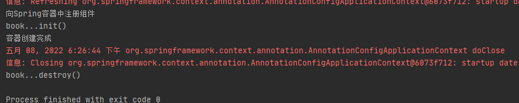
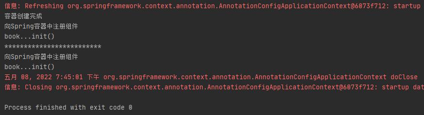

# 第11章：@Bean指定初始化和销毁方法
## 是什么
### bean的生命周期
Spring的bean的生命周期指的是bean从创建到初始化，最终销毁的过程。由Spring容器来管理bean的生命周期。我们可以指定bean的初始化和销毁，当容器在bean进行到当前生命周期的阶段时，
会自动调用我们指定的初始化和销毁方法。
## 能干嘛
### 应用场景
一个典型的使用场景就是对于数据源的管理。例如，在配置数据源时，在初始化的时候，会对很多的数据源的属性进行赋值操作；在销毁的时候，我们需要对数据源的连接等信息进行关闭和清理。这个时候，我们就可以在自定义的初始化和销毁方法中来做这些事情了！
## 去哪下
## 怎么玩
### 指定初始化和销毁方法
如果使用XML配置文件的方式配置bean的初始化和销毁方法，如下所示：
```xml
<!-- 向Spring容器中注册组件 -->
<bean id="book" class="cn.forbearance.spring.bean.Book" init-method="init" destroy-method="destroy">
    <property name="bookName" value="forbearance.cn"></property>
    <property name="price" value="49"></property>
</bean>
```
需要在注册的bean对象中存在`init-method`和`destroy-method`指定的方法。并且`init-method`和`destroy-method`指定的方法必须时无参的，但可以抛异常。

@Bean源码如下：
```java
package org.springframework.context.annotation;

import java.lang.annotation.Documented;
import java.lang.annotation.ElementType;
import java.lang.annotation.Retention;
import java.lang.annotation.RetentionPolicy;
import java.lang.annotation.Target;

import org.springframework.beans.factory.annotation.Autowire;
import org.springframework.beans.factory.support.AbstractBeanDefinition;
import org.springframework.core.annotation.AliasFor;

/**
 * 指示一个方法生成一个由 Spring 容器管理的 bean。
 */
@Target({ElementType.METHOD, ElementType.ANNOTATION_TYPE})
@Retention(RetentionPolicy.RUNTIME)
@Documented
public @interface Bean {

	@AliasFor("name")
	String[] value() default {};

	@AliasFor("value")
	String[] name() default {};

	Autowire autowire() default Autowire.NO;

	/**
	 * 在初始化期间调用 bean 实例的方法的可选名称。
	 */
	String initMethod() default "";

	/**
	 * 在关闭容器时调用 bean 实例的方法的可选名称
	 */
	String destroyMethod() default AbstractBeanDefinition.INFER_METHOD;
}
```

如果是使用JavaConfig的方式，配置如下：
```java
@Bean(initMethod = "init", destroyMethod = "destroy")
```

#### 案例
配置类：
```java
@Configuration
public class BeanConfig {
    @Bean(initMethod = "init", destroyMethod = "destroy")
    public Book book() {
        System.out.println("向Spring容器中注册组件");
        return new Book("forbearance.cn", 49);
    }
}
```
测试类：
```java
@Test
public void test01() {
    AnnotationConfigApplicationContext context = new AnnotationConfigApplicationContext(BeanConfig.class);
}
```
运行测试类：



Spring 容器先是调用`Book`类的构造方法来创建`Book`对象，然后调用`Book#init()`方法来进行初始化。容器在关闭的会调用`Book#destroy()`销毁方法。

### 初始化和销毁方法调用的时机
我们先找到`org.springframework.beans.factory.support.AbstractAutowireCapableBeanFactory#invokeInitMethods()`方法的源码：
```java
protected void invokeInitMethods(String beanName, final Object bean, RootBeanDefinition mbd)
        throws Throwable {

    boolean isInitializingBean = (bean instanceof InitializingBean);
    if (isInitializingBean && (mbd == null || !mbd.isExternallyManagedInitMethod("afterPropertiesSet"))) {
        if (logger.isDebugEnabled()) {
            logger.debug("Invoking afterPropertiesSet() on bean with name '" + beanName + "'");
        }
        if (System.getSecurityManager() != null) {
            try {
                AccessController.doPrivileged(new PrivilegedExceptionAction<Object>() {
                    @Override
                    public Object run() throws Exception {
                        ((InitializingBean) bean).afterPropertiesSet();
                        return null;
                    }
                }, getAccessControlContext());
            }
            catch (PrivilegedActionException pae) {
                throw pae.getException();
            }
        }
        else {
            // 调用InitializingBean#afterPropertiesSet()
            ((InitializingBean) bean).afterPropertiesSet();
        }
    }

    if (mbd != null) {
        String initMethodName = mbd.getInitMethodName();
        if (initMethodName != null && !(isInitializingBean && "afterPropertiesSet".equals(initMethodName)) &&
                !mbd.isExternallyManagedInitMethod(initMethodName)) {
            // 调用 init-method     
            invokeCustomInitMethod(beanName, bean, mbd);
        }
    }
}
```
**bean的初始化调用**：对象创建完成后，并且给对象的属性都赋值好后，接着会调用bean的初始化方法。对于单例bean来说，在bean创建完成后，Spring容器会去调用bean的初始化方法。
而对于多实例bean来说，在每次获取bean对象的时候，调用bean的初始化方法。

bean的销毁这里简单说一下，后面会用篇幅介绍bean的销毁的。

**bean的销毁调用**：在完成bean的创建，初始化后，Spring会注册bean销毁的逻辑。在注册bean销毁逻辑时，需要满足`!mbd.isPrototype()`，保证bean不是原型bean，
因为Spring容器不会缓存原型bean，也就不会有销毁。如果bean需要销毁，则会对需要销毁的bean通过适配器模式生成`DisposableBeanAdapter`对象，最后通过`org.springframework.beans.factory.support.DefaultSingletonBeanRegistry#registerDisposableBean()`方法将`DisposableBeanAdapter`对象放入`disposableBeans`缓存中，
当Spring容器关闭时，从`disposableBeans`缓存中取出销毁调用，执行销毁逻辑。Spring不会管理原型bean的销毁，但是可以手动调用原型bean的销毁方法。

修改配置类中的bean为原型(prototype)：
```java
@Scope(value = "prototype")
@Bean(initMethod = "init", destroyMethod = "destroy")
public Book book() {
    System.out.println("向Spring容器中注册组件");
    return new Book("forbearance.cn", 49);
}
```
测试类：
```java
@Test
public void test01() {
    AnnotationConfigApplicationContext context = new AnnotationConfigApplicationContext(BeanConfig.class);
    System.out.println("容器创建完成");
    context.getBean("book");
    System.out.println("*************************");
    context.getBean("book");
    
    // 关闭容器
    context.close();
}
```
运行测试类：



## 小结
Spring容器不会管理原型bean的销毁，获取的时候需要这个对象，容器帮你创建并返回。原型bean的销毁需要手动调用。