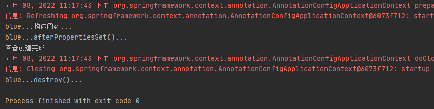
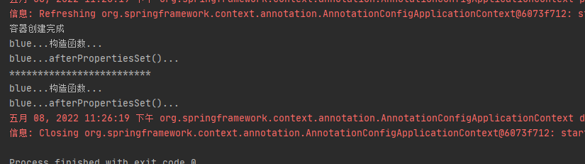

# 第12章：InitializingBean和DisposableBean

## 是什么
要与容器对 bean 生命周期的管理进行交互，可以实现 Spring `InitializingBean`和`DisposableBean`接口。本质上就是定义bean的初始化方法和销毁方法。

### InitializingBean概述
```java
package org.springframework.beans.factory;

/**
 * 由 BeanFactory 设置所有属性后需要做出反应的 bean 实现的接口：例如，执行自定义初始化，或仅检查所有强制属性是否已设置。
 * 通俗讲就是定义bean的初始化方法，在bean赋值完后执行。
 */
public interface InitializingBean {

	/**
	 * Invoked by a BeanFactory after it has set all bean properties supplied
	 * (and satisfied BeanFactoryAware and ApplicationContextAware).
	 * <p>This method allows the bean instance to perform initialization only
	 * possible when all bean properties have been set and to throw an
	 * exception in the event of misconfiguration.
	 * @throws Exception in the event of misconfiguration (such
	 * as failure to set an essential property) or if initialization fails.
	 */
	void afterPropertiesSet() throws Exception;
}
```
`InitializingBean`接口一个`afterPropertiesSet()`方法，`afterPropertiesSet()`是在给bean赋值好之后调用的。

### Spring在什么地方调用的InitializingBean
找到`org.springframework.beans.factory.support.AbstractAutowireCapableBeanFactory#invokeInitMethods()`这个方法，源码如下：
```java
protected void invokeInitMethods(String beanName, final Object bean, RootBeanDefinition mbd)
        throws Throwable {
    // 如果bean实现了InitializingBean接口，就调用bean的afterPropertiesSet()方法
    boolean isInitializingBean = (bean instanceof InitializingBean);
    if (isInitializingBean && (mbd == null || !mbd.isExternallyManagedInitMethod("afterPropertiesSet"))) {
        if (logger.isDebugEnabled()) {
            logger.debug("Invoking afterPropertiesSet() on bean with name '" + beanName + "'");
        }
        if (System.getSecurityManager() != null) {
            try {
                AccessController.doPrivileged(new PrivilegedExceptionAction<Object>() {
                    @Override
                    public Object run() throws Exception {
                        // 调用bean的afterPropertiesSet()方法
                        ((InitializingBean) bean).afterPropertiesSet();
                        return null;
                    }
                }, getAccessControlContext());
            }
            catch (PrivilegedActionException pae) {
                throw pae.getException();
            }
        }
        else {
            // 调用bean的afterPropertiesSet()方法
            ((InitializingBean) bean).afterPropertiesSet();
        }
    }

    if (mbd != null) {
        String initMethodName = mbd.getInitMethodName();
        if (initMethodName != null && !(isInitializingBean && "afterPropertiesSet".equals(initMethodName)) &&
                !mbd.isExternallyManagedInitMethod(initMethodName)) {
            // 通过反射的方式调用init-method
            invokeCustomInitMethod(beanName, bean, mbd);
        }
    }
}
```
有人要问了，你凭什么说`InitializingBean`的执行在bean赋值之后。别急，往下看，这里简要说明一下，后面会用篇幅介绍bean的初始化过程的。(只介绍关键代码，不在这篇文章中作重点说明。)

首先定位到`org.springframework.beans.factory.support.AbstractAutowireCapableBeanFactory#doCreateBean()`方法：
我的Spring版本是4.3.12，`doCreateBean()`方法在504行，
```java
protected Object doCreateBean(final String beanName, final RootBeanDefinition mbd, final Object[] args)
        throws BeanCreationException {
    ... ...
    // Initialize the bean instance.
    Object exposedObject = bean;
    try {
        // 给bean中的属性赋值的逻辑
        populateBean(beanName, mbd, instanceWrapper);
        if (exposedObject != null) {
            // 初始化bean，定位这个方法
            exposedObject = initializeBean(beanName, exposedObject, mbd);
        }
    }
    catch (Throwable ex) {
        if (ex instanceof BeanCreationException && beanName.equals(((BeanCreationException) ex).getBeanName())) {
            throw (BeanCreationException) ex;
        }
        else {
            throw new BeanCreationException(
                    mbd.getResourceDescription(), beanName, "Initialization of bean failed", ex);
        }
    }
    ... ...
}
```
接着定位到`org.springframework.beans.factory.support.AbstractAutowireCapableBeanFactory#initializeBean()`，1604行
```java
protected Object initializeBean(final String beanName, final Object bean, RootBeanDefinition mbd) {
    if (System.getSecurityManager() != null) {
        AccessController.doPrivileged(new PrivilegedAction<Object>() {
            @Override
            public Object run() {
                invokeAwareMethods(beanName, bean);
                return null;
            }
        }, getAccessControlContext());
    }
    else {
        invokeAwareMethods(beanName, bean);
    }

    Object wrappedBean = bean;
    if (mbd == null || !mbd.isSynthetic()) {
        wrappedBean = applyBeanPostProcessorsBeforeInitialization(wrappedBean, beanName);
    }

    try {
        // invokeInitMethods()方法就是上面介绍的执行bean初始化方法的逻辑了。
        // 执行InitializingBean#afterPropertiesSet()方法和init-method，
        invokeInitMethods(beanName, wrappedBean, mbd);
    }
    catch (Throwable ex) {
        throw new BeanCreationException(
                (mbd != null ? mbd.getResourceDescription() : null),
                beanName, "Invocation of init method failed", ex);
    }

    if (mbd == null || !mbd.isSynthetic()) {
        wrappedBean = applyBeanPostProcessorsAfterInitialization(wrappedBean, beanName);
    }
    return wrappedBean;
}
```
Spring提供了两种为bean初始化的方式
- 第一种：实现`InitializingBean`接口
- 第二种：在配置文件或`@Bean`注解中指定`init-method`来指定初始化方法
1. 两种方式可以同时执行，同时使用先执行`InitializingBean#afterPropertiesSet()`，后执行`init-method`指定的方法。
2. 实现`InitializingBean`接口的方法调用，与通过反射调用`init-method`指定的方法相比。前者效率相对来说较高。但是`init-method`方式消除了对Spring的依赖。
3. 如果`InitializingBean#afterPropertiesSet()`执行失败，那么`init-method`的方式就不会得到执行。

### DisposableBean概述
```java
package org.springframework.beans.factory;

/**
 * Interface to be implemented by beans that want to release resources
 * on destruction. A BeanFactory is supposed to invoke the destroy
 * method if it disposes a cached singleton. An application context
 * is supposed to dispose all of its singletons on close.
 *
 * <p>An alternative to implementing DisposableBean is specifying a custom
 * destroy-method, for example in an XML bean definition.
 * For a list of all bean lifecycle methods, see the BeanFactory javadocs.
 *
 * @author Juergen Hoeller
 * @since 12.08.2003
 * @see org.springframework.beans.factory.support.RootBeanDefinition#getDestroyMethodName
 * @see org.springframework.context.ConfigurableApplicationContext#close
 */
public interface DisposableBean {

	/**
	 * Invoked by a BeanFactory on destruction of a singleton.
	 * @throws Exception in case of shutdown errors.
	 * Exceptions will get logged but not rethrown to allow
	 * other beans to release their resources too.
	 */
	void destroy() throws Exception;
}
```
实现了`DisposableBean`接口的bean在销毁前，Spring会调用`DisposableBean#destroy()`方法来执行bean的销毁逻辑。通常用来在bean的生命周期结束前调用`destroy()`方法来做一些收尾工作，
也可以使用`destroy-method`。前者与Spring的耦合高，因为是方法调用但效率高，后者耦合低，使用反射，效率相对来说较低。

✨ 多实例bean的生命周期不归Spring管理，也就不会调用`DisposableBean#destroy()`方法了`destroy-method`也不会生效。Spring是不会自动调用bean的销毁方法的。

## 能干嘛
## 去哪下
官方文档：https://docs.spring.io/spring-framework/docs/current/reference/html/core.html#beans-factory-lifecycle-initializingbean
## 怎么玩
### 单实例bean
定义一个名为的类并实现`InitializingBean`和`DisposableBean`接口：
```java
package cn.forbearance.spring.bean;

import org.springframework.beans.factory.DisposableBean;
import org.springframework.beans.factory.InitializingBean;

/**
 * @author cristina
 */
public class Blue implements InitializingBean, DisposableBean {

    public Blue() {
        System.out.println("blue...构造函数...");
    }

    // 在容器关闭的时候调用
    @Override
    public void destroy() throws Exception {
        System.out.println("blue...destroy()...");
    }

    // 在bean创建后，并且给bean的属性赋值后调用
    @Override
    public void afterPropertiesSet() throws Exception {
        System.out.println("blue...afterPropertiesSet()...");
    }
}
```
配置类：
```java
@Configuration
public class BeanConfig {
    @Bean
    public Blue blue() {
        return new Blue();
    }
}
```
测试类：
```java
@Test
public void test01() {
    AnnotationConfigApplicationContext context = new AnnotationConfigApplicationContext(BeanConfig.class);
    System.out.println("容器创建完成");
    context.close();
}
```
运行测试类：



单实例bean在创建后，Spring会自动调用bean的初始化方法，在容器销毁前，会调用bean的销毁方法，

### 多实例bean
只需要在注入bean的方法上添加`@Scope("prototype")`即可：
```java
@Configuration
public class BeanConfig {
    @Bean
    @Scope("prototype")
    public Blue blue() {
        return new Blue();
    }
}
```
改造测试类：
```java
@Test
public void test01() {
    AnnotationConfigApplicationContext context = new AnnotationConfigApplicationContext(BeanConfig.class);
    System.out.println("容器创建完成");
    context.getBean("blue");
    System.out.println("*************************");
    context.getBean("blue");
    context.close();
}
```
运行测试类：



在多实例bean情况下，Spring不会自动调用bean的销毁方法。
## 小结