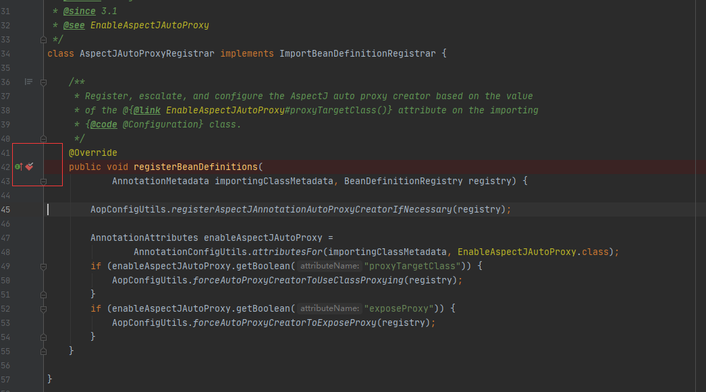
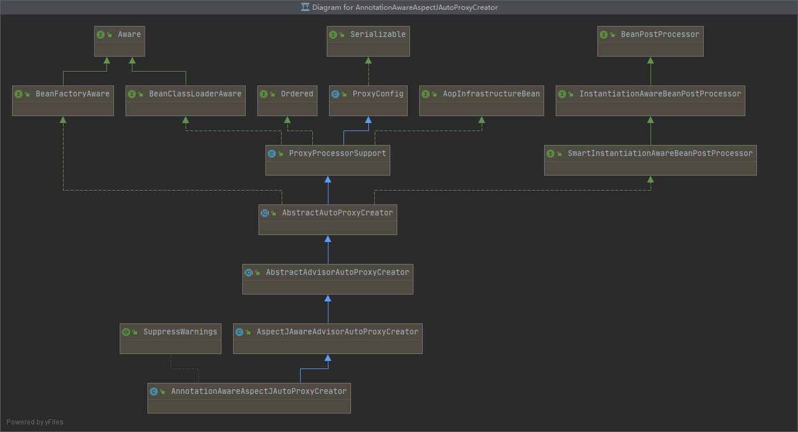

# 第24章：@EnableAspectJAutoProxy 原理
### @EnableAspectJAutoProxy概述
&emsp;&emsp;使用xml配置文件开启对aop的注解支持
```xml
<!-- 开启对切面的注解支持 -->
<aop:aspectj-autoproxy></aop:aspectj-autoproxy>
```
&emsp;&emsp;如果用 JavaConfig 方式，则在配置类上标注`@EnableAspectJAutoProxy`注解就能够开始注解版的AOP功能，其源码如下：
```java
package org.springframework.context.annotation;

import java.lang.annotation.Documented;
import java.lang.annotation.ElementType;
import java.lang.annotation.Retention;
import java.lang.annotation.RetentionPolicy;
import java.lang.annotation.Target;

@Target(ElementType.TYPE)
@Retention(RetentionPolicy.RUNTIME)
@Documented
@Import(AspectJAutoProxyRegistrar.class)
public @interface EnableAspectJAutoProxy {

	/**
	 * 代理模式：CGLib、JDK 动态代理
	 * 默认 false 表示基于 JDK 动态代理，设置为 true，会影响到所有需要代理的 Spring 管理的 bean
	 */
	boolean proxyTargetClass() default false;

	/**
	 * 标识代理是否暴露，以便通过 AopContext 可以获取代理
	 */
	boolean exposeProxy() default false;

}
```
&emsp;&emsp;支持处理标记有 AspectJ 的 @Aspect 注解的组件，类似于 Spring 的 `<aop:aspectj-autoproxy>` XML 元素中的功能。

&emsp;&emsp;`@EnableAspectJAutoProxy`上标注了`@Import`注解，其引入了一个`AspectJAutoProxyRegistrar`的组件：
```java
package org.springframework.context.annotation;

import org.springframework.aop.config.AopConfigUtils;
import org.springframework.beans.factory.support.BeanDefinitionRegistry;
import org.springframework.core.annotation.AnnotationAttributes;
import org.springframework.core.type.AnnotationMetadata;

/**
 * Registers an {@link org.springframework.aop.aspectj.annotation.AnnotationAwareAspectJAutoProxyCreator
 * AnnotationAwareAspectJAutoProxyCreator} against the current {@link BeanDefinitionRegistry}
 * as appropriate based on a given @{@link EnableAspectJAutoProxy} annotation.
 *
 * @author Chris Beams
 * @author Juergen Hoeller
 * @since 3.1
 * @see EnableAspectJAutoProxy
 */
class AspectJAutoProxyRegistrar implements ImportBeanDefinitionRegistrar {

	/**
	 * importingClassMetadata：通过 @Import 引入该类的配置类的元数据信息
	 * registry：bean 注册容器
	 */
	@Override
	public void registerBeanDefinitions(
			AnnotationMetadata importingClassMetadata, BeanDefinitionRegistry registry) {

        // 向容器中注册 AnnotationAwareAspectJAutoProxyCreator
		AopConfigUtils.registerAspectJAnnotationAutoProxyCreatorIfNecessary(registry);

        // 获取 @EnableAspectJAutoProxy 注解的属性信息
		AnnotationAttributes enableAspectJAutoProxy =
				AnnotationConfigUtils.attributesFor(importingClassMetadata, EnableAspectJAutoProxy.class);
		if (enableAspectJAutoProxy.getBoolean("proxyTargetClass")) {
		    // 解析 proxyTargetClass 属性，强制使用 CGLib 代理
			AopConfigUtils.forceAutoProxyCreatorToUseClassProxying(registry);
		}
		if (enableAspectJAutoProxy.getBoolean("exposeProxy")) {
		    // 解析 exposeProxy 属性，强制暴露代理
			AopConfigUtils.forceAutoProxyCreatorToExposeProxy(registry);
		}
	}

}
```
&emsp;&emsp;`AspectJAutoProxyRegistrar`实现了`ImportBeanDefinitionRegistrar`接口，`ImportBeanDefinitionRegistrar`接口在前面`@Import`注解章节的时候介绍过。通过实现`ImportBeanDefinitionRegistrar`接口将自定义的组件注册到 IoC 容器中。

&emsp;&emsp;`@EnableAspectJAutoProxy`注解使用`AspectJAutoProxyRegistrar`类进行自定义组件，并将自定义组件注册到IoC容器中。

### 调试源码
&emsp;&emsp;`@EnableAspectJAutoProxy`注解使用`AspectJAutoProxyRegistrar`类向IoC容器中注册了什么bean？



&emsp;&emsp;在`AspectJAutoProxyRegistrar#registerBeanDefinitions()`方法中调用了`AopConfigUtils.registerAspectJAnnotationAutoProxyCreatorIfNecessary(registry)`方法来注册`registry`，
方法名含义：如果需要的话就注册一个`AspectJAnnotationAutoProxyCreator`组件。

&emsp;&emsp;定位到`org.springframework.aop.config.AopConfigUtils#registerAspectJAnnotationAutoProxyCreatorIfNecessary()`，85行：
```java
public static BeanDefinition registerAspectJAnnotationAutoProxyCreatorIfNecessary(BeanDefinitionRegistry registry) {
    return registerAspectJAnnotationAutoProxyCreatorIfNecessary(registry, null);
}

// 方法重载，89行
public static BeanDefinition registerAspectJAnnotationAutoProxyCreatorIfNecessary(BeanDefinitionRegistry registry, Object source) {
    return registerOrEscalateApcAsRequired(AnnotationAwareAspectJAutoProxyCreator.class, registry, source);
}
```
&emsp;&emsp;在重载的`registerAspectJAnnotationAutoProxyCreatorIfNecessary()`方法中调用了`registerOrEscalateApcAsRequired()`方法，并传入了一个`AnnotationAwareAspectJAutoProxyCreator`对象。

&emsp;&emsp;定位到`org.springframework.aop.config.AopConfigUtils#registerOrEscalateApcAsRequired`，108行：
```java
private static BeanDefinition registerOrEscalateApcAsRequired(Class<?> cls, BeanDefinitionRegistry registry, Object source) {
    Assert.notNull(registry, "BeanDefinitionRegistry must not be null");
    // 判断IoC容器中是否包含名称为 org.springframework.aop.config.internalAutoProxyCreator 的bean
    if (registry.containsBeanDefinition(AUTO_PROXY_CREATOR_BEAN_NAME)) {
        // 若存在根据 beanName 获取 bean定义
        BeanDefinition apcDefinition = registry.getBeanDefinition(AUTO_PROXY_CREATOR_BEAN_NAME);
        // 判断已存在的 bean 的 className 和 cls 的 name 是否一致
        if (!cls.getName().equals(apcDefinition.getBeanClassName())) {
            int currentPriority = findPriorityForClass(apcDefinition.getBeanClassName());
            int requiredPriority = findPriorityForClass(cls);
            // 若不一致则使用优先级高的
            if (currentPriority < requiredPriority) {
                apcDefinition.setBeanClassName(cls.getName());
            }
        }
        return null;
    }
    // 注册 bean
    RootBeanDefinition beanDefinition = new RootBeanDefinition(cls);
    beanDefinition.setSource(source);
    beanDefinition.getPropertyValues().add("order", Ordered.HIGHEST_PRECEDENCE);
    beanDefinition.setRole(BeanDefinition.ROLE_INFRASTRUCTURE);
    registry.registerBeanDefinition(AUTO_PROXY_CREATOR_BEAN_NAME, beanDefinition);
    return beanDefinition;
}
```
&emsp;&emsp;这里的if判断是：如果 registry（IoC容器）包含名称为`"org.springframework.aop.config.internalAutoProxyCreator"`的bean，则按照名称将bean从容器中获取，名称为`"org.springframework.aop.config.internalAutoProxyCreator"`。判断传进来的`cls`对象的`name`值和从容器中获取的`apcDefinition`对象的`beanClassName`值是否相等，如果不相等，获取`cls`对象和`apcDefinition`对象的优先级，如果`apcDefinition`的优先级小于`cls`的优先级，则将`apcDefinition`的`beanClassName`属性设置为`cls`对象的`name`值。
```java
/**
 * 按升级顺序存储自动代理创建者类。
 */
private static final List<Class<?>> APC_PRIORITY_LIST = new ArrayList<Class<?>>();

// 获取className在集合中的索引
private static int findPriorityForClass(String className) {
    for (int i = 0; i < APC_PRIORITY_LIST.size(); i++) {
        Class<?> clazz = APC_PRIORITY_LIST.get(i);
        if (clazz.getName().equals(className)) {
            return i;
        }
    }
    throw new IllegalArgumentException(
            "Class name [" + className + "] is not a known auto-proxy creator class");
}
// 获取clazz在集合中的索引
private static int findPriorityForClass(Class<?> clazz) {
    return APC_PRIORITY_LIST.indexOf(clazz);
}
```
&emsp;&emsp;第一次运行程序，IoC容器中还没有名为`"org.springframework.aop.config.internalAutoProxyCreator"`的bean（至少我运行的时候没有），所以此时不会进到if判断逻辑中。

&emsp;&emsp;使用`RootBeanDefinition`创建一个bean定义（BeanDefinition），通过`registry.registerBeanDefinition()`方法注册组件。组件类型是`org.springframework.aop.aspectj.annotation.AnnotationAwareAspectJAutoProxyCreator`，组件的名称是`org.springframework.aop.config.internalAutoProxyCreator`.

&emsp;&emsp;至此，`AopConfigUtils.registerAspectJAnnotationAutoProxyCreatorIfNecessary(registry)`方法执行完成。回到`registerBeanDefinitions()`方法。

&emsp;&emsp;定位`org.springframework.context.annotation.AspectJAutoProxyRegistrar#registerBeanDefinitions`：
```java
class AspectJAutoProxyRegistrar implements ImportBeanDefinitionRegistrar {

	/**
	 * Register, escalate, and configure the AspectJ auto proxy creator based on the value
	 * of the @{@link EnableAspectJAutoProxy#proxyTargetClass()} attribute on the importing
	 * {@code @Configuration} class.
	 */
	@Override
	public void registerBeanDefinitions(
			AnnotationMetadata importingClassMetadata, BeanDefinitionRegistry registry) {

		AopConfigUtils.registerAspectJAnnotationAutoProxyCreatorIfNecessary(registry);

		AnnotationAttributes enableAspectJAutoProxy =
				AnnotationConfigUtils.attributesFor(importingClassMetadata, EnableAspectJAutoProxy.class);
		if (enableAspectJAutoProxy.getBoolean("proxyTargetClass")) {
			AopConfigUtils.forceAutoProxyCreatorToUseClassProxying(registry);
		}
		if (enableAspectJAutoProxy.getBoolean("exposeProxy")) {
			AopConfigUtils.forceAutoProxyCreatorToExposeProxy(registry);
		}
	}

}
```
&emsp;&emsp;然后会调用`AnnotationConfigUtils.attributesFor()`方法来获取`@EnableAspectJAutoProxy`注解的信息，拿到注解信息后，判断`proxyTargetClass`属性是否为tue，为true执行`AopConfigUtils.forceAutoProxyCreatorToUseClassProxying()`方法。判断`exposeProxy`属性是否为true，为true执行`AopConfigUtils.forceAutoProxyCreatorToExposeProxy()`方法。
- forceAutoProxyCreatorToUseClassProxying() 方法意为：强制自动代理创建器使用类代理
- forceAutoProxyCreatorToExposeProxy() 方法意为：强制自动代理创建器暴露代理

&emsp;&emsp;简单来说就是在配置类标注`@EnableAspectJAutoProxy`注解后，会向IoC容器中注册一个类型为`org.springframework.aop.aspectj.annotation.AnnotationAwareAspectJAutoProxyCreator`的组件，**类名见名知意：注解装配模式的AspectJ切面自动代理创建器**。

&emsp;&emsp;`AnnotationAwareAspectJAutoProxyCreator` 继承的结构图：



&emsp;&emsp;简单梳理`AnnotationAwareAspectJAutoProxyCreator`类的继承关系：
```text
AnnotationAwareAspectJAutoProxyCreator
    -> AspectJAwareAdvisorAutoProxyCreator(父类)
        -> AbstractAdvisorAutoProxyCreator(父类)
            -> AbstractAutoProxyCreator(父类) implements SmartInstantiationAwareBeanPostProcessor, BeanFactoryAware(两个接口)
                    -> ProxyProcessorSupport(父类)
                        -> ProxyConfig(父类)
```
&emsp;&emsp;还实现了`BeanPostProcessor`和`Aware`，这两个接口都和bean的初始化有关，说明`AnnotationAwareAspectJAutoProxyCreator`类的主要处理方法来自这两个接口的实现方法。