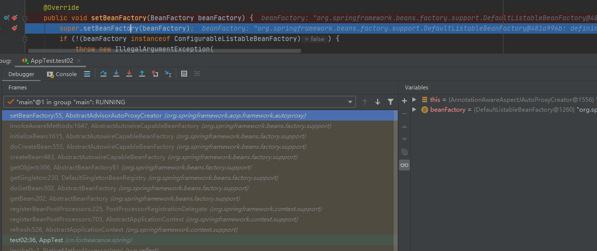
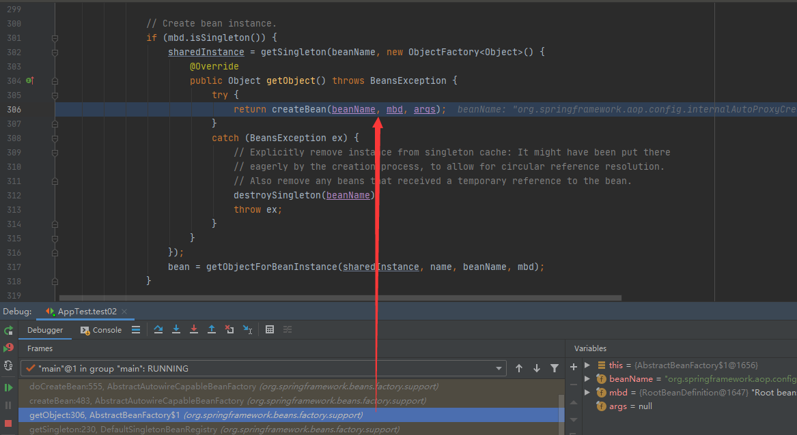
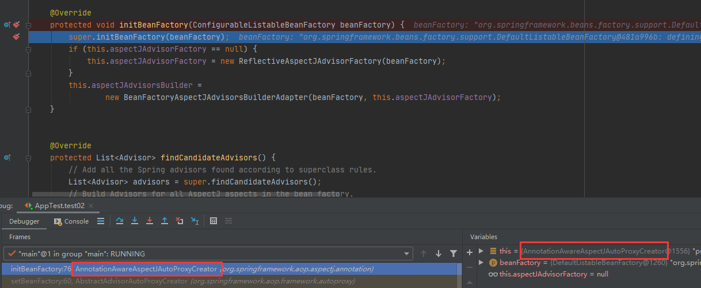
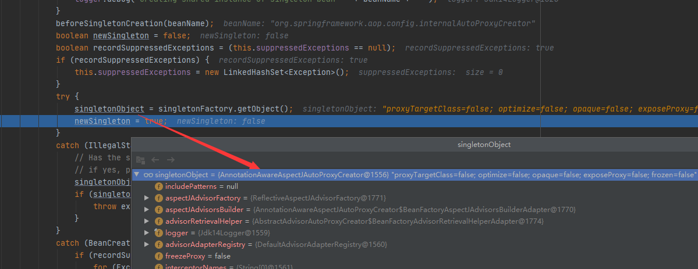
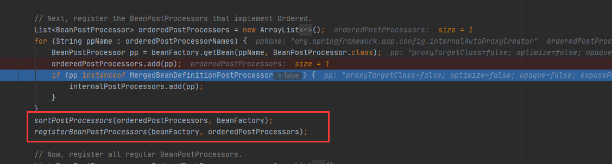

# 第25章：注册AnnotationAwareAspectJAutoProxyCreator
`debug`模式运行程序，程序运行方法栈。

定位`org.springframework.aop.framework.autoproxy.AbstractAdvisorAutoProxyCreator#setBeanFactory`，54行：



可以看到，程序的入口是这个`test02()`方法：
```java
@Test
public void test02() {
    // 2、无参构造
    AnnotationConfigApplicationContext context = new AnnotationConfigApplicationContext();
    // 3、设置环境
    context.getEnvironment().setActiveProfiles("test");
    // 4、注册配置类
    context.register(BeanConfig.class);
    // 5、刷新容器，核心方法
    context.refresh();

    String[] beanNames = context.getBeanNamesForType(DataSource.class);
    for (String beaName : beanNames) {
        System.out.println(beaName);
    }
    System.out.println("============================");
    Color color = context.getBean(Color.class);
    System.out.println(color);
    context.close();
}
```
只对关键代码深入，其他代码在前面有介绍过。

定位到`org.springframework.context.support.AbstractApplicationContext#refresh`，509行：
```java
@Override
public void refresh() throws BeansException, IllegalStateException {
    synchronized (this.startupShutdownMonitor) {
        // Prepare this context for refreshing.
        prepareRefresh();

        // Tell the subclass to refresh the internal bean factory.
        ConfigurableListableBeanFactory beanFactory = obtainFreshBeanFactory();

        // Prepare the bean factory for use in this context.
        prepareBeanFactory(beanFactory);

        try {
            // Allows post-processing of the bean factory in context subclasses.
            postProcessBeanFactory(beanFactory);

            // Invoke factory processors registered as beans in the context.
            invokeBeanFactoryPostProcessors(beanFactory);

            // 注册 BeanPostProcessor 的实现类
            registerBeanPostProcessors(beanFactory);

            // Initialize message source for this context.
            initMessageSource();

            // Initialize event multicaster for this context.
            initApplicationEventMulticaster();

            // Initialize other special beans in specific context subclasses.
            onRefresh();

            // Check for listener beans and register them.
            registerListeners();

            // Instantiate all remaining (non-lazy-init) singletons.
            finishBeanFactoryInitialization(beanFactory);

            // Last step: publish corresponding event.
            finishRefresh();
        }
    }
}
```
定位到`org.springframework.context.support.AbstractApplicationContext#registerBeanPostProcessors`，702行：
```java
protected void registerBeanPostProcessors(ConfigurableListableBeanFactory beanFactory) {
    PostProcessorRegistrationDelegate.registerBeanPostProcessors(beanFactory, this);
}
```
定位到`org.springframework.context.support.PostProcessorRegistrationDelegate#registerBeanPostProcessors`，185行：
```java
public static void registerBeanPostProcessors(
        ConfigurableListableBeanFactory beanFactory, AbstractApplicationContext applicationContext) {
    // 按照BeanPostProcessor类型从容器中获取所有需要创建的后置处理器，refresh()方法中只是将配置文件解析成一个个的bean定义，还没有创建。
    String[] postProcessorNames = beanFactory.getBeanNamesForType(BeanPostProcessor.class, true, false);

    // Register BeanPostProcessorChecker that logs an info message when
    // a bean is created during BeanPostProcessor instantiation, i.e. when
    // a bean is not eligible for getting processed by all BeanPostProcessors.
    int beanProcessorTargetCount = beanFactory.getBeanPostProcessorCount() + 1 + postProcessorNames.length;
    beanFactory.addBeanPostProcessor(new BeanPostProcessorChecker(beanFactory, beanProcessorTargetCount));

    // 将BeanPostProcessor分离，
    // 实现了 PriorityOrdered 接口的放在 priorityOrderedPostProcessors 集合、
    // 实现了 Ordered 接口的放 orderedPostProcessorNames 集合，
    // 没有实现优先级接口的放在 nonOrderedPostProcessorNames 集合
    List<BeanPostProcessor> priorityOrderedPostProcessors = new ArrayList<BeanPostProcessor>();
    List<BeanPostProcessor> internalPostProcessors = new ArrayList<BeanPostProcessor>();
    List<String> orderedPostProcessorNames = new ArrayList<String>();
    List<String> nonOrderedPostProcessorNames = new ArrayList<String>();
    for (String ppName : postProcessorNames) {
        if (beanFactory.isTypeMatch(ppName, PriorityOrdered.class)) {
            BeanPostProcessor pp = beanFactory.getBean(ppName, BeanPostProcessor.class);
            priorityOrderedPostProcessors.add(pp);
            if (pp instanceof MergedBeanDefinitionPostProcessor) {
                internalPostProcessors.add(pp);
            }
        }
        else if (beanFactory.isTypeMatch(ppName, Ordered.class)) {
            orderedPostProcessorNames.add(ppName);
        }
        else {
            nonOrderedPostProcessorNames.add(ppName);
        }
    }

    // First, register the BeanPostProcessors that implement PriorityOrdered.
    sortPostProcessors(priorityOrderedPostProcessors, beanFactory);
    registerBeanPostProcessors(beanFactory, priorityOrderedPostProcessors);

    // Next, register the BeanPostProcessors that implement Ordered.
    List<BeanPostProcessor> orderedPostProcessors = new ArrayList<BeanPostProcessor>();
    for (String ppName : orderedPostProcessorNames) {
        // 获取名称为 ppName 的 bean，
        BeanPostProcessor pp = beanFactory.getBean(ppName, BeanPostProcessor.class);
        orderedPostProcessors.add(pp);
        if (pp instanceof MergedBeanDefinitionPostProcessor) {
            internalPostProcessors.add(pp);
        }
    }
    sortPostProcessors(orderedPostProcessors, beanFactory);
    registerBeanPostProcessors(beanFactory, orderedPostProcessors);

    // Now, register all regular BeanPostProcessors.
    List<BeanPostProcessor> nonOrderedPostProcessors = new ArrayList<BeanPostProcessor>();
    for (String ppName : nonOrderedPostProcessorNames) {
        BeanPostProcessor pp = beanFactory.getBean(ppName, BeanPostProcessor.class);
        nonOrderedPostProcessors.add(pp);
        if (pp instanceof MergedBeanDefinitionPostProcessor) {
            internalPostProcessors.add(pp);
        }
    }
    registerBeanPostProcessors(beanFactory, nonOrderedPostProcessors);

    // Finally, re-register all internal BeanPostProcessors.
    sortPostProcessors(internalPostProcessors, beanFactory);
    registerBeanPostProcessors(beanFactory, internalPostProcessors);

    // Re-register post-processor for detecting inner beans as ApplicationListeners,
    // moving it to the end of the processor chain (for picking up proxies etc).
    beanFactory.addBeanPostProcessor(new ApplicationListenerDetector(applicationContext));
}
```
`org.springframework.core.PriorityOrdered`
```java
public interface PriorityOrdered extends Ordered {

}
```
`PriorityOrdered`实现了`Ordered`接口，`BeanPostProcessor`后置处理器的加载是有优先级排序的。根据实现的接口来定义它们工作的优先级，谁先谁后。

定位到`org.springframework.aop.framework.ProxyProcessorSupport`，这是`AnnotationAwareAspectJAutoProxyCreator`的父类：会发现`ProxyProcessorSupport`实现了`Ordered`接口。所以`AnnotationAwareAspectJAutoProxyCreator`会被添加到`orderedPostProcessorNames`集合中。
```java
public class ProxyProcessorSupport extends ProxyConfig implements Ordered, BeanClassLoaderAware, AopInfrastructureBean {}
```

定位`org.springframework.beans.factory.support.AbstractBeanFactory#getBean`， 201行：
```java
@Override
public <T> T getBean(String name, Class<T> requiredType) throws BeansException {
    return doGetBean(name, requiredType, null, false);
}

@SuppressWarnings("unchecked")
protected <T> T doGetBean(
        final String name, final Class<T> requiredType, final Object[] args, boolean typeCheckOnly)
        throws BeansException {

    final String beanName = transformedBeanName(name);
    Object bean;

    // Eagerly check singleton cache for manually registered singletons.
    Object sharedInstance = getSingleton(beanName);
    if (sharedInstance != null && args == null) {
        if (logger.isDebugEnabled()) {
            if (isSingletonCurrentlyInCreation(beanName)) {
                logger.debug("Returning eagerly cached instance of singleton bean '" + beanName +
                        "' that is not fully initialized yet - a consequence of a circular reference");
            }
            else {
                logger.debug("Returning cached instance of singleton bean '" + beanName + "'");
            }
        }
        bean = getObjectForBeanInstance(sharedInstance, name, beanName, null);
    }

    else {
        try {
            ... ...

            // 如果是 singleton scope 的，创建 singleton 的实例
            if (mbd.isSingleton()) {
                // 返回以给定名称注册的（原始）单例对象，如果尚未注册，则创建并注册一个新对象。
                sharedInstance = getSingleton(beanName, new ObjectFactory<Object>() {
                    @Override
                    public Object getObject() throws BeansException {
                        try {
                            // 执行创建 Bean
                            return createBean(beanName, mbd, args);
                        }
                        catch (BeansException ex) {
                            // Explicitly remove instance from singleton cache: It might have been put there
                            // eagerly by the creation process, to allow for circular reference resolution.
                            // Also remove any beans that received a temporary reference to the bean.
                            destroySingleton(beanName);
                            throw ex;
                        }
                    }
                });
                bean = getObjectForBeanInstance(sharedInstance, name, beanName, mbd);
            }
        }
        ... ...
    }

    return (T) bean;
}
```
定位到`org.springframework.beans.factory.support.DefaultSingletonBeanRegistry#getSingleton`，210行：
```java
/**
 * Return the (raw) singleton object registered under the given name,
 * creating and registering a new one if none registered yet.
 * @param beanName the name of the bean
 * @param singletonFactory the ObjectFactory to lazily create the singleton
 * with, if necessary
 * @return the registered singleton object
 */
public Object getSingleton(String beanName, ObjectFactory<?> singletonFactory) {
    Assert.notNull(beanName, "'beanName' must not be null");
    synchronized (this.singletonObjects) {
        Object singletonObject = this.singletonObjects.get(beanName);
        if (singletonObject == null) {
            if (this.singletonsCurrentlyInDestruction) {
                throw new BeanCreationNotAllowedException(beanName,
                        "Singleton bean creation not allowed while singletons of this factory are in destruction " +
                        "(Do not request a bean from a BeanFactory in a destroy method implementation!)");
            }
            if (logger.isDebugEnabled()) {
                logger.debug("Creating shared instance of singleton bean '" + beanName + "'");
            }
            beforeSingletonCreation(beanName);
            boolean newSingleton = false;
            boolean recordSuppressedExceptions = (this.suppressedExceptions == null);
            if (recordSuppressedExceptions) {
                this.suppressedExceptions = new LinkedHashSet<Exception>();
            }
            try {
                // 返回此工厂管理的对象的实例
                singletonObject = singletonFactory.getObject();
                newSingleton = true;
            }
            catch (IllegalStateException ex) {
                // Has the singleton object implicitly appeared in the meantime ->
                // if yes, proceed with it since the exception indicates that state.
                singletonObject = this.singletonObjects.get(beanName);
                if (singletonObject == null) {
                    throw ex;
                }
            }
            catch (BeanCreationException ex) {
                if (recordSuppressedExceptions) {
                    for (Exception suppressedException : this.suppressedExceptions) {
                        ex.addRelatedCause(suppressedException);
                    }
                }
                throw ex;
            }
            finally {
                if (recordSuppressedExceptions) {
                    this.suppressedExceptions = null;
                }
                afterSingletonCreation(beanName);
            }
            if (newSingleton) {
                addSingleton(beanName, singletonObject);
            }
        }
        return (singletonObject != NULL_OBJECT ? singletonObject : null);
    }
}
```
`singletonFactory.getObject()`执行的实际上是下面这个逻辑：
```java
@SuppressWarnings("unchecked")
protected <T> T doGetBean(
        final String name, final Class<T> requiredType, final Object[] args, boolean typeCheckOnly)
        throws BeansException {

    final String beanName = transformedBeanName(name);
    Object bean;

    // Eagerly check singleton cache for manually registered singletons.
    Object sharedInstance = getSingleton(beanName);
    if (sharedInstance != null && args == null) {
        if (logger.isDebugEnabled()) {
            if (isSingletonCurrentlyInCreation(beanName)) {
                logger.debug("Returning eagerly cached instance of singleton bean '" + beanName +
                        "' that is not fully initialized yet - a consequence of a circular reference");
            }
            else {
                logger.debug("Returning cached instance of singleton bean '" + beanName + "'");
            }
        }
        bean = getObjectForBeanInstance(sharedInstance, name, beanName, null);
    }

    else {
        try {
            ... ...

            // 如果是 singleton scope 的，创建 singleton 的实例
            if (mbd.isSingleton()) {
                // 返回以给定名称注册的（原始）单例对象，如果尚未注册，则创建并注册一个新对象。
                sharedInstance = getSingleton(beanName, new ObjectFactory<Object>() {
                    // 匿名内部类，最终会执行匿名内部类的逻辑
                    @Override
                    public Object getObject() throws BeansException {
                        try {
                            // 执行创建 Bean
                            return createBean(beanName, mbd, args);
                        }
                        catch (BeansException ex) {
                            // Explicitly remove instance from singleton cache: It might have been put there
                            // eagerly by the creation process, to allow for circular reference resolution.
                            // Also remove any beans that received a temporary reference to the bean.
                            destroySingleton(beanName);
                            throw ex;
                        }
                    }
                });
                bean = getObjectForBeanInstance(sharedInstance, name, beanName, mbd);
            }
        }
        ... ...
    }

    return (T) bean;
}
```
从调用方法栈也可以看出：



现在就是来创建bean的，如果获取不到那就创建bean，注册`BeanPostProcessor`，即创建`BeanPostProcessor`对象，然后加载到IoC容器中。

接下里应该是创建名称为`internalAutoProxyCreator`的`BeanPostProcessor`了，bean类型为`AnnotationAwareAspectJAutoProxyCreator`。

定位`org.springframework.beans.factory.support.AbstractAutowireCapableBeanFactory#createBean`，447行：
```java
/**
 * Central method of this class: creates a bean instance,
 * populates the bean instance, applies post-processors, etc.
 * @see #doCreateBean
 */
@Override
protected Object createBean(String beanName, RootBeanDefinition mbd, Object[] args) throws BeanCreationException {
    if (logger.isDebugEnabled()) {
        logger.debug("Creating instance of bean '" + beanName + "'");
    }
    RootBeanDefinition mbdToUse = mbd;

    // 确保 BeanDefinition 中的 Class 被加载
    Class<?> resolvedClass = resolveBeanClass(mbd, beanName);
    if (resolvedClass != null && !mbd.hasBeanClass() && mbd.getBeanClassName() != null) {
        mbdToUse = new RootBeanDefinition(mbd);
        mbdToUse.setBeanClass(resolvedClass);
    }

    // 准备方法覆写，涉及到一个概念：MethodOverrides，来自 bean 定义中的 <lookup-method /> 和 <replaced-method />
    try {
        mbdToUse.prepareMethodOverrides();
    }
    catch (BeanDefinitionValidationException ex) {
        throw new BeanDefinitionStoreException(mbdToUse.getResourceDescription(),
                beanName, "Validation of method overrides failed", ex);
    }

    try {
        // 让 InstantiationAwareBeanPostProcessor 在这一步有机会返回代理，前提是bean有实现 TargetSource 接口
        // 建议参考官网文档：https://docs.spring.io/spring-framework/docs/4.3.11.RELEASE/spring-framework-reference/htmlsingle/#aop-targetsource
        Object bean = resolveBeforeInstantiation(beanName, mbdToUse);
        if (bean != null) {
            return bean;
        }
    }
    catch (Throwable ex) {
        throw new BeanCreationException(mbdToUse.getResourceDescription(), beanName,
                "BeanPostProcessor before instantiation of bean failed", ex);
    }
    // 重头戏，创建bean
    Object beanInstance = doCreateBean(beanName, mbdToUse, args);
    if (logger.isDebugEnabled()) {
        logger.debug("Finished creating instance of bean '" + beanName + "'");
    }
    return beanInstance;
}
```
定位`org.springframework.beans.factory.support.AbstractAutowireCapableBeanFactory#doCreateBean`，504行
```java
/**
 * Actually create the specified bean. Pre-creation processing has already happened
 * at this point, e.g. checking {@code postProcessBeforeInstantiation} callbacks.
 * <p>Differentiates between default bean instantiation, use of a
 * factory method, and autowiring a constructor.
 * @param beanName the name of the bean
 * @param mbd the merged bean definition for the bean
 * @param args explicit arguments to use for constructor or factory method invocation
 * @return a new instance of the bean
 * @throws BeanCreationException if the bean could not be created
 * @see #instantiateBean
 * @see #instantiateUsingFactoryMethod
 * @see #autowireConstructor
 */
protected Object doCreateBean(final String beanName, final RootBeanDefinition mbd, final Object[] args)
        throws BeanCreationException {

    // Instantiate the bean.
    BeanWrapper instanceWrapper = null;
    if (mbd.isSingleton()) {
        instanceWrapper = this.factoryBeanInstanceCache.remove(beanName);
    }
    if (instanceWrapper == null) {
        // 如果不是 FactoryBean，在这里实例化bean
        instanceWrapper = createBeanInstance(beanName, mbd, args);
    }
    // 这个就是我们定义的类的实例
    final Object bean = (instanceWrapper != null ? instanceWrapper.getWrappedInstance() : null);
    // 类型
    Class<?> beanType = (instanceWrapper != null ? instanceWrapper.getWrappedClass() : null);
    mbd.resolvedTargetType = beanType;

    // 涉及到接口：MergedBeanDefinitionPostProcessor
    synchronized (mbd.postProcessingLock) {
        if (!mbd.postProcessed) {
            try {
                applyMergedBeanDefinitionPostProcessors(mbd, beanType, beanName);
            }
            catch (Throwable ex) {
                throw new BeanCreationException(mbd.getResourceDescription(), beanName,
                        "Post-processing of merged bean definition failed", ex);
            }
            mbd.postProcessed = true;
        }
    }

    // 解决循环依赖
    boolean earlySingletonExposure = (mbd.isSingleton() && this.allowCircularReferences &&
            isSingletonCurrentlyInCreation(beanName));
    if (earlySingletonExposure) {
        if (logger.isDebugEnabled()) {
            logger.debug("Eagerly caching bean '" + beanName +
                    "' to allow for resolving potential circular references");
        }
        addSingletonFactory(beanName, new ObjectFactory<Object>() {
            @Override
            public Object getObject() throws BeansException {
                return getEarlyBeanReference(beanName, mbd, bean);
            }
        });
    }

    // Initialize the bean instance.
    Object exposedObject = bean;
    try {
        // 前面只负责了创建，但还没有属性赋值，这一步负责属性装配
        populateBean(beanName, mbd, instanceWrapper);
        if (exposedObject != null) {
            // bean初始化的各种回调：init-method、InitializingBean 以及 BeanPostProcessor
            exposedObject = initializeBean(beanName, exposedObject, mbd);
        }
    }
    catch (Throwable ex) {
        if (ex instanceof BeanCreationException && beanName.equals(((BeanCreationException) ex).getBeanName())) {
            throw (BeanCreationException) ex;
        }
        else {
            throw new BeanCreationException(
                    mbd.getResourceDescription(), beanName, "Initialization of bean failed", ex);
        }
    }

    if (earlySingletonExposure) {
        Object earlySingletonReference = getSingleton(beanName, false);
        if (earlySingletonReference != null) {
            if (exposedObject == bean) {
                exposedObject = earlySingletonReference;
            }
            else if (!this.allowRawInjectionDespiteWrapping && hasDependentBean(beanName)) {
                String[] dependentBeans = getDependentBeans(beanName);
                Set<String> actualDependentBeans = new LinkedHashSet<String>(dependentBeans.length);
                for (String dependentBean : dependentBeans) {
                    if (!removeSingletonIfCreatedForTypeCheckOnly(dependentBean)) {
                        actualDependentBeans.add(dependentBean);
                    }
                }
                if (!actualDependentBeans.isEmpty()) {
                    throw new BeanCurrentlyInCreationException(beanName,
                            "Bean with name '" + beanName + "' has been injected into other beans [" +
                            StringUtils.collectionToCommaDelimitedString(actualDependentBeans) +
                            "] in its raw version as part of a circular reference, but has eventually been " +
                            "wrapped. This means that said other beans do not use the final version of the " +
                            "bean. This is often the result of over-eager type matching - consider using " +
                            "'getBeanNamesOfType' with the 'allowEagerInit' flag turned off, for example.");
                }
            }
        }
    }

    // Register bean as disposable.
    try {
        registerDisposableBeanIfNecessary(beanName, bean, mbd);
    }
    catch (BeanDefinitionValidationException ex) {
        throw new BeanCreationException(
                mbd.getResourceDescription(), beanName, "Invalid destruction signature", ex);
    }

    return exposedObject;
}
```
定位`org.springframework.beans.factory.support.AbstractAutowireCapableBeanFactory#initializeBean`，1604行：
```java
/**
 * Initialize the given bean instance, applying factory callbacks
 * as well as init methods and bean post processors.
 * <p>Called from {@link #createBean} for traditionally defined beans,
 * and from {@link #initializeBean} for existing bean instances.
 * @param beanName the bean name in the factory (for debugging purposes)
 * @param bean the new bean instance we may need to initialize
 * @param mbd the bean definition that the bean was created with
 * (can also be {@code null}, if given an existing bean instance)
 * @return the initialized bean instance (potentially wrapped)
 * @see BeanNameAware
 * @see BeanClassLoaderAware
 * @see BeanFactoryAware
 * @see #applyBeanPostProcessorsBeforeInitialization
 * @see #invokeInitMethods
 * @see #applyBeanPostProcessorsAfterInitialization
 */
protected Object initializeBean(final String beanName, final Object bean, RootBeanDefinition mbd) {
    if (System.getSecurityManager() != null) {
        AccessController.doPrivileged(new PrivilegedAction<Object>() {
            @Override
            public Object run() {
                invokeAwareMethods(beanName, bean);
                return null;
            }
        }, getAccessControlContext());
    }
    else {
        // 如果 bean 实现了 BeanNameAware、BeanClassLoaderAware 或 BeanFactoryAware 接口，回调
        invokeAwareMethods(beanName, bean);
    }

    Object wrappedBean = bean;
    if (mbd == null || !mbd.isSynthetic()) {
        // BeanPostProcessor 的 postProcessBeforeInitialization 回调
        wrappedBean = applyBeanPostProcessorsBeforeInitialization(wrappedBean, beanName);
    }

    try {
        // 处理 init-method 以及 InitializingBean#afterPropertiesSet()
        invokeInitMethods(beanName, wrappedBean, mbd);
    }
    catch (Throwable ex) {
        throw new BeanCreationException(
                (mbd != null ? mbd.getResourceDescription() : null),
                beanName, "Invocation of init method failed", ex);
    }

    if (mbd == null || !mbd.isSynthetic()) {
        // BeanPostProcessor 的 postProcessAfterInitialization 回调
        wrappedBean = applyBeanPostProcessorsAfterInitialization(wrappedBean, beanName);
    }
    return wrappedBean;
}
```
定位`org.springframework.beans.factory.support.AbstractAutowireCapableBeanFactory#invokeAwareMethods`，1638行：

如果 bean 实现了 BeanNameAware、BeanClassLoaderAware 或 BeanFactoryAware 接口，回调：
```java
private void invokeAwareMethods(final String beanName, final Object bean) {
    if (bean instanceof Aware) {
        if (bean instanceof BeanNameAware) {
            ((BeanNameAware) bean).setBeanName(beanName);
        }
        if (bean instanceof BeanClassLoaderAware) {
            ((BeanClassLoaderAware) bean).setBeanClassLoader(getBeanClassLoader());
        }
        if (bean instanceof BeanFactoryAware) {
            ((BeanFactoryAware) bean).setBeanFactory(AbstractAutowireCapableBeanFactory.this);
        }
    }
}
```
定位`org.springframework.aop.framework.autoproxy.AbstractAdvisorAutoProxyCreator#setBeanFactory`，54行：

会调用其父类的`setBeanFactory()`方法。
```java
@Override
public void setBeanFactory(BeanFactory beanFactory) {
    super.setBeanFactory(beanFactory);
    if (!(beanFactory instanceof ConfigurableListableBeanFactory)) {
        throw new IllegalArgumentException(
                "AdvisorAutoProxyCreator requires a ConfigurableListableBeanFactory: " + beanFactory);
    }
    initBeanFactory((ConfigurableListableBeanFactory) beanFactory);
}
```
查看方法调用栈，会发现`initBeanFactory()`方法执行的是`AnnotationAwareAspectJAutoProxyCreator`类中的重写方法，即调到了我们要给容器中创建的AspectJ自动代理创建器的`initBeanFactory()`方法中：



在`initBeanFactory()`方法中，创建了两个对象，`ReflectiveAspectJAdvisorFactory` 和 `BeanFactoryAspectJAdvisorsBuilderAdapter`，而 `BeanFactoryAspectJAdvisorsBuilderAdapter` 相当于把之前创建的`aspectJAdvisorFactory`和`beanFactory`重新包装了一下，仅此而已。

至此，以`AnnotationAwareAspectJAutoProxyCreator`（`@EnableAspectJAutoProxy`注解核心导入的`BeanPostProcessor`）为例讲解的AspectJ自动代理创建器，就创建成功了。

相信此时屏幕前的你，应该知道`BeanPostProcessor`后置处理器整个的注册以及创建流程了。那么所谓的注册是什么呢？

定位`org.springframework.beans.factory.support.DefaultSingletonBeanRegistry#getSingleton`，210行：
```java
/**
 * Return the (raw) singleton object registered under the given name,
 * creating and registering a new one if none registered yet.
 * @param beanName the name of the bean
 * @param singletonFactory the ObjectFactory to lazily create the singleton
 * with, if necessary
 * @return the registered singleton object
 */
public Object getSingleton(String beanName, ObjectFactory<?> singletonFactory) {
    Assert.notNull(beanName, "'beanName' must not be null");
    synchronized (this.singletonObjects) {
        Object singletonObject = this.singletonObjects.get(beanName);
        if (singletonObject == null) {
            if (this.singletonsCurrentlyInDestruction) {
                throw new BeanCreationNotAllowedException(beanName,
                        "Singleton bean creation not allowed while singletons of this factory are in destruction " +
                        "(Do not request a bean from a BeanFactory in a destroy method implementation!)");
            }
            if (logger.isDebugEnabled()) {
                logger.debug("Creating shared instance of singleton bean '" + beanName + "'");
            }
            beforeSingletonCreation(beanName);
            boolean newSingleton = false;
            boolean recordSuppressedExceptions = (this.suppressedExceptions == null);
            if (recordSuppressedExceptions) {
                this.suppressedExceptions = new LinkedHashSet<Exception>();
            }
            try {
                singletonObject = singletonFactory.getObject();
                newSingleton = true;
            }
            catch (IllegalStateException ex) {
                // Has the singleton object implicitly appeared in the meantime ->
                // if yes, proceed with it since the exception indicates that state.
                singletonObject = this.singletonObjects.get(beanName);
                if (singletonObject == null) {
                    throw ex;
                }
            }
            catch (BeanCreationException ex) {
                if (recordSuppressedExceptions) {
                    for (Exception suppressedException : this.suppressedExceptions) {
                        ex.addRelatedCause(suppressedException);
                    }
                }
                throw ex;
            }
            finally {
                if (recordSuppressedExceptions) {
                    this.suppressedExceptions = null;
                }
                afterSingletonCreation(beanName);
            }
            if (newSingleton) {
                addSingleton(beanName, singletonObject);
            }
        }
        return (singletonObject != NULL_OBJECT ? singletonObject : null);
    }
}
```
可以看到，要创建的后置处理器`AnnotationAwareAspectJAutoProxyCreator`，创建完成了。



注意一下`addSingleton(beanName, singletonObject)`，这个逻辑是把`BeanPostProcessor`放入一级缓存中，一共有三级缓存（用来解决循环依赖），IoC容器中的对象最终都会保存在一级缓存中。 其实就是把创建好的bean定义以key-value的形式放入缓存（单例池）中，这跟`getBean()`方法就联系起来了，`getBean()`会先去缓冲中取，这个缓存就是`addSingleton()`方法操作的单例池。

放行代码让程序执行到如下位置：



先会调用`sortPostProcessors()`方法按照优先级给这些后置处理器排序，然后就会调用`registerBeanPostProcessors()`方法，从方法名上不难猜出，注册后置处理器：
```java
/**
 * Register the given BeanPostProcessor beans.
 */
private static void registerBeanPostProcessors(
        ConfigurableListableBeanFactory beanFactory, List<BeanPostProcessor> postProcessors) {

    for (BeanPostProcessor postProcessor : postProcessors) {
        beanFactory.addBeanPostProcessor(postProcessor);
    }
}
```
所谓的注册，其实就是拿到所有的`BeanPostProcessor`，然后调用`beanFactory.addBeanPostProcessor()`方法将`BeanPostProcessor`添加到`beanPostProcessors`集合中
```java
// org.springframework.beans.factory.support.AbstractBeanFactory#addBeanPostProcessor 840行
@Override
public void addBeanPostProcessor(BeanPostProcessor beanPostProcessor) {
    Assert.notNull(beanPostProcessor, "BeanPostProcessor must not be null");
    this.beanPostProcessors.remove(beanPostProcessor);
    this.beanPostProcessors.add(beanPostProcessor);
    if (beanPostProcessor instanceof InstantiationAwareBeanPostProcessor) {
        this.hasInstantiationAwareBeanPostProcessors = true;
    }
    if (beanPostProcessor instanceof DestructionAwareBeanPostProcessor) {
        this.hasDestructionAwareBeanPostProcessors = true;
    }
}
```
至此，`BeanPostProcessor`的注册以及创建过程就介绍完了。


