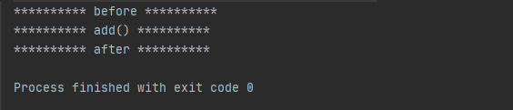

# 第26章：Spring AOP 源码 解析
&#8195;&#8195;在开始分析 Spring AOP 源码前，先来看一下 bean 的初始化过程，如下所示：


## 前置
### Spring AOP 常见概念
#### 1、连接点（JoinPoint）
&#8195;&#8195;所谓连接点是指那些被拦截到的点，程序执行的某个特定位置。在 Spring 中，这些点指的是方法，因为 Spring 值支持方法类型的连接点。业务层接口的所有方法都叫连接点。代码体现如下：


#### 2、切点（Pointcut）
&#8195;&#8195;所谓切点就是指我们要对哪些`JoinPoint`进行拦截的定义。表示指定在哪个方法切入。业务接口中被增强的方法叫切点。（连接点不一定是切点，但切点一定是连接点）。
```java
@Before("execution(public int cn.forbearance.spring.MathCalculator.*(..))") 中的 public int cn.forbearance.spring.MathCalculator.*(..) 这一串就是切入点表达式，即切点，
```

#### 3、通知/增强（Advice）
&#8195;&#8195;即增强的方法（包含了增强的横切代码）。所谓通知是指拦截到`JoinPoint`之后所要做的事情就是通知。通知定义了什么时候做什么事。就是拦截到连接点之后需要执行的代码。通知的类型：
1. 前置通知
2. 后置通知
3. 异常通知
4. 返回通知（在目标方法执行成功后调用）
5. 环绕通知（在目标方法调用前后均可执行自定义逻辑，可手动执行`joinPoint.procced()`调用目标方法）

#### 4、目标对象（Target）
&#8195;&#8195;包含连接点的对象。所谓目标对象就是被一个或多个切面（通知和切点的结合）所通知的对象。（被代理的对象）
```java
比如 @Before("execution(public int cn.forbearance.spring.MathCalculator.*(..))") 中的 cn.forbearance.spring.MathCalculator 就是目标对象
```

#### 5、引介（Introduction）
&#8195;&#8195;引介是一种特殊的增强，在不修改类代码的前提下，可以在运行期为类添加一些属性和方法，这样即便一个业务类原本没有实现某个接口，通过引介功能，也可以动态的为该业务类添加接口的实现逻辑。

#### 6、织入（Weave）
&#8195;&#8195;织入是将`Advice`（通知）应用到目标对象具体连接点上的过程。一般分为三种织入：动态代理织入、编译器织入和类装载器织入。Weave 是一个操作过程。

#### 7、切面（Aspect）
&emsp;&emsp;切面由`Pointcut`（切点）和`Advice`（通知）组成的，它包括了对横切（非业务逻辑，比如日志功能、事务等等）关注功能的定义，也包括了对连接点的定义。通俗理解就是将业务代码抽离出来的一个类（用`@Aspect`注解标注的类）。

#### 8、拦截器（Interceptor）
&emsp;&emsp;在`Advice`的基础上扩展定义，定义了通知的增强方式，也就是通过对连接点（`JoinPoint`）的拦截。一个通用的拦截器可以拦截发生在基础程序中的运行时事件。

#### 9、增强器/顾问（Advisor）
&emsp;&emsp;增强器（Advisor）是切面的另一种实现，绑定通知和切点，没有指定切点的通知是没有意义的。`Advisor` 可以理解为是一个绑定在指定切点上的通知。它能够将通知以更为复杂的方式织入到目标对象中。是一个将通知包装为更复杂切面的装饰器。

#### 10、代理对象（Proxy）
&emsp;&emsp;包含了原始对象的代码（在合适的位置调用目标对象的方法）和增加后的代码（`Advice` 通知的内容）的那个对象（被增强后的对象）。

## 入口


&emsp;&emsp;`META-INF`文件夹中是 Spring 自定义标签的配置文件，是对`<aop/>`标签的支持。

&emsp;&emsp;要实现自定义的xml配置，需要有两个默认 Spring 配置文件来支持。`spring.schemas`和`spring.handles`，`spring.schemas`文件用来验证自定义的xml配置文件是否符合格式要求，`spring.handles`文件则是用来告诉 Spring 该如何来解析自定义的配置文件。

&emsp;&emsp;`spring.handles`文件内容如下：
```text
http\://www.springframework.org/schema/aop=org.springframework.aop.config.AopNamespaceHandler
```
&emsp;&emsp;配置的入口是`org.springframework.aop.config.AopNamespaceHandler`：
```javapackage org.springframework.aop.config;

import org.springframework.aop.aspectj.AspectJExpressionPointcut;
import org.springframework.beans.factory.xml.BeanDefinitionParser;
import org.springframework.beans.factory.xml.NamespaceHandlerSupport;

public class AopNamespaceHandler extends NamespaceHandlerSupport {

	/**
	 * Register the {@link BeanDefinitionParser BeanDefinitionParsers} for the
	 * '{@code config}', '{@code spring-configured}', '{@code aspectj-autoproxy}'
	 * and '{@code scoped-proxy}' tags.
	 */
	@Override
	public void init() {
		// In 2.0 XSD as well as in 2.1 XSD.
		registerBeanDefinitionParser("config", new ConfigBeanDefinitionParser());
		registerBeanDefinitionParser("aspectj-autoproxy", new AspectJAutoProxyBeanDefinitionParser());
		registerBeanDefinitionDecorator("scoped-proxy", new ScopedProxyBeanDefinitionDecorator());

		// Only in 2.0 XSD: moved to context namespace as of 2.1
		registerBeanDefinitionParser("spring-configured", new SpringConfiguredBeanDefinitionParser());
	}

}
```
&emsp;&emsp;注册几个`BeanDefinitionParser`，用来支持`config`、`aspectj-autoproxy`、`scoped-proxy`、`spring-configured`标签的功能。
`aspectj-autoproxy`是不是很眼熟，用于xml配置文件开启基于注解配置的aop代理
```java
<aop:aspectj-autoproxy/>
```
&emsp;&emsp;而这个标签会交给`AspectJAutoProxyBeanDefinitionParser`来解析这行配置，定位`org.springframework.aop.config.AspectJAutoProxyBeanDefinitionParser#parse`：
```java
@Override
public BeanDefinition parse(Element element, ParserContext parserContext) {
    // 注册 AnnotationAwareAspectJAutoProxyCreator
    AopNamespaceUtils.registerAspectJAnnotationAutoProxyCreatorIfNecessary(parserContext, element);
    // 对于注解中子类的处理
    extendBeanDefinition(element, parserContext);
    return null;
}
```

&emsp;&emsp;执行`org.springframework.aop.config.AopNamespaceHandler#init()`的调用方法栈如下所示：


## 注册 AnnotationAwareAspectJAutoProxyCreator
`org.springframework.aop.config.AopNamespaceUtils#registerAspectJAnnotationAutoProxyCreatorIfNecessary`方法会注册`AnnotationAwareAspectJAutoProxyCreator`：
```java
public static void registerAspectJAnnotationAutoProxyCreatorIfNecessary(
        ParserContext parserContext, Element sourceElement) {
    // 注册 beanName 为 org.springframework.aop.config.internalAutoProxyCreator 的bean，类型为 AnnotationAwareAspectJAutoProxyCreator
    BeanDefinition beanDefinition = AopConfigUtils.registerAspectJAnnotationAutoProxyCreatorIfNecessary(
            parserContext.getRegistry(), parserContext.extractSource(sourceElement));
    // 对于 proxy-target-class 和 expose-proxy 属性的处理
    useClassProxyingIfNecessary(parserContext.getRegistry(), sourceElement);
    //  注册组件并通知
    registerComponentIfNecessary(beanDefinition, parserContext);
}
```
&emsp;&emsp;定位到`org.springframework.aop.config.AopConfigUtils#registerAspectJAnnotationAutoProxyCreatorIfNecessary`，89行：
```java
public static BeanDefinition registerAspectJAnnotationAutoProxyCreatorIfNecessary(BeanDefinitionRegistry registry, Object source) {
    return registerOrEscalateApcAsRequired(AnnotationAwareAspectJAutoProxyCreator.class, registry, source);
}

// org.springframework.aop.config.AopConfigUtils#registerOrEscalateApcAsRequired 108
private static BeanDefinition registerOrEscalateApcAsRequired(Class<?> cls, BeanDefinitionRegistry registry, Object source) {
    Assert.notNull(registry, "BeanDefinitionRegistry must not be null");
    // 如果已经存在beanName=org.springframework.aop.config.internalAutoProxyCreator 的bean，并且与当前传入的bean (cls)的类型不同
    // 则比较两个 bean 的优先级，保留优先级高的那个 bean
    if (registry.containsBeanDefinition(AUTO_PROXY_CREATOR_BEAN_NAME)) {
        BeanDefinition apcDefinition = registry.getBeanDefinition(AUTO_PROXY_CREATOR_BEAN_NAME);
        if (!cls.getName().equals(apcDefinition.getBeanClassName())) {
            int currentPriority = findPriorityForClass(apcDefinition.getBeanClassName());
            int requiredPriority = findPriorityForClass(cls);
            if (currentPriority < requiredPriority) {
                apcDefinition.setBeanClassName(cls.getName());
            }
        }
        return null;
    }
    // 如果不存在则注册当前 bean 到 BeanFactory
    // 注册 AnnotationAwareAspectJAutoProxyCreator 到 BeanFactory
    RootBeanDefinition beanDefinition = new RootBeanDefinition(cls);
    beanDefinition.setSource(source);
    // 优先级设置为最高
    beanDefinition.getPropertyValues().add("order", Ordered.HIGHEST_PRECEDENCE);
    beanDefinition.setRole(BeanDefinition.ROLE_INFRASTRUCTURE);
    registry.registerBeanDefinition(AUTO_PROXY_CREATOR_BEAN_NAME, beanDefinition);
    return beanDefinition;
}
```

### 处理 proxy-target-class 和 expose-proxy 属性
&emsp;&emsp;定位`org.springframework.aop.config.AopNamespaceUtils#useClassProxyingIfNecessary`：

&emsp;&emsp;注册`AnnotationAwareAspectJAutoProxyCreator`之后，Spring 会接着解析`<proxy-target-class/>`、`<expose-proxy/>`标签。如果属性存在的话，会将属性值设置到`AnnotationAwareAspectJAutoProxyCreator`对应的`BeanDefinition`中。
```java
private static void useClassProxyingIfNecessary(BeanDefinitionRegistry registry, Element sourceElement) {
    if (sourceElement != null) {
        // proxy-target-class 属性的处理
        boolean proxyTargetClass = Boolean.valueOf(sourceElement.getAttribute(PROXY_TARGET_CLASS_ATTRIBUTE));
        if (proxyTargetClass) {
            AopConfigUtils.forceAutoProxyCreatorToUseClassProxying(registry);
        }
        // expose-proxy 属性的处理
        boolean exposeProxy = Boolean.valueOf(sourceElement.getAttribute(EXPOSE_PROXY_ATTRIBUTE));
        if (exposeProxy) {
            AopConfigUtils.forceAutoProxyCreatorToExposeProxy(registry);
        }
    }
}
```
&emsp;&emsp;如果存在标签，设置属性值：
```java
// proxy-target-class 属性的处理，org.springframework.aop.config.AopConfigUtils#forceAutoProxyCreatorToUseClassProxying
public static void forceAutoProxyCreatorToUseClassProxying(BeanDefinitionRegistry registry) {
    if (registry.containsBeanDefinition(AUTO_PROXY_CREATOR_BEAN_NAME)) {
        BeanDefinition definition = registry.getBeanDefinition(AUTO_PROXY_CREATOR_BEAN_NAME);
        definition.getPropertyValues().add("proxyTargetClass", Boolean.TRUE);
    }
}

// expose-proxy 属性的处理，org.springframework.aop.config.AopConfigUtils#forceAutoProxyCreatorToExposeProxy
public static void forceAutoProxyCreatorToExposeProxy(BeanDefinitionRegistry registry) {
    if (registry.containsBeanDefinition(AUTO_PROXY_CREATOR_BEAN_NAME)) {
        BeanDefinition definition = registry.getBeanDefinition(AUTO_PROXY_CREATOR_BEAN_NAME);
        definition.getPropertyValues().add("exposeProxy", Boolean.TRUE);
    }
}
```
1. `proxy-target-class` 用于强制使用 CGLib 为目标对象创建对象。但是使用 CGLib 有两个问题：1、无法代理`final`方法，因为它们不能被覆写，2、需要将 CGLib 二进制发行包放在 classpath 中；如果没有设置该标签，并且目标对象实现了至少一个接口，则会使用 JDK 动态代理。
2. `expose-proxy` 用于解决目标对象内部的自我调用时，无法实现切面的增强的问题。

## 创建 AOP 代理
&emsp;&emsp;Spring 会在容器中注册`AnnotationAwareAspectJAutoProxyCreator`，那么`AnnotationAwareAspectJAutoProxyCreator`类做了什么工作来完成 AOP 的工作呢？首先看看`AnnotationAwareAspectJAutoProxyCreator`类的结构层次：


&emsp;&emsp;查看`AnnotationAwareAspectJAutoProxyCreator`类的结构层次发现，该类实现了`BeanPostProcessor`接口。`BeanPostProcessor`包含两个方法：`postProcessBeforeInitialization()`和`postProcessAfterInitialization()`，分别在 bean 初始化前后执行。当 Spring 加载这个 bean 时会在初始化后调用`postProcessAfterInitialization()`方法，AOP 的逻辑分析从此开始。

&emsp;&emsp;定位`org.springframework.aop.framework.autoproxy.AbstractAutoProxyCreator#postProcessAfterInitialization`
```java
/**
 * Create a proxy with the configured interceptors if the bean is
 * identified as one to proxy by the subclass.
 * @see #getAdvicesAndAdvisorsForBean
 */
@Override
public Object postProcessAfterInitialization(Object bean, String beanName) throws BeansException {
    if (bean != null) {
        // 缓存链：1、beanName 不为空的话，使用 beanName（FactoryBean会在见面加上"&"）
        // 2、如果 beanName，使用 Class 对象作为缓存的 key
        Object cacheKey = getCacheKey(bean.getClass(), beanName);
        if (!this.earlyProxyReferences.contains(cacheKey)) {
            // 如果条件满足，则封装指定 bean，生成代理对象
            return wrapIfNecessary(bean, beanName, cacheKey);
        }
    }
    return bean;
}
```
&emsp;&emsp;定位`org.springframework.aop.framework.autoproxy.AbstractAutoProxyCreator#wrapIfNecessary`：
```java
/**
 * Wrap the given bean if necessary, i.e. if it is eligible for being proxied.
 * @param bean the raw bean instance
 * @param beanName the name of the bean
 * @param cacheKey the cache key for metadata access
 * @return a proxy wrapping the bean, or the raw bean instance as-is
 */
protected Object wrapIfNecessary(Object bean, String beanName, Object cacheKey) {
    // 如果已经处理过（targetSourcedBeans 存放已经增强过的 bean）
    if (beanName != null && this.targetSourcedBeans.contains(beanName)) {
        return bean;
    }
    
    // advisedBeans 的 key 是 cacheKey，表示是否进行过代理
    // 已经处理过的 bean，无需增强
    if (Boolean.FALSE.equals(this.advisedBeans.get(cacheKey))) {
        return bean;
    }
    
    // 是否是基础类或者切面（标注了@Aspect的），基础类不应被代理。或者配置了指定 bean 不需要代理
    if (isInfrastructureClass(bean.getClass()) || shouldSkip(bean.getClass(), beanName)) {
        this.advisedBeans.put(cacheKey, Boolean.FALSE);
        return bean;
    }

    // 如果存在增强方法，则创建代理，获取所有候选的 Advisor。（获取当前 bean 的通知方法以及增强器）
    Object[] specificInterceptors = getAdvicesAndAdvisorsForBean(bean.getClass(), beanName, null);
    // 如果获取到了增强，则为该 bean 创建代理
    if (specificInterceptors != DO_NOT_PROXY) {
        this.advisedBeans.put(cacheKey, Boolean.TRUE);
        // 创建代理，（JDK 或者 CGLib 代理）
        Object proxy = createProxy(
                bean.getClass(), beanName, specificInterceptors, new SingletonTargetSource(bean));
        this.proxyTypes.put(cacheKey, proxy.getClass());
        return proxy;
    }
    // 标记该 cacheKey 已经被处理过了
    this.advisedBeans.put(cacheKey, Boolean.FALSE);
    return bean;
}
```
&emsp;&emsp;创建代理主要包含两个步骤：
1. 获取增强方法或者增强器。
2. 根据获取的增强进行代理。

### 获取增强方法或增强器
```java
// org.springframework.aop.framework.autoproxy.AbstractAdvisorAutoProxyCreator#getAdvicesAndAdvisorsForBean
@Override
protected Object[] getAdvicesAndAdvisorsForBean(Class<?> beanClass, String beanName, TargetSource targetSource) {
    // 获取 beanClass 类型的所有增强器（可用的增强器）
    List<Advisor> advisors = findEligibleAdvisors(beanClass, beanName);
    if (advisors.isEmpty()) {
        return DO_NOT_PROXY;
    }
    return advisors.toArray();
}

// org.springframework.aop.framework.autoproxy.AbstractAdvisorAutoProxyCreator#findEligibleAdvisors
/**
 * Find all eligible Advisors for auto-proxying this class.
 * @param beanClass the clazz to find advisors for
 * @param beanName the name of the currently proxied bean
 * @return the empty List, not {@code null},
 * if there are no pointcuts or interceptors
 * @see #findCandidateAdvisors
 * @see #sortAdvisors
 * @see #extendAdvisors
 */
protected List<Advisor> findEligibleAdvisors(Class<?> beanClass, String beanName) {
    // 获取所有增强
    List<Advisor> candidateAdvisors = findCandidateAdvisors();
    // 过滤出适合当前 bean 的 Advisors。（哪些通知是需要切入到当前 bean 的目标方法中的）
    List<Advisor> eligibleAdvisors = findAdvisorsThatCanApply(candidateAdvisors, beanClass, beanName);
    extendAdvisors(eligibleAdvisors);
    if (!eligibleAdvisors.isEmpty()) {
        eligibleAdvisors = sortAdvisors(eligibleAdvisors);
    }
    return eligibleAdvisors;
}
```
&emsp;&emsp;对于指定 bean 的增强方法的获取包含两个步骤：
1. 获取所有的增强。
2. 获取所有的增强中适用于当前 bean 的增强，并能够应用的。

&emsp;&emsp;AOP 源码分析是基于注解的，所以`findCandidateAdvisors()`方法的实现是由`AnnotationAwareAspectJAutoProxyCreator`类完成的。定位`org.springframework.aop.aspectj.annotation.AnnotationAwareAspectJAutoProxyCreator#findCandidateAdvisors`：
```java
@Override
protected List<Advisor> findCandidateAdvisors() {
    // 调用父类方法加载配置文件中 AOP 声明
    List<Advisor> advisors = super.findCandidateAdvisors();
    // Build Advisors for all AspectJ aspects in the bean factory.
    advisors.addAll(this.aspectJAdvisorsBuilder.buildAspectJAdvisors());
    return advisors;
}
```
`AnnotationAwareAspectJAutoProxyCreator`继承了`AbstractAdvisorAutoProxyCreator`，在实现获取增强的方法中除了保留父类的获取配置文件中定义的增强外，同时添加了获取 bean 的注解增强功能，其实现由`this.aspectJAdvisorsBuilder.buildAspectJAdvisors()`方法来实现的。

&emsp;&emsp;定位`org.springframework.aop.aspectj.annotation.BeanFactoryAspectJAdvisorsBuilder#buildAspectJAdvisors`：对 Spring 中所有的类进行分析，提取 Advisor。
```java
/**
 * Look for AspectJ-annotated aspect beans in the current bean factory,
 * and return to a list of Spring AOP Advisors representing them.
 * <p>Creates a Spring Advisor for each AspectJ advice method.
 * @return the list of {@link org.springframework.aop.Advisor} beans
 * @see #isEligibleBean
 */
public List<Advisor> buildAspectJAdvisors() {
    List<String> aspectNames = this.aspectBeanNames;

    if (aspectNames == null) {
        synchronized (this) {
            aspectNames = this.aspectBeanNames;
            if (aspectNames == null) {
                List<Advisor> advisors = new LinkedList<Advisor>();
                aspectNames = new LinkedList<String>();
                // 获取所有的 beanName
                String[] beanNames = BeanFactoryUtils.beanNamesForTypeIncludingAncestors(
                        this.beanFactory, Object.class, true, false);
                // 循环所有的 beanName，找出对应的增强方法
                for (String beanName : beanNames) {
                    // 不合法的 bean 则忽略，由子类定义规则，默认返回 true
                    if (!isEligibleBean(beanName)) {
                        continue;
                    }
                    // 获取 bean 的类型
                    Class<?> beanType = this.beanFactory.getType(beanName);
                    if (beanType == null) {
                        continue;
                    }
                    // 如果存在 @Aspect 注解
                    if (this.advisorFactory.isAspect(beanType)) {
                        aspectNames.add(beanName);
                        AspectMetadata amd = new AspectMetadata(beanType, beanName);
                        // 检查 @Aspect 注解的 value 值，验证生成的增强是否是单例
                        if (amd.getAjType().getPerClause().getKind() == PerClauseKind.SINGLETON) {
                            MetadataAwareAspectInstanceFactory factory =
                                    new BeanFactoryAspectInstanceFactory(this.beanFactory, beanName);
                            
                            // 解析标记 Aspect 注解中的增强方法
                            List<Advisor> classAdvisors = this.advisorFactory.getAdvisors(factory);
                            // 如果 bean 是单例的，则缓存 bean 的增强器
                            if (this.beanFactory.isSingleton(beanName)) {
                                this.advisorsCache.put(beanName, classAdvisors);
                            }
                            // 非单例的，缓存 bean 对应的增强器创建工厂
                            else {
                                this.aspectFactoryCache.put(beanName, factory);
                            }
                            advisors.addAll(classAdvisors);
                        }
                        else {
                            // Per target or per this.
                            if (this.beanFactory.isSingleton(beanName)) {
                                throw new IllegalArgumentException("Bean with name '" + beanName +
                                        "' is a singleton, but aspect instantiation model is not singleton");
                            }
                            MetadataAwareAspectInstanceFactory factory =
                                    new PrototypeAspectInstanceFactory(this.beanFactory, beanName);
                            this.aspectFactoryCache.put(beanName, factory);
                            advisors.addAll(this.advisorFactory.getAdvisors(factory));
                        }
                    }
                }
                this.aspectBeanNames = aspectNames;
                return advisors;
            }
        }
    }
    // 如果不是第一次解析切面，证明增强器已经被缓存过了，会执行下面的代码，查询缓存
    
    if (aspectNames.isEmpty()) {
        return Collections.emptyList();
    }
    // 记录到缓存中
    List<Advisor> advisors = new LinkedList<Advisor>();
    for (String aspectName : aspectNames) {
        List<Advisor> cachedAdvisors = this.advisorsCache.get(aspectName);
        if (cachedAdvisors != null) {
            advisors.addAll(cachedAdvisors);
        }
        else {
            MetadataAwareAspectInstanceFactory factory = this.aspectFactoryCache.get(aspectName);
            advisors.addAll(this.advisorFactory.getAdvisors(factory));
        }
    }
    return advisors;
}
```
&emsp;&emsp;至此，Advisor 的获取就完成了。接着深入细节分析增强器的获取，而这一功能委托给`this.advisorFactory.getAdvisors(factory)`方法去实现。

&emsp;&emsp;定位`org.springframework.aop.aspectj.annotation.ReflectiveAspectJAdvisorFactory#getAdvisors`：
```java
@Override
public List<Advisor> getAdvisors(MetadataAwareAspectInstanceFactory aspectInstanceFactory) {
    // 目标 Class
    Class<?> aspectClass = aspectInstanceFactory.getAspectMetadata().getAspectClass();
    // 代理对象的 beanName
    String aspectName = aspectInstanceFactory.getAspectMetadata().getAspectName();
    // 对 CLass 标注 @Aspect 注解信息验证
    validate(aspectClass);

    // 应用装饰器模式，将 aspectInstanceFactory 实例化的增强器缓存起来，避免对此创建
    MetadataAwareAspectInstanceFactory lazySingletonAspectInstanceFactory =
            new LazySingletonAspectInstanceFactoryDecorator(aspectInstanceFactory);

    List<Advisor> advisors = new LinkedList<Advisor>();
    // getAdvisorMethods() 方法或筛选出不带有 @Pointcut 注解的方法，即声明为 Pointcut 的方法不处理
    for (Method method : getAdvisorMethods(aspectClass)) {
        // 创建增强器对象
        Advisor advisor = getAdvisor(method, lazySingletonAspectInstanceFactory, advisors.size(), aspectName);
        if (advisor != null) {
            advisors.add(advisor);
        }
    }

    // 如果找到的增强器不为空，且配置了增强延迟初始化，那么需要在头部加入加上 SyntheticInstantiationAdvisor 同步实例化增强器，延迟初始化切面 bena
    if (!advisors.isEmpty() && lazySingletonAspectInstanceFactory.getAspectMetadata().isLazilyInstantiated()) {
        Advisor instantiationAdvisor = new SyntheticInstantiationAdvisor(lazySingletonAspectInstanceFactory);
        advisors.add(0, instantiationAdvisor);
    }

    // @DeclareParent 注解功能的支持
    for (Field field : aspectClass.getDeclaredFields()) {
        Advisor advisor = getDeclareParentsAdvisor(field);
        if (advisor != null) {
            advisors.add(advisor);
        }
    }

    return advisors;
}
```
&emsp;&emsp;`getAdvisors()`方法首先完成了对增强器的获取，包括获取注解以及根据注解生成增强的步骤，然后判断是否配置了增强延迟初始化，如果有则在头部加入同步实例化增强器，保证增强使用之前的实例化，最后是对`@DeclareParent`注解的获取。下面将详细介绍每个步骤。

#### 1.增强器的获取
&emsp;&emsp;增强器的获取逻辑`getAdvisor()`方法实现，实现步骤包括：对切点的注解的获取以及根据注解信息生成增强。定位`org.springframework.aop.aspectj.annotation.ReflectiveAspectJAdvisorFactory#getAdvisor`：
```java
@Override
public Advisor getAdvisor(Method candidateAdviceMethod, MetadataAwareAspectInstanceFactory aspectInstanceFactory,
        int declarationOrderInAspect, String aspectName) {

    validate(aspectInstanceFactory.getAspectMetadata().getAspectClass());
    // 切点信息的获取，根据候选方法名获取对应的 pointCut
    AspectJExpressionPointcut expressionPointcut = getPointcut(
            candidateAdviceMethod, aspectInstanceFactory.getAspectMetadata().getAspectClass());
    if (expressionPointcut == null) {
        return null;
    }
    // 根据切点信息生成增强器，如果能够获取到 pointCut，则将切点表达式、当前方法、ReflectiveAspectJAdvisorFactory 对象、aspectInstanceFactory 装饰、顺序、代理对象className 等包装成 Advisor 对象
    return new InstantiationModelAwarePointcutAdvisorImpl(expressionPointcut, candidateAdviceMethod,
            this, aspectInstanceFactory, declarationOrderInAspect, aspectName);
}
```

##### 1.切点信息的获取
&emsp;&emsp;所谓获取切点信息获取就是指定注解的表达式信息的获取，如：`@Before("test()")`，定位`org.springframework.aop.aspectj.annotation.ReflectiveAspectJAdvisorFactory#getPointcut`：
```java
private AspectJExpressionPointcut getPointcut(Method candidateAdviceMethod, Class<?> candidateAspectClass) {
    // 获取方法上的注解
    AspectJAnnotation<?> aspectJAnnotation =
            AbstractAspectJAdvisorFactory.findAspectJAnnotationOnMethod(candidateAdviceMethod);
    if (aspectJAnnotation == null) {
        return null;
    }

    // 使用 AspectJExpressionPointcut 对象封装获取的信息
    AspectJExpressionPointcut ajexp =
            new AspectJExpressionPointcut(candidateAspectClass, new String[0], new Class<?>[0]);
    // 提取获取的注解中的表达式。如：@PointCut("execution(* *.*test*(..))")中的 execution(* *.*test*(..))
    ajexp.setExpression(aspectJAnnotation.getPointcutExpression());
    ajexp.setBeanFactory(this.beanFactory);
    return ajexp;
}

// org.springframework.aop.aspectj.annotation.AbstractAspectJAdvisorFactory#findAspectJAnnotationOnMethod
/**
 * Find and return the first AspectJ annotation on the given method
 * (there <i>should</i> only be one anyway...)
 */
@SuppressWarnings("unchecked")
protected static AspectJAnnotation<?> findAspectJAnnotationOnMethod(Method method) {
    // 设置敏感的注解类
    Class<?>[] classesToLookFor = new Class<?>[] {
            Before.class, Around.class, After.class, AfterReturning.class, AfterThrowing.class, Pointcut.class};
    for (Class<?> c : classesToLookFor) {
        AspectJAnnotation<?> foundAnnotation = findAnnotation(method, (Class<Annotation>) c);
        if (foundAnnotation != null) {
            return foundAnnotation;
        }
    }
    return null;
}

// org.springframework.aop.aspectj.annotation.AbstractAspectJAdvisorFactory#findAnnotation
// 获取指定方法上的注解并使用 AspectJAnnotation 对象封装
private static <A extends Annotation> AspectJAnnotation<A> findAnnotation(Method method, Class<A> toLookFor) {
    A result = AnnotationUtils.findAnnotation(method, toLookFor);
    if (result != null) {
        return new AspectJAnnotation<A>(result);
    }
    else {
        return null;
    }
}
```

##### 2.根据切点信息生成增强
&emsp;&emsp;所有的增强都由`Advisor`的实现类`InstantiationModelAwarePointcutAdvisorImpl`统一封装，定位`org.springframework.aop.aspectj.annotation.InstantiationModelAwarePointcutAdvisorImpl#InstantiationModelAwarePointcutAdvisorImpl`：
```java
public InstantiationModelAwarePointcutAdvisorImpl(AspectJExpressionPointcut declaredPointcut,
        Method aspectJAdviceMethod, AspectJAdvisorFactory aspectJAdvisorFactory,
        MetadataAwareAspectInstanceFactory aspectInstanceFactory, int declarationOrder, String aspectName) {
        
    // test()，@PointCut标注的方法
    this.declaredPointcut = declaredPointcut;
    this.declaringClass = aspectJAdviceMethod.getDeclaringClass();
    
    // public void test.AspectJTest.beforeTest()
    this.methodName = aspectJAdviceMethod.getName();
    this.parameterTypes = aspectJAdviceMethod.getParameterTypes();
    this.aspectJAdviceMethod = aspectJAdviceMethod;
    this.aspectJAdvisorFactory = aspectJAdvisorFactory;
    this.aspectInstanceFactory = aspectInstanceFactory;
    
    // 0 -> "advisors.size()"
    this.declarationOrder = declarationOrder;
    
    // test.AspectJTest
    this.aspectName = aspectName;

    if (aspectInstanceFactory.getAspectMetadata().isLazilyInstantiated()) {
        // Static part of the pointcut is a lazy type.
        Pointcut preInstantiationPointcut = Pointcuts.union(
                aspectInstanceFactory.getAspectMetadata().getPerClausePointcut(), this.declaredPointcut);

        // Make it dynamic: must mutate from pre-instantiation to post-instantiation state.
        // If it's not a dynamic pointcut, it may be optimized out
        // by the Spring AOP infrastructure after the first evaluation.
        this.pointcut = new PerTargetInstantiationModelPointcut(
                this.declaredPointcut, preInstantiationPointcut, aspectInstanceFactory);
        this.lazy = true;
    }
    else {
        // A singleton aspect.
        this.pointcut = this.declaredPointcut;
        this.lazy = false;
        this.instantiatedAdvice = instantiateAdvice(this.declaredPointcut);
    }
}
```
&emsp;&emsp;在封装过程中只是简单地将信息封装在类的实例中，仅仅只是赋值，在实例化的过程中还完成了对于增强器的初始化。因为不同的增强所体现的逻辑是不同的，比如`@Before("test()")`和`@After("test()")`标签的不同就是因为增强器增强的位置不同，所以就需要不同的增强器来完成不同的逻辑。而根据注解中的信息初始化对应的增强器就是在`instantiateAdvice()`方法中实现的。

&emsp;&emsp;定位`org.springframework.aop.aspectj.annotation.InstantiationModelAwarePointcutAdvisorImpl#instantiateAdvice`：
```java
private Advice instantiateAdvice(AspectJExpressionPointcut pcut) {
    return this.aspectJAdvisorFactory.getAdvice(this.aspectJAdviceMethod, pcut,
            this.aspectInstanceFactory, this.declarationOrder, this.aspectName);
}

// org.springframework.aop.aspectj.annotation.ReflectiveAspectJAdvisorFactory#getAdvice
@Override
public Advice getAdvice(Method candidateAdviceMethod, AspectJExpressionPointcut expressionPointcut,
        MetadataAwareAspectInstanceFactory aspectInstanceFactory, int declarationOrder, String aspectName) {

    Class<?> candidateAspectClass = aspectInstanceFactory.getAspectMetadata().getAspectClass();
    validate(candidateAspectClass);

    AspectJAnnotation<?> aspectJAnnotation =
            AbstractAspectJAdvisorFactory.findAspectJAnnotationOnMethod(candidateAdviceMethod);
    if (aspectJAnnotation == null) {
        return null;
    }

    // If we get here, we know we have an AspectJ method.
    // Check that it's an AspectJ-annotated class
    if (!isAspect(candidateAspectClass)) {
        throw new AopConfigException("Advice must be declared inside an aspect type: " +
                "Offending method '" + candidateAdviceMethod + "' in class [" +
                candidateAspectClass.getName() + "]");
    }

    if (logger.isDebugEnabled()) {
        logger.debug("Found AspectJ method: " + candidateAdviceMethod);
    }

    AbstractAspectJAdvice springAdvice;
    
    // 根据不同的注解类型封装不同的增强器
    switch (aspectJAnnotation.getAnnotationType()) {
        case AtBefore:
            springAdvice = new AspectJMethodBeforeAdvice(
                    candidateAdviceMethod, expressionPointcut, aspectInstanceFactory);
            break;
        case AtAfter:
            springAdvice = new AspectJAfterAdvice(
                    candidateAdviceMethod, expressionPointcut, aspectInstanceFactory);
            break;
        case AtAfterReturning:
            springAdvice = new AspectJAfterReturningAdvice(
                    candidateAdviceMethod, expressionPointcut, aspectInstanceFactory);
            AfterReturning afterReturningAnnotation = (AfterReturning) aspectJAnnotation.getAnnotation();
            if (StringUtils.hasText(afterReturningAnnotation.returning())) {
                springAdvice.setReturningName(afterReturningAnnotation.returning());
            }
            break;
        case AtAfterThrowing:
            springAdvice = new AspectJAfterThrowingAdvice(
                    candidateAdviceMethod, expressionPointcut, aspectInstanceFactory);
            AfterThrowing afterThrowingAnnotation = (AfterThrowing) aspectJAnnotation.getAnnotation();
            if (StringUtils.hasText(afterThrowingAnnotation.throwing())) {
                springAdvice.setThrowingName(afterThrowingAnnotation.throwing());
            }
            break;
        case AtAround:
            springAdvice = new AspectJAroundAdvice(
                    candidateAdviceMethod, expressionPointcut, aspectInstanceFactory);
            break;
        case AtPointcut:
            if (logger.isDebugEnabled()) {
                logger.debug("Processing pointcut '" + candidateAdviceMethod.getName() + "'");
            }
            return null;
        default:
            throw new UnsupportedOperationException(
                    "Unsupported advice type on method: " + candidateAdviceMethod);
    }

    // Now to configure the advice...
    springAdvice.setAspectName(aspectName);
    springAdvice.setDeclarationOrder(declarationOrder);
    String[] argNames = this.parameterNameDiscoverer.getParameterNames(candidateAdviceMethod);
    if (argNames != null) {
        springAdvice.setArgumentNamesFromStringArray(argNames);
    }
    springAdvice.calculateArgumentBindings();
    return springAdvice;
}
```
&emsp;&emsp;Spring 会根据不同的注解生成不同的增强器，比如 AtBefore 对应 AspectJMethodBeforeAdvice，在 AspectJMethodBeforeAdvice 中会完成增强方法的逻辑。接下来会尝试分析几个常用的增强器实现。

1. MethodBeforeAdviceInterceptor

&emsp;&emsp;先查看`MethodBeforeAdviceInterceptor`类的内部实现，定位`org.springframework.aop.framework.adapter.MethodBeforeAdviceInterceptor`：
```java
/**
 * Interceptor to wrap am {@link org.springframework.aop.MethodBeforeAdvice}.
 * Used internally by the AOP framework; application developers should not need
 * to use this class directly.
 *
 * @author Rod Johnson
 */
@SuppressWarnings("serial")
public class MethodBeforeAdviceInterceptor implements MethodInterceptor, Serializable {

	private MethodBeforeAdvice advice;


	/**
	 * Create a new MethodBeforeAdviceInterceptor for the given advice.
	 * @param advice the MethodBeforeAdvice to wrap
	 */
	public MethodBeforeAdviceInterceptor(MethodBeforeAdvice advice) {
		Assert.notNull(advice, "Advice must not be null");
		this.advice = advice;
	}

	@Override
	public Object invoke(MethodInvocation mi) throws Throwable {
		this.advice.before(mi.getMethod(), mi.getArguments(), mi.getThis() );
		return mi.proceed();
	}

}
```
&emsp;&emsp;其中的属性`MethodInvocation`代表前置增强的`AspectJMethodBeforeAdvice`，跟踪`before()`方法，定位`org.springframework.aop.aspectj.AspectJMethodBeforeAdvice#before`：
```java
@Override
public void before(Method method, Object[] args, Object target) throws Throwable {
    invokeAdviceMethod(getJoinPointMatch(), null, null);
}

// org.springframework.aop.aspectj.AbstractAspectJAdvice#invokeAdviceMethod 610
protected Object invokeAdviceMethod(JoinPointMatch jpMatch, Object returnValue, Throwable ex) throws Throwable {
    return invokeAdviceMethodWithGivenArgs(argBinding(getJoinPoint(), jpMatch, returnValue, ex));
}

// org.springframework.aop.aspectj.AbstractAspectJAdvice#invokeAdviceMethodWithGivenArgs
protected Object invokeAdviceMethodWithGivenArgs(Object[] args) throws Throwable {
    Object[] actualArgs = args;
    if (this.aspectJAdviceMethod.getParameterTypes().length == 0) {
        actualArgs = null;
    }
    try {
        ReflectionUtils.makeAccessible(this.aspectJAdviceMethod);
        // 激活增强方法
        return this.aspectJAdviceMethod.invoke(this.aspectInstanceFactory.getAspectInstance(), actualArgs);
    }
    catch (IllegalArgumentException ex) {
        throw new AopInvocationException("Mismatch on arguments to advice method [" +
                this.aspectJAdviceMethod + "]; pointcut expression [" +
                this.pointcut.getPointcutExpression() + "]", ex);
    }
    catch (InvocationTargetException ex) {
        throw ex.getTargetException();
    }
}
```
&emsp;&emsp;`invokeAdviceMethodWithGivenArgs()`方法中的`aspectJAdviceMethod`属性就是对应的前置增强的方法，在这里实现了调用。

2. AspectJAfterAdvice

&emsp;&emsp;后置增强与前置增强有稍许不一致的地方。回顾前面的前置增强，大致的结构实在拦截器中放置`MethodBeforeAdviceInterceptor`，而在`MethodBeforeAdviceInterceptor`中又放置了`AspectJMethodBeforeAdvice`，并在调用`invoke()`时首先串联调用。但是在后置增强的时候却不一样，没有提供中间类。而是直接在拦截器链中使用`AspectJAfterAdvice`。

&emsp;&emsp;定位`org.springframework.aop.aspectj.AspectJAfterAdvice`：
```java
@SuppressWarnings("serial")
public class AspectJAfterAdvice extends AbstractAspectJAdvice
		implements MethodInterceptor, AfterAdvice, Serializable {

	public AspectJAfterAdvice(
			Method aspectJBeforeAdviceMethod, AspectJExpressionPointcut pointcut, AspectInstanceFactory aif) {

		super(aspectJBeforeAdviceMethod, pointcut, aif);
	}


	@Override
	public Object invoke(MethodInvocation mi) throws Throwable {
		try {
			return mi.proceed();
		}
		finally {
		        // 激活增强方法
			invokeAdviceMethod(getJoinPointMatch(), null, null);
		}
	}

	@Override
	public boolean isBeforeAdvice() {
		return false;
	}

	@Override
	public boolean isAfterAdvice() {
		return true;
	}

}
```

#### 2.增加同步实例化增强器
&emsp;&emsp;如果获取的增强器不为空且配置了增强延迟初始化，那么需要在头部加入同步实例化增强器，定位`org.springframework.aop.aspectj.annotation.ReflectiveAspectJAdvisorFactory.SyntheticInstantiationAdvisor`：
```java
/**
 * Synthetic advisor that instantiates the aspect.
 * Triggered by per-clause pointcut on non-singleton aspect.
 * The advice has no effect.
 */
@SuppressWarnings("serial")
protected static class SyntheticInstantiationAdvisor extends DefaultPointcutAdvisor {

    public SyntheticInstantiationAdvisor(final MetadataAwareAspectInstanceFactory aif) {
        super(aif.getAspectMetadata().getPerClausePointcut(), new MethodBeforeAdvice() {
            @Override
            public void before(Method method, Object[] args, Object target) {
                // Simply instantiate the aspect
                aif.getAspectInstance();
            }
        });
    }
}
```

#### 3.获取 DeclareParents 注解
&emsp;&emsp;`DeclareParents`主要用于引介增强的注解形式的实现，实现方式与普通增强很类似，只不过使用`DeclareParentsAdvisor`对功能进行封装。定位`org.springframework.aop.aspectj.annotation.ReflectiveAspectJAdvisorFactory#getDeclareParentsAdvisor`：

```java
/**
 * Build a {@link org.springframework.aop.aspectj.DeclareParentsAdvisor}
 * for the given introduction field.
 * <p>Resulting Advisors will need to be evaluated for targets.
 * @param introductionField the field to introspect
 * @return {@code null} if not an Advisor
 */
private Advisor getDeclareParentsAdvisor(Field introductionField) {
    DeclareParents declareParents = introductionField.getAnnotation(DeclareParents.class);
    if (declareParents == null) {
        // Not an introduction field
        return null;
    }

    if (DeclareParents.class == declareParents.defaultImpl()) {
        throw new IllegalStateException("'defaultImpl' attribute must be set on DeclareParents");
    }

    return new DeclareParentsAdvisor(
            introductionField.getType(), declareParents.value(), declareParents.defaultImpl());
}
```

### 筛选出匹配的增强器
&emsp;&emsp;在上一步中以及完成了所有增强器的解析，但是对于所有的增强器来讲，并不一定都适用于当前 bean，还要进一步筛选出适合的增强器。也就是满足配置的通配符的增强器，具体实现在`findAdvisorsThatCanApply()`方法中。定位`org.springframework.aop.framework.autoproxy.AbstractAdvisorAutoProxyCreator#findAdvisorsThatCanApply`：
```java
/**
 * Search the given candidate Advisors to find all Advisors that
 * can apply to the specified bean.
 * @param candidateAdvisors the candidate Advisors
 * @param beanClass the target's bean class
 * @param beanName the target's bean name
 * @return the List of applicable Advisors
 * @see ProxyCreationContext#getCurrentProxiedBeanName()
 */
protected List<Advisor> findAdvisorsThatCanApply(
        List<Advisor> candidateAdvisors, Class<?> beanClass, String beanName) {

    ProxyCreationContext.setCurrentProxiedBeanName(beanName);
    try {
        // 过滤已经获取到的 advisors
        return AopUtils.findAdvisorsThatCanApply(candidateAdvisors, beanClass);
    }
    finally {
        ProxyCreationContext.setCurrentProxiedBeanName(null);
    }
}

// org.springframework.aop.support.AopUtils#findAdvisorsThatCanApply
/**
 * Determine the sublist of the {@code candidateAdvisors} list
 * that is applicable to the given class.
 * @param candidateAdvisors the Advisors to evaluate
 * @param clazz the target class
 * @return sublist of Advisors that can apply to an object of the given class
 * (may be the incoming List as-is)
 */
public static List<Advisor> findAdvisorsThatCanApply(List<Advisor> candidateAdvisors, Class<?> clazz) {
    if (candidateAdvisors.isEmpty()) {
        return candidateAdvisors;
    }
    List<Advisor> eligibleAdvisors = new LinkedList<Advisor>();
    // 首先处理引介增强 @DeclareParents
    for (Advisor candidate : candidateAdvisors) {
        if (candidate instanceof IntroductionAdvisor && canApply(candidate, clazz)) {
            eligibleAdvisors.add(candidate);
        }
    }
    boolean hasIntroductions = !eligibleAdvisors.isEmpty();
    for (Advisor candidate : candidateAdvisors) {
        // 引介增强已经处理
        if (candidate instanceof IntroductionAdvisor) {
            // already processed
            continue;
        }
        // 对于普通 bena 的处理
        if (canApply(candidate, clazz, hasIntroductions)) {
            eligibleAdvisors.add(candidate);
        }
    }
    return eligibleAdvisors;
}
```
&emsp;&emsp;`findAdvisorsThatCanApply()`方法主要的功能是获取所有增强器中适用于当前 bean 的增强器。引介增强与普通地增强处理是不一样的，所以分开处理。而对于真正的匹配在`canApply()`方法中实现。定位`org.springframework.aop.support.AopUtils#canApply`，273：
```java
/**
 * Can the given advisor apply at all on the given class?
 * <p>This is an important test as it can be used to optimize out a advisor for a class.
 * This version also takes into account introductions (for IntroductionAwareMethodMatchers).
 * @param advisor the advisor to check
 * @param targetClass class we're testing
 * @param hasIntroductions whether or not the advisor chain for this bean includes
 * any introductions
 * @return whether the pointcut can apply on any method
 */
public static boolean canApply(Advisor advisor, Class<?> targetClass, boolean hasIntroductions) {
    if (advisor instanceof IntroductionAdvisor) {
        return ((IntroductionAdvisor) advisor).getClassFilter().matches(targetClass);
    }
    else if (advisor instanceof PointcutAdvisor) {
        PointcutAdvisor pca = (PointcutAdvisor) advisor;
        return canApply(pca.getPointcut(), targetClass, hasIntroductions);
    }
    else {
        // It doesn't have a pointcut so we assume it applies.
        return true;
    }
}
```
&emsp;&emsp;判断每一个通知方法能否匹配上切入点表达式。

### 创建代理
&emsp;&emsp;在获取了所有对应 bean 的增强器后，便可以进行代理的创建了。定位`org.springframework.aop.framework.autoproxy.AbstractAutoProxyCreator#createProxy`：
```java
/**
 * Create an AOP proxy for the given bean.
 * @param beanClass the class of the bean
 * @param beanName the name of the bean
 * @param specificInterceptors the set of interceptors that is
 * specific to this bean (may be empty, but not null)
 * @param targetSource the TargetSource for the proxy,
 * already pre-configured to access the bean
 * @return the AOP proxy for the bean
 * @see #buildAdvisors
 */
protected Object createProxy(
        Class<?> beanClass, String beanName, Object[] specificInterceptors, TargetSource targetSource) {

    if (this.beanFactory instanceof ConfigurableListableBeanFactory) {
        AutoProxyUtils.exposeTargetClass((ConfigurableListableBeanFactory) this.beanFactory, beanName, beanClass);
    }

    ProxyFactory proxyFactory = new ProxyFactory();
    // 将当前类中的属性赋值给 ProxyConfig
    proxyFactory.copyFrom(this);

    if (!proxyFactory.isProxyTargetClass()) {
        // 决定对应给定的 bean 是否应该使用 targetClass 而不是 bean 的接口代理
        // 检查 proxyTargetClass 和 preserveTargetClass 属性
        if (shouldProxyTargetClass(beanClass, beanName)) {
            proxyFactory.setProxyTargetClass(true);
        }
        else {
            // 添加代理接口
            evaluateProxyInterfaces(beanClass, proxyFactory);
        }
    }

    Advisor[] advisors = buildAdvisors(beanName, specificInterceptors);
    // 加入增强器
    proxyFactory.addAdvisors(advisors);
    // 设置要代理的类
    proxyFactory.setTargetSource(targetSource);
    // 定制代理
    customizeProxyFactory(proxyFactory);

    // 用来控制代理工厂被配置之后，是否还允许被修改通知
    // 默认 false，即在代理被被配置后，不允许修改代理的配置
    proxyFactory.setFrozen(this.freezeProxy);
    if (advisorsPreFiltered()) {
        proxyFactory.setPreFiltered(true);
    }

    return proxyFactory.getProxy(getProxyClassLoader());
}
```
&emsp;&emsp;对于代理类的创建及处理，Spring 委托给了 ProxyFactory 去处理，而在`createProxy()`方法中主要是对 ProxyFactory 初始化操作，为真正创建代理做准备，这些初始化操作包括如下内容：
1. 获取当前类中的属性并赋值给父类（ProxyConfig）
2. 添加代理接口
3. 封装 Advisor 并添加到 ProxyFactory 中
4. 设置到代理的类
5. 提供了定制方法`customizeProxyFactory()`，子类可以在此方法中对 ProxyFactory 进行进一步的封装
6. 进行获取代理操作

&emsp;&emsp;其中，封装 Advisor 并添加到 ProxyFactory 中以及创建代理是两个相对繁琐的过程，可以通过`ProxyFactory#addAdvisors`方法将增强器放置到代理创建工厂中，但是将拦截器封装为增强器还是需要一定的逻辑。

&emsp;&emsp;定位`org.springframework.aop.framework.autoproxy.AbstractAutoProxyCreator#buildAdvisors`：
```java
/**
 * Determine the advisors for the given bean, including the specific interceptors
 * as well as the common interceptor, all adapted to the Advisor interface.
 * @param beanName the name of the bean
 * @param specificInterceptors the set of interceptors that is
 * specific to this bean (may be empty, but not null)
 * @return the list of Advisors for the given bean
 */
protected Advisor[] buildAdvisors(String beanName, Object[] specificInterceptors) {
    // 解析注册的所有 interceptorName （拦截器）
    Advisor[] commonInterceptors = resolveInterceptorNames();

    List<Object> allInterceptors = new ArrayList<Object>();
    if (specificInterceptors != null) {
        // 加入拦截器
        allInterceptors.addAll(Arrays.asList(specificInterceptors));
        if (commonInterceptors.length > 0) {
            if (this.applyCommonInterceptorsFirst) {
                allInterceptors.addAll(0, Arrays.asList(commonInterceptors));
            }
            else {
                allInterceptors.addAll(Arrays.asList(commonInterceptors));
            }
        }
    }
    if (logger.isDebugEnabled()) {
        int nrOfCommonInterceptors = commonInterceptors.length;
        int nrOfSpecificInterceptors = (specificInterceptors != null ? specificInterceptors.length : 0);
        logger.debug("Creating implicit proxy for bean '" + beanName + "' with " + nrOfCommonInterceptors +
                " common interceptors and " + nrOfSpecificInterceptors + " specific interceptors");
    }

    Advisor[] advisors = new Advisor[allInterceptors.size()];
    for (int i = 0; i < allInterceptors.size(); i++) {
        // 拦截器进行封装转换为 Advisor
        advisors[i] = this.advisorAdapterRegistry.wrap(allInterceptors.get(i));
    }
    return advisors;
}
```
&emsp;&emsp;定位`org.springframework.aop.framework.adapter.DefaultAdvisorAdapterRegistry#wrap`：
```java
@Override
public Advisor wrap(Object adviceObject) throws UnknownAdviceTypeException {
    // 如果要封装的对象本身就是 Advisor 类型，则无需再做过多处理
    if (adviceObject instanceof Advisor) {
        return (Advisor) adviceObject;
    }
    
    // 封装只对 Advisor 和 Advice 两种类型有效，如果不是将不能被封装
    if (!(adviceObject instanceof Advice)) {
        throw new UnknownAdviceTypeException(adviceObject);
    }
    Advice advice = (Advice) adviceObject;
    if (advice instanceof MethodInterceptor) {
        // 如果是 MethodInterceptor 类型，则使用 DefaultPointcutAdvisor 进行封装
        return new DefaultPointcutAdvisor(advice);
    }
    // 如果存在 Advisor 的适配器那么也同样需要进行封装
    for (AdvisorAdapter adapter : this.adapters) {
        // Check that it is supported.
        if (adapter.supportsAdvice(advice)) {
            return new DefaultPointcutAdvisor(advice);
        }
    }
    throw new UnknownAdviceTypeException(advice);
}
```
&emsp;&emsp;由于 Spring 中涉及过多的拦截器、增强器、增强方法等方式来对逻辑进行增强，所有非常有必要统一封装成 Advisor 来进行代理的创建。完成了增强的封装过程，那么解析最重要的一步就是代理的创建与获取了。

```java
// org.springframework.aop.framework.ProxyFactory#getProxy， 108
/**
 * Create a new proxy according to the settings in this factory.
 * <p>Can be called repeatedly. Effect will vary if we've added
 * or removed interfaces. Can add and remove interceptors.
 * <p>Uses the given class loader (if necessary for proxy creation).
 * @param classLoader the class loader to create the proxy with
 * (or {@code null} for the low-level proxy facility's default)
 * @return the proxy object
 */
public Object getProxy(ClassLoader classLoader) {
    return createAopProxy().getProxy(classLoader);
}
```
#### 1. 创建代理
&emsp;&emsp;定位`org.springframework.aop.framework.ProxyCreatorSupport#createAopProxy`，：
```java
/**
 * Subclasses should call this to get a new AOP proxy. They should <b>not</b>
 * create an AOP proxy with {@code this} as an argument.
 */
protected final synchronized AopProxy createAopProxy() {
    if (!this.active) {
        activate();
    }
    // 创建代理
    return getAopProxyFactory().createAopProxy(this);
}

// org.springframework.aop.framework.DefaultAopProxyFactory#createAopProxy
@Override
public AopProxy createAopProxy(AdvisedSupport config) throws AopConfigException {
    if (config.isOptimize() || config.isProxyTargetClass() || hasNoUserSuppliedProxyInterfaces(config)) {
        Class<?> targetClass = config.getTargetClass();
        if (targetClass == null) {
            throw new AopConfigException("TargetSource cannot determine target class: " +
                    "Either an interface or a target is required for proxy creation.");
        }
        if (targetClass.isInterface() || Proxy.isProxyClass(targetClass)) {
            return new JdkDynamicAopProxy(config);
        }
        return new ObjenesisCglibAopProxy(config);
    }
    else {
        return new JdkDynamicAopProxy(config);
    }
}
```
&emsp;&emsp;到此已经完成了代理的创建，但是需要注意`ObjenesisCglibAopProxy`和`JdkDynamicAopProxy`，分别对应`JDKProxy`的实现和`CglibProxy`的实现，Spring 是如何选取的呢？接下来就从源码的角度分析，看看 Spring 是如何选择代理方式的。

&emsp;&emsp;从`if`中判断条件可以看到有三个方面会影响 Spring 的判断。
1. `optimize`：用来控制通过 CGLib 创建的代理是否使用激进地优化策略。除非完全了解 AOP 代理如何处理优化，否则不推荐使用这个设置，目前这个属性仅用于 CGLib 代理，对于 JDK 动态代理（默认代理）无效。
2. `proxyTargetClass`：这个属性为`true`时，目标类本身被代理而不是目标类的接口被代理，如果这个属性值被设为`true`，CGLib 代理将被创建，设置方式为`<aop:aspejt-autoproxy-proxy-target-class="true"`。
3. `hasNoUserSuppliedProxyInterfaces`：是否存在代理接口

&emsp;&emsp;JDK 与 CGLib 方式的总结：
- 如果目标对象实现了接口，默认情况下会采用 JDK 的动态代理实现 AOP。
- 如果目标对象实现了接口，可以强制使用 CGLib 实现 AOP。
- 如果目标对象没有实现接口，必须采用 CGLib 库，Spring 会自动在 JDK 动态代理和 CGLib 之间转换。

&emsp;&emsp;如何强制使用 CGLib 实现 AOP？
1. 在`classpath`下添加 CGLib 库，
2. 在配置文件中配置`<aop:aspejt-autoproxy-proxy-target-class="true"`。

&emsp;&emsp;JDK 动态代理和 CGLib 字节码生成的区别？
1. JDK 动态代理只能对实现了接口的类生成代理，而不能针对类。
2. CGLib 是针对类实现代理，主要是对指定的类生成一个子类，覆盖其中的方法。因为是继承，所以该类或方法最好不要声明为`final`。

#### 2. 获取代理
##### 1. JDK 代理
&emsp;&emsp;回顾一下附录中的 JDK 代理的方式，在整个创建过程中，对于`InvocationHandler`的创建是最为核心的，在自定义的`InvocationHandler`中需要包含三个部分：
1. 构造器，将代理的对象传入。
2. 重写`invoke`方法，此方法中实现类 AOP 增强的所有逻辑。
3. 重写`getProxy`方法，

&emsp;&emsp;继续之前的跟踪，看看 Spring 中的 JDK 代理实现是不是也是如此的呢？定位`org.springframework.aop.framework.JdkDynamicAopProxy#getProxy`，116：
```java
@Override
public Object getProxy(ClassLoader classLoader) {
    if (logger.isDebugEnabled()) {
        logger.debug("Creating JDK dynamic proxy: target source is " + this.advised.getTargetSource());
    }
    Class<?>[] proxiedInterfaces = AopProxyUtils.completeProxiedInterfaces(this.advised, true);
    findDefinedEqualsAndHashCodeMethods(proxiedInterfaces);
    return Proxy.newProxyInstance(classLoader, proxiedInterfaces, this);
}
```
&emsp;&emsp;JDKProxy 的使用关键是创建自定义的`InvocationHandler`，`InvocationHandler`中包含了需要覆盖的`getProxy()`方法，而当前的方法正是完成了这个操作。
```java
final class JdkDynamicAopProxy implements AopProxy, InvocationHandler, Serializable {... ...}
```
&emsp;&emsp;JdkDynamicAopProxy 也确实实现了`InvocationHandler`接口。那么可以推断出，在 JdkDynamicAopProxy 中一定会有一个 invoke 方法，并且 JdkDynamicAopProxy 会把 AOP 的核心逻辑写在其中，定位`org.springframework.aop.framework.JdkDynamicAopProxy#invoke`：
```java
/**
 * Implementation of {@code InvocationHandler.invoke}.
 * <p>Callers will see exactly the exception thrown by the target,
 * unless a hook method throws an exception.
 */
@Override
public Object invoke(Object proxy, Method method, Object[] args) throws Throwable {
    MethodInvocation invocation;
    Object oldProxy = null;
    boolean setProxyContext = false;

    TargetSource targetSource = this.advised.targetSource;
    Class<?> targetClass = null;
    Object target = null;

    try {
        // equals 方法的处理
        if (!this.equalsDefined && AopUtils.isEqualsMethod(method)) {
            // 目标本身没有实现 equals(Object) 方法
            return equals(args[0]);
        }
        // hash 方法的处理
        else if (!this.hashCodeDefined && AopUtils.isHashCodeMethod(method)) {
            // The target does not implement the hashCode() method itself.
            return hashCode();
        }
        else if (method.getDeclaringClass() == DecoratingProxy.class) {
            // There is only getDecoratedClass() declared -> dispatch to proxy config.
            return AopProxyUtils.ultimateTargetClass(this.advised);
        }
        /*
           Class 类的 isAssignableFrom(Class cls) 方法
           如果调用这个方法的 class 或接口与参数 cls 指向的类或接口相同，或者是 cls 参数指向的类或接口的父类，则返回 true。
           通俗讲：自身类.isAssignableFrom(自身类或子类.class) 返回 true
               eg：
               System.out.println(ArrayList.class.isAssignableFrom(Object.class));  // false
               System.out.println(Object.class.isAssignableFrom(ArrayList.class));  // true
        */
        else if (!this.advised.opaque && method.getDeclaringClass().isInterface() &&
                method.getDeclaringClass().isAssignableFrom(Advised.class)) {
            // Service invocations on ProxyConfig with the proxy config...
            return AopUtils.invokeJoinpointUsingReflection(this.advised, method, args);
        }

        Object retVal;

        // 目标对象内部的自我调用无法实施切面中的增强时，则需要通过此属性暴露代理
        if (this.advised.exposeProxy) {
            // Make invocation available if necessary.
            oldProxy = AopContext.setCurrentProxy(proxy);
            setProxyContext = true;
        }

        // May be null. Get as late as possible to minimize the time we "own" the target,
        // in case it comes from a pool.
        target = targetSource.getTarget();
        if (target != null) {
            targetClass = target.getClass();
        }

        // 获取当前方法的拦截器链
        List<Object> chain = this.advised.getInterceptorsAndDynamicInterceptionAdvice(method, targetClass);

        if (chain.isEmpty()) {
            Object[] argsToUse = AopProxyUtils.adaptArgumentsIfNecessary(method, args);
            // 如果没有发现拦截器那么直接调用切点方法
            retVal = AopUtils.invokeJoinpointUsingReflection(target, method, argsToUse);
        }
        else {
            // 将拦截器封装在 ReflectiveMethodInvocation，以便于使用其 proceed() 进行链式调用拦截器
            invocation = new ReflectiveMethodInvocation(proxy, target, method, args, targetClass, chain);
            // 执行拦截器链
            retVal = invocation.proceed();
        }

        // 返回结果
        Class<?> returnType = method.getReturnType();
        if (retVal != null && retVal == target &&
                returnType != Object.class && returnType.isInstance(proxy) &&
                !RawTargetAccess.class.isAssignableFrom(method.getDeclaringClass())) {
            // Special case: it returned "this" and the return type of the method
            // is type-compatible. Note that we can't help if the target sets
            // a reference to itself in another returned object.
            retVal = proxy;
        }
        else if (retVal == null && returnType != Void.TYPE && returnType.isPrimitive()) {
            throw new AopInvocationException(
                    "Null return value from advice does not match primitive return type for: " + method);
        }
        return retVal;
    }
    finally {
        if (target != null && !targetSource.isStatic()) {
            // Must have come from TargetSource.
            targetSource.releaseTarget(target);
        }
        if (setProxyContext) {
            // Restore old proxy.
            AopContext.setCurrentProxy(oldProxy);
        }
    }
}
```
&emsp;&emsp;上面的方法中最主要的工作就是创建了一个拦截器链，并使用`ReflectiveMethodInvocation`类进行了链的封装，而在`ReflectiveMethodInvocation`类的`proceed`方法中实现类拦截器的逐一调用，接下来继续探究，在`proceed`方法中是如何实现在目标方法前调用前置增强和在目在标方法后调用后置增强的呢？

&emsp;&emsp;定位`org.springframework.aop.framework.ReflectiveMethodInvocation#proceed`：
```java
@Override
public Object proceed() throws Throwable {
    // currentInterceptorIndex 是一个标识符，初始值为 -1，记录当前拦截器的索引
    // 执行完所有增强后执行切点方法
    if (this.currentInterceptorIndex == this.interceptorsAndDynamicMethodMatchers.size() - 1) {
        // 执行目标方法
        return invokeJoinpoint();
    }

    // 获取下一个要执行的拦截器
    Object interceptorOrInterceptionAdvice =
            this.interceptorsAndDynamicMethodMatchers.get(++this.currentInterceptorIndex);
    if (interceptorOrInterceptionAdvice instanceof InterceptorAndDynamicMethodMatcher) {
        // Evaluate dynamic method matcher here: static part will already have
        // been evaluated and found to match.
        InterceptorAndDynamicMethodMatcher dm =
                (InterceptorAndDynamicMethodMatcher) interceptorOrInterceptionAdvice;
        if (dm.methodMatcher.matches(this.method, this.targetClass, this.arguments)) {
            return dm.interceptor.invoke(this);
        }
        else {
            // 不匹配则不执行拦截器，递归调用
            return proceed();
        }ReflectiveMethodInvocation 
    }
    else {
        /*
          普通拦截器，直接调用拦截器，比如：
            ExposeInvocationInterceptor、
            DelegatePerTargetObjectIntroductionInterceptor、
            MethodBeforeAdviceInterceptor、
            AspectJAfterAdvice、
            AspectJAroundAdvice
        */
        // 将 this 作为参数传递以保证当前实例中调用链的执行
        return ((MethodInterceptor) interceptorOrInterceptionAdvice).invoke(this);
    }
}
```
&emsp;&emsp;在`proceed()`方法中，代码逻辑并没有那么复杂，ReflectiveMethodInvocation 中的主要职责是维护了链式调用计数器，记录着当前调用链的位置，以便链可以有序地进行下去。在这个方法中并没有维护各种增强的顺序，而是将此工作委托给了各个增强器，使各个增强器在内部进行逻辑实现。

##### 2.CGLib
&emsp;&emsp;完成 CGLib 代理的类是`CglibAopProxy`类来实现的，按照前面分析的，`CglibAopProxy`的入口应该是在`getProxy()`。也就是说，在`CglibAopProxy`类的`getProxy()`方法中实现类`Enhancer`的创建及接口封装。

&emsp;&emsp;定位`org.springframework.aop.framework.CglibAopProxy#getProxy`，155：
```java
@Override
public Object getProxy(ClassLoader classLoader) {
    if (logger.isDebugEnabled()) {
        logger.debug("Creating CGLIB proxy: target source is " + this.advised.getTargetSource());
    }

    try {
        Class<?> rootClass = this.advised.getTargetClass();
        Assert.state(rootClass != null, "Target class must be available for creating a CGLIB proxy");

        Class<?> proxySuperClass = rootClass;
        if (ClassUtils.isCglibProxyClass(rootClass)) {
            proxySuperClass = rootClass.getSuperclass();
            Class<?>[] additionalInterfaces = rootClass.getInterfaces();
            for (Class<?> additionalInterface : additionalInterfaces) {
                this.advised.addInterface(additionalInterface);
            }
        }

        // 验证 Class
        validateClassIfNecessary(proxySuperClass, classLoader);

        // 创建及配置 Enhancer
        Enhancer enhancer = createEnhancer();
        if (classLoader != null) {
            enhancer.setClassLoader(classLoader);
            if (classLoader instanceof SmartClassLoader &&
                    ((SmartClassLoader) classLoader).isClassReloadable(proxySuperClass)) {
                enhancer.setUseCache(false);
            }
        }
        enhancer.setSuperclass(proxySuperClass);
        enhancer.setInterfaces(AopProxyUtils.completeProxiedInterfaces(this.advised));
        enhancer.setNamingPolicy(SpringNamingPolicy.INSTANCE);
        enhancer.setStrategy(new ClassLoaderAwareUndeclaredThrowableStrategy(classLoader));

        // 设置拦截器
        Callback[] callbacks = getCallbacks(rootClass);
        Class<?>[] types = new Class<?>[callbacks.length];
        for (int x = 0; x < types.length; x++) {
            types[x] = callbacks[x].getClass();
        }
        // fixedInterceptorMap only populated at this point, after getCallbacks call above
        enhancer.setCallbackFilter(new ProxyCallbackFilter(
                this.advised.getConfigurationOnlyCopy(), this.fixedInterceptorMap, this.fixedInterceptorOffset));
        enhancer.setCallbackTypes(types);

        // 生成代理类以及创建代理示例
        return createProxyClassAndInstance(enhancer, callbacks);
    }
    catch (CodeGenerationException ex) {
        throw new AopConfigException("Could not generate CGLIB subclass of class [" +
                this.advised.getTargetClass() + "]: " +
                "Common causes of this problem include using a final class or a non-visible class",
                ex);
    }
    catch (IllegalArgumentException ex) {
        throw new AopConfigException("Could not generate CGLIB subclass of class [" +
                this.advised.getTargetClass() + "]: " +
                "Common causes of this problem include using a final class or a non-visible class",
                ex);
    }
    catch (Throwable ex) {
        // TargetSource.getTarget() failed
        throw new AopConfigException("Unexpected AOP exception", ex);
    }
}
```
&emsp;&emsp;以上方法完整的阐述了在 Spring 中创建 Enhancer 的过程，具体可以参考 Enhancer 的官方文档查看每个步骤的含义，这里最重要的是通过`getCallbacks()`方法设置拦截器链。

定位`org.springframework.aop.framework.CglibAopProxy#getCallbacks`：
```java
private Callback[] getCallbacks(Class<?> rootClass) throws Exception {
    // 对于 expose-proxy 属性的处理
    boolean exposeProxy = this.advised.isExposeProxy();
    boolean isFrozen = this.advised.isFrozen();
    boolean isStatic = this.advised.getTargetSource().isStatic();

    // 将拦截器封装在 DynamicAdvisedInterceptor 中
    Callback aopInterceptor = new DynamicAdvisedInterceptor(this.advised);

    // Choose a "straight to target" interceptor. (used for calls that are
    // unadvised but can return this). May be required to expose the proxy.
    Callback targetInterceptor;
    if (exposeProxy) {
        targetInterceptor = isStatic ?
                new StaticUnadvisedExposedInterceptor(this.advised.getTargetSource().getTarget()) :
                new DynamicUnadvisedExposedInterceptor(this.advised.getTargetSource());
    }
    else {
        targetInterceptor = isStatic ?
                new StaticUnadvisedInterceptor(this.advised.getTargetSource().getTarget()) :
                new DynamicUnadvisedInterceptor(this.advised.getTargetSource());
    }

    // Choose a "direct to target" dispatcher (used for
    // unadvised calls to static targets that cannot return this).
    Callback targetDispatcher = isStatic ?
            new StaticDispatcher(this.advised.getTargetSource().getTarget()) : new SerializableNoOp();

    Callback[] mainCallbacks = new Callback[] {
            // 将拦截器链加入 Callback 中
            aopInterceptor,  // for normal advice
            targetInterceptor,  // invoke target without considering advice, if optimized
            new SerializableNoOp(),  // no override for methods mapped to this
            targetDispatcher, this.advisedDispatcher,
            new EqualsInterceptor(this.advised),
            new HashCodeInterceptor(this.advised)
    };

    Callback[] callbacks;

    // If the target is a static one and the advice chain is frozen,
    // then we can make some optimizations by sending the AOP calls
    // direct to the target using the fixed chain for that method.
    if (isStatic && isFrozen) {
        Method[] methods = rootClass.getMethods();
        Callback[] fixedCallbacks = new Callback[methods.length];
        this.fixedInterceptorMap = new HashMap<String, Integer>(methods.length);

        // TODO: small memory optimization here (can skip creation for methods with no advice)
        for (int x = 0; x < methods.length; x++) {
            List<Object> chain = this.advised.getInterceptorsAndDynamicInterceptionAdvice(methods[x], rootClass);
            fixedCallbacks[x] = new FixedChainStaticTargetInterceptor(
                    chain, this.advised.getTargetSource().getTarget(), this.advised.getTargetClass());
            this.fixedInterceptorMap.put(methods[x].toString(), x);
        }

        // Now copy both the callbacks from mainCallbacks
        // and fixedCallbacks into the callbacks array.
        callbacks = new Callback[mainCallbacks.length + fixedCallbacks.length];
        System.arraycopy(mainCallbacks, 0, callbacks, 0, mainCallbacks.length);
        System.arraycopy(fixedCallbacks, 0, callbacks, mainCallbacks.length, fixedCallbacks.length);
        this.fixedInterceptorOffset = mainCallbacks.length;
    }
    else {
        callbacks = mainCallbacks;
    }
    return callbacks;
}
```
&emsp;&emsp;在`getCallbacks()`方法中 Spring 考虑了很多情况，但是只需理解最常用的就可以了。比如将`advised`属性封装在`DynamicAdvisedInterceptor`并添加到`callbacks`中，这么做的目的是什么呢？如何调用呢？对于方法的拦截是通过将自定义的拦截器（实现 MethodInterceptor 接口）加入到`Callback`中，并在调用代理时直接激活拦截器中的`intercept()`方法来实现的。而在`getCallbacks()`方法正是实现了这样一个目的，**`DynamicAdvisedInterceptor`实现了`MethodInterceptor`**，加入到`Callback`中后，在下次调用代理时会直接调用`DynamicAdvisedInterceptor`的`intercept()`方法。由此可知，对于 CGLib 方式实现的代理，其核心逻辑必然在`DynamicAdvisedInterceptor`的`intercept()`方法中。

&emsp;&emsp;定位`org.springframework.aop.framework.CglibAopProxy.DynamicAdvisedInterceptor#intercept`：
```java
@Override
public Object intercept(Object proxy, Method method, Object[] args, MethodProxy methodProxy) throws Throwable {
    Object oldProxy = null;
    boolean setProxyContext = false;
    Class<?> targetClass = null;
    Object target = null;
    try {
        if (this.advised.exposeProxy) {
            // Make invocation available if necessary.
            oldProxy = AopContext.setCurrentProxy(proxy);
            setProxyContext = true;
        }
        // May be null. Get as late as possible to minimize the time we
        // "own" the target, in case it comes from a pool...
        target = getTarget();
        if (target != null) {
            targetClass = target.getClass();
        }
        
        // 获取拦截器链
        List<Object> chain = this.advised.getInterceptorsAndDynamicInterceptionAdvice(method, targetClass);
        Object retVal;
        // Check whether we only have one InvokerInterceptor: that is,
        // no real advice, but just reflective invocation of the target.
        if (chain.isEmpty() && Modifier.isPublic(method.getModifiers())) {
            Object[] argsToUse = AopProxyUtils.adaptArgumentsIfNecessary(method, args);
            // 如果拦截器链为空，则直接激活目标方法（切点方法）
            retVal = methodProxy.invoke(target, argsToUse);
        }
        else {
            // 执行链式调用
            retVal = new CglibMethodInvocation(proxy, target, method, args, targetClass, chain, methodProxy).proceed();
        }
        retVal = processReturnType(proxy, target, method, retVal);
        return retVal;
    }
    finally {
        if (target != null) {
            releaseTarget(target);
        }
        if (setProxyContext) {
            // Restore old proxy.
            AopContext.setCurrentProxy(oldProxy);
        }
    }
}
```
&emsp;&emsp;上述的实现与 JDK 方式实现代理中的`invoke()`方法大同小异，都是首先构造链，然后封装此链进行串联调用。稍有些却别就是在 JDK 中直接构造`ReflectiveMethodInvocation`，而在 CGLib 中使用`CglibMethodInvocation`。`CglibMethodInvocation`继承自`ReflectiveMethodInvocation`，但是`proceed()`方法并没有重写。

> Spring 4.x ==> 目标方法正常执行：前置通知→目标方法→后置通知→返回通知
> Spring 4.x ==> 目标方法出现异常：前置通知→目标方法→后置通知→异常通知

> Spring 5.x ==> 目标方法正常执行：前置通知→目标方法→返回通知→后置通知
> Spring 5.x ==> 目标方法出现异常：前置通知→目标方法→异常通知→后置通知

## 总结
Spring AOP 流程图：


## 附录
### JDK 代理使用示例
1. 创建业务接口
```java
package cn.forbearance.spring.service;

/**
 * @author cristina
 */
public interface UserService {

    /**
     * 目标方法
     */
    public void add();
}
```
2. 创建业务接口实现类
```java
package cn.forbearance.spring.service.impl;

import cn.forbearance.spring.service.UserService;

/**
 * @author cristina
 */
public class UserServiceImpl implements UserService {

    @Override
    public void add() {
        System.out.println("********** add() **********");
    }
}
```
3.创建自定义 InvocationHandler，用于对接口提供的方法进行增强
```java
package cn.forbearance.spring.handler;

import java.lang.reflect.InvocationHandler;
import java.lang.reflect.Method;
import java.lang.reflect.Proxy;

/**
 * @author cristina
 */
public class CustomInvocationHandler implements InvocationHandler {

    /**
     * 目标对象
     */
    private Object target;

    public CustomInvocationHandler(Object target) {
        super();
        this.target = target;
    }

    /**
     * 执行目标对象的方法
     */
    @Override
    public Object invoke(Object proxy, Method method, Object[] args) throws Throwable {
        System.out.println("********** before **********");
        
        // 执行目标对象的方法
        Object result = method.invoke(target, args);
        System.out.println("********** after **********");
        return result;
    }

    /**
     * 获取目标对象的代理对象
     * @return 代理对象
     */
    public Object getProxy() {
        return Proxy.newProxyInstance(Thread.currentThread().getContextClassLoader(),
                target.getClass().getInterfaces(),
                this);
    }
}
```
4.测试类
```java
@Test
public void test03() {
    // 实例化目标对象
    UserService userService = new UserServiceImpl();

    // 实例化 InvocationHandler
    CustomInvocationHandler invocationHandler = new CustomInvocationHandler(userService);

    // 根据目标对象生成代理对象
    UserService proxy = (UserService) invocationHandler.getProxy();

    // 调用代理对象的方法
    proxy.add();
}
```
执行结果：



Spring 的 AOP 实现其实也是用了 Proxy 和 InvocationHandler。

### CGLib 使用示例
```java
public class AppTest {
    @Test
    public void test04() {
        Enhancer enhancer = new Enhancer();
        enhancer.setSuperclass(AppTest.class);
        enhancer.setCallback(new CustomMethodInterceptor());

        AppTest test = (AppTest) enhancer.create();
        test.test();
        System.out.println("**********");
        System.out.println(test);
    }

    public void test() {
        System.out.println("AppTest test()");
    }

    private static class CustomMethodInterceptor implements MethodInterceptor {

        @Override
        public Object intercept(Object o, Method method, Object[] objects, MethodProxy methodProxy) throws Throwable {
            System.out.println("before invoke " + method);
            Object result = methodProxy.invokeSuper(o, objects);
            System.out.println("after invoke " + method);
            return result;
        }
    }
}
```
执行结果：


&emsp;&emsp;CGLib 包的底层通过使用一个小而快的字节码处理床架 ASM，来转换字节码并生成新的类。如果直接使用 ASM，必须要对 JVM 内部结构（包括 class 文件格式和指令集）都很熟悉。

### AOP 源码文件清单