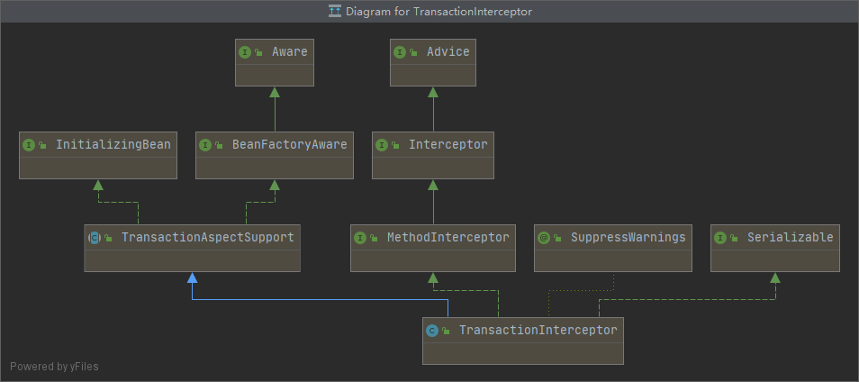

# 第27章：@EnableTransactionManagement 源码分析

## @EnableTransactionManagement 概述
```java
@Target(ElementType.TYPE)
@Retention(RetentionPolicy.RUNTIME)
@Documented
@Import(TransactionManagementConfigurationSelector.class)
public @interface EnableTransactionManagement {

	/**
	 * 代理模式：CGLib、JDK 动态代理
	 *    默认false：基于 JDK 动态代理
	 *    true：会影响所有需要代理的 Spring 管理的 bean
	 */
	boolean proxyTargetClass() default false;

	/**
	 * 代理应用模式：Proxy、AspectJ
	 *   Proxy：只会允许通过代理拦截调用，不会拦截同一类中的本地调用
	 *   AspectJ：proxyTargetClass() 会失效，会拦截同一类中的本地方法
	 */
	AdviceMode mode() default AdviceMode.PROXY;

	/**
	 * 事务操作的执行顺序
	 */
	int order() default Ordered.LOWEST_PRECEDENCE;

}
```
`@EnableTransactionManagement`注解的主要作用是导入`TransactionManagementConfigurationSelector`。

## 给容器中导入 TransactionManagementConfigurationSelector
`@EnableTransactionManagement`注解会使用`@Import`注解给容器中导入`TransactionManagementConfigurationSelector`类型的组件，它实际上是一个`ImportSelector`。


定位`org.springframework.transaction.annotation.TransactionManagementConfigurationSelector`：
```java
import org.springframework.context.annotation.AdviceMode;
import org.springframework.context.annotation.AdviceModeImportSelector;
import org.springframework.context.annotation.AutoProxyRegistrar;
import org.springframework.transaction.config.TransactionManagementConfigUtils;

public class TransactionManagementConfigurationSelector extends AdviceModeImportSelector<EnableTransactionManagement> {

	/**
	 * {@inheritDoc}
	 * @return {@link ProxyTransactionManagementConfiguration} or
	 * {@code AspectJTransactionManagementConfiguration} for {@code PROXY} and
	 * {@code ASPECTJ} values of {@link EnableTransactionManagement#mode()}, respectively
	 */
	@Override
	protected String[] selectImports(AdviceMode adviceMode) {
		switch (adviceMode) {
		    // 默认是 PROXY ，会导入两个类，以它为例
			case PROXY:
				return new String[] {AutoProxyRegistrar.class.getName(), ProxyTransactionManagementConfiguration.class.getName()};
			case ASPECTJ:
				return new String[] {TransactionManagementConfigUtils.TRANSACTION_ASPECT_CONFIGURATION_CLASS_NAME};
			default:
				return null;
		}
	}

}
```

### AutoProxyRegistrar
类结构图：


`AutoProxyRegistrar`实现了`ImportBeanDefinitionRegistrar`，用于向容器中注册代理创建器`AutoProxyCreator`。

定位`org.springframework.context.annotation.AutoProxyRegistrar`：
```java
package org.springframework.context.annotation;

import java.util.Set;

import org.apache.commons.logging.Log;
import org.apache.commons.logging.LogFactory;

import org.springframework.aop.config.AopConfigUtils;
import org.springframework.beans.factory.support.BeanDefinitionRegistry;
import org.springframework.core.annotation.AnnotationAttributes;
import org.springframework.core.type.AnnotationMetadata;

public class AutoProxyRegistrar implements ImportBeanDefinitionRegistrar {

	private final Log logger = LogFactory.getLog(getClass());

	@Override
	public void registerBeanDefinitions(AnnotationMetadata importingClassMetadata, BeanDefinitionRegistry registry) {
		boolean candidateFound = false;
		
		// 获取配置类的注解列表
		Set<String> annoTypes = importingClassMetadata.getAnnotationTypes();
		for (String annoType : annoTypes) {
		    // 获取注解的属性信息
			AnnotationAttributes candidate = AnnotationConfigUtils.attributesFor(importingClassMetadata, annoType);
			if (candidate == null) {
				continue;
			}
			Object mode = candidate.get("mode");
			Object proxyTargetClass = candidate.get("proxyTargetClass");
			
			// 过滤掉 @EnableTransactionManagement 注解
			if (mode != null && proxyTargetClass != null && AdviceMode.class == mode.getClass() &&
					Boolean.class == proxyTargetClass.getClass()) {
				candidateFound = true;
				if (mode == AdviceMode.PROXY) {
					AopConfigUtils.registerAutoProxyCreatorIfNecessary(registry);
					if ((Boolean) proxyTargetClass) {
						AopConfigUtils.forceAutoProxyCreatorToUseClassProxying(registry);
						return;
					}
				}
			}
		}
		if (!candidateFound) {
			String name = getClass().getSimpleName();
			logger.warn(String.format("%s was imported but no annotations were found " +
					"having both 'mode' and 'proxyTargetClass' attributes of type " +
					"AdviceMode and boolean respectively. This means that auto proxy " +
					"creator registration and configuration may not have occurred as " +
					"intended, and components may not be proxied as expected. Check to " +
					"ensure that %s has been @Import'ed on the same class where these " +
					"annotations are declared; otherwise remove the import of %s " +
					"altogether.", name, name, name));
		}
	}

}
```
其核心逻辑就是`AopConfigUtils.registerAutoProxyCreatorIfNecessary(registry)`和`AopConfigUtils.forceAutoProxyCreatorToUseClassProxying(registry)`。

#### registerAutoProxyCreatorIfNecessary
定位`org.springframework.aop.config.AopConfigUtils#registerAutoProxyCreatorIfNecessary`，68：
```java
public static BeanDefinition registerAutoProxyCreatorIfNecessary(BeanDefinitionRegistry registry) {
    return registerAutoProxyCreatorIfNecessary(registry, null);
}

// org.springframework.aop.config.AopConfigUtils#registerAutoProxyCreatorIfNecessary 73
public static BeanDefinition registerAutoProxyCreatorIfNecessary(BeanDefinitionRegistry registry, Object source) {
    return registerOrEscalateApcAsRequired(InfrastructureAdvisorAutoProxyCreator.class, registry, source);
}

// org.springframework.aop.config.AopConfigUtils#registerOrEscalateApcAsRequired 108
private static BeanDefinition registerOrEscalateApcAsRequired(Class<?> cls, BeanDefinitionRegistry registry, Object source) {
    Assert.notNull(registry, "BeanDefinitionRegistry must not be null");
    
    // 判断当前容器中是否存在自动代理创建器的 bean 定义
    if (registry.containsBeanDefinition(AUTO_PROXY_CREATOR_BEAN_NAME)) {
        BeanDefinition apcDefinition = registry.getBeanDefinition(AUTO_PROXY_CREATOR_BEAN_NAME);
        // 判断已存在的 bean 定义的 className 和当前 cls 的 className 是否一致
        if (!cls.getName().equals(apcDefinition.getBeanClassName())) {
            // 不一致则使用优先级更高的
            int currentPriority = findPriorityForClass(apcDefinition.getBeanClassName());
            int requiredPriority = findPriorityForClass(cls);
            if (currentPriority < requiredPriority) {
                apcDefinition.setBeanClassName(cls.getName());
            }
        }
        return null;
    }
    
    // 创建 bean 定义
    RootBeanDefinition beanDefinition = new RootBeanDefinition(cls);
    beanDefinition.setSource(source);
    beanDefinition.getPropertyValues().add("order", Ordered.HIGHEST_PRECEDENCE);
    beanDefinition.setRole(BeanDefinition.ROLE_INFRASTRUCTURE);
    registry.registerBeanDefinition(AUTO_PROXY_CREATOR_BEAN_NAME, beanDefinition);
    return beanDefinition;
}
```

#### forceAutoProxyCreatorToUseClassProxying
定位`org.springframework.aop.config.AopConfigUtils#forceAutoProxyCreatorToUseClassProxying`：
```java
public static void forceAutoProxyCreatorToUseClassProxying(BeanDefinitionRegistry registry) {
    if (registry.containsBeanDefinition(AUTO_PROXY_CREATOR_BEAN_NAME)) {
        BeanDefinition definition = registry.getBeanDefinition(AUTO_PROXY_CREATOR_BEAN_NAME);
        // 给 bean 定义中添加 proxyTargetClass 属性
        definition.getPropertyValues().add("proxyTargetClass", Boolean.TRUE);
    }
}
```

### ProxyTransactionManagementConfiguration
类结构图：


`ProxyTransactionManagementConfiguration`是`@Configuration`，会向容器中注入`BeanFactoryTransactionAttributeSourceAdvisor`、`TransactionAttributeSource`以及`TransactionInterceptor`组件。

定位`org.springframework.transaction.annotation.ProxyTransactionManagementConfiguration`：
```java
@Configuration
public class ProxyTransactionManagementConfiguration extends AbstractTransactionManagementConfiguration {

	@Bean(name = TransactionManagementConfigUtils.TRANSACTION_ADVISOR_BEAN_NAME)
	@Role(BeanDefinition.ROLE_INFRASTRUCTURE)
	public BeanFactoryTransactionAttributeSourceAdvisor transactionAdvisor() {
		BeanFactoryTransactionAttributeSourceAdvisor advisor = new BeanFactoryTransactionAttributeSourceAdvisor();
		advisor.setTransactionAttributeSource(transactionAttributeSource());
		// 设置增强
		advisor.setAdvice(transactionInterceptor());
		advisor.setOrder(this.enableTx.<Integer>getNumber("order"));
		return advisor;
	}

	@Bean
	@Role(BeanDefinition.ROLE_INFRASTRUCTURE)
	public TransactionAttributeSource transactionAttributeSource() {
	    // 基于注解的事务属性源
		return new AnnotationTransactionAttributeSource();
	}

	@Bean
	@Role(BeanDefinition.ROLE_INFRASTRUCTURE)
	public TransactionInterceptor transactionInterceptor() {
	    // 事务拦截器，会依赖这个拦截器来开启、提交/回滚事务，且最终会调用此拦截器内部的 invoke 方法
		TransactionInterceptor interceptor = new TransactionInterceptor();
		interceptor.setTransactionAttributeSource(transactionAttributeSource());
		if (this.txManager != null) {
		    // 设置事务管理器
			interceptor.setTransactionManager(this.txManager);
		}
		return interceptor;
	}

}
```

#### AbstractTransactionManagementConfiguration
`ProxyTransactionManagementConfiguration`继承了`AbstractTransactionManagementConfiguration`，`AbstractTransactionManagementConfiguration`实现了`ImportAware`接口。`AbstractTransactionManagementConfiguration`会注入`@EnableTransactionManagement`注解的属性信息，同时还会注入`TransactionManagementConfigurer`自定义事务管理器。
```
@Configuration
public abstract class AbstractTransactionManagementConfiguration implements ImportAware {

	protected AnnotationAttributes enableTx;

	/**
	 * Default transaction manager, as configured through a {@link TransactionManagementConfigurer}.
	 */
	protected PlatformTransactionManager txManager;


	@Override
	public void setImportMetadata(AnnotationMetadata importMetadata) {
	    // 获取 @EnableTransactionManagement 注解的属性信息
		this.enableTx = AnnotationAttributes.fromMap(
				importMetadata.getAnnotationAttributes(EnableTransactionManagement.class.getName(), false));
		if (this.enableTx == null) {
			throw new IllegalArgumentException(
					"@EnableTransactionManagement is not present on importing class " + importMetadata.getClassName());
		}
	}

	@Autowired(required = false)
	void setConfigurers(Collection<TransactionManagementConfigurer> configurers) {
		if (CollectionUtils.isEmpty(configurers)) {
			return;
		}
		// Spring 容器中类型为 TransactionManagementConfigurer 的 bean 只能存在一个
		if (configurers.size() > 1) {
			throw new IllegalStateException("Only one TransactionManagementConfigurer may exist");
		}
		TransactionManagementConfigurer configurer = configurers.iterator().next();
		// 使用自定义的事务管理器
		this.txManager = configurer.annotationDrivenTransactionManager();
	}


	@Bean(name = TransactionManagementConfigUtils.TRANSACTIONAL_EVENT_LISTENER_FACTORY_BEAN_NAME)
	@Role(BeanDefinition.ROLE_INFRASTRUCTURE)
	public TransactionalEventListenerFactory transactionalEventListenerFactory() {
	    // 注入监听器工厂，支持 @TransactionalEventListener 注解标注的方法，来监听事务相关的事件
		return new TransactionalEventListenerFactory();
	}

}
```

#### AnnotationTransactionAttributeSource
`AnnotationTransactionAttributeSource`是基于注解的事务属性源，内部维护`TransactionAnnotationParser`集合，用于解析类或方法的事务属性。

定位`org.springframework.transaction.annotation.AnnotationTransactionAttributeSource#AnnotationTransactionAttributeSource()`
```java
public AnnotationTransactionAttributeSource() {
    this(true);
}

public AnnotationTransactionAttributeSource(boolean publicMethodsOnly) {
    this.publicMethodsOnly = publicMethodsOnly;
    this.annotationParsers = new LinkedHashSet<TransactionAnnotationParser>(2);
    // 默认支持 Spring 事务注解
    // SpringTransactionAnnotationParser 实现了 TransactionAnnotationParser 接口，负责解析 @Transactional 注解
    this.annotationParsers.add(new SpringTransactionAnnotationParser());
    if (jta12Present) {
        // 支持 JTS 事务注解
        this.annotationParsers.add(new JtaTransactionAnnotationParser());
    }
    if (ejb3Present) {
        // 支持 EJB3 事务注解
        this.annotationParsers.add(new Ejb3TransactionAnnotationParser());
    }
}

@Override
protected TransactionAttribute findTransactionAttribute(Method method) {
    return determineTransactionAttribute(method);
}

@Override
protected TransactionAttribute findTransactionAttribute(Class<?> clazz) {
    return determineTransactionAttribute(clazz);
}

protected TransactionAttribute determineTransactionAttribute(AnnotatedElement ae) {
    if (ae.getAnnotations().length > 0) {
        // 遍历事务注解解析器
        for (TransactionAnnotationParser annotationParser : this.annotationParsers) {
            // 解析事务属性
            TransactionAttribute attr = annotationParser.parseTransactionAnnotation(ae);
            if (attr != null) {
                return attr;
            }
        }
    }
    return null;
}
```

#### TransactionInterceptor
类结构图：



`TransactionInterceptor`继承自`TransactionAspectSupport`，并实现了`MethodInterceptor`接口。

```java
@Override
public Object invoke(final MethodInvocation invocation) throws Throwable {
    // Work out the target class: may be {@code null}.
    // The TransactionAttributeSource should be passed the target class
    // as well as the method, which may be from an interface.
    Class<?> targetClass = (invocation.getThis() != null ? AopUtils.getTargetClass(invocation.getThis()) : null);

    // Adapt to TransactionAspectSupport's invokeWithinTransaction...
    return invokeWithinTransaction(invocation.getMethod(), targetClass, new InvocationCallback() {
        @Override
        public Object proceedWithInvocation() throws Throwable {
            return invocation.proceed();
        }
    });
}
```

### 总结
阉割版执行流程。
```text
@EnableTransactionManagement
    利用 TransactionManagementConfigurationSelector 给容器中导入两个组件（默认情况下 PROXY ）
        org.springframework.context.annotation.AutoProxyRegistrar
        org.springframework.transaction.annotation.ProxyTransactionManagementConfiguration
        
    AutoProxyRegistrar
        给容器中注册一个 InfrastructureAdvisorAutoProxyCreator 组件
            利用后置处理器在对象实例化后，包装对象，返回一个代理对象（增强器），代理对象执行方法利用拦截器进行调用
    
    ProxyTransactionManagementConfiguration -> 配置类
        给容器中注册事务增强器 BeanFactoryTransactionAttributeSourceAdvisor
        给容器中注册事务注解解析器 AnnotationTransactionAttributeSource ，并添加到 BeanFactoryTransactionAttributeSourceAdvisor 的 transactionAttributeSource 属性
        给容器中注册事务拦截器 TransactionInterceptor，并添加到 BeanFactoryTransactionAttributeSourceAdvisor 的 advice 属性
            TransactionInterceptor 保存了事务属性信息、事务管理器等，实现了 MethodInterceptor 接口
            
    在目标方法执行时
        执行事务拦截器链
            先获取事务相关属性
            再获取 PlatformTransactionManager，如果没有指定任何 transactionManger，最终会从容器中按照类型获取 PlatformTransactionManager。（容器中只能存在一个）
            执行目标方法
                异常：获取事务管理器，利用事务管理器回滚
                正常：利用事务管理器，提交事务
```

`@EnableXXX`原理：注解上有 XXXRegistrar，或通过 XXXSelector 引入 XXXRegistrar，XXXRegistrar 实现了 ImportBeanDefinitionRegistrar 接口，给容器中注册 XXXCreator。这个 XXXCreator 实现了`BeanPostProcessor`，后置处理器再对象创建后，包装对象，返回一个代理对象（增强器），代理对象执行方法利用拦截器进行调用。