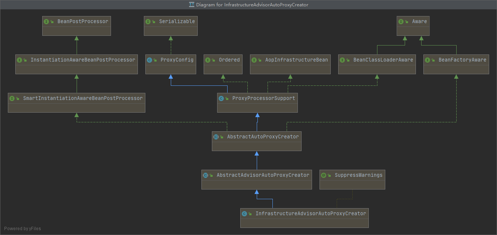
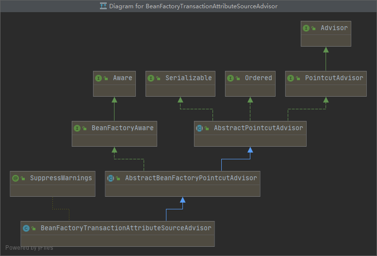

# 第28章：Spring 事务原理
> 默认情况下，Spring 中的事务处理只对 RuntimeException 异常进行回滚，若使用 Exception 将不会产生回滚效果

## 开启事务的xml自定义标签
&emsp;&emsp;如果想要开启事务的功能。那么在配置文件中会有`<tx:annotation-driven/>`这样一个配置。如果没有这个配置，Spring 中将不存在事务的功能。

定位`org.springframework.transaction.config.TxNamespaceHandler#init`：
```java
public class TxNamespaceHandler extends NamespaceHandlerSupport {

	static final String TRANSACTION_MANAGER_ATTRIBUTE = "transaction-manager";

	static final String DEFAULT_TRANSACTION_MANAGER_BEAN_NAME = "transactionManager";


	static String getTransactionManagerName(Element element) {
		return (element.hasAttribute(TRANSACTION_MANAGER_ATTRIBUTE) ?
				element.getAttribute(TRANSACTION_MANAGER_ATTRIBUTE) : DEFAULT_TRANSACTION_MANAGER_BEAN_NAME);
	}


	@Override
	public void init() {
		registerBeanDefinitionParser("advice", new TxAdviceBeanDefinitionParser());
		registerBeanDefinitionParser("annotation-driven", new AnnotationDrivenBeanDefinitionParser());
		registerBeanDefinitionParser("jta-transaction-manager", new JtaTransactionManagerBeanDefinitionParser());
	}

}
```
&emsp;&emsp;在遇到以`<tx:annotation-driven`开头的配置后，Spring 会使用`AnnotationDrivenBeanDefinitionParser`类的`parse`方法进行解析。

&emsp;&emsp;定位`org.springframework.transaction.config.AnnotationDrivenBeanDefinitionParser#parse`：
```java
/**
 * Parses the {@code <tx:annotation-driven/>} tag. Will
 * {@link AopNamespaceUtils#registerAutoProxyCreatorIfNecessary register an AutoProxyCreator}
 * with the container as necessary.
 */
@Override
public BeanDefinition parse(Element element, ParserContext parserContext) {
    registerTransactionalEventListenerFactory(parserContext);
    String mode = element.getAttribute("mode");
    if ("aspectj".equals(mode)) {
        // mode="aspectj"
        registerTransactionAspect(element, parserContext);
    }
    else {
        // mode="proxy"
        AopAutoProxyConfigurer.configureAutoProxyCreator(element, parserContext);
    }
    return null;
}
```
而在解析中，存在对`mode`属性的判断，默认proxy，如果需要配置 AspectJ 的事务切入，具体配置如下：
```xml
<tx:annotation-driven transaction-manager="transactionManager" mode="aspectj"/>
```

### 注入 InfrastructureAdvisorAutoProxyCreator
我们以默认配置为例，定位`org.springframework.transaction.config.AnnotationDrivenBeanDefinitionParser.AopAutoProxyConfigurer#configureAutoProxyCreator`：
```java
public static void configureAutoProxyCreator(Element element, ParserContext parserContext) {
    // 注入类型为 InfrastructureAdvisorAutoProxyCreator 的 bean
    AopNamespaceUtils.registerAutoProxyCreatorIfNecessary(parserContext, element);

    String txAdvisorBeanName = TransactionManagementConfigUtils.TRANSACTION_ADVISOR_BEAN_NAME;
    if (!parserContext.getRegistry().containsBeanDefinition(txAdvisorBeanName)) {
        Object eleSource = parserContext.extractSource(element);

        // 1. 创建 TransactionAttributeSource 的 bean
        RootBeanDefinition sourceDef = new RootBeanDefinition(
                "org.springframework.transaction.annotation.AnnotationTransactionAttributeSource");
        sourceDef.setSource(eleSource);
        sourceDef.setRole(BeanDefinition.ROLE_INFRASTRUCTURE);
        // 注册 bean，并使用 Spring 的定义规则生成 beanName
        String sourceName = parserContext.getReaderContext().registerWithGeneratedName(sourceDef);

        // 2. 创建 TransactionInterceptor 的 bean
        RootBeanDefinition interceptorDef = new RootBeanDefinition(TransactionInterceptor.class);
        interceptorDef.setSource(eleSource);
        interceptorDef.setRole(BeanDefinition.ROLE_INFRASTRUCTURE);
        registerTransactionManager(element, interceptorDef);
        interceptorDef.getPropertyValues().add("transactionAttributeSource", new RuntimeBeanReference(sourceName));
        // 注册 bean，并使用 Spring 的定义规则生成 beanName
        String interceptorName = parserContext.getReaderContext().registerWithGeneratedName(interceptorDef);

        // 3. 创建 TransactionAttributeSourceAdvisor 的 bean
        RootBeanDefinition advisorDef = new RootBeanDefinition(BeanFactoryTransactionAttributeSourceAdvisor.class);
        advisorDef.setSource(eleSource);
        advisorDef.setRole(BeanDefinition.ROLE_INFRASTRUCTURE);
        
        // 将 TransactionAttributeSource 注入到 TransactionAttributeSourceAdvisor 的 transactionAttributeSource 属性中
        advisorDef.getPropertyValues().add("transactionAttributeSource", new RuntimeBeanReference(sourceName));
        
        // 将 TransactionInterceptor 注入到 TransactionAttributeSourceAdvisor 的 adviceBeanName 属性中
        advisorDef.getPropertyValues().add("adviceBeanName", interceptorName);
        if (element.hasAttribute("order")) {
            // 如果配置了 order 属性，则加入到 bean 中
            advisorDef.getPropertyValues().add("order", element.getAttribute("order"));
        }
        parserContext.getRegistry().registerBeanDefinition(txAdvisorBeanName, advisorDef);

        // 创建 CompositeComponentDefinition
        CompositeComponentDefinition compositeDef = new CompositeComponentDefinition(element.getTagName(), eleSource);
        compositeDef.addNestedComponent(new BeanComponentDefinition(sourceDef, sourceName));
        compositeDef.addNestedComponent(new BeanComponentDefinition(interceptorDef, interceptorName));
        compositeDef.addNestedComponent(new BeanComponentDefinition(advisorDef, txAdvisorBeanName));
        parserContext.registerComponent(compositeDef);
    }
}
```
上面的代码注册了代理类和三个 bean，而这三个 bean 支撑了整个的事务功能。那么这三个 bean 是怎么组织起来的呢？

首先。其中的两个 bean 被注册到了一个名为`advisorDef`的 bean 中，`advisorDef`使用`BeanFactoryTransactionAttributeSourceAdvisor`作为其 class 属性。也就是说`BeanFactoryTransactionAttributeSourceAdvisor`代表当前 bean。如图所示，具体代码如下：
```java
advisorDef.getPropertyValues().add("transactionAttributeSource", new RuntimeBeanReference(sourceName));
advisorDef.getPropertyValues().add("adviceBeanName", interceptorName);
```


如此组装的目的是什么呢？暂且留一个悬念，继续分析代码，请看这一段代码`AopNamespaceUtils.registerAutoProxyCreatorIfNecessary(parserContext, element)`，是不是很眼熟？AOP 注册自动代理器也用到了。

定位`org.springframework.aop.config.AopNamespaceUtils#registerAutoProxyCreatorIfNecessary`：
```java
public static void registerAutoProxyCreatorIfNecessary(
        ParserContext parserContext, Element sourceElement) {

    BeanDefinition beanDefinition = AopConfigUtils.registerAutoProxyCreatorIfNecessary(
            parserContext.getRegistry(), parserContext.extractSource(sourceElement));
    useClassProxyingIfNecessary(parserContext.getRegistry(), sourceElement);
    registerComponentIfNecessary(beanDefinition, parserContext);
}
public static BeanDefinition registerAutoProxyCreatorIfNecessary(BeanDefinitionRegistry registry, Object source) {
    return registerOrEscalateApcAsRequired(InfrastructureAdvisorAutoProxyCreator.class, registry, source);
}
```
上述的代码流程在 AOP 中有所分析，上面两个方法主要目的是注册`InfrastructureAdvisorAutoProxyCreator`类型的 bean，那么注册这个类的目的是什么呢？查看这个类的层次，如图所示：



可以看到，`InfrastructureAdvisorAutoProxyCreator`间接实现了`SmartInstantiationAwareBeanPostProcessor`，而`SmartInstantiationAwareBeanPostProcessor`又继承于`InstantiationAwareBeanPostProcessor`，也就是说在 Spring 中，bean 实例化后 Spring 都会保证调用其`postProcessAfterInitialization()`方法，其实现是在父类`AbstractAutoProxyCreator`中实现的。      

定位`org.springframework.aop.framework.autoproxy.AbstractAutoProxyCreator#postProcessAfterInitialization`：
```java
/**
 * Create a proxy with the configured interceptors if the bean is
 * identified as one to proxy by the subclass.
 * @see #getAdvicesAndAdvisorsForBean
 */
@Override
public Object postProcessAfterInitialization(Object bean, String beanName) throws BeansException {
    if (bean != null) {
        // 缓存链：1、beanName 不为空的话，使用 beanName（FactoryBean会在见面加上"&"）
        // 2、如果 beanName，使用 Class 对象作为缓存的 key
        Object cacheKey = getCacheKey(bean.getClass(), beanName);
        // 是否由于避免循环依赖而创建的 bean 代理
        if (!this.earlyProxyReferences.contains(cacheKey)) {
            return wrapIfNecessary(bean, beanName, cacheKey);
        }
    }
    return bean;
}
```
这里实现的主要目的是对指定 bean 进行封装，当然首先要确定是否需要封装，而检测及封装的工作都委托给了`wrapIfNecessary()`方法进行处理。

定位`org.springframework.aop.framework.autoproxy.AbstractAutoProxyCreator#wrapIfNecessary`：
```java
/**
 * Wrap the given bean if necessary, i.e. if it is eligible for being proxied.
 * @param bean the raw bean instance
 * @param beanName the name of the bean
 * @param cacheKey the cache key for metadata access
 * @return a proxy wrapping the bean, or the raw bean instance as-is
 */
protected Object wrapIfNecessary(Object bean, String beanName, Object cacheKey) {       
    // 已经处理过了
    if (beanName != null && this.targetSourcedBeans.contains(beanName)) {
        return bean;
    }
    // 已经处理过的 bean，无需增强
    if (Boolean.FALSE.equals(this.advisedBeans.get(cacheKey))) {
        return bean;
    }
    // 是否是基础类或者切面（标注了@Aspect的），基础类不应被代理。或者配置了指定 bean 不需要代理
    if (isInfrastructureClass(bean.getClass()) || shouldSkip(bean.getClass(), beanName)) {
        this.advisedBeans.put(cacheKey, Boolean.FALSE);
        return bean;
    }

    // Create proxy if we have advice.
    Object[] specificInterceptors = getAdvicesAndAdvisorsForBean(bean.getClass(), beanName, null);
    if (specificInterceptors != DO_NOT_PROXY) {
        this.advisedBeans.put(cacheKey, Boolean.TRUE);
        Object proxy = createProxy(
                bean.getClass(), beanName, specificInterceptors, new SingletonTargetSource(bean));
        this.proxyTypes.put(cacheKey, proxy.getClass());
        return proxy;
    }

    this.advisedBeans.put(cacheKey, Boolean.FALSE);
    return bean;
}
```
`wrapIfNecessary()`方法主要的工作如下：
1.找出指定 bean 对应的增强器
2.根据找出的增强器创建代理

### 获取对应类或方法的增强器
获取指定 bean 对应的增强器，其中包含两个关键字：增强器与对应。也就是说在`getAdvicesAndAdvisorsForBean()`方法中不但要找出增强器，而且还需要判断增强器是否满足要求。

定位`org.springframework.aop.framework.autoproxy.AbstractAdvisorAutoProxyCreator#getAdvicesAndAdvisorsForBean`：
```java
@Override
protected Object[] getAdvicesAndAdvisorsForBean(Class<?> beanClass, String beanName, TargetSource targetSource) {
    List<Advisor> advisors = findEligibleAdvisors(beanClass, beanName);
    if (advisors.isEmpty()) {
        return DO_NOT_PROXY;
    }
    return advisors.toArray();
}
protected List<Advisor> findEligibleAdvisors(Class<?> beanClass, String beanName) {
    List<Advisor> candidateAdvisors = findCandidateAdvisors();
    List<Advisor> eligibleAdvisors = findAdvisorsThatCanApply(candidateAdvisors, beanClass, beanName);
    extendAdvisors(eligibleAdvisors);
    if (!eligibleAdvisors.isEmpty()) {
        eligibleAdvisors = sortAdvisors(eligibleAdvisors);
    }
    return eligibleAdvisors;
}
```
而通过上面的方法，Spring 又将任务进行了拆分，分成了获取所有增强器和增强器是否匹配这两个功能点。

#### 1.获取候选增强器
定位`org.springframework.aop.framework.autoproxy.AbstractAdvisorAutoProxyCreator#findCandidateAdvisors`：
```java
/**
 * Find all candidate Advisors to use in auto-proxying.
 * @return the List of candidate Advisors
 */
protected List<Advisor> findCandidateAdvisors() {
    return this.advisorRetrievalHelper.findAdvisorBeans();
}

public List<Advisor> findAdvisorBeans() {
    // Determine list of advisor bean names, if not cached already.
    String[] advisorNames = null;
    synchronized (this) {
        advisorNames = this.cachedAdvisorBeanNames;
        if (advisorNames == null) {
            // 获取所有对应 Advisor.class 的类
            advisorNames = BeanFactoryUtils.beanNamesForTypeIncludingAncestors(
                    this.beanFactory, Advisor.class, true, false);
            this.cachedAdvisorBeanNames = advisorNames;
        }
    }
    if (advisorNames.length == 0) {
        return new LinkedList<Advisor>();
    }

    List<Advisor> advisors = new LinkedList<Advisor>();
    for (String name : advisorNames) {
        if (isEligibleBean(name)) {
            if (this.beanFactory.isCurrentlyInCreation(name)) {
                if (logger.isDebugEnabled()) {
                    logger.debug("Skipping currently created advisor '" + name + "'");
                }
            }
            else {
                try {
                    // 获取 bean
                    advisors.add(this.beanFactory.getBean(name, Advisor.class));
                }
                catch (BeanCreationException ex) {
                    Throwable rootCause = ex.getMostSpecificCause();
                    if (rootCause instanceof BeanCurrentlyInCreationException) {
                        BeanCreationException bce = (BeanCreationException) rootCause;
                        if (this.beanFactory.isCurrentlyInCreation(bce.getBeanName())) {
                            if (logger.isDebugEnabled()) {
                                logger.debug("Skipping advisor '" + name +
                                        "' with dependency on currently created bean: " + ex.getMessage());
                            }
                            // Ignore: indicates a reference back to the bean we're trying to advise.
                            // We want to find advisors other than the currently created bean itself.
                            continue;
                        }
                    }
                    throw ex;
                }
            }
        }
    }
    return advisors;
}
```
对于上面的方法，首先是通过`BeanFactoryUtils.beanNamesForTypeIncludingAncestors()`方法获取所有对应`Advisor.class`的类，使用`ListableBeanFactory`提供的方法进行获取，如下所示：
```java
    String[] getBeanNamesForType(Class<?> type, boolean includeNonSingletons, boolean allowEagerInit);
```
而知道了增强器在容器中的 beanName 时，调用`BeanFactory`提供的方法，获取 bean 的示例：
```java
    <T> T getBean(String name, Class<T> requiredType) throws BeansException;
```
还记得之前留下的悬念吗？前面注册了一个类型为`BeanFactoryTransactionAttributeSourceAdvisor`的 bean，而在此 bean 中又注册了两个 bean。此时这个 bean 就会被开始使用。因为`BeanFactoryTransactionAttributeSourceAdvisor`实现了`Advisor`接口，那么在获取所有增强器时自然也会将此 bean 提取出来，并随着其他增强器一起在后续的步骤中被织入代理。



#### 2.候选增强器中寻找匹配的增强器
当找出对应的增强器后，接下来的任务就是检查这些增强器是否与对应的 class 匹配。当然不只是 class，class 内部的方法如果匹配也可以通过验证。

定位`org.springframework.aop.framework.autoproxy.AbstractAdvisorAutoProxyCreator#findAdvisorsThatCanApply`：
```java
protected List<Advisor> findAdvisorsThatCanApply(
        List<Advisor> candidateAdvisors, Class<?> beanClass, String beanName) {

    ProxyCreationContext.setCurrentProxiedBeanName(beanName);
    try {
        return AopUtils.findAdvisorsThatCanApply(candidateAdvisors, beanClass);
    }
    finally {
        ProxyCreationContext.setCurrentProxiedBeanName(null);
    }
}

// org.springframework.aop.support.AopUtils#findAdvisorsThatCanApply
public static List<Advisor> findAdvisorsThatCanApply(List<Advisor> candidateAdvisors, Class<?> clazz) {
    if (candidateAdvisors.isEmpty()) {
        return candidateAdvisors;
    }
    List<Advisor> eligibleAdvisors = new LinkedList<Advisor>();
    // 首先处理引介增强，例如 @DeclareParents 注解
    for (Advisor candidate : candidateAdvisors) {
        if (candidate instanceof IntroductionAdvisor && canApply(candidate, clazz)) {
            eligibleAdvisors.add(candidate);
        }
    }
    boolean hasIntroductions = !eligibleAdvisors.isEmpty();
    for (Advisor candidate : candidateAdvisors) {
        // 引介增强已经处理
        if (candidate instanceof IntroductionAdvisor) {
            // already processed
            continue;
        }
        // 对于普通增强的处理
        if (canApply(candidate, clazz, hasIntroductions)) {
            eligibleAdvisors.add(candidate);
        }
    }
    return eligibleAdvisors;
}

// org.springframework.aop.support.AopUtils#canApply，273
public static boolean canApply(Advisor advisor, Class<?> targetClass, boolean hasIntroductions) {
    if (advisor instanceof IntroductionAdvisor) {
        return ((IntroductionAdvisor) advisor).getClassFilter().matches(targetClass);
    }
    else if (advisor instanceof PointcutAdvisor) {
        PointcutAdvisor pca = (PointcutAdvisor) advisor;
        return canApply(pca.getPointcut(), targetClass, hasIntroductions);
    }
    else {
        // It doesn't have a pointcut so we assume it applies.
        return true;
    }
}
```
当前我们分析的是对于`UserService`（请移步附录）是否适用于此增强方法，那么当前的`advisor`就是之前查找出来的类型为`BeanFactoryTransactionAttributeSourceAdvisor`的 bean 示例，而通过类的层次结构我们知道，`BeanFactoryTransactionAttributeSourceAdvisor`间接实现了`PointcutAdvisor`。
在`canApply()`方法中的第二个 if 判断时就会通过判断，会将`BeanFactoryTransactionAttributeSourceAdvisor`中的`getPointcut()`方法返回值作为参数继续调用`canApply()`方法，而`getPointcut()`方法返回的是`TransactionAttributeSourcePointcut`类型的实例。对于`transactionAttributeSource`这个属性还有印象吗？这个属性是在解析自定义标签时注入进去的。
```java
private final TransactionAttributeSourcePointcut pointcut = new TransactionAttributeSourcePointcut() {
    @Override
    protected TransactionAttributeSource getTransactionAttributeSource() {
        return transactionAttributeSource;
    }
};
```
接着，使用`TransactionAttributeSourcePointcut`类型的实例作为方法的参数继续跟踪`canApply()`。定位`org.springframework.aop.support.AopUtils#canApply`，218：
```java
public static boolean canApply(Pointcut pc, Class<?> targetClass, boolean hasIntroductions) {
    Assert.notNull(pc, "Pointcut must not be null");
    if (!pc.getClassFilter().matches(targetClass)) {
        return false;
    }

    // 此时的 pc 表示 TransactionAttributeSourcePointcut
    // pc.getMethodMatcher() 返回的是自身(this)。TransactionAttributeSourcePointcut 继承自 StaticMethodMatcherPointcut，调用的是父类的方法
    MethodMatcher methodMatcher = pc.getMethodMatcher();
    if (methodMatcher == MethodMatcher.TRUE) {
        // No need to iterate the methods if we're matching any method anyway...
        return true;
    }

    IntroductionAwareMethodMatcher introductionAwareMethodMatcher = null;
    if (methodMatcher instanceof IntroductionAwareMethodMatcher) {
        introductionAwareMethodMatcher = (IntroductionAwareMethodMatcher) methodMatcher;
    }

    Set<Class<?>> classes = new LinkedHashSet<Class<?>>(ClassUtils.getAllInterfacesForClassAsSet(targetClass));
    classes.add(targetClass);
    for (Class<?> clazz : classes) {
        Method[] methods = ReflectionUtils.getAllDeclaredMethods(clazz);
        for (Method method : methods) {
            if ((introductionAwareMethodMatcher != null &&
                    introductionAwareMethodMatcher.matches(method, targetClass, hasIntroductions)) ||
                    methodMatcher.matches(method, targetClass)) {
                return true;
            }
        }
    }

    return false;
}
```
通过上面的方法大致可以理清大体脉络：首先获取目标类的所有接口并连同类本身一起遍历，遍历过程中又对类中的方法再次遍历，一旦匹配成功便认为这个类适用于当前增强器。

对于事务的配置不仅仅局限于方法上配置，在类或接口上的配置可以延续到类中的每个方法，那如果，针对每个方法进行检测，在类本身上配置的事务属性岂不是就检测不到了吗？带着这个疑问继续探究`matches`方法。

调用`methodMatcher.matches(method, targetClass)`会使用`TransactionAttributeSourcePointcut`类的`matches`方法。

定位`org.springframework.transaction.interceptor.TransactionAttributeSourcePointcut#matches`：
```java
@Override
public boolean matches(Method method, Class<?> targetClass) {
    if (targetClass != null && TransactionalProxy.class.isAssignableFrom(targetClass)) {
        return false;
    }
    // 自定义标签解析时注入
    TransactionAttributeSource tas = getTransactionAttributeSource();
    return (tas == null || tas.getTransactionAttribute(method, targetClass) != null);
}
```
此时的 tas 表示`AnnotationTransactionAttributeSource`类型，而`AnnotationTransactionAttributeSource`类型的`getTransactionAttribute()`方法如下：
```java
/* org.springframework.transaction.interceptor.AbstractFallbackTransactionAttributeSource#getTransactionAttribute
 * AnnotationTransactionAttributeSource 继承自 AbstractFallbackTransactionAttributeSource
 * AnnotationTransactionAttributeSource#getTransactionAttribute() 方法由父类实现
 */
/**
 * Determine the transaction attribute for this method invocation.
 * <p>Defaults to the class's transaction attribute if no method attribute is found.
 * @param method the method for the current invocation (never {@code null})
 * @param targetClass the target class for this invocation (may be {@code null})
 * @return TransactionAttribute for this method, or {@code null} if the method
 * is not transactional
 */
@Override
public TransactionAttribute getTransactionAttribute(Method method, Class<?> targetClass) {
    if (method.getDeclaringClass() == Object.class) {
        return null;
    }

    // First, see if we have a cached value.
    Object cacheKey = getCacheKey(method, targetClass);
    Object cached = this.attributeCache.get(cacheKey);
    if (cached != null) {
        // Value will either be canonical value indicating there is no transaction attribute,
        // or an actual transaction attribute.
        if (cached == NULL_TRANSACTION_ATTRIBUTE) {
            return null;
        }
        else {
            return (TransactionAttribute) cached;
        }
    }
    else {
        // We need to work it out.
        TransactionAttribute txAttr = computeTransactionAttribute(method, targetClass);
        // Put it in the cache.
        if (txAttr == null) {
            this.attributeCache.put(cacheKey, NULL_TRANSACTION_ATTRIBUTE);
        }
        else {
            String methodIdentification = ClassUtils.getQualifiedMethodName(method, targetClass);
            if (txAttr instanceof DefaultTransactionAttribute) {
                ((DefaultTransactionAttribute) txAttr).setDescriptor(methodIdentification);
            }
            if (logger.isDebugEnabled()) {
                logger.debug("Adding transactional method '" + methodIdentification + "' with attribute: " + txAttr);
            }
            this.attributeCache.put(cacheKey, txAttr);
        }
        return txAttr;
    }
}
```
上述方法中并没有看到对事务属性的检测，只是一些常规套路。尝试从缓存加载，如果对应信息没有被缓存的话，任务又委托给了`computeTransactionAttribute()`方法，在`computeTransactionAttribute()`方法看到了事务标签的提取过程。

#### 3.提取事务标签
定位`org.springframework.transaction.interceptor.AbstractFallbackTransactionAttributeSource#computeTransactionAttribute`：
```java
/**
 * Same signature as {@link #getTransactionAttribute}, but doesn't cache the result.
 * {@link #getTransactionAttribute} is effectively a caching decorator for this method.
 * <p>As of 4.1.8, this method can be overridden.
 * @since 4.1.8
 * @see #getTransactionAttribute
 */
protected TransactionAttribute computeTransactionAttribute(Method method, Class<?> targetClass) {
    // Don't allow no-public methods as required.
    if (allowPublicMethodsOnly() && !Modifier.isPublic(method.getModifiers())) {
        return null;
    }

    // Ignore CGLIB subclasses - introspect the actual user class.
    Class<?> userClass = ClassUtils.getUserClass(targetClass);
    // method 代表接口中的方法，specificMethod 代表实现类中的方法
    Method specificMethod = ClassUtils.getMostSpecificMethod(method, userClass);
    // If we are dealing with method with generic parameters, find the original method.
    specificMethod = BridgeMethodResolver.findBridgedMethod(specificMethod);

    // First try is the method in the target class.
    // 查看目标类中的方法是否存在事务声明
    TransactionAttribute txAttr = findTransactionAttribute(specificMethod);
    if (txAttr != null) {
        return txAttr;
    }

    // Second try is the transaction attribute on the target class.
    // 查看方法所在类中是否存在事务声明
    txAttr = findTransactionAttribute(specificMethod.getDeclaringClass());
    if (txAttr != null && ClassUtils.isUserLevelMethod(method)) {
        return txAttr;
    }

    // 如果存在接口，则到接口去找
    if (specificMethod != method) {
        // 查找接口方法
        txAttr = findTransactionAttribute(method);
        if (txAttr != null) {
            return txAttr;
        }
        // 到接口中的类去找
        txAttr = findTransactionAttribute(method.getDeclaringClass());
        if (txAttr != null && ClassUtils.isUserLevelMethod(method)) {
            return txAttr;
        }
    }

    return null;
}
```
事务属性的获取规则：
1. 如果方法中存在事务属性，则使用方法上的属性，否则使用方法所在类上的属性。
2. 如果方法所在类的属性没有找到对应的事务属性，那么再查找接口中的方法。
3. 如果接口方法也没有找到，最后尝试查找接口的类上面的声明。
但是上面方法中并没有真正地去做搜寻事务属性的逻辑，只是搭建了执行框架，而是将搜寻事务属性的任务委托给了`findTransactionAttribute()`方法去执行。

定位`org.springframework.transaction.annotation.AnnotationTransactionAttributeSource#findTransactionAttribute`，132：
```java
@Override
protected TransactionAttribute findTransactionAttribute(Method method) {
    return determineTransactionAttribute(method);
}

protected TransactionAttribute determineTransactionAttribute(AnnotatedElement ae) {
    if (ae.getAnnotations().length > 0) {
        for (TransactionAnnotationParser annotationParser : this.annotationParsers) {
            TransactionAttribute attr = annotationParser.parseTransactionAnnotation(ae);
            if (attr != null) {
                return attr;
            }
        }
    }
    return null;
}
```
`this.annotationParsers`是在当前类`AnnotationTransactionAttributeSource`初始化的时候初始化的。其中的值被加入了`SpringTransactionAnnotationParser`，当进行属性获取的时候其实是使用`SpringTransactionAnnotationParser`类的`parseTransactionAnnotation()`方法进行解析的。

定位`org.springframework.transaction.annotation.SpringTransactionAnnotationParser#parseTransactionAnnotation`，41：
```java
@Override
public TransactionAttribute parseTransactionAnnotation(AnnotatedElement ae) {
    AnnotationAttributes attributes = AnnotatedElementUtils.getMergedAnnotationAttributes(ae, Transactional.class);
    if (attributes != null) {
        return parseTransactionAnnotation(attributes);
    }
    else {
        return null;
    }
}
```
至此，终于看到了想看到的获取注解标记的代码。首先会判断`ae`（可能是方法、类、接口或者接口上的类）是否包含`@Transactional`注解，这是事务属性的基础，如果有的话会继续调用`parseTransactionAnnotation()`方法解析详细的属性。
```java
protected TransactionAttribute parseTransactionAnnotation(AnnotationAttributes attributes) {
    RuleBasedTransactionAttribute rbta = new RuleBasedTransactionAttribute();
    // 解析 propagation
    Propagation propagation = attributes.getEnum("propagation");
    rbta.setPropagationBehavior(propagation.value());
    // 解析 isolation
    Isolation isolation = attributes.getEnum("isolation");
    rbta.setIsolationLevel(isolation.value());
    // 解析 timeout
    rbta.setTimeout(attributes.getNumber("timeout").intValue());
    // 解析 readOnly
    rbta.setReadOnly(attributes.getBoolean("readOnly"));
    // 解析 value
    rbta.setQualifier(attributes.getString("value"));
    ArrayList<RollbackRuleAttribute> rollBackRules = new ArrayList<RollbackRuleAttribute>();
    // 解析 rollbackFor
    Class<?>[] rbf = attributes.getClassArray("rollbackFor");
    for (Class<?> rbRule : rbf) {
        RollbackRuleAttribute rule = new RollbackRuleAttribute(rbRule);
        rollBackRules.add(rule);
    }
    // 解析 rollbackForClassName
    String[] rbfc = attributes.getStringArray("rollbackForClassName");
    for (String rbRule : rbfc) {
        RollbackRuleAttribute rule = new RollbackRuleAttribute(rbRule);
        rollBackRules.add(rule);
    }
    // 解析 noRollbackFor
    Class<?>[] nrbf = attributes.getClassArray("noRollbackFor");
    for (Class<?> rbRule : nrbf) {
        NoRollbackRuleAttribute rule = new NoRollbackRuleAttribute(rbRule);
        rollBackRules.add(rule);
    }
    // 解析 noRollbackForClassName
    String[] nrbfc = attributes.getStringArray("noRollbackForClassName");
    for (String rbRule : nrbfc) {
        NoRollbackRuleAttribute rule = new NoRollbackRuleAttribute(rbRule);
        rollBackRules.add(rule);
    }
    rbta.getRollbackRules().addAll(rollBackRules);
    return rbta;
}
```
上面方法中实现了对对应类或者方法的事务属性解析，你会在这个类中看到任何你常用或者不常用的属性提取。

至此，完成了事务标签的解析。回顾一下主旨，我们现在的任务是找出某个增强器是否适用于对应的类，而是否匹配的关键则在于是否从指定的类或类中的方法中找到对应的事务属性（`@Transactional`）。现在，我们以`UserServiceImpl`为例，在它的接口`UserService`中已经找到了事务属性，所以，它是与事务增强器匹配的，也就是它会被事务功能修饰。

至此，事务功能的初始化工作便结束了。当判断某个 bean 适用于事务增强时，实际上是适用于增强器`BeanFactoryTransactionAttributeSourceAdvisor`，看到没，还是这个类，所以说，在自定义标签解析时，注入的 bean 成为了整个事务功能的基础。

`BeanFactoryTransactionAttributeSourceAdvisor`作为`Advisor`的实现类，自然要遵从`Advisor`的处理方式。当代理被调用时会调用这个类的增强方法，也就是此 bean 的 Advise。又因为在解析事务定义标签时将`TransactionInterceptor`类型的 bean 注入到了`BeanFactoryTransactionAttributeSourceAdvisor`中，所以，在调用事务增强器增强的代理类时会首先执行`TransactionInterceptor`进行增强，同时，也就是在`TransactionInterceptor`类中的`invoke()`方法中完成了整个事务的逻辑。

## 事务增强器-(事务创建、提交/回滚)
`TransactionInterceptor`支撑着整个事务功能的架构，逻辑相对复杂，接下来分析此拦截器是如何实现事务特性的。`TransactionInterceptor`类实现了`MethodInterceptor`接口，所以调用该类是从其`invoke()`方法开始的。先来看一下这个方法：
```java
@Override
public Object invoke(final MethodInvocation invocation) throws Throwable {
    // Work out the target class: may be {@code null}.
    // The TransactionAttributeSource should be passed the target class
    // as well as the method, which may be from an interface.
    Class<?> targetClass = (invocation.getThis() != null ? AopUtils.getTargetClass(invocation.getThis()) : null);

    // Adapt to TransactionAspectSupport's invokeWithinTransaction...
    return invokeWithinTransaction(invocation.getMethod(), targetClass, new InvocationCallback() {
        @Override
        public Object proceedWithInvocation() throws Throwable {
            return invocation.proceed();
        }
    });
}
```
`TransactionInterceptor`的`invoke()`方法中又调用了`invokeWithinTransaction()`方法，`invokeWithinTransaction()`方法在其父类`TransactionAspectSupport`中得到实现。
```java
/**
 * General delegate for around-advice-based subclasses, delegating to several other template
 * methods on this class. Able to handle {@link CallbackPreferringPlatformTransactionManager}
 * as well as regular {@link PlatformTransactionManager} implementations.
 * @param method the Method being invoked
 * @param targetClass the target class that we're invoking the method on
 * @param invocation the callback to use for proceeding with the target invocation
 * @return the return value of the method, if any
 * @throws Throwable propagated from the target invocation
 */
protected Object invokeWithinTransaction(Method method, Class<?> targetClass, final InvocationCallback invocation)
        throws Throwable {

    // 获取 targetClass 对应事务属性
    final TransactionAttribute txAttr = getTransactionAttributeSource().getTransactionAttribute(method, targetClass);
    // 获取 beanFactory 中的 transactionManager
    final PlatformTransactionManager tm = determineTransactionManager(txAttr);
    // 构建方法的唯一表示（类.方法，如 service.UserServiceImpl.save）
    final String joinpointIdentification = methodIdentification(method, targetClass, txAttr);

    // 声明式事务处理
    if (txAttr == null || !(tm instanceof CallbackPreferringPlatformTransactionManager)) {
        // 创建事务信息
        TransactionInfo txInfo = createTransactionIfNecessary(tm, txAttr, joinpointIdentification);
        Object retVal = null;
        try {
            // 执行被增强方法（即目标方法）
            retVal = invocation.proceedWithInvocation();
        }
        catch (Throwable ex) {
            // 异常回滚
            completeTransactionAfterThrowing(txInfo, ex);
            throw ex;
        }
        finally {
            // 清除信息
            cleanupTransactionInfo(txInfo);
        }
        // 提交事务
        commitTransactionAfterReturning(txInfo);
        return retVal;
    }

    else {
        // 编程式事务处理
        try {
            Object result = ((CallbackPreferringPlatformTransactionManager) tm).execute(txAttr,
                    new TransactionCallback<Object>() {
                        @Override
                        public Object doInTransaction(TransactionStatus status) {
                            TransactionInfo txInfo = prepareTransactionInfo(tm, txAttr, joinpointIdentification, status);
                            try {
                                return invocation.proceedWithInvocation();
                            }
                            catch (Throwable ex) {
                                if (txAttr.rollbackOn(ex)) {
                                    // A RuntimeException: will lead to a rollback.
                                    if (ex instanceof RuntimeException) {
                                        throw (RuntimeException) ex;
                                    }
                                    else {
                                        throw new ThrowableHolderException(ex);
                                    }
                                }
                                else {
                                    // A normal return value: will lead to a commit.
                                    return new ThrowableHolder(ex);
                                }
                            }
                            finally {
                                cleanupTransactionInfo(txInfo);
                            }
                        }
                    });

            // Check result: It might indicate a Throwable to rethrow.
            if (result instanceof ThrowableHolder) {
                throw ((ThrowableHolder) result).getThrowable();
            }
            else {
                return result;
            }
        }
        catch (ThrowableHolderException ex) {
            throw ex.getCause();
        }
    }
}
```
从上面的方法中，我们尝试整理事务处理的脉络，在 Spring 中支持两种事务处理的方式，分别式声明式和编程式的事务处理，两者相对于开发来讲差别很大，但是对于 Spring 中的实现来讲确是大同小异。而在`invoke()`方法中也能够看到这两种方式的实现。只不过声明式事务相对编程式事务来说，使用起来方便，也比较流行，所以就以此种方式进行分析。对于声明式事务处理主要有以下几个步骤。
1. 获取事务属性（@Transactional）
   
    如果没有事务属性，其他功能也无从谈起，而在分析事务准备阶段时，已经分析了事务属性提取的功能。
2. 加载配置中配置的`TransactionManager`
3. 不同的事务处理方式使用不同的逻辑
   
    对于声明式事务的处理与编程式事务的处理，第一点区别在于事务属性上，编程式事务处理不需要有事务属性。第二点区别就是在`TransactionManager`上，`CallbackPreferringPlatformTransactionManager`实现`PlatformTransactionManager`接口，暴露出一个方法用于执行事务处理中的回调。这两种方式都可以作为事务处理方式的判断。
4. 在目标方法执行前获取事务并收集事务信息
   
    事务信息与事务属性并不相同，也就是`TransactionInfo`和`TransactionAttribute`并不相同。`TransactionInfo`包含了`TransactionAttribute`，但是，除了`TransactionAttribute`外还包含其他事务信息，例如`PlatformTransactionManager`以及`TransactionStatus`。
5. 执行目标方法
6. 如果出现异常，尝试异常处理
   
    Spring 默认只对 RuntimeException 异常进行回滚
7. 提交事务前的事务信息清除
8. 提交事务

上面的步骤分析是为了对事务功能和步骤有个大致的了解，具体的功能还需要详细的分析。


### 创建事务
我们先分析事务创建的过程，定位`org.springframework.transaction.interceptor.TransactionAspectSupport#createTransactionIfNecessary`：
```java
protected TransactionInfo createTransactionIfNecessary(
      PlatformTransactionManager tm, TransactionAttribute txAttr, final String joinpointIdentification) {

  // 如果没有指定名称则使用方法唯一标识，并使用 DelegatingTransactionAttribute 封装 txAttr
  if (txAttr != null && txAttr.getName() == null) {
      txAttr = new DelegatingTransactionAttribute(txAttr) {
          @Override
          public String getName() {
              return joinpointIdentification;
          }
      };
  }

  TransactionStatus status = null;
  if (txAttr != null) {
      if (tm != null) {
          // 获取 TransactionStatus
          status = tm.getTransaction(txAttr);
      }
      else {
          if (logger.isDebugEnabled()) {
              logger.debug("Skipping transactional joinpoint [" + joinpointIdentification +
                      "] because no transaction manager has been configured");
          }
      }
  }
  // 根据指定的属性与 TransactionStatus 准备一个 TransactionInfo
  return prepareTransactionInfo(tm, txAttr, joinpointIdentification, status);
}
```
对于 `createTransactionIfNecessary()`方法主要做了以下几件事情。
1. 使用`DelegatingTransactionAttribute`封装传入的`TransactionAttribute`实例。
   
   对于传入的`TransactionAttribute`类型的参数`txAttr`，当前的实际类型是`RuleBasedTransactionAttribute`，是在获取事务属性时生成的，主要用于数据承载，这里用`DelegatingTransactionAttribute`进行封装，是为了提供更多的功能。
2. 获取事务。
3. 构建事务信息。

   根据之前几个步骤获取的信息构建`TransactionInfo`并返回。

#### 1.获取事务
Spring 中使用`getTransaction()`来处理事务的准备工作，包括事务获取以及信息的构建。定位`org.springframework.transaction.support.AbstractPlatformTransactionManager#getTransaction`：
```java
@Override
public final TransactionStatus getTransaction(TransactionDefinition definition) throws TransactionException {
  Object transaction = doGetTransaction();

  // Cache debug flag to avoid repeated checks.
  boolean debugEnabled = logger.isDebugEnabled();

  if (definition == null) {
      // Use defaults if no transaction definition given.
      definition = new DefaultTransactionDefinition();
  }
  // 判断当前线程是否存在事务
  // 判断依据：当前线程中记录的连接不为空，并且连接中（connectionHolder）的 transactionActive 属性为 true
  if (isExistingTransaction(transaction)) {
      // 当前线程已经存在事务
      return handleExistingTransaction(definition, transaction, debugEnabled);
  }

  // 事务超时设置验证
  if (definition.getTimeout() < TransactionDefinition.TIMEOUT_DEFAULT) {
      throw new InvalidTimeoutException("Invalid transaction timeout", definition.getTimeout());
  }

  // 如果当前线程不存在事务，但是 propagationBehavior 却被声明为 PROPAGATION_MANDATORY，抛异常
  if (definition.getPropagationBehavior() == TransactionDefinition.PROPAGATION_MANDATORY) {
      throw new IllegalTransactionStateException(
              "No existing transaction found for transaction marked with propagation 'mandatory'");
  }
  else if (definition.getPropagationBehavior() == TransactionDefinition.PROPAGATION_REQUIRED ||
          definition.getPropagationBehavior() == TransactionDefinition.PROPAGATION_REQUIRES_NEW ||
          definition.getPropagationBehavior() == TransactionDefinition.PROPAGATION_NESTED) {
      // 新建事务
      
      // 空挂起
      SuspendedResourcesHolder suspendedResources = suspend(null);
      if (debugEnabled) {
          logger.debug("Creating new transaction with name [" + definition.getName() + "]: " + definition);
      }
      try {
          boolean newSynchronization = (getTransactionSynchronization() != SYNCHRONIZATION_NEVER);
          DefaultTransactionStatus status = newTransactionStatus(
                  definition, transaction, true, newSynchronization, debugEnabled, suspendedResources);
          /*
            构造 transaction，包括设置 connectionHolder、隔离级别、timeout
            如果是新连接，绑定到当前线程
          */
          doBegin(transaction, definition);
          // 新同步事务的设置，针对于当前线程的设置
          prepareSynchronization(status, definition);
          return status;
      }
      catch (RuntimeException ex) {
          resume(null, suspendedResources);
          throw ex;
      }
      catch (Error err) {
          resume(null, suspendedResources);
          throw err;
      }
  }
  else {
      // Create "empty" transaction: no actual transaction, but potentially synchronization.
      if (definition.getIsolationLevel() != TransactionDefinition.ISOLATION_DEFAULT && logger.isWarnEnabled()) {
          logger.warn("Custom isolation level specified but no actual transaction initiated; " +
                  "isolation level will effectively be ignored: " + definition);
      }
      boolean newSynchronization = (getTransactionSynchronization() == SYNCHRONIZATION_ALWAYS);
      return prepareTransactionStatus(definition, null, true, newSynchronization, debugEnabled, null);
  }
}
```
当然，在 Spring 中每个复杂的功能实现，并非一次完成的，而是会通过入口方法进行一次框架的搭建，初步构建完整的逻辑，而将实现细节分摊给不同的方法。事务的准备工作包括如下几点。
1. 获取事务。
   
   创建对应的事务实例，这里使用的是`DataSourceTransactionManager`中的`doGetTransaction()`方法，创建基于 JDBC 的事务实例，如果当前线程中存在关于`dataSource`的连接，那么直接使用。这里有一个对保存点的设置，是否开启允许保存点取决于是否设置了允许嵌入式事务。
   ```java
    @Override
    protected Object doGetTransaction() {
        DataSourceTransactionObject txObject = new DataSourceTransactionObject();
        txObject.setSavepointAllowed(isNestedTransactionAllowed());
        // 如果当前线程已经记录数据库连接，则使用原有连接
        ConnectionHolder conHolder =
                (ConnectionHolder) TransactionSynchronizationManager.getResource(this.dataSource);
        // false 表示非新创建连接
        txObject.setConnectionHolder(conHolder, false);
        return txObject;
    }
   ```
2. 如果当前线程存在事务，则转向嵌套事务的处理。
3. 事务超时设置验证。
4. 事务`propagationBehavior`属性的设置验证。
5. 构建`DefaultTransactionStatus`。
6. 完善`transaction`，包括设置`connectionHolder`、隔离级别、`timeout`，如果是新连接，则绑定到当前线程。
7. 将事务信息记录在当前线程中。

   ```java
   /**
    * Initialize transaction synchronization as appropriate.
    */
   protected void prepareSynchronization(DefaultTransactionStatus status, TransactionDefinition definition) {
       if (status.isNewSynchronization()) {
           TransactionSynchronizationManager.setActualTransactionActive(status.hasTransaction());
           TransactionSynchronizationManager.setCurrentTransactionIsolationLevel(
                   definition.getIsolationLevel() != TransactionDefinition.ISOLATION_DEFAULT ?
                           definition.getIsolationLevel() : null);
           TransactionSynchronizationManager.setCurrentTransactionReadOnly(definition.isReadOnly());
           TransactionSynchronizationManager.setCurrentTransactionName(definition.getName());
           TransactionSynchronizationManager.initSynchronization();
       }
   }
   ```

对于像隔离级别、`timeout`等功能的设置并不是由 Spring 来完成的，而是委托给底层的数据库连接去做的，而对于数据库连接的设置就是在`doBegin()`方法中处理的。

定位`org.springframework.jdbc.datasource.DataSourceTransactionManager#doBegin`：
```java
/**
* This implementation sets the isolation level but ignores the timeout.
*/
@Override
protected void doBegin(Object transaction, TransactionDefinition definition) {
  DataSourceTransactionObject txObject = (DataSourceTransactionObject) transaction;
  Connection con = null;

  try {
      if (!txObject.hasConnectionHolder() ||
              txObject.getConnectionHolder().isSynchronizedWithTransaction()) {
          Connection newCon = this.dataSource.getConnection();
          if (logger.isDebugEnabled()) {
              logger.debug("Acquired Connection [" + newCon + "] for JDBC transaction");
          }
          txObject.setConnectionHolder(new ConnectionHolder(newCon), true);
      }

      txObject.getConnectionHolder().setSynchronizedWithTransaction(true);
      con = txObject.getConnectionHolder().getConnection();

      // 设置隔离级别
      Integer previousIsolationLevel = DataSourceUtils.prepareConnectionForTransaction(con, definition);
      txObject.setPreviousIsolationLevel(previousIsolationLevel);

      // 更改自动提交设置，由 Spring 控制提交
      if (con.getAutoCommit()) {
          txObject.setMustRestoreAutoCommit(true);
          if (logger.isDebugEnabled()) {
              logger.debug("Switching JDBC Connection [" + con + "] to manual commit");
          }
          con.setAutoCommit(false);
      }

      prepareTransactionalConnection(con, definition);
      
      // 设置判断当前线程是否存在事务的依据
      txObject.getConnectionHolder().setTransactionActive(true);

      int timeout = determineTimeout(definition);
      if (timeout != TransactionDefinition.TIMEOUT_DEFAULT) {
          txObject.getConnectionHolder().setTimeoutInSeconds(timeout);
      }

      // Bind the connection holder to the thread.
      if (txObject.isNewConnectionHolder()) {
          // 将当前获取到的连接绑定到当前线程
          TransactionSynchronizationManager.bindResource(getDataSource(), txObject.getConnectionHolder());
      }
  }

  catch (Throwable ex) {
      if (txObject.isNewConnectionHolder()) {
          DataSourceUtils.releaseConnection(con, this.dataSource);
          txObject.setConnectionHolder(null, false);
      }
      throw new CannotCreateTransactionException("Could not open JDBC Connection for transaction", ex);
  }
}
```
可以说事务是从这个方法开始的，因为在这个方法中已经开始尝试对数据库连接的获取。在获取数据库连接的同时，一些必要地设置也是需要同步设置的。
1. 尝试获取连接。
   
   并不是每次都会获取新的连接，如果当前线程中的`connectionHolder`已经存在，则没有必要再次获取。或者对于事务同步设置为true的需要重新获取连接。
2. 设置隔离级别以及只读标识。
3. 更改的默认提交设置。
   
   如果事务属性是自动提交，那么需要改变这种配置，将提交操作委托给 Spring 来处理。
4. 设置标志位，标识当前连接已经被事务激活。
5. 设置过期时间。
6. 将`connectionHolder`绑定到当前线程。

设置隔离级别的`prepareConnectionForTransaction()`方法用于负责对底层数据库连接的设置，仅仅是对只读标识和隔离级别的设置。但由于日志和异常处理过多，显得方法代码量较大，但是单从业务角度来看，关键代码其实是不多的。

定位`org.springframework.jdbc.datasource.DataSourceUtils#prepareConnectionForTransaction`：
```java
/**
 * Prepare the given Connection with the given transaction semantics.
 * @param con the Connection to prepare
 * @param definition the transaction definition to apply
 * @return the previous isolation level, if any
 * @throws SQLException if thrown by JDBC methods
 * @see #resetConnectionAfterTransaction
 */
public static Integer prepareConnectionForTransaction(Connection con, TransactionDefinition definition)
        throws SQLException {

    Assert.notNull(con, "No Connection specified");

    // 设置数据连接的只读标识
    if (definition != null && definition.isReadOnly()) {
        try {
            if (logger.isDebugEnabled()) {
                logger.debug("Setting JDBC Connection [" + con + "] read-only");
            }
            con.setReadOnly(true);
        }
        catch (SQLException ex) {
            Throwable exToCheck = ex;
            while (exToCheck != null) {
                if (exToCheck.getClass().getSimpleName().contains("Timeout")) {
                    // Assume it's a connection timeout that would otherwise get lost: e.g. from JDBC 4.0
                    throw ex;
                }
                exToCheck = exToCheck.getCause();
            }
            // "read-only not supported" SQLException -> ignore, it's just a hint anyway
            logger.debug("Could not set JDBC Connection read-only", ex);
        }
        catch (RuntimeException ex) {
            Throwable exToCheck = ex;
            while (exToCheck != null) {
                if (exToCheck.getClass().getSimpleName().contains("Timeout")) {
                    // Assume it's a connection timeout that would otherwise get lost: e.g. from Hibernate
                    throw ex;
                }
                exToCheck = exToCheck.getCause();
            }
            // "read-only not supported" UnsupportedOperationException -> ignore, it's just a hint anyway
            logger.debug("Could not set JDBC Connection read-only", ex);
        }
    }

    // 设置数据库连接的隔离级别（如果有）
    Integer previousIsolationLevel = null;
    if (definition != null && definition.getIsolationLevel() != TransactionDefinition.ISOLATION_DEFAULT) {
        if (logger.isDebugEnabled()) {
            logger.debug("Changing isolation level of JDBC Connection [" + con + "] to " +
                    definition.getIsolationLevel());
        }
        int currentIsolation = con.getTransactionIsolation();
        if (currentIsolation != definition.getIsolationLevel()) {
            previousIsolationLevel = currentIsolation;
            con.setTransactionIsolation(definition.getIsolationLevel());
        }
    }

    return previousIsolationLevel;
}
```

#### 2.处理已经存在的事务
前面讲述了普通事务建立的过程，但是 Spring 中支持多种事务的传播规则，比如`PROPAGATION_NESTED`、`PROPAGATION_REQUIRED`、`PROPAGATION_REQUIRES_NEW`等，这些都是在已经存在事务的基础上进行进一步的处理。那么，对于已经存在的事务，准备操作是如何进行的呢？

定位`org.springframework.transaction.support.AbstractPlatformTransactionManager#handleExistingTransaction`：
```java
/**
 * Create a TransactionStatus for an existing transaction.
 */
private TransactionStatus handleExistingTransaction(
        TransactionDefinition definition, Object transaction, boolean debugEnabled)
        throws TransactionException {

    if (definition.getPropagationBehavior() == TransactionDefinition.PROPAGATION_NEVER) {
        throw new IllegalTransactionStateException(
                "Existing transaction found for transaction marked with propagation 'never'");
    }

    if (definition.getPropagationBehavior() == TransactionDefinition.PROPAGATION_NOT_SUPPORTED) {
        if (debugEnabled) {
            logger.debug("Suspending current transaction");
        }
        Object suspendedResources = suspend(transaction);
        boolean newSynchronization = (getTransactionSynchronization() == SYNCHRONIZATION_ALWAYS);
        return prepareTransactionStatus(
                definition, null, false, newSynchronization, debugEnabled, suspendedResources);
    }

    if (definition.getPropagationBehavior() == TransactionDefinition.PROPAGATION_REQUIRES_NEW) {
        if (debugEnabled) {
            logger.debug("Suspending current transaction, creating new transaction with name [" +
                    definition.getName() + "]");
        }
        // 新事务的建立
        SuspendedResourcesHolder suspendedResources = suspend(transaction);
        try {
            boolean newSynchronization = (getTransactionSynchronization() != SYNCHRONIZATION_NEVER);
            DefaultTransactionStatus status = newTransactionStatus(
                    definition, transaction, true, newSynchronization, debugEnabled, suspendedResources);
            doBegin(transaction, definition);
            prepareSynchronization(status, definition);
            return status;
        }
        catch (RuntimeException beginEx) {
            resumeAfterBeginException(transaction, suspendedResources, beginEx);
            throw beginEx;
        }
        catch (Error beginErr) {
            resumeAfterBeginException(transaction, suspendedResources, beginErr);
            throw beginErr;
        }
    }

    // 嵌入式事务的处理
    if (definition.getPropagationBehavior() == TransactionDefinition.PROPAGATION_NESTED) {
        if (!isNestedTransactionAllowed()) {
            throw new NestedTransactionNotSupportedException(
                    "Transaction manager does not allow nested transactions by default - " +
                    "specify 'nestedTransactionAllowed' property with value 'true'");
        }
        if (debugEnabled) {
            logger.debug("Creating nested transaction with name [" + definition.getName() + "]");
        }
        if (useSavepointForNestedTransaction()) {
            // 如果没有可以使用保存点的方式控制事务回滚，那么在嵌入式事务的建立初始建立保存点
            DefaultTransactionStatus status =
                    prepareTransactionStatus(definition, transaction, false, false, debugEnabled, null);
            status.createAndHoldSavepoint();
            return status;
        }
        else {
            // 有些情况是不能使用保存点操作，比如 JTS，那么建立新事务
            boolean newSynchronization = (getTransactionSynchronization() != SYNCHRONIZATION_NEVER);
            DefaultTransactionStatus status = newTransactionStatus(
                    definition, transaction, true, newSynchronization, debugEnabled, null);
            doBegin(transaction, definition);
            prepareSynchronization(status, definition);
            return status;
        }
    }

    // Assumably PROPAGATION_SUPPORTS or PROPAGATION_REQUIRED.
    if (debugEnabled) {
        logger.debug("Participating in existing transaction");
    }
    if (isValidateExistingTransaction()) {
        if (definition.getIsolationLevel() != TransactionDefinition.ISOLATION_DEFAULT) {
            Integer currentIsolationLevel = TransactionSynchronizationManager.getCurrentTransactionIsolationLevel();
            if (currentIsolationLevel == null || currentIsolationLevel != definition.getIsolationLevel()) {
                Constants isoConstants = DefaultTransactionDefinition.constants;
                throw new IllegalTransactionStateException("Participating transaction with definition [" +
                        definition + "] specifies isolation level which is incompatible with existing transaction: " +
                        (currentIsolationLevel != null ?
                                isoConstants.toCode(currentIsolationLevel, DefaultTransactionDefinition.PREFIX_ISOLATION) :
                                "(unknown)"));
            }
        }
        if (!definition.isReadOnly()) {
            if (TransactionSynchronizationManager.isCurrentTransactionReadOnly()) {
                throw new IllegalTransactionStateException("Participating transaction with definition [" +
                        definition + "] is not marked as read-only but existing transaction is");
            }
        }
    }
    boolean newSynchronization = (getTransactionSynchronization() != SYNCHRONIZATION_NEVER);
    return prepareTransactionStatus(definition, transaction, false, newSynchronization, debugEnabled, null);
}
```
上述方法中对已经存在的事务处理考虑两种情况。
1. `PROPAGATION_REQUIRES_NEW`：表示当前方法必须在它自己的事务中运行，一个新的事务将被启动，而如果有一个事务正在运行的话，则在这个方法运行期间被挂起。而 Spring 中对于此种传播方式的处理与新事务建立最大的不同点在于使用`suspend()`方法将原事务挂起。将信息挂起的目的是为了在当前事务执行完毕后将原事务还原。
2. `PROPAGATION_NESTED`：表示如果当前有一个事务正在运行中，则该方法应该运行在一个嵌套的事务中，被嵌套的事务可以独立于封装事务继续提交或者回滚。如果封装事务不存在，行为就像`PROPAGATION_REQUIRES_NEW`。对于嵌入式事务的处理，Spring 中主要考虑两种方式的处理。
   - Spring 中允许嵌套事务的时候，则首选设置保存点的方式作为异常处理的回滚。
   - 对于其他方式，比如 JTA 无法使用保存点的方式，那么处理方式与`PROPAGATION_REQUIRES_NEW`相同。而一旦出现异常，则由 Spring 的事务异常处理机制去完成后续操作。
   

对于挂起操作的主要目的是记录原有事务的状态，以便于后续操作对事务的恢复。定位`org.springframework.transaction.support.AbstractPlatformTransactionManager#suspend`：
```java
/**
 * Suspend the given transaction. Suspends transaction synchronization first,
 * then delegates to the {@code doSuspend} template method.
 * @param transaction the current transaction object
 * (or {@code null} to just suspend active synchronizations, if any)
 * @return an object that holds suspended resources
 * (or {@code null} if neither transaction nor synchronization active)
 * @see #doSuspend
 * @see #resume
 */
protected final SuspendedResourcesHolder suspend(Object transaction) throws TransactionException {
    if (TransactionSynchronizationManager.isSynchronizationActive()) {
        List<TransactionSynchronization> suspendedSynchronizations = doSuspendSynchronization();
        try {
            Object suspendedResources = null;
            if (transaction != null) {
                suspendedResources = doSuspend(transaction);
            }
            String name = TransactionSynchronizationManager.getCurrentTransactionName();
            TransactionSynchronizationManager.setCurrentTransactionName(null);
            boolean readOnly = TransactionSynchronizationManager.isCurrentTransactionReadOnly();
            TransactionSynchronizationManager.setCurrentTransactionReadOnly(false);
            Integer isolationLevel = TransactionSynchronizationManager.getCurrentTransactionIsolationLevel();
            TransactionSynchronizationManager.setCurrentTransactionIsolationLevel(null);
            boolean wasActive = TransactionSynchronizationManager.isActualTransactionActive();
            TransactionSynchronizationManager.setActualTransactionActive(false);
            return new SuspendedResourcesHolder(
                    suspendedResources, suspendedSynchronizations, name, readOnly, isolationLevel, wasActive);
        }
        catch (RuntimeException ex) {
            // doSuspend failed - original transaction is still active...
            doResumeSynchronization(suspendedSynchronizations);
            throw ex;
        }
        catch (Error err) {
            // doSuspend failed - original transaction is still active...
            doResumeSynchronization(suspendedSynchronizations);
            throw err;
        }
    }
    else if (transaction != null) {
        // Transaction active but no synchronization active.
        Object suspendedResources = doSuspend(transaction);
        return new SuspendedResourcesHolder(suspendedResources);
    }
    else {
        // Neither transaction nor synchronization active.
        return null;
    }
}
```

#### 3.准备事务信息
当已经建立事务连接并完成了事务信息的提取后，需要将所有的事务信息统一记录在`TransactionInfo`类型的实例中，这个实例包含了目标方法开始前的所有状态信息，一旦执行失败，Spring 会通过`TransactionInfo`类型的实例中的信息来进行回滚等后续工作。

定位`org.springframework.transaction.interceptor.TransactionAspectSupport#prepareTransactionInfo`：
```java
/**
 * Prepare a TransactionInfo for the given attribute and status object.
 * @param txAttr the TransactionAttribute (may be {@code null})
 * @param joinpointIdentification the fully qualified method name
 * (used for monitoring and logging purposes)
 * @param status the TransactionStatus for the current transaction
 * @return the prepared TransactionInfo object
 */
protected TransactionInfo prepareTransactionInfo(PlatformTransactionManager tm,
        TransactionAttribute txAttr, String joinpointIdentification, TransactionStatus status) {

    TransactionInfo txInfo = new TransactionInfo(tm, txAttr, joinpointIdentification);
    if (txAttr != null) {
        // We need a transaction for this method...
        if (logger.isTraceEnabled()) {
            logger.trace("Getting transaction for [" + txInfo.getJoinpointIdentification() + "]");
        }
        // 记录事务状态
        txInfo.newTransactionStatus(status);
    }
    else {
        // The TransactionInfo.hasTransaction() method will return false. We created it only
        // to preserve the integrity of the ThreadLocal stack maintained in this class.
        if (logger.isTraceEnabled())
            logger.trace("Don't need to create transaction for [" + joinpointIdentification +
                    "]: This method isn't transactional.");
    }

    // We always bind the TransactionInfo to the thread, even if we didn't create
    // a new transaction here. This guarantees that the TransactionInfo stack
    // will be managed correctly even if no transaction was created by this aspect.
    txInfo.bindToThread();
    return txInfo;
}
```

### 回滚处理
前面已经完成了目标方法运行前的事务准备工作，而这些准备工作最大的目的无非就是对于程序没有按照预期的那样执行，也就是出现特定的错误。那么，当出现错误时，Spring 是怎么对数据进行恢复的呢？

定位`org.springframework.transaction.interceptor.TransactionAspectSupport#completeTransactionAfterThrowing`：
```java
/**
 * Handle a throwable, completing the transaction.
 * We may commit or roll back, depending on the configuration.
 * @param txInfo information about the current transaction
 * @param ex throwable encountered
 */
protected void completeTransactionAfterThrowing(TransactionInfo txInfo, Throwable ex) {
    // 当出现异常时首先判断当前是否存在事务，这是基础依据
    if (txInfo != null && txInfo.hasTransaction()) {
        if (logger.isTraceEnabled()) {
            logger.trace("Completing transaction for [" + txInfo.getJoinpointIdentification() +
                    "] after exception: " + ex);
        }
        // 判断是否回滚的依据：抛出的异常是否时 RuntimeException 或者 Error 的类型
        if (txInfo.transactionAttribute.rollbackOn(ex)) {
            try {
                // 根据 TransactionStatus 信息进行回滚处理
                txInfo.getTransactionManager().rollback(txInfo.getTransactionStatus());
            }
            catch (TransactionSystemException ex2) {
                logger.error("Application exception overridden by rollback exception", ex);
                ex2.initApplicationException(ex);
                throw ex2;
            }
            catch (RuntimeException ex2) {
                logger.error("Application exception overridden by rollback exception", ex);
                throw ex2;
            }
            catch (Error err) {
                logger.error("Application exception overridden by rollback error", ex);
                throw err;
            }
        }
        else {
            // 如果不满足回滚条件即使抛异常也同样会提交
            try {
                txInfo.getTransactionManager().commit(txInfo.getTransactionStatus());
            }
            catch (TransactionSystemException ex2) {
                logger.error("Application exception overridden by commit exception", ex);
                ex2.initApplicationException(ex);
                throw ex2;
            }
            catch (RuntimeException ex2) {
                logger.error("Application exception overridden by commit exception", ex);
                throw ex2;
            }
            catch (Error err) {
                logger.error("Application exception overridden by commit error", ex);
                throw err;
            }
        }
    }
}
```
在对目标方法的执行过程中，一旦出现 Throwable 就会被引导至此方法处理，但是并不代表所有的 Throwable 都会被回滚处理。比如常用的 Exception 默认是不会被处理的。默认情况下，即使出现异常，数据也会被正常提交，而这个关键的地方就是在`rollbackOn()`方法。

#### 1.回滚条件
定位`org.springframework.transaction.interceptor.DefaultTransactionAttribute#rollbackOn`：
```java
@Override
public boolean rollbackOn(Throwable ex) {
    return (ex instanceof RuntimeException || ex instanceof Error);
}
```
默认情况下 Spring 中的事务异常处理机制只对`RuntimeException`和`Error`两种情况感兴趣，当然也可以通过扩展来改变，不过最常用的还是使用事务提供的属性设置，利用注解方式的使用，如：
```java
@Transactional(rollbackFor=Exception.class, propagation=Propagation.REQUIRED)
```

#### 2.回滚处理
如果符合条件，Spring 会将程序引导至回滚处理方法中。定位`org.springframework.transaction.support.AbstractPlatformTransactionManager#rollback`：
```java
/**
 * This implementation of rollback handles participating in existing
 * transactions. Delegates to {@code doRollback} and
 * {@code doSetRollbackOnly}.
 * @see #doRollback
 * @see #doSetRollbackOnly
 */
@Override
public final void rollback(TransactionStatus status) throws TransactionException {
    // 如果事务已经完成，那么再次回滚会抛异常
    if (status.isCompleted()) {
        throw new IllegalTransactionStateException(
                "Transaction is already completed - do not call commit or rollback more than once per transaction");
    }

    DefaultTransactionStatus defStatus = (DefaultTransactionStatus) status;
    processRollback(defStatus);
}

private void processRollback(DefaultTransactionStatus status) {
    try {
        try {
            // 激活所有 TransactionSynchronization 中对应的方法
            triggerBeforeCompletion(status);
            if (status.hasSavepoint()) {
                if (status.isDebug()) {
                    logger.debug("Rolling back transaction to savepoint");
                }
                // 如果有保存点，也就是当前事务是单独的线程，则会退到保存点
                status.rollbackToHeldSavepoint();
            }
            else if (status.isNewTransaction()) {
                if (status.isDebug()) {
                    logger.debug("Initiating transaction rollback");
                }
                // 如果当前事务是独立的新事务，则直接回退
                doRollback(status);
            }
            else if (status.hasTransaction()) {
                if (status.isLocalRollbackOnly() || isGlobalRollbackOnParticipationFailure()) {
                    if (status.isDebug()) {
                        logger.debug("Participating transaction failed - marking existing transaction as rollback-only");
                    }
                    // 如果当前事务不是独立的事务，那么只能先标记状态，等待事务链执行完毕后统一回滚
                    doSetRollbackOnly(status);
                }
                else {
                    if (status.isDebug()) {
                        logger.debug("Participating transaction failed - letting transaction originator decide on rollback");
                    }
                }
            }
            else {
                logger.debug("Should roll back transaction but cannot - no transaction available");
            }
        }
        catch (RuntimeException ex) {
            triggerAfterCompletion(status, TransactionSynchronization.STATUS_UNKNOWN);
            throw ex;
        }
        catch (Error err) {
            triggerAfterCompletion(status, TransactionSynchronization.STATUS_UNKNOWN);
            throw err;
        }
        // 激活 TransactionSynchronization 中对应的方法
        triggerAfterCompletion(status, TransactionSynchronization.STATUS_ROLLED_BACK);
    }
    finally {
        // 清空记录的资源并将挂起的资源恢复
        cleanupAfterCompletion(status);
    }
}
```
同样，对于在 Spring 中的复杂的逻辑处理过程，在入口方法一般都会给出整体的处理脉络，而把实现细节委托给其他方法去执行。我们尝试总结一下 Spring 中对于回滚处理的大致脉络如下：
1. 首先是自定义触发器的调用，包括在回滚前、完成回滚后的调用，完成回滚又包括正常回滚与回滚过程中出现异常。自定义的触发器会根据这些信息作进一步处理，而对于触发器的注册，常见是在回调过程中通过`TransactionSynchronizationManager`类中的静态方法直接注册：
```java
public static void registerSynchronization(TransactionSynchronization synchronization)
```
2. 除了触发监听函数外，就是真正的回滚逻辑处理了。
   - 如果之间已经保存的事务信息中有保存点信息，则使用保存点信息进行回滚。常用于嵌入式事务，对于嵌入式事务的处理，内嵌的事务异常并不会引起外部事务的回滚。
   
   根据保存点回滚的实现方式其实是根据底层的数据库连接进行的。
   ```java
    public void rollbackToHeldSavepoint() throws TransactionException {
        if (!hasSavepoint()) {
            throw new TransactionUsageException(
                    "Cannot roll back to savepoint - no savepoint associated with current transaction");
        }
        getSavepointManager().rollbackToSavepoint(getSavepoint());
        getSavepointManager().releaseSavepoint(getSavepoint());
        setSavepoint(null);
    }
   ```
   这里使用的是 JDBC 的方式进行数据库连接，那么`getSavepointManager()`方法返回的是`JdbcTransactionObjectSupport`，所以上面方法会调用`JdbcTransactionObjectSupport`中的`rollbackToSavepoint()`方法。
      ```java
      /**
      * This implementation rolls back to the given JDBC 3.0 Savepoint.
      * @see java.sql.Connection#rollback(java.sql.Savepoint)
      */
      @Override
      public void rollbackToSavepoint(Object savepoint) throws TransactionException {
         ConnectionHolder conHolder = getConnectionHolderForSavepoint();
         try {
            conHolder.getConnection().rollback((Savepoint) savepoint);
         }
         catch (Throwable ex) {
            throw new TransactionSystemException("Could not roll back to JDBC savepoint", ex);
         }
      }
      ```
   - 如果之前已经保存的事务信息中的事务是新事务，那么直接回滚。常用于单独事务的处理，对于没有保存点的回滚，Spring 同样是借助底层数据库连接提供的 API 来操作的。由于我们使用的是`DataSourceTransactionManager`，那么`doRollback()`方法会使用该类中的实现：
   ```java
    protected void doRollback(DefaultTransactionStatus status) {
        DataSourceTransactionObject txObject = (DataSourceTransactionObject) status.getTransaction();
        Connection con = txObject.getConnectionHolder().getConnection();
        if (status.isDebug()) {
            logger.debug("Rolling back JDBC transaction on Connection [" + con + "]");
        }
        try {
            con.rollback();
        }
        catch (SQLException ex) {
            throw new TransactionSystemException("Could not roll back JDBC transaction", ex);
        }
    }
   ```
   - 当前事务信息中存在事务，但是又不属于以上两种情况，多数用于 JTA，只做回滚标识，等到提交的时候 统一不提交。
   
#### 3.回滚后的信息清除
对于回滚逻辑执行结束后，无论回滚是否成功，都必须要做的事情就是待事务结束后的收尾工作。

定位`org.springframework.transaction.support.AbstractPlatformTransactionManager#cleanupAfterCompletion`：
```java
/**
 * Clean up after completion, clearing synchronization if necessary,
 * and invoking doCleanupAfterCompletion.
 * @param status object representing the transaction
 * @see #doCleanupAfterCompletion
 */
private void cleanupAfterCompletion(DefaultTransactionStatus status) {
    // 设置完成状态
    status.setCompleted();
    if (status.isNewSynchronization()) {
        TransactionSynchronizationManager.clear();
    }
    if (status.isNewTransaction()) {
        doCleanupAfterCompletion(status.getTransaction());
    }
    if (status.getSuspendedResources() != null) {
        if (status.isDebug()) {
            logger.debug("Resuming suspended transaction after completion of inner transaction");
        }
        // 结束之前事务的挂起状态
        resume(status.getTransaction(), (SuspendedResourcesHolder) status.getSuspendedResources());
    }
}
```
事务处理的收尾处理工作包括如下内容。
1. 对事务信息作完成标识设置，避免重复调用。
2. 如果当前事务是新的同步状态，需要将绑定到当前线程的事务信息清除。
3. 如果是新事务，需要清除资源。
```java
// org.springframework.jdbc.datasource.DataSourceTransactionManager#doCleanupAfterCompletion
@Override
protected void doCleanupAfterCompletion(Object transaction) {
DataSourceTransactionObject txObject = (DataSourceTransactionObject) transaction;

    // Remove the connection holder from the thread, if exposed.
    if (txObject.isNewConnectionHolder()) {
        // 将数据库连接从当前线程中接触绑定
        TransactionSynchronizationManager.unbindResource(this.dataSource);
    }

    // 释放连接
    Connection con = txObject.getConnectionHolder().getConnection();
    try {
        if (txObject.isMustRestoreAutoCommit()) {
            // 恢复数据库连接的自动提交属性
            con.setAutoCommit(true);
        }
        // 重置数据库连接
        DataSourceUtils.resetConnectionAfterTransaction(con, txObject.getPreviousIsolationLevel());
    }
    catch (Throwable ex) {
        logger.debug("Could not reset JDBC Connection after transaction", ex);
    }

    if (txObject.isNewConnectionHolder()) {
        if (logger.isDebugEnabled()) {
            logger.debug("Releasing JDBC Connection [" + con + "] after transaction");
        }
        // 如果当前事务是独立的，新创建的事务则在事务完成后释放数据库连接
        DataSourceUtils.releaseConnection(con, this.dataSource);
    }

    txObject.getConnectionHolder().clear();
}
```
4. 如果在事务执行前又事务挂起，那么将当前事务执行结束后需要将挂起事务恢复。
```java
/**
 * Resume the given transaction. Delegates to the {@code doResume}
 * template method first, then resuming transaction synchronization.
 * @param transaction the current transaction object
 * @param resourcesHolder the object that holds suspended resources,
 * as returned by {@code suspend} (or {@code null} to just
 * resume synchronizations, if any)
 * @see #doResume
 * @see #suspend
 */
protected final void resume(Object transaction, SuspendedResourcesHolder resourcesHolder)
        throws TransactionException {

    if (resourcesHolder != null) {
        Object suspendedResources = resourcesHolder.suspendedResources;
        if (suspendedResources != null) {
            doResume(transaction, suspendedResources);
        }
        List<TransactionSynchronization> suspendedSynchronizations = resourcesHolder.suspendedSynchronizations;
        if (suspendedSynchronizations != null) {
            TransactionSynchronizationManager.setActualTransactionActive(resourcesHolder.wasActive);
            TransactionSynchronizationManager.setCurrentTransactionIsolationLevel(resourcesHolder.isolationLevel);
            TransactionSynchronizationManager.setCurrentTransactionReadOnly(resourcesHolder.readOnly);
            TransactionSynchronizationManager.setCurrentTransactionName(resourcesHolder.name);
            doResumeSynchronization(suspendedSynchronizations);
        }
    }
}
```

### 事务提交
前面分析了 Spring 的事务异常处理机制，那么事务的执行并没有出现任何的异常，也就意味着事务可以走正常的事务提交流程。

定位`org.springframework.transaction.interceptor.TransactionAspectSupport#commitTransactionAfterReturning`：
```java
/**
 * Execute after successful completion of call, but not after an exception was handled.
 * Do nothing if we didn't create a transaction.
 * @param txInfo information about the current transaction
 */
protected void commitTransactionAfterReturning(TransactionInfo txInfo) {
    if (txInfo != null && txInfo.hasTransaction()) {
        if (logger.isTraceEnabled()) {
            logger.trace("Completing transaction for [" + txInfo.getJoinpointIdentification() + "]");
        }
        txInfo.getTransactionManager().commit(txInfo.getTransactionStatus());
    }
}
```
在真正的数据提交之前，还需要做个判断。在分析事务异常处理机制的时候提到过，当某个事务既没有保存点也不是新事务，Spring 对它的处理方式只是设置一个回滚标识，这个回滚标识在这里就会派上用场，主要应用常见如下。

某个事务是另一个事务的嵌入事务，但这些事务又不在 Spring 的管理范围内，或者无法设置保存点，那么 Spring 会通过设置回滚标识的方式来禁止提交。首先当某个嵌入事务发生回滚的时候会设置回滚标识，而等到外部事务提交时，一旦检测出当前事务流被设置了回滚标识，则由

所以，即使事务没有被异常捕获，也并不意味着一定会执行提交的过程。
```java
// org.springframework.transaction.support.AbstractPlatformTransactionManager#commit
/**
 * This implementation of commit handles participating in existing
 * transactions and programmatic rollback requests.
 * Delegates to {@code isRollbackOnly}, {@code doCommit}
 * and {@code rollback}.
 * @see org.springframework.transaction.TransactionStatus#isRollbackOnly()
 * @see #doCommit
 * @see #rollback
 */
@Override
public final void commit(TransactionStatus status) throws TransactionException {
    if (status.isCompleted()) {
        throw new IllegalTransactionStateException(
                "Transaction is already completed - do not call commit or rollback more than once per transaction");
    }

    DefaultTransactionStatus defStatus = (DefaultTransactionStatus) status;
    // 如果在事务链中已经被标记回滚，那么不会尝试提交事务，直接回滚
    if (defStatus.isLocalRollbackOnly()) {
        if (defStatus.isDebug()) {
            logger.debug("Transactional code has requested rollback");
        }
        processRollback(defStatus);
        return;
    }
    if (!shouldCommitOnGlobalRollbackOnly() && defStatus.isGlobalRollbackOnly()) {
        if (defStatus.isDebug()) {
            logger.debug("Global transaction is marked as rollback-only but transactional code requested commit");
        }
        processRollback(defStatus);
        // Throw UnexpectedRollbackException only at outermost transaction boundary
        // or if explicitly asked to.
        if (status.isNewTransaction() || isFailEarlyOnGlobalRollbackOnly()) {
            throw new UnexpectedRollbackException(
                    "Transaction rolled back because it has been marked as rollback-only");
        }
        return;
    }

    // 处理事务提交
    processCommit(defStatus);
}
```
而当事务执行一切正常的时候，便可以真正地进入提交流程了。
```java
// org.springframework.transaction.support.AbstractPlatformTransactionManager#processCommit
/**
 * Process an actual commit.
 * Rollback-only flags have already been checked and applied.
 * @param status object representing the transaction
 * @throws TransactionException in case of commit failure
 */
private void processCommit(DefaultTransactionStatus status) throws TransactionException {
    try {
        boolean beforeCompletionInvoked = false;
        try {
            // 预留给子类实现的
            prepareForCommit(status);
            // 添加的 TransactionSynchronization 中的对应的方法的调用
            triggerBeforeCommit(status);
            // 添加的 TransactionSynchronization 中的对应的方法的调用
            triggerBeforeCompletion(status);
            beforeCompletionInvoked = true;
            boolean globalRollbackOnly = false;
            if (status.isNewTransaction() || isFailEarlyOnGlobalRollbackOnly()) {
                globalRollbackOnly = status.isGlobalRollbackOnly();
            }
            if (status.hasSavepoint()) {
                if (status.isDebug()) {
                    logger.debug("Releasing transaction savepoint");
                }
                // 如果村子保存点则清除保存点信息
                status.releaseHeldSavepoint();
            }
            else if (status.isNewTransaction()) {
                if (status.isDebug()) {
                    logger.debug("Initiating transaction commit");
                }
                // 如果时独立的事务则直接提交
                doCommit(status);
            }
            // Throw UnexpectedRollbackException if we have a global rollback-only
            // marker but still didn't get a corresponding exception from commit.
            if (globalRollbackOnly) {
                throw new UnexpectedRollbackException(
                        "Transaction silently rolled back because it has been marked as rollback-only");
            }
        }
        catch (UnexpectedRollbackException ex) {
            // can only be caused by doCommit
            triggerAfterCompletion(status, TransactionSynchronization.STATUS_ROLLED_BACK);
            throw ex;
        }
        catch (TransactionException ex) {
            // can only be caused by doCommit
            if (isRollbackOnCommitFailure()) {
                doRollbackOnCommitException(status, ex);
            }
            else {
                triggerAfterCompletion(status, TransactionSynchronization.STATUS_UNKNOWN);
            }
            throw ex;
        }
        catch (RuntimeException ex) {
            if (!beforeCompletionInvoked) {
                triggerBeforeCompletion(status);
            }
            doRollbackOnCommitException(status, ex);
            throw ex;
        }
        catch (Error err) {
            if (!beforeCompletionInvoked) {
                // 添加的 TransactionSynchronization 中的对应的方法的调用
                triggerBeforeCompletion(status);
            }
            // 提交过程中若出现异常则回滚
            doRollbackOnCommitException(status, err);
            throw err;
        }

        // Trigger afterCommit callbacks, with an exception thrown there
        // propagated to callers but the transaction still considered as committed.
        try {
            // 添加的 TransactionSynchronization 中的对应的方法的调用
            triggerAfterCommit(status);
        }
        finally {
            triggerAfterCompletion(status, TransactionSynchronization.STATUS_COMMITTED);
        }

    }
    finally {
        cleanupAfterCompletion(status);
    }
}
```
在提交过程中也并不是直接提交的，而是考虑了诸多的方面，符合提交的条件如下。
1. 当事务状态中有保存点信息的话，不会去提交事务。
2. 当事务非新事物的时候也不会去执行提交事务操作。

此条件主要考虑内嵌事务的情况，对于内嵌事务，在 Spring 中正常的处理方式是将内嵌事务开始之前设置保存点，一旦内嵌驶入出现异常则根据保存点信息进行回滚。但是如果没有出现异常，内嵌事务并不会单独提交，而是根据事务流由最外层事务负责提交，所以如果当前事务存在保存点信息的则不是最外层事务，不做保存操作，对于是否是新事务的判断也是基于此考虑的。

如果程序流通过了事务的层层把关，最后顺利地进入了提交流程，那么同样，Spring 会将事务提交的操作引导至底层数据库连接的 API，进行事务提交。
```java
@Override
protected void doCommit(DefaultTransactionStatus status) {
    DataSourceTransactionObject txObject = (DataSourceTransactionObject) status.getTransaction();
    Connection con = txObject.getConnectionHolder().getConnection();
    if (status.isDebug()) {
        logger.debug("Committing JDBC transaction on Connection [" + con + "]");
    }
    try {
        con.commit();
    }
    catch (SQLException ex) {
        throw new TransactionSystemException("Could not commit JDBC transaction", ex);
    }
}
```
