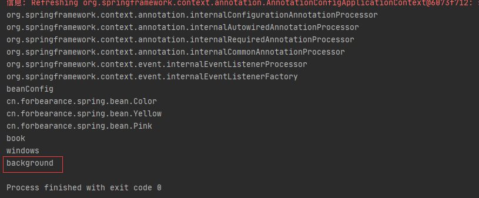

# 第9章：@Import-使用ImportBeanDefinitionRegistrar
## 是什么
### 概述
查看`ImportBeanDefinitionRegistrar`源码：
```java
package org.springframework.context.annotation;

import org.springframework.beans.factory.support.BeanDefinitionRegistry;
import org.springframework.beans.factory.support.BeanDefinitionRegistryPostProcessor;
import org.springframework.core.type.AnnotationMetadata;

/**
 * 由在处理配置类时注册附加 bean 定义的类型实现的接口。 在需要或必须在 bean 定义级别（相对于@Bean 方法/实例级别）操作时很有用。 
 *
 * Interface to be implemented by types that register additional bean definitions when
 * processing @{@link Configuration} classes. Useful when operating at the bean definition
 * level (as opposed to {@code @Bean} method/instance level) is desired or necessary.
 *
 * <p>Along with {@code @Configuration} and {@link ImportSelector}, classes of this type
 * may be provided to the @{@link Import} annotation (or may also be returned from an
 * {@code ImportSelector}).
 *
 * <p>An {@link ImportBeanDefinitionRegistrar} may implement any of the following
 * {@link org.springframework.beans.factory.Aware Aware} interfaces, and their respective
 * methods will be called prior to {@link #registerBeanDefinitions}:
 * <ul>
 * <li>{@link org.springframework.context.EnvironmentAware EnvironmentAware}</li>
 * <li>{@link org.springframework.beans.factory.BeanFactoryAware BeanFactoryAware}
 * <li>{@link org.springframework.beans.factory.BeanClassLoaderAware BeanClassLoaderAware}
 * <li>{@link org.springframework.context.ResourceLoaderAware ResourceLoaderAware}
 * </ul>
 *
 * <p>See implementations and associated unit tests for usage examples.
 *
 * @author Chris Beams
 * @since 3.1
 * @see Import
 * @see ImportSelector
 * @see Configuration
 */
public interface ImportBeanDefinitionRegistrar {

	/**
	 * Register bean definitions as necessary based on the given annotation metadata of
	 * the importing {@code @Configuration} class.
	 * <p>Note that {@link BeanDefinitionRegistryPostProcessor} types may <em>not</em> be
	 * registered here, due to lifecycle constraints related to {@code @Configuration}
	 * class processing.
	 * @param importingClassMetadata annotation metadata of the importing class
	 * @param registry current bean definition registry
	 */
	public void registerBeanDefinitions(
			AnnotationMetadata importingClassMetadata, BeanDefinitionRegistry registry);

}
```
`ImportBeanDefinitionRegistrar`是一个接口，包含一个`registerBeanDefinitions()`方法。通过该方法，能够向容器中注册bean示例。

Spring官方再动态注册bean时，大部分套路就是使用`ImportBeanDefinitionRegistrar`接口。

所有实现了`ImportBeanDefinitionRegistrar`接口的类都会被`ConfigurationClassPostProcessor`处理，而`ConfigurationClassPostProcessor`实现了`BeanFactoryPostProcessor`接口，
所以`ImportBeanDefinitionRegistrar`中的动态注册的bean是优先于bean初始化的，能够被aop、validator等机制处理。

和`BeanPostProcessor`原理一致，Spring提供了对`BeanFactory`进行操作的处理器`BeanFactoryPostProcessor`。简单来说就是获取容器`BeanFactory`，
然后在真正初始化bean之前对bean做一些处理。允许所有的bean在加载后初始化前，对所有的bean的属性进行修改。

## 能干嘛
## 去哪下
## 怎么玩
### 如何使用
要想`ImportBeanDefinitionRegistrar`能够使用，还需要配合`Configuration`注解和`@Import`注解。`Configuration`注解定义JavaConfig的Spring配置文件，
`@Import`注解导入ImportBeanDefinitionRegistrar实现类。
### 案例
定义一个名为`Background`的类：
```java
package cn.forbearance.spring.bean;

/**
 * @author cristina
 */
public class Background {
}
```
定义一个名为`CustomImportBeanDefinitionRegistrar`的类并实现`ImportBeanDefinitionRegistrar`接口：
```java
package cn.forbearance.spring.condition;

import cn.forbearance.spring.bean.Background;
import org.springframework.beans.factory.support.BeanDefinitionRegistry;
import org.springframework.beans.factory.support.RootBeanDefinition;
import org.springframework.context.annotation.ImportBeanDefinitionRegistrar;
import org.springframework.core.type.AnnotationMetadata;

/**
 * @author cristina
 */
public class CustomImportBeanDefinitionRegistrar implements ImportBeanDefinitionRegistrar {

    /**
     * 手动注册需要添加到容器中的bean
     * @param importingClassMetadata 当前类的注解信息
     * @param registry BeanDefinition注册类
     */
    @Override
    public void registerBeanDefinitions(AnnotationMetadata importingClassMetadata,
                                        BeanDefinitionRegistry registry) {
        boolean definition1 = registry.containsBeanDefinition("cn.forbearance.spring.bean.Color");
        boolean definition2 = registry.containsBeanDefinition("cn.forbearance.spring.bean.Pink");
        if (definition1 && definition2) {
            // 可以指定bean的定义信息：bean的类型、作用域等等
            // RootBeanDefinition是BeanDefinition接口的一个实现类
            // 创建一个单例的bean定义信息
            RootBeanDefinition beanDefinition = new RootBeanDefinition(Background.class);
            registry.registerBeanDefinition("background", beanDefinition);
        }
    }
}
```
如果同时存在以`cn.forbearance.spring.bean.Color`，`cn.forbearance.spring.bean.Pink`命名的bean，就向容器中注册名为background的bean。

配置类：
```java
package cn.forbearance.spring.config;

import cn.forbearance.spring.bean.Book;
import cn.forbearance.spring.bean.Color;
import cn.forbearance.spring.condition.CustomImportBeanDefinitionRegistrar;
import cn.forbearance.spring.condition.CustomImportSelector;
import cn.forbearance.spring.condition.LinuxCondition;
import cn.forbearance.spring.condition.WindowsCondition;
import org.springframework.context.annotation.*;

/**
 * @author cristina
 */
@Configuration
@Import({Color.class, CustomImportSelector.class, CustomImportBeanDefinitionRegistrar.class}) //
public class BeanConfig {

    @Lazy
    @Bean
    public Book book() {
        System.out.println("向Spring容器中注册组件");
        return new Book("forbearance.cn", 49);
    }

    @Conditional(WindowsCondition.class)
    @Bean(value = "windows")
    public Book book1() {
        return new Book("book1", 49);
    }

    @Conditional(LinuxCondition.class)
    @Bean(value = "linux")
    public Book book2() {
        return new Book("book2", 49);
    }
}
```
测试类：
```java
@Test
public void test01() {
    AnnotationConfigApplicationContext context = new AnnotationConfigApplicationContext(BeanConfig.class);
    String[] beanNames = context.getBeanDefinitionNames();
    for (String beanName : beanNames) {
        System.out.println(beanName);
    }
}
```
运行测试类：



`End`

## 小结
