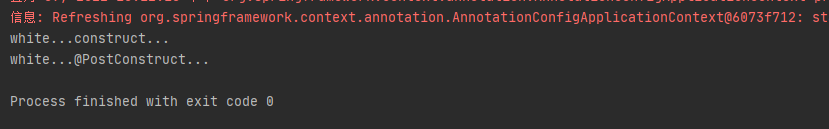

# 第13章：@PostConstruct&@PreDestroy
## 是什么
JDK提供了两个注解能够在bean创建并且属性赋值后执行初始化工作和在容器销毁bean之前执行销毁逻辑。这两个注解是JSR-250规范中定义的注解。而非Spring提供的。

### @PostConstruct概述
源码如下，省略了注释：
```java
/*
package javax.annotation;

import java.lang.annotation.*;
import static java.lang.annotation.ElementType.*;
import static java.lang.annotation.RetentionPolicy.*;

@Documented
@Retention (RUNTIME)
@Target(METHOD)
public @interface PostConstruct {
}
```
`@PostConstruct`注解被用来修饰一个非静态的 `void` 方法。被`@PostConstruct`修饰的方法会在服务器加载 Servlet 的时候运行，并且只会被服务器执行一次。而`@PostConstruct`修饰的方法修饰的方法通常在构造函数之后，`init()`方法之前执行。
> 执行顺序：Construct > @Autowired > @PostConstruct > InitializingBean > init-method

### @PreDestroy概述
```java
package javax.annotation;

import java.lang.annotation.*;
import static java.lang.annotation.ElementType.*;
import static java.lang.annotation.RetentionPolicy.*;

@Documented
@Retention (RUNTIME)
@Target(METHOD)
public @interface PreDestroy {
}
```
被`@PreDestroy`修饰的方法会在服务器卸载 Servlet 的时候执行，并且只会被服务器执行一次。
> 执行顺序：Servlet#destroy() > @PreDestroy > DisposableBean > destroy-method

`@Resource`注解也是JSR-250规范中定义的。
## 能干嘛
## 去哪下
## 怎么玩
#### 案例
定义一个名为`White`的类并创建两个方法分别指定@PostConstruct&@PreDestroy注解：
```java
package cn.forbearance.spring.bean;

import javax.annotation.PostConstruct;
import javax.annotation.PreDestroy;

/**
 * @author cristina
 */
public class White {

    public White() {
        System.out.println("white...construct...");
    }

    @PostConstruct
    public void init() {
        System.out.println("white...@PostConstruct...");
    }

    @PreDestroy
    public void destroy() {
        System.out.println("white...@PreDestroy...");
    }
}
```
配置类：
```java
@Configuration
public class BeanConfig {
    @Bean
    public White white() {
        return new White();
    }
}
```
运行测试类：



## 小结
