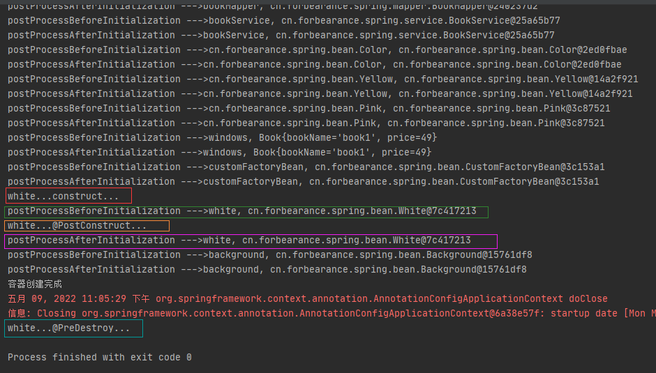

# 第14章：BeanPostProcessor后置处理器
## 是什么
### BeanPostProcessor概述
BeanPostProcessor 源码：
```java
package org.springframework.beans.factory.config;

import org.springframework.beans.BeansException;

/**
 * Factory hook that allows for custom modification of new bean instances,
 * e.g. checking for marker interfaces or wrapping them with proxies.
 *
 * <p>ApplicationContexts can autodetect BeanPostProcessor beans in their
 * bean definitions and apply them to any beans subsequently created.
 * Plain bean factories allow for programmatic registration of post-processors,
 * applying to all beans created through this factory.
 *
 * <p>Typically, post-processors that populate beans via marker interfaces
 * or the like will implement {@link #postProcessBeforeInitialization},
 * while post-processors that wrap beans with proxies will normally
 * implement {@link #postProcessAfterInitialization}.
 *
 * @author Juergen Hoeller
 * @since 10.10.2003
 * @see InstantiationAwareBeanPostProcessor
 * @see DestructionAwareBeanPostProcessor
 * @see ConfigurableBeanFactory#addBeanPostProcessor
 * @see BeanFactoryPostProcessor
 */
public interface BeanPostProcessor {

	Object postProcessBeforeInitialization(Object bean, String beanName) throws BeansException;

	Object postProcessAfterInitialization(Object bean, String beanName) throws BeansException;
}
```
`BeanPostProcessor`是一个接口，包含两个方法：`postProcessBeforeInitialization()`和`postProcessAfterInitialization()`。分别在bean初始化前后执行。所有实现了`BeanPostProcessor`接口的bean在bean的初始化前后都会执行`BeanPostProcessor`接口实现类的两个实现方法。

`postProcessBeforeInitialization()`方法会在bean创建和属性赋值之后，在初始化方法之前被调用，而`postProcessAfterInitialization()`方法会在初始化方法之后被调用。当容器中存在多个`BeanPostProcessor`接口实现类时，会按照在容器中注册的顺序执行。也可以实现`Ordered`接口实现自定义排序。
## 能干嘛
`BeanPostProcessor`后置处理器可用于bean初始化前后的逻辑增强，Spring本身就提供了很多实现类。比如`AutowiredAnnotationBeanPostProcessor`是`@Autowired`注解的实现、`AnnotationAwareAspectJAutoProxyCreator`是Spring AOP的动态代理的实现。

我们以`AnnotationAwareAspectJAutoProxyCreator`为例简单说明后置处理器如何工作。

Spring AOP的实现原理是动态代理，最终放入容器的是代理类对象，而非bean本身。这一步的执行是在`AnnotationAwareAspectJAutoProxyCreator#postProcessAfterInitialization()`，在bean初始化之后，后置处理器会判断该bean是否注册了切面。若是则生成代理对象注入到容器中。
```java
/**
 * Create a proxy with the configured interceptors if the bean is
 * identified as one to proxy by the subclass.
 * @see #getAdvicesAndAdvisorsForBean
 */
@Override
public Object postProcessAfterInitialization(Object bean, String beanName) throws BeansException {
    if (bean != null) {
        Object cacheKey = getCacheKey(bean.getClass(), beanName);
        if (!this.earlyProxyReferences.contains(cacheKey)) {
            return wrapIfNecessary(bean, beanName, cacheKey);
        }
    }
    return bean;
}
```

## 去哪下
官方文档：https://docs.spring.io/spring-framework/docs/current/reference/html/core.html#beans-factory-extension-bpp
## 怎么玩
### 案例
定义一个名为`CustomerBeanPostProcessor`的类并实现`BeanPostProcessor`接口：
```java
package cn.forbearance.spring.bean;

import org.springframework.beans.BeansException;
import org.springframework.beans.factory.config.BeanPostProcessor;
import org.springframework.stereotype.Component;

/**
 * @author cristina
 */
@Component
public class CustomerBeanPostProcessor implements BeanPostProcessor {

    @Override
    public Object postProcessBeforeInitialization(Object bean, String beanName) throws BeansException {
        System.out.println("postProcessBeforeInitialization --->" + beanName + ", " + bean);
        return bean;
    }

    @Override
    public Object postProcessAfterInitialization(Object bean, String beanName) throws BeansException {
        System.out.println("postProcessAfterInitialization --->" + beanName + ", " + bean);
        return bean;
    }
}
```
测试类：
```java
@Test
public void test01() {
    AnnotationConfigApplicationContext context = new AnnotationConfigApplicationContext(BeanConfig.class);
    System.out.println("容器创建完成");
    context.close();
}
```
运行测试类：



## 小结