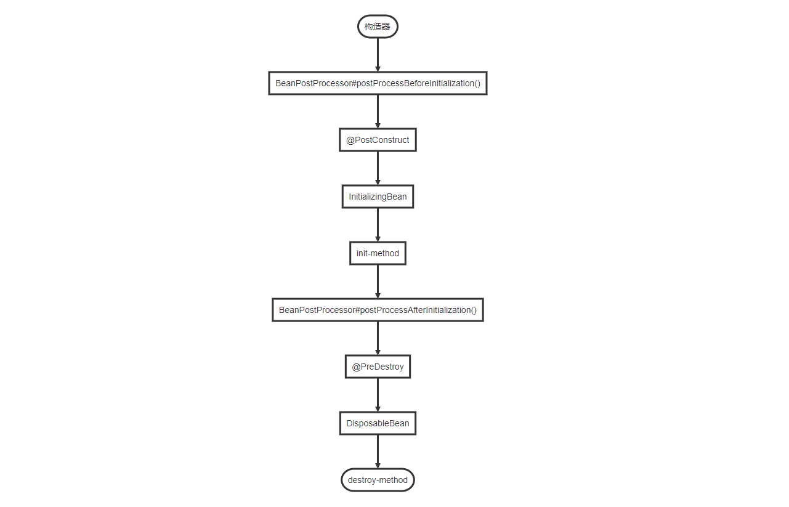

# 第15章：BeanPostProcessor原理
## bean的初始化和销毁的几种方式
1. `@Bean`注解指定`init-method`和`destroy-method`属性
2. 实现`InitializingBean`和`DisposableBean`接口
3. 使用JSR-250规范中的`@PreConstruct`和`@PreDestroy`注解
4. 实现`BeanPostProcessor`接口

### 执行顺序
如下的流程图已经描述了bean的整个生命周期。仅仅只是针对bean的初始化和销毁的这几种方式的执行顺序。省略了细节。



## BeanPostProcessor 源码解析
接下来将通过阅读Spring相关的源码来深入理解一下`BeanPostProcessor`的工作原理。

定位到`org.springframework.context.annotation.AnnotationConfigApplicationContext#AnnotationConfigApplicationContext`，81行<br/>
```java
/**
 * Create a new AnnotationConfigApplicationContext, deriving bean definitions
 * from the given annotated classes and automatically refreshing the context.
 * @param annotatedClasses one or more annotated classes,
 * e.g. {@link Configuration @Configuration} classes
 */
public AnnotationConfigApplicationContext(Class<?>... annotatedClasses) {
    this();
    register(annotatedClasses);
    // 核心方法
    refresh();
}
```
我们是可以通过调用`refresh()`方法重建，`refresh()`会将原来的`ApplicationContext`对象销毁，重新执行一次初始化操作。

定位到`org.springframework.context.support.AbstractApplicationContext#refresh`，509行
```java
@Override
public void refresh() throws BeansException, IllegalStateException {
    synchronized (this.startupShutdownMonitor) {
        /*
         准备工作：
            设置启动时间、是否激活标识位
            处理配置文件中的占位符
        */
        prepareRefresh();

        /*
         告诉子类刷新内部 bean 工厂。
         拿到DefaultListableBeanFactory对象，提供给后续方法调用
         将配置文件解析成一个个的bean定义，注册到BeanFactory中，这里bean并没有初始化，只是将bean信息保存到注册中心
         所谓注册中心，实际上就是一个Map集合：key=beanName，value=beanDefinition
        */
        ConfigurableListableBeanFactory beanFactory = obtainFreshBeanFactory();

        // 准备bean工厂
        prepareBeanFactory(beanFactory);

        try {
            /*
             如果 Bean 实现了 BeanFactoryPostProcessor 接口，那么在容器初始化以后，Spring 会调用 postProcessBeanFactory 方法
             这是提供给子类的扩展点，但是这个方法在当前版本中没有实现。
            */
            postProcessBeanFactory(beanFactory);

            // 实例化并调用所有已注册的 BeanFactoryPostProcessorBean 的 postProcessBeanFactory(factory) 回调方法
            invokeBeanFactoryPostProcessors(beanFactory);

            // 注册 BeanPostProcessor 的实现类
            registerBeanPostProcessors(beanFactory);

            // 国际化支持
            initMessageSource();

            // 初始化当前 ApplicationContext 的事件广播器
            initApplicationEventMulticaster();

            // 典型的模板方法(钩子方法)
            // 这个方法在当前版本没有实现
            onRefresh();

            // 注册事件监听器，监听器需要实现 ApplicationListener 接口
            registerListeners();

            // 初始化所有的 singleton beans. （lazy-init 除外）
            finishBeanFactoryInitialization(beanFactory);

            // 广播事件，ApplicationContext 初始化完成
            finishRefresh();
        }
        ... ...
    }
}
```
定位到`org.springframework.context.support.AbstractApplicationContext#finishBeanFactoryInitialization`，834行：

到这一步，`BeanFactory` 已经创建完成，并且所有实现了`BeanFactoryPostProcessor`接口的`Bean`都已经初始化并且`postProcessBeanFactory(factory)`方法已经得到回调执行。Spring 也已经注册了一些特殊的 Bean，`environment`、`systemProperties`等

接下来，如果没有设置懒加载，Spring 会初始化所有的 singleton beans：
```java
protected void finishBeanFactoryInitialization(ConfigurableListableBeanFactory beanFactory) {
    /*
     初始化名称为conversionService的bean
    */
    if (beanFactory.containsBean(CONVERSION_SERVICE_BEAN_NAME) &&
            beanFactory.isTypeMatch(CONVERSION_SERVICE_BEAN_NAME, ConversionService.class)) {
        beanFactory.setConversionService(
                beanFactory.getBean(CONVERSION_SERVICE_BEAN_NAME, ConversionService.class));
    }

    // Register a default embedded value resolver if no bean post-processor
    // (such as a PropertyPlaceholderConfigurer bean) registered any before:
    // at this point, primarily for resolution in annotation attribute values.
    if (!beanFactory.hasEmbeddedValueResolver()) {
        beanFactory.addEmbeddedValueResolver(new StringValueResolver() {
            @Override
            public String resolveStringValue(String strVal) {
                return getEnvironment().resolvePlaceholders(strVal);
            }
        });
    }

    // 初始化LoadTimeWeaverAware类型的bean
    // 这是AspectJ的相关内容
    String[] weaverAwareNames = beanFactory.getBeanNamesForType(LoadTimeWeaverAware.class, false, false);
    for (String weaverAwareName : weaverAwareNames) {
        getBean(weaverAwareName);
    }

    // Stop using the temporary ClassLoader for type matching.
    beanFactory.setTempClassLoader(null);

    // 冻结所有bean定义，已注册的bean定义将不会被进一步修改或后处理.
    beanFactory.freezeConfiguration();

    // 开始初始化
    beanFactory.preInstantiateSingletons();
}
```
定位到`org.springframework.beans.factory.support.DefaultListableBeanFactory#preInstantiateSingletons`，728行：
```java
@Override
public void preInstantiateSingletons() throws BeansException {
    if (this.logger.isDebugEnabled()) {
        this.logger.debug("Pre-instantiating singletons in " + this);
    }

    // this.beanDefinitionNames保存了所有的beanNames
    List<String> beanNames = new ArrayList<String>(this.beanDefinitionNames);

    // 循环触发所有非懒加载的 singleton beans 的初始化操作
    for (String beanName : beanNames) {
    
        // 合并父 Bean 中的配置 <bean id="" class="" parent="" />
        RootBeanDefinition bd = getMergedLocalBeanDefinition(beanName);
        
        // 非抽象、非懒加载的 singletons，如果配置了 'abstract=true'，那是不需要初始化的
        if (!bd.isAbstract() && bd.isSingleton() && !bd.isLazyInit()) {
            // 处理FactoryBean
            if (isFactoryBean(beanName)) {
                // 得到的是FactoryBean对象本身的实例，而非工厂管理的对象的实例
                final FactoryBean<?> factory = (FactoryBean<?>) getBean(FACTORY_BEAN_PREFIX + beanName);
                // 判断当前FactoryBean是不是SmartFactoryBean的实现类
                boolean isEagerInit;
                if (System.getSecurityManager() != null && factory instanceof SmartFactoryBean) {
                    isEagerInit = AccessController.doPrivileged(new PrivilegedAction<Boolean>() {
                        @Override
                        public Boolean run() {
                            return ((SmartFactoryBean<?>) factory).isEagerInit();
                        }
                    }, getAccessControlContext());
                }
                else {
                    isEagerInit = (factory instanceof SmartFactoryBean &&
                            ((SmartFactoryBean<?>) factory).isEagerInit());
                }
                if (isEagerInit) {
                    getBean(beanName);
                }
            }
            else {
                // 对于普通的beanm，调用getBean(beanName)方法就可以进行初始化了，
                getBean(beanName);
            }
        }
    }

    // 到这里说明所有的非懒加载的 singleton beans 已经完成了初始化，如果我们定义的bean实现了SmartInitializingSingleton接口，在这里会得到回调
    for (String beanName : beanNames) {
        Object singletonInstance = getSingleton(beanName);
        if (singletonInstance instanceof SmartInitializingSingleton) {
            final SmartInitializingSingleton smartSingleton = (SmartInitializingSingleton) singletonInstance;
            if (System.getSecurityManager() != null) {
                AccessController.doPrivileged(new PrivilegedAction<Object>() {
                    @Override
                    public Object run() {
                        smartSingleton.afterSingletonsInstantiated();
                        return null;
                    }
                }, getAccessControlContext());
            }
            else {
                smartSingleton.afterSingletonsInstantiated();
            }
        }
    }
}
```
接下来，我们进入到`getBean(beanName)`方法内部，这个方法经常用来从`BeanFactory`中获取一个bean，
而初始化的过程也封装在这里面定位到`org.springframework.beans.factory.support.AbstractBeanFactory#getBean`，196行：
```java
@Override
public Object getBean(String name) throws BeansException {
    return doGetBean(name, null, null, false);
}


// 已经初始化过的从容器中直接返回，否则就先初始化再返回
@SuppressWarnings("unchecked")
protected <T> T doGetBean(
        final String name, final Class<T> requiredType, final Object[] args, boolean typeCheckOnly)
        throws BeansException {

    // 处理(前面带'&')的FactoryBean、以及别名问题，获取到'正统的'beanName
    final String beanName = transformedBeanName(name);
    // 返回值
    Object bean;

    // 检查是否已经创建过了
    Object sharedInstance = getSingleton(beanName);
    // 如果args不为空的时候，意味着调用方不是希望获取bean，而是创建bean
    if (sharedInstance != null && args == null) {
        if (logger.isDebugEnabled()) {
            if (isSingletonCurrentlyInCreation(beanName)) {
                logger.debug("Returning eagerly cached instance of singleton bean '" + beanName +
                        "' that is not fully initialized yet - a consequence of a circular reference");
            }
            else {
                logger.debug("Returning cached instance of singleton bean '" + beanName + "'");
            }
        }
        // 如果是普通的bean，返回sharedInstance即可
        // 如果是FactoryBean，返回它创建的那个实例对象
        bean = getObjectForBeanInstance(sharedInstance, name, beanName, null);
    }

    else {
        if (isPrototypeCurrentlyInCreation(beanName)) {
            // 创建过了此beanName的prototype类型的bean，则抛异常。
            // 往往是因为陷入了循环引用
            throw new BeanCurrentlyInCreationException(beanName);
        }

        // 检查这个BeanDefinition在容器中是否存在
        BeanFactory parentBeanFactory = getParentBeanFactory();
        if (parentBeanFactory != null && !containsBeanDefinition(beanName)) {
            // 如果当前容器不存在这个BeanDefinition，检查父容器中有没有
            String nameToLookup = originalBeanName(name);
            if (args != null) {
                // 返回父容器的查询结果
                return (T) parentBeanFactory.getBean(nameToLookup, args);
            }
            else {
                // No args -> delegate to standard getBean method.
                return parentBeanFactory.getBean(nameToLookup, requiredType);
            }
        }

        if (!typeCheckOnly) {
            // typeCheckOnly为false，将当前beanName放入到一个alreadyCreated的set集合中
            markBeanAsCreated(beanName);
        }

        // 准备创建bean，对于singleton的bean来说，容器中还没有创建过此bean
        // 对于prototype的bean来说，本来就是要创建一个新的bean
        try {
            final RootBeanDefinition mbd = getMergedLocalBeanDefinition(beanName);
            checkMergedBeanDefinition(mbd, beanName, args);

            // 先初始化依赖的所有bean，即 depends-on 中定义的依赖
            String[] dependsOn = mbd.getDependsOn();
            if (dependsOn != null) {
                for (String dep : dependsOn) {
                    // 检查是否有循环依赖
                    if (isDependent(beanName, dep)) {
                        throw new BeanCreationException(mbd.getResourceDescription(), beanName,
                                "Circular depends-on relationship between '" + beanName + "' and '" + dep + "'");
                    }
                    // 注册依赖关系
                    registerDependentBean(dep, beanName);
                    // 先初始化被依赖项
                    getBean(dep);
                }
            }

            // 如果是 singleton scope，创建 singleton beans 实例
            if (mbd.isSingleton()) {
                sharedInstance = getSingleton(beanName, new ObjectFactory<Object>() {
                    @Override
                    public Object getObject() throws BeansException {
                        try {
                            // 执行创建 bean
                            return createBean(beanName, mbd, args);
                        }
                        catch (BeansException ex) {
                            // Explicitly remove instance from singleton cache: It might have been put there
                            // eagerly by the creation process, to allow for circular reference resolution.
                            // Also remove any beans that received a temporary reference to the bean.
                            destroySingleton(beanName);
                            throw ex;
                        }
                    }
                });
                bean = getObjectForBeanInstance(sharedInstance, name, beanName, mbd);
            }
                 
            // 如果是 prototype scope，创建 prototype beans 实例
            else if (mbd.isPrototype()) {
                // It's a prototype -> create a new instance.
                Object prototypeInstance = null;
                try {
                    beforePrototypeCreation(beanName);
                    // 执行创建 bean
                    prototypeInstance = createBean(beanName, mbd, args);
                }
                finally {
                    afterPrototypeCreation(beanName);
                }
                bean = getObjectForBeanInstance(prototypeInstance, name, beanName, mbd);
            }

            // 如果不是 singleton 和 prototype，则需要委托给对应的是实现类来实现
            else {
                String scopeName = mbd.getScope();
                final Scope scope = this.scopes.get(scopeName);
                if (scope == null) {
                    throw new IllegalStateException("No Scope registered for scope name '" + scopeName + "'");
                }
                try {
                    Object scopedInstance = scope.get(beanName, new ObjectFactory<Object>() {
                        @Override
                        public Object getObject() throws BeansException {
                            beforePrototypeCreation(beanName);
                            try {
                                // 执行创建 bean
                                return createBean(beanName, mbd, args);
                            }
                            finally {
                                afterPrototypeCreation(beanName);
                            }
                        }
                    });
                    bean = getObjectForBeanInstance(scopedInstance, name, beanName, mbd);
                }
                catch (IllegalStateException ex) {
                    throw new BeanCreationException(beanName,
                            "Scope '" + scopeName + "' is not active for the current thread; consider " +
                            "defining a scoped proxy for this bean if you intend to refer to it from a singleton",
                            ex);
                }
            }
        }
        catch (BeansException ex) {
            cleanupAfterBeanCreationFailure(beanName);
            throw ex;
        }
    }

    //最后，检查一下类型对不对，不对就抛异常，对就返回
    if (requiredType != null && bean != null && !requiredType.isInstance(bean)) {
        try {
            return getTypeConverter().convertIfNecessary(bean, requiredType);
        }
        catch (TypeMismatchException ex) {
            if (logger.isDebugEnabled()) {
                logger.debug("Failed to convert bean '" + name + "' to required type '" +
                        ClassUtils.getQualifiedName(requiredType) + "'", ex);
            }
            throw new BeanNotOfRequiredTypeException(name, requiredType, bean.getClass());
        }
    }
    return (T) bean;
}
```
定位`org.springframework.beans.factory.support.AbstractAutowireCapableBeanFactory#createBean`，447行

看类名，`AbstractAutowireCapableBeanFactory`，AutowireCapable，是不是能说明点问题，主要是为了利用注解注入属性值，比如`@Autowired`。

```java
/**
 * Central method of this class: creates a bean instance,
 * populates the bean instance, applies post-processors, etc.
 * @see #doCreateBean
 */
@Override
protected Object createBean(String beanName, RootBeanDefinition mbd, Object[] args) throws BeanCreationException {
    if (logger.isDebugEnabled()) {
        logger.debug("Creating instance of bean '" + beanName + "'");
    }
    RootBeanDefinition mbdToUse = mbd;

    // 确保BeanDefinition中的Class被加载
    Class<?> resolvedClass = resolveBeanClass(mbd, beanName);
    if (resolvedClass != null && !mbd.hasBeanClass() && mbd.getBeanClassName() != null) {
        mbdToUse = new RootBeanDefinition(mbd);
        mbdToUse.setBeanClass(resolvedClass);
    }

    // 准备方法复写，涉及到一个概念：MethodOverrides，它来自于bean定义中的<lookup-method/>和<replaced-method/>标签
    try {
        mbdToUse.prepareMethodOverrides();
    }
    catch (BeanDefinitionValidationException ex) {
        throw new BeanDefinitionStoreException(mbdToUse.getResourceDescription(),
                beanName, "Validation of method overrides failed", ex);
    }

    try {
        // 让InstantiationAwareBeanPostProcessor在这一步有机会返回代理
        Object bean = resolveBeforeInstantiation(beanName, mbdToUse);
        if (bean != null) {
            return bean;
        }
    }
    catch (Throwable ex) {
        throw new BeanCreationException(mbdToUse.getResourceDescription(), beanName,
                "BeanPostProcessor before instantiation of bean failed", ex);
    }
    // 创建bean
    Object beanInstance = doCreateBean(beanName, mbdToUse, args);
    if (logger.isDebugEnabled()) {
        logger.debug("Finished creating instance of bean '" + beanName + "'");
    }
    return beanInstance;
}
```
方法复写，MethodOverrides，方法注入的另一种解决方案，一种实现方式是实现`ApplicationContextAware`接口
- 可以用`<lookup-method/>`来取代`ApplicationContextAware`接口
- `<lookup-method/>`会覆盖指定名称的所有同名方法，如果想要覆盖指定的重载方法，可以使用`<replaced-method/>`

定位`org.springframework.beans.factory.support.AbstractAutowireCapableBeanFactory#doCreateBean`，504行
```java
/**
 * Actually create the specified bean. Pre-creation processing has already happened
 * at this point, e.g. checking {@code postProcessBeforeInstantiation} callbacks.
 * <p>Differentiates between default bean instantiation, use of a
 * factory method, and autowiring a constructor.
 * @param beanName the name of the bean
 * @param mbd the merged bean definition for the bean
 * @param args explicit arguments to use for constructor or factory method invocation
 * @return a new instance of the bean
 * @throws BeanCreationException if the bean could not be created
 * @see #instantiateBean
 * @see #instantiateUsingFactoryMethod
 * @see #autowireConstructor
 */
protected Object doCreateBean(final String beanName, final RootBeanDefinition mbd, final Object[] args)
        throws BeanCreationException {

    // Instantiate the bean.
    BeanWrapper instanceWrapper = null;
    if (mbd.isSingleton()) {
        instanceWrapper = this.factoryBeanInstanceCache.remove(beanName);
    }
    if (instanceWrapper == null) {
        // 如果不是FactoryBean，这里实例化bean
        instanceWrapper = createBeanInstance(beanName, mbd, args);
    }
    // bean实例
    final Object bean = (instanceWrapper != null ? instanceWrapper.getWrappedInstance() : null);
    // 类型
    Class<?> beanType = (instanceWrapper != null ? instanceWrapper.getWrappedClass() : null);
    mbd.resolvedTargetType = beanType;

    // Allow post-processors to modify the merged bean definition.
    // 涉及 MergedBeanDefinitionPostProcessor 接口
    synchronized (mbd.postProcessingLock) {
        if (!mbd.postProcessed) {
            try {
                // MergedBeanDefinitionPostProcessor
                applyMergedBeanDefinitionPostProcessors(mbd, beanType, beanName);
            }
            catch (Throwable ex) {
                throw new BeanCreationException(mbd.getResourceDescription(), beanName,
                        "Post-processing of merged bean definition failed", ex);
            }
            mbd.postProcessed = true;
        }
    }

    // Eagerly cache singletons to be able to resolve circular references
    // even when triggered by lifecycle interfaces like BeanFactoryAware.
    // 解决循环依赖
    boolean earlySingletonExposure = (mbd.isSingleton() && this.allowCircularReferences &&
            isSingletonCurrentlyInCreation(beanName));
    if (earlySingletonExposure) {
        if (logger.isDebugEnabled()) {
            logger.debug("Eagerly caching bean '" + beanName +
                    "' to allow for resolving potential circular references");
        }
        addSingletonFactory(beanName, new ObjectFactory<Object>() {
            @Override
            public Object getObject() throws BeansException {
                return getEarlyBeanReference(beanName, mbd, bean);
            }
        });
    }

    // Initialize the bean instance.
    Object exposedObject = bean;
    try {
        // 依赖注入，前面bean只是实例化了但没有赋值，这里是属性赋值
        populateBean(beanName, mbd, instanceWrapper);
        if (exposedObject != null) {
            // 初始化，包括BeanPostProcessor，InitializingBean以及init-method都会在这里得到执行，
            exposedObject = initializeBean(beanName, exposedObject, mbd);
        }
    }
    catch (Throwable ex) {
        if (ex instanceof BeanCreationException && beanName.equals(((BeanCreationException) ex).getBeanName())) {
            throw (BeanCreationException) ex;
        }
        else {
            throw new BeanCreationException(
                    mbd.getResourceDescription(), beanName, "Initialization of bean failed", ex);
        }
    }

    if (earlySingletonExposure) {
        Object earlySingletonReference = getSingleton(beanName, false);
        // earlySingletonReference只有在检测到有循环依赖的情况才会不为空
        if (earlySingletonReference != null) {
            if (exposedObject == bean) {
                exposedObject = earlySingletonReference;
            }
            else if (!this.allowRawInjectionDespiteWrapping && hasDependentBean(beanName)) {
                String[] dependentBeans = getDependentBeans(beanName);
                Set<String> actualDependentBeans = new LinkedHashSet<String>(dependentBeans.length);
                // 检查依赖
                for (String dependentBean : dependentBeans) {
                    if (!removeSingletonIfCreatedForTypeCheckOnly(dependentBean)) {
                        actualDependentBeans.add(dependentBean);
                    }
                }
                // actualDependentBeans不为空表示当前bean创建后，其依赖的bean没有全部创建，存在循环依赖
                if (!actualDependentBeans.isEmpty()) {
                    throw new BeanCurrentlyInCreationException(beanName,
                            "Bean with name '" + beanName + "' has been injected into other beans [" +
                            StringUtils.collectionToCommaDelimitedString(actualDependentBeans) +
                            "] in its raw version as part of a circular reference, but has eventually been " +
                            "wrapped. This means that said other beans do not use the final version of the " +
                            "bean. This is often the result of over-eager type matching - consider using " +
                            "'getBeanNamesOfType' with the 'allowEagerInit' flag turned off, for example.");
                }
            }
        }
    }

    // Register bean as disposable.
    // 注册销毁方法，DisposableBean和destroy-method
    try {
        registerDisposableBeanIfNecessary(beanName, bean, mbd);
    }
    catch (BeanDefinitionValidationException ex) {
        throw new BeanCreationException(
                mbd.getResourceDescription(), beanName, "Invalid destruction signature", ex);
    }

    return exposedObject;
}
```
到这里，整个初始化流程应该结束了。接下来我们说一下回调方法 initializeBean。

定位`org.springframework.beans.factory.support.AbstractAutowireCapableBeanFactory#initializeBean`，1604行：
```java
protected Object initializeBean(final String beanName, final Object bean, RootBeanDefinition mbd) {
    if (System.getSecurityManager() != null) {
        AccessController.doPrivileged(new PrivilegedAction<Object>() {
            @Override
            public Object run() {
                invokeAwareMethods(beanName, bean);
                return null;
            }
        }, getAccessControlContext());
    }
    else {
        // 特殊通知，如果bean实现了BeanNameAware、BeanClassLoaderAware或BeanFactoryAware接口，回调方法
        invokeAwareMethods(beanName, bean);
    }

    Object wrappedBean = bean;
    if (mbd == null || !mbd.isSynthetic()) {
        // BeanPostProcessor#postProcessBeforeInitialization() 回调方法
        wrappedBean = applyBeanPostProcessorsBeforeInitialization(wrappedBean, beanName);
    }

    try {
        // 处理bean中定义的init-method
        // 如果bean实现了InitializingBean接口，调用afterPropertiesSet()方法，
        // 两者可以同时存在
        invokeInitMethods(beanName, wrappedBean, mbd);
    }
    catch (Throwable ex) {
        throw new BeanCreationException(
                (mbd != null ? mbd.getResourceDescription() : null),
                beanName, "Invocation of init method failed", ex);
    }

    if (mbd == null || !mbd.isSynthetic()) {
        // BeanPostProcessor#postProcessAfterInitialization() 回调方法
        wrappedBean = applyBeanPostProcessorsAfterInitialization(wrappedBean, beanName);
    }
    return wrappedBean;
}   
```
`@PostConstruct`的Spring实现就是利用`BeanPostProcessor#postProcessBeforeInitialization()`方法实现的。

`BeanPostProcessor`有个是实现类`org.springframework.context.annotation.CommonAnnotationBeanPostProcessor`用于处理`@PostConstruct`和`@PreDestroy`注解，它有个父类`org.springframework.beans.factory.annotation.InitDestroyAnnotationBeanPostProcessor`提供具体的实现：
```java
// org.springframework.beans.factory.annotation.InitDestroyAnnotationBeanPostProcessor#postProcessBeforeInitialization 131行
@Override
public Object postProcessBeforeInitialization(Object bean, String beanName) throws BeansException {
    // 找到使用@PostConstruct或@PreDestroy的方法
    LifecycleMetadata metadata = findLifecycleMetadata(bean.getClass());
    try {
        // 反射调用
        metadata.invokeInitMethods(bean, beanName);
    }
    catch (InvocationTargetException ex) {
        throw new BeanCreationException(beanName, "Invocation of init method failed", ex.getTargetException());
    }
    catch (Throwable ex) {
        throw new BeanCreationException(beanName, "Failed to invoke init method", ex);
    }
    return bean;
}

// org.springframework.beans.factory.annotation.InitDestroyAnnotationBeanPostProcessor#findLifecycleMetadata 176行
private LifecycleMetadata findLifecycleMetadata(Class<?> clazz) {
    if (this.lifecycleMetadataCache == null) {
        // Happens after deserialization, during destruction...
        return buildLifecycleMetadata(clazz);
    }
    // Quick check on the concurrent map first, with minimal locking.
    LifecycleMetadata metadata = this.lifecycleMetadataCache.get(clazz);
    if (metadata == null) {
        synchronized (this.lifecycleMetadataCache) {
            metadata = this.lifecycleMetadataCache.get(clazz);
            if (metadata == null) {
                metadata = buildLifecycleMetadata(clazz);
                this.lifecycleMetadataCache.put(clazz, metadata);
            }
            return metadata;
        }
    }
    return metadata;
}

// org.springframework.beans.factory.annotation.InitDestroyAnnotationBeanPostProcessor#buildLifecycleMetadata 196行
private LifecycleMetadata buildLifecycleMetadata(final Class<?> clazz) {
    final boolean debug = logger.isDebugEnabled();
    LinkedList<LifecycleElement> initMethods = new LinkedList<LifecycleElement>();
    LinkedList<LifecycleElement> destroyMethods = new LinkedList<LifecycleElement>();
    Class<?> targetClass = clazz;

    do {
        final LinkedList<LifecycleElement> currInitMethods = new LinkedList<LifecycleElement>();
        final LinkedList<LifecycleElement> currDestroyMethods = new LinkedList<LifecycleElement>();

        ReflectionUtils.doWithLocalMethods(targetClass, new ReflectionUtils.MethodCallback() {
            @Override
            public void doWith(Method method) throws IllegalArgumentException, IllegalAccessException {
                // 查找@PostConstruct注解的方法 
                if (initAnnotationType != null) {
                    if (method.getAnnotation(initAnnotationType) != null) {
                        LifecycleElement element = new LifecycleElement(method);
                        currInitMethods.add(element);
                        if (debug) {
                            logger.debug("Found init method on class [" + clazz.getName() + "]: " + method);
                        }
                    }
                }
                // 查找@PreDestroy注解方法 
                if (destroyAnnotationType != null) {
                    if (method.getAnnotation(destroyAnnotationType) != null) {
                        currDestroyMethods.add(new LifecycleElement(method));
                        if (debug) {
                            logger.debug("Found destroy method on class [" + clazz.getName() + "]: " + method);
                        }
                    }
                }
            }
        });

        initMethods.addAll(0, currInitMethods);
        destroyMethods.addAll(currDestroyMethods);
        targetClass = targetClass.getSuperclass();
    }
    while (targetClass != null && targetClass != Object.class);

    return new LifecycleMetadata(clazz, initMethods, destroyMethods);
}
```
`@PostConstruct`和`@PreDestroy`注解实在 Java1.5被引入的，Java 9 开始被废弃，并计划再Java 11 将其删除，不建议再使用。可使用`InitializingBean`和`DisposableBean`代替。
> 虽然`@PostConstruct`注解约定一个类中只有一个方法可以用此注解进行标注，但是Spring没有遵守该约定，在Spring中同一个类定义多个方法并标注`@PostConstruct`注解，都会得到执行。😜约定有时候就是用来打破的！

## 总结
简化一下`doCreateBean()`关键代码的调用过程：
```java
createBeanInstance(beanName, mbd, args); // 实例化bean
populateBean(beanName, mbd, instanceWrapper); //属性赋值
initializeBean(beanName, exposedObject, mbd){
    wrappedBean = applyBeanPostProcessorsBeforeInitialization(wrappedBean, beanName);
    invokeInitMethods(beanName, wrappedBean, mbd); // InitializingBean、init-method
    wrappedBean = applyBeanPostProcessorsAfterInitialization(wrappedBean, beanName);
}
registerDisposableBeanIfNecessary(beanName, bean, mbd); // DisposableBean、destroy-method
```
至此，bean的初始化过程就结束了。

