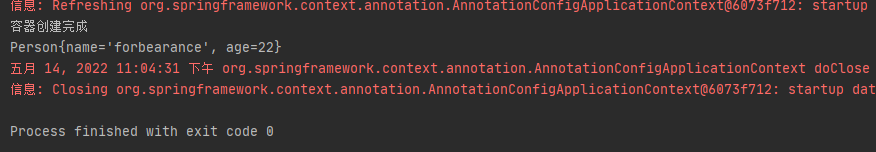

# 第17章：@Value赋值

## 是什么
```java
@Target({ElementType.FIELD, ElementType.METHOD, ElementType.PARAMETER, ElementType.ANNOTATION_TYPE})
@Retention(RetentionPolicy.RUNTIME)
@Documented
public @interface Value {

	/**
	 * The actual value expression: e.g. "#{systemProperties.myProp}".
	 */
	String value();

}
```
`@Value`注解可以标注在字段、方法、参数以及注解上。
## 能干嘛
### @Value的用法
#### #{}的用法
`#{}`用于执行SpEl表达式，并将内容赋值给属性。
```java
@Value("forbearance")
private String name;

@Value("#{systemProperties['os.name']}")
private String osName;

// SpEl表达式
@Value("#{'Hello World'.concat('!')}")
private String str;
```
#### ${}的用法
`${}`主要用于加载外部配置文件中的值。如果获取的key不存在，会报错。则可以不存在时赋予默认值，如下所示：
```java
@Value("${person.name:forbearance}")
private String name;
```
#### #{}和${}的混合使用
`#{}`和`${}`如果一起使用，必须`#{}`在外层，`${}`在内层。Spring执行`${}`的时机要早于`#{}`，当Spring执行外层的`${}`时，内部的`#{}`为空，所以会执行失败！
```java
@Value("#{'${server.name}'.split(',')}")
private List<String> severs;
```
上面片段的代码的执行顺序：通过`${server.name}`从属性文件中获取值并进行替换，然后就变成了执行SpEL表达式`{'server1,server2,server3'.split(',')}`。
## 去哪下
官方文档：https://docs.spring.io/spring-framework/docs/current/reference/html/core.html#beans-value-annotations
## 怎么玩
定义一个名为`Perosn`的类：
```java
package cn.forbearance.spring.bean;

import org.springframework.beans.factory.annotation.Value;

/**
 * @author cristina
 */
public class Person {

    @Value("${person.name}")
    private String name;

    @Value("#{22}")
    private Integer age;

    public Person() {
    }

    public String getName() {
        return name;
    }

    public void setName(String name) {
        this.name = name;
    }

    public Integer getAge() {
        return age;
    }

    public void setAge(Integer age) {
        this.age = age;
    }

    @Override
    public String toString() {
        return "Person{" +
                "name='" + name + '\'' +
                ", age=" + age +
                '}';
    }
}
```
定义一个配置文件`application.properties`：
```properties
person.name=forbearance
```
配置类：
```java
package cn.forbearance.spring.config;

import cn.forbearance.spring.bean.Person;
import org.springframework.context.annotation.Bean;
import org.springframework.context.annotation.Configuration;
import org.springframework.context.annotation.PropertySource;

/**
 * @author cristina
 */
@Configuration
@PropertySource("classpath:/application.properties")
public class BeanConfig {

    @Bean
    public Person person() {
        return new Person();
    }
}
```
测试类：
```java
@Test
public void test01() {
    AnnotationConfigApplicationContext context = new AnnotationConfigApplicationContext(BeanConfig.class);
    System.out.println("容器创建完成");
    Person person = (Person) context.getBean("person");
    System.out.println(person);
    context.close();
}
```
运行测试类：



通过注解方式的注入实现了，那xml配置文件放大方式如何实现呢？如下所示：
```xml
<!-- 向Spring容器中注册组件 -->
<bean id="book" class="cn.forbearance.spring.bean.Person">
    <property name="name" value="forbearance"></property>
    <property name="age" value="22"></property>
</bean>
```
## 小结
通过`@Value`注解将外部的值动态注入到bean的属性中：
1. 注入普通的值
    ```java
    @Value("forbearance")
    private String name; 
    ```
2. 注入操作系统属性
   ```java
   @Value("#{systemProperties['os.name']}")
   private String systemPropertiesName; 
   ```
3. 注入SpEl表达式
   ```java
   @Value("#{ T(java.lang.Math).random() * 100.0 }")
   private double randomNumber; 
   ```
4. 注入其他bean属性的值
   ```java
   @Value("#{person.name}")
   private String username;
   ```
5. 注入文件资源
   ```java
   @Value("classpath:/config.properties")
   private Resource resourceFile;
   ```
6. 注入URL资源
   ```java
   @Value("https://www.baidu.com")
   private Resource url;
   ```