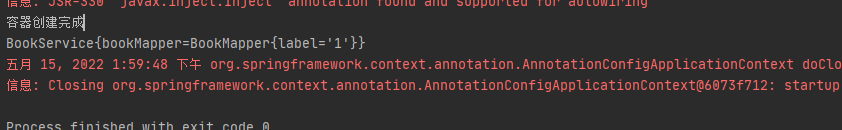
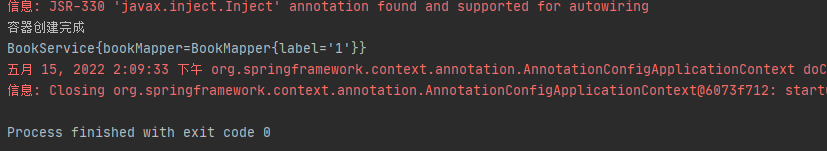

# 第20章：@Resource&@Inject

## 是什么
### @Resource
定位到`javax.annotation.Resource`
```java
@Target({TYPE, FIELD, METHOD})
@Retention(RUNTIME)
public @interface Resource {
    /**
     * The JNDI name of the resource.  For field annotations,
     * the default is the field name.  For method annotations,
     * the default is the JavaBeans property name corresponding
     * to the method.  For class annotations, there is no default
     * and this must be specified.
     */
    String name() default "";

    /**
     * The name of the resource that the reference points to. It can
     * link to any compatible resource using the global JNDI names.
     *
     * @since Common Annotations 1.1
     */

    String lookup() default "";

    /**
     * The Java type of the resource.  For field annotations,
     * the default is the type of the field.  For method annotations,
     * the default is the type of the JavaBeans property.
     * For class annotations, there is no default and this must be
     * specified.
     */
    Class<?> type() default java.lang.Object.class;

    /**
     * The two possible authentication types for a resource.
     */
    enum AuthenticationType {
            CONTAINER,
            APPLICATION
    }

    /**
     * The authentication type to use for this resource.
     * This may be specified for resources representing a
     * connection factory of any supported type, and must
     * not be specified for resources of other types.
     */
    AuthenticationType authenticationType() default AuthenticationType.CONTAINER;

    /**
     * Indicates whether this resource can be shared between
     * this component and other components.
     * This may be specified for resources representing a
     * connection factory of any supported type, and must
     * not be specified for resources of other types.
     */
    boolean shareable() default true;

    /**
     * A product specific name that this resource should be mapped to.
     * The name of this resource, as defined by the <code>name</code>
     * element or defaulted, is a name that is local to the application
     * component using the resource.  (It's a name in the JNDI
     * <code>java:comp/env</code> namespace.)  Many application servers
     * provide a way to map these local names to names of resources
     * known to the application server.  This mapped name is often a
     * <i>global</i> JNDI name, but may be a name of any form. <p>
     *
     * Application servers are not required to support any particular
     * form or type of mapped name, nor the ability to use mapped names.
     * The mapped name is product-dependent and often installation-dependent.
     * No use of a mapped name is portable.
     */
    String mappedName() default "";

    /**
     * Description of this resource.  The description is expected
     * to be in the default language of the system on which the
     * application is deployed.  The description can be presented
     * to the Deployer to help in choosing the correct resource.
     */
    String description() default "";
}
```
可以标注在类、接口、枚举、方法以及字段上。

`@Resource`注解是JSR250规范中定义的注解。该注解默认按照名称装配，如果没有指定名称装配，当标注在成员变量上，默认取成员变量名作为组件的名称去容器中查找。如果注解标注在setter方法上， 默认取参数名称进行装配，如果名称匹配找不到，则会按照属性的参数类型进行匹配。

### @Inject
需要导入依赖：
```xml
<dependency>
    <groupId>javax.inject</groupId>
    <artifactId>javax.inject</artifactId>
    <version>1</version>
</dependency>
```
定位到`javax.inject.Inject`
```java
@Target({ METHOD, CONSTRUCTOR, FIELD })
@Retention(RUNTIME)
@Documented
public @interface Inject {}
```

可以标注在方法、构造器以及成员变量上。

`@Inject`是JSR330规范中的注解。该注解默认按照名称注入bean，且支持`@Primary`注解优先注入。还可以增加`@Named`注解指定要注入的bean

## 能干嘛
## 去哪下
## 怎么玩
### @Resource
定义一个名为BookService的类：
```java
package cn.forbearance.spring.service;

import cn.forbearance.spring.mapper.BookMapper;
import org.springframework.beans.factory.annotation.Autowired;
import org.springframework.beans.factory.annotation.Qualifier;
import org.springframework.stereotype.Service;

import javax.annotation.Resource;

/**
 * @author cristina
 */
@Service
public class BookService {

    @Resource
    private BookMapper bookMapper;

    @Override
    public String toString() {
        return "BookService{" +
                "bookMapper=" + bookMapper +
                '}';
    }
}
```
测试类：
```java
@Test
public void test01() {
    AnnotationConfigApplicationContext context = new AnnotationConfigApplicationContext(BeanConfig.class);
    System.out.println("容器创建完成");
    BookService service = context.getBean(BookService.class);
    System.out.println(service);
    context.close();
}
```
运行测试类：



`@Resource`和`@Autowired`两个注解的功能是一样的，都能够实现自动装配。但是`@Resource`注解默认是将属性的名称作为组件名称进行装配的，不支持`@Primary`优先注入，没有`required`属性，但是找不到组件不会报错。

`@Resource`显式指定bean注入需通过`name`属性指定。比如：`@Resource(name="bookMapper1")`

### @Inject
修改 BookService将`@Resource`注解替换为`@Inject`：
```java
package cn.forbearance.spring.service;

import cn.forbearance.spring.mapper.BookMapper;
import org.springframework.beans.factory.annotation.Autowired;
import org.springframework.beans.factory.annotation.Qualifier;
import org.springframework.stereotype.Service;

import javax.annotation.Resource;
import javax.inject.Inject;

/**
 * @author cristina
 */
@Service
public class BookService {

    // @Resource
    @Inject
    private BookMapper bookMapper;

    @Override
    public String toString() {
        return "BookService{" +
                "bookMapper=" + bookMapper +
                '}';
    }
}
```
运行测试类：



`@Inject`注解支持搭配`@Primary`注解一起使用，优先装配`@Primary`注解标注的组件。`@Inject`内部没有定义任何属性。所以也就不能指定bean注入。需要额外搭配`@Named`注解才可以显式指定注入bean。

## 小结
何为`JSR`，`JSR`是 Java Specification Requests 的缩写，意为 Java 规范提案。
### @Resource和@Inject与@Autowired的区别
#### 相同点
都能够实现bean的自动装配。
#### 不同点
1. `@Autowired`是Spring定义的注解，`@Resource`是JSR250规范定义的注解，`@Inject`是JSR330规范定义的注解。
2. `@Autowired`支持`required=false`的属性设置，`@Resource`和`@Inject`不支持。
3. `@Autowired`和`@Inject`支持`@Primary`注解优先注入，`@Resource`不支持
4. `@Autowired`通过`@Qualifier`显式指定bean注入，`@Resource`通过`name`属性指定bean注入，`@Inject`通过`@Named`注解指定bean注入。

#### 扩展
```text
ElementType.TYPE：能修饰类、接口或枚举类型
ElementType.FIELD：能修饰成员变量
ElementType.METHOD：能修饰方法
ElementType.PARAMETER：能修饰参数
ElementType.CONSTRUCTOR：能修饰构造器
ElementType.LOCAL_VARIABLE：能修饰局部变量
ElementType.ANNOTATION_TYPE：能修饰注解
ElementType.PACKAGE：能修饰包
```