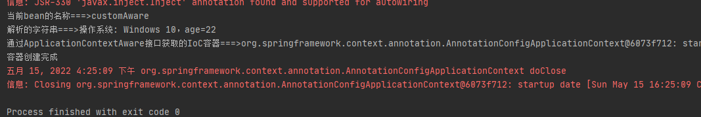

# 第22章：Aware注入Spring底层组件&原理

## Aware接口概述
定位到`org.springframework.beans.factory.Aware`
```java
package org.springframework.beans.factory;

/**
 * Marker superinterface indicating that a bean is eligible to be
 * notified by the Spring container of a particular framework object
 * through a callback-style method. Actual method signature is
 * determined by individual subinterfaces, but should typically
 * consist of just one void-returning method that accepts a single
 * argument.
 *
 * <p>Note that merely implementing {@link Aware} provides no default
 * functionality. Rather, processing must be done explicitly, for example
 * in a {@link org.springframework.beans.factory.config.BeanPostProcessor BeanPostProcessor}.
 * Refer to {@link org.springframework.context.support.ApplicationContextAwareProcessor}
 * and {@link org.springframework.beans.factory.support.AbstractAutowireCapableBeanFactory}
 * for examples of processing {@code *Aware} interface callbacks.
 *
 * @author Chris Beams
 * @since 3.1
 */
public interface Aware {

}
```
`Aware`接口是Spring3.1引入的，

在Spring中提供的继承`Aware`接口的接口


## 案例
定义一个名称`CustomAware`的类并实现`ApplicationContextAware, BeanNameAware, EmbeddedValueResolverAware`接口，获取IoC容器：
```java
package cn.forbearance.spring.bean;

import org.springframework.beans.BeansException;
import org.springframework.beans.factory.BeanNameAware;
import org.springframework.context.ApplicationContext;
import org.springframework.context.ApplicationContextAware;
import org.springframework.context.EmbeddedValueResolverAware;
import org.springframework.util.StringValueResolver;

/**
 * @author cristina
 */
public class CustomAware implements ApplicationContextAware, BeanNameAware, EmbeddedValueResolverAware {

    private ApplicationContext applicationContext;

    @Override
    public void setApplicationContext(ApplicationContext applicationContext) throws BeansException {
        System.out.println("通过ApplicationContextAware接口获取的IoC容器===>" + applicationContext);
        this.applicationContext = applicationContext;
    }

    @Override
    public void setBeanName(String name) {
        System.out.println("当前bean的名称===>" + name);
    }

    @Override
    public void setEmbeddedValueResolver(StringValueResolver resolver) {
        String value = resolver.resolveStringValue("操作系统: ${os.name}，age=#{22}");
        System.out.println("解析的字符串===>" + value);
    }
}
```
配置类：
```java
@Configuration
public class BeanConfig {

    @Bean
    public CustomAware customAware() {
        return new CustomAware();
    }

}
```
测试类：
```java
@Test
public void test01() {
    AnnotationConfigApplicationContext context = new AnnotationConfigApplicationContext(BeanConfig.class);
    System.out.println("容器创建完成");
    context.close();
}
```
运行测试类：



`ApplicationContextAware`接口能够获取到IoC容器，`BeanNameAware`接口能够获取到当前bean在Spring容器中的名称并可以自定义名称，`EmbeddedValueResolverAware`接口能够获取到String值解析器（解析占位符的字符串）。

## Aware接口原理
这里以`ApplicationContextAware`接口为例说明。`ApplicationContextAware`接口的底层原理是由`ApplicationContextAwareProcessor`类实现的。

方法调用栈：


其他的接口不再一一测试，如果不清楚执行时机，可以写一个对应功能的实现逻辑，然后在其方法左侧标注一个断点，以`debug`方法运行，并查看方法调用栈，查看方法走向。

定位`org.springframework.context.support.ApplicationContextAwareProcessor`：
```java
import java.security.AccessControlContext;
import java.security.AccessController;
import java.security.PrivilegedAction;

import org.springframework.beans.BeansException;
import org.springframework.beans.factory.Aware;
import org.springframework.beans.factory.config.BeanPostProcessor;
import org.springframework.beans.factory.config.EmbeddedValueResolver;
import org.springframework.context.ApplicationContextAware;
import org.springframework.context.ApplicationEventPublisherAware;
import org.springframework.context.ConfigurableApplicationContext;
import org.springframework.context.EmbeddedValueResolverAware;
import org.springframework.context.EnvironmentAware;
import org.springframework.context.MessageSourceAware;
import org.springframework.context.ResourceLoaderAware;
import org.springframework.util.StringValueResolver;

/**
 * {@link org.springframework.beans.factory.config.BeanPostProcessor}
 * implementation that passes the ApplicationContext to beans that
 * implement the {@link EnvironmentAware}, {@link EmbeddedValueResolverAware},
 * {@link ResourceLoaderAware}, {@link ApplicationEventPublisherAware},
 * {@link MessageSourceAware} and/or {@link ApplicationContextAware} interfaces.
 *
 * <p>Implemented interfaces are satisfied in order of their mention above.
 *
 * <p>Application contexts will automatically register this with their
 * underlying bean factory. Applications do not use this directly.
 *
 * @author Juergen Hoeller
 * @author Costin Leau
 * @author Chris Beams
 * @since 10.10.2003
 * @see org.springframework.context.EnvironmentAware
 * @see org.springframework.context.EmbeddedValueResolverAware
 * @see org.springframework.context.ResourceLoaderAware
 * @see org.springframework.context.ApplicationEventPublisherAware
 * @see org.springframework.context.MessageSourceAware
 * @see org.springframework.context.ApplicationContextAware
 * @see org.springframework.context.support.AbstractApplicationContext#refresh()
 */
class ApplicationContextAwareProcessor implements BeanPostProcessor {

	private final ConfigurableApplicationContext applicationContext;

	private final StringValueResolver embeddedValueResolver;


	/**
	 * Create a new ApplicationContextAwareProcessor for the given context.
	 */
	public ApplicationContextAwareProcessor(ConfigurableApplicationContext applicationContext) {
		this.applicationContext = applicationContext;
		this.embeddedValueResolver = new EmbeddedValueResolver(applicationContext.getBeanFactory());
	}


	@Override
	public Object postProcessBeforeInitialization(final Object bean, String beanName) throws BeansException {
		AccessControlContext acc = null;

		if (System.getSecurityManager() != null &&
				(bean instanceof EnvironmentAware || bean instanceof EmbeddedValueResolverAware ||
						bean instanceof ResourceLoaderAware || bean instanceof ApplicationEventPublisherAware ||
						bean instanceof MessageSourceAware || bean instanceof ApplicationContextAware)) {
			acc = this.applicationContext.getBeanFactory().getAccessControlContext();
		}

		if (acc != null) {
			AccessController.doPrivileged(new PrivilegedAction<Object>() {
				@Override
				public Object run() {
					invokeAwareInterfaces(bean);
					return null;
				}
			}, acc);
		}
		else {
			invokeAwareInterfaces(bean);
		}

		return bean;
	}

	private void invokeAwareInterfaces(Object bean) {
		if (bean instanceof Aware) {
			if (bean instanceof EnvironmentAware) {
				((EnvironmentAware) bean).setEnvironment(this.applicationContext.getEnvironment());
			}
			if (bean instanceof EmbeddedValueResolverAware) {
				((EmbeddedValueResolverAware) bean).setEmbeddedValueResolver(this.embeddedValueResolver);
			}
			if (bean instanceof ResourceLoaderAware) {
				((ResourceLoaderAware) bean).setResourceLoader(this.applicationContext);
			}
			if (bean instanceof ApplicationEventPublisherAware) {
				((ApplicationEventPublisherAware) bean).setApplicationEventPublisher(this.applicationContext);
			}
			if (bean instanceof MessageSourceAware) {
				((MessageSourceAware) bean).setMessageSource(this.applicationContext);
			}
			if (bean instanceof ApplicationContextAware) {
				((ApplicationContextAware) bean).setApplicationContext(this.applicationContext);
			}
		}
	}

	@Override
	public Object postProcessAfterInitialization(Object bean, String beanName) {
		return bean;
	}

}
```
重点关注`invokeAwareInterfaces()`方法，如果bean实现了`ApplicationContextAware`接口，Spring则会回调`setApplicationContext()`方法将对象注入。

并且`ApplicationContextAwareProcessor`接口实现了`BeanPostProcessor`接口，本质上是一个后置处理器。