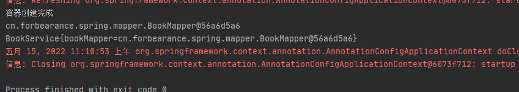
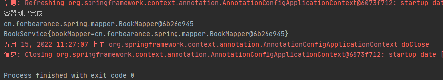
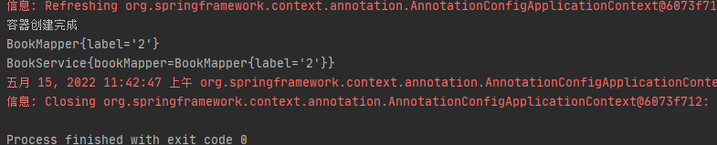

# 第19章：@Autowired&@Qualifier&@Primary
## 是什么
### @Autowired
定位到`org.springframework.beans.factory.annotation.Autowired`
```java
@Target({ElementType.CONSTRUCTOR, ElementType.METHOD, ElementType.PARAMETER, ElementType.FIELD, ElementType.ANNOTATION_TYPE})
@Retention(RetentionPolicy.RUNTIME)
@Documented
public @interface Autowired {

	/**
	 * Declares whether the annotated dependency is required.
	 * <p>Defaults to {@code true}.
	 */
	boolean required() default true;

}
```
能够标注在类、接口、成员变量、构造函数以及方法上。

`@Autowired`注解默认是优先按照类型去容器中找对应的组件，相当于`applicationContext.getBean(Person.class)`。如果找到多个类型相同的组件，则将属性名作为id去容器中查找，相当于`applicationContext.getBean("person")`。

### Qualifier
`@Autowired`是按照类型自动装配的，如果按照名称进行装配，需要和`Qualifier`配合使用。

定位到`org.springframework.beans.factory.annotation.Qualifier`
```java
@Target({ElementType.FIELD, ElementType.METHOD, ElementType.PARAMETER, ElementType.TYPE, ElementType.ANNOTATION_TYPE})
@Retention(RetentionPolicy.RUNTIME)
@Inherited
@Documented
public @interface Qualifier {

	String value() default "";

}
```
### @Primary
定位到`org.springframework.context.annotation.Primary`

对于一个接口，可能会多个实现类，默认情况下与`@Autowired`一起应用于注入。Spring会抛出NoUniqueBeanDefinitionException。则可以使用`@Primary`来赋予bean更高的优先级。
```java
@Target({ElementType.TYPE, ElementType.METHOD})
@Retention(RetentionPolicy.RUNTIME)
@Inherited
@Documented
public @interface Primary {

}
```
## 能干嘛
Spring组件的自动装配就是利用依赖注入(DI)，完成对IoC容器中各个组件的依赖关系赋值。
## 去哪下
## 怎么玩
### @Autowired
定义名为BookMapper、BookService的类：
```java
package cn.forbearance.spring.mapper;

import org.springframework.stereotype.Repository;

/**
 * @author cristina
 */
@Repository
public class BookMapper {
}
```

```java
package cn.forbearance.spring.service;

import cn.forbearance.spring.mapper.BookMapper;
import org.springframework.beans.factory.annotation.Autowired;
import org.springframework.stereotype.Service;

/**
 * @author cristina
 */
@Service
public class BookService {

    @Autowired
    private BookMapper bookMapper;

    @Override
    public String toString() {
        return "BookService{" +
                "bookMapper=" + bookMapper +
                '}';
    }
}
```
配置类：
```java
@Configuration
@PropertySource("classpath:/application.properties")
@ComponentScan({"cn.forbearance.spring.mapper", "cn.forbearance.spring.service"})
public class BeanConfig {

    @Bean
    public Person person() {
        return new Person();
    }
}
```
测试类：
```java
@Test
public void test01() {
    AnnotationConfigApplicationContext context = new AnnotationConfigApplicationContext(BeanConfig.class);
    System.out.println("容器创建完成");
    BookMapper mapper = context.getBean(BookMapper.class);
    System.out.println(mapper);
    BookService service = context.getBean(BookService.class);
    System.out.println(service);
    context.close();
}
```
运行测试类：



`@Autowired`注入的属性和从容器中获取的bean是同一个对象。

如果容器中存在多个`BookMapper`对象，`@Autowired`注解默认是优先按照类型去容器中找对应的组件，如果找到多个类型相同的组件，则将属性名作为id去容器中查找。

`@Autowired`如果没找到组件，会报错NoSuchBeanDefinitionException，通过设置`@Autowired`的required属性为false即可，找不到就不装配。

### @Qualifier
`@Autowired`是按照类型自动装配的，如果按照名称进行装配，需要和`Qualifier`配合使用。如果存在多个同类型组件时，@Qualifier用来指定`@Autowired`装配哪个组件。

修改 BookService，添加`@Qualifier` ：
```java
package cn.forbearance.spring.service;

import cn.forbearance.spring.mapper.BookMapper;
import org.springframework.beans.factory.annotation.Autowired;
import org.springframework.beans.factory.annotation.Qualifier;
import org.springframework.stereotype.Service;

/**
 * @author cristina
 */
@Service
public class BookService {

    @Qualifier("bookMapper")
    @Autowired
    private BookMapper bookMapper;

    @Override
    public String toString() {
        return "BookService{" +
                "bookMapper=" + bookMapper +
                '}';
    }
}
```
运行测试类：



### @Primary
对于一个接口，可能会多个实现类，默认情况下与`@Autowired`一起应用于注入。Spring会抛出NoUniqueBeanDefinitionException。则可以使用`@Primary`来赋予bean更高的优先级。

修改配置类：
```java
package cn.forbearance.spring.config;

import cn.forbearance.spring.bean.Person;
import cn.forbearance.spring.mapper.BookMapper;
import org.springframework.context.annotation.*;

/**
 * @author cristina
 */
@Configuration
@PropertySource("classpath:/application.properties")
@ComponentScan({"cn.forbearance.spring.mapper", "cn.forbearance.spring.service"})
public class BeanConfig {

    @Bean("person")
    public Person person() {
        return new Person();
    }

    @Primary
    @Bean("bookMapper1")
    public BookMapper bookMapper1() {
        BookMapper bookMapper = new BookMapper();
        bookMapper.setLabel("2");
        return bookMapper;
    }

}
```
运行测试类：



如果并未明确指定哪个bean，以`@Primary`为主。如果明确指定注入哪个bean，那么以`@Qualifier`为主。

## 小结