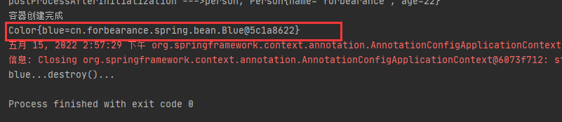
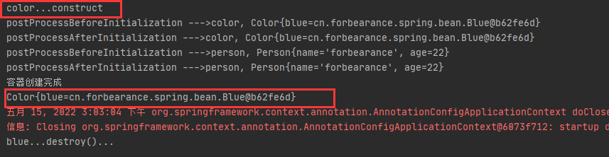
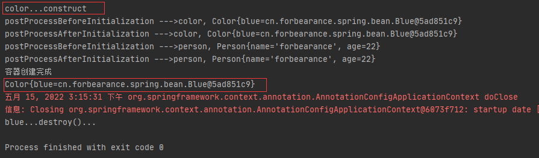
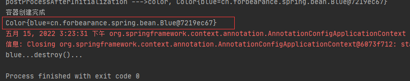

# 第21章：方法、构造器实现自动装配
## 案例
### 标注在方法
定义一个名为`Color`的类：
```java
package cn.forbearance.spring.bean;

import org.springframework.beans.factory.annotation.Autowired;
import org.springframework.stereotype.Component;

/**
 * @author cristina
 */
@Component
public class Color {

    private Blue blue;

    public Color(Blue blue) {
        this.blue = blue;
    }

    public Blue getBlue() {
        return blue;
    }

    @Autowired
    public void setBlue(Blue blue) {
        this.blue = blue;
    }

    @Override
    public String toString() {
        return "Color{" +
                "blue=" + blue +
                '}';
    }
}
```
配置类：
```java
package cn.forbearance.spring.config;

import cn.forbearance.spring.bean.Blue;
import cn.forbearance.spring.bean.Color;
import cn.forbearance.spring.bean.Person;
import org.springframework.context.annotation.Bean;
import org.springframework.context.annotation.ComponentScan;
import org.springframework.context.annotation.Configuration;
import org.springframework.context.annotation.PropertySource;


/**
 * @author cristina
 */
@Configuration
@PropertySource("classpath:/application.properties")
@ComponentScan({"cn.forbearance.spring.mapper", "cn.forbearance.spring.service", "cn.forbearance.spring.bean"})
public class BeanConfig {

    @Bean("person")
    public Person person() {
        return new Person();
    }

    @Bean
    public Blue blue() {
        return new Blue();
    }

}
```
测试类：
```java
@Test
public void test01() {
    AnnotationConfigApplicationContext context = new AnnotationConfigApplicationContext(BeanConfig.class);
    System.out.println("容器创建完成");
    Color color = context.getBean(Color.class);
    System.out.println(color);
    context.close();
}
```
运行测试类：



### 标注在构造器
```java
package cn.forbearance.spring.bean;

import org.springframework.beans.factory.annotation.Autowired;
import org.springframework.stereotype.Component;

/**
 * @author cristina
 */
@Component
public class Color {

    private Blue blue;

    @Autowired
    public Color(Blue blue) {
        this.blue = blue;
        System.out.println("color...construct");
    }

    public Blue getBlue() {
        return blue;
    }

//    @Autowired
    public void setBlue(Blue blue) {
        this.blue = blue;
    }

    @Override
    public String toString() {
        return "Color{" +
                "blue=" + blue +
                '}';
    }
}
```
运行测试类：



### 标注在参数
```java
package cn.forbearance.spring.bean;

import org.springframework.beans.factory.annotation.Autowired;
import org.springframework.stereotype.Component;

/**
 * @author cristina
 */
@Component
public class Color {

    private Blue blue;

//    @Autowired
    public Color(@Autowired Blue blue) {
        this.blue = blue;
        System.out.println("color...construct");
    }

    public Blue getBlue() {
        return blue;
    }

//    @Autowired
    public void setBlue(/*@Autowired*/ Blue blue) {
        this.blue = blue;
    }

    @Override
    public String toString() {
        return "Color{" +
                "blue=" + blue +
                '}';
    }
}
```
运行测试类：



无论`@Autowired`标注在字段、方法、构造器还是参数上，参数位置的组件都是从IoC容器中获取的。

如果`@Autowired`注解标注在构造器上，且组件中只有一个有参构造方法时，则`@Autowired`注解可以省略，

### 标注在自定义方法
```java
@Bean
public Color color(/*@Autowired*/ Blue blue) {
    Color color = new Color();
    color.setBlue(blue);
    return color;
}
```
测试：



标注在自定义方法上，且配合`@Bean`注解使用，可以省略`@Autowired`。

