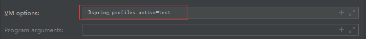
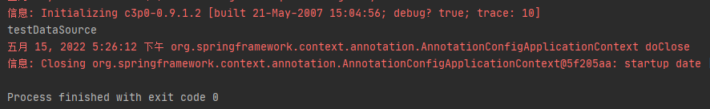
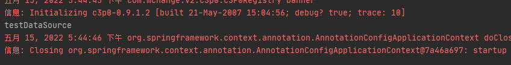
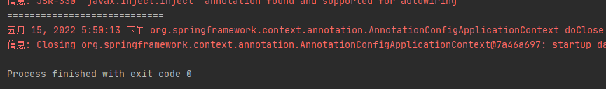
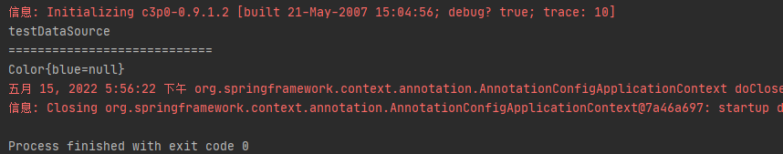

# 第23章：@Profile根据环境注册bean
## @Profile概述
```java
package org.springframework.context.annotation;

import java.lang.annotation.Documented;
import java.lang.annotation.ElementType;
import java.lang.annotation.Retention;
import java.lang.annotation.RetentionPolicy;
import java.lang.annotation.Target;

import org.springframework.core.env.AbstractEnvironment;
import org.springframework.core.env.ConfigurableEnvironment;

@Target({ElementType.TYPE, ElementType.METHOD})
@Retention(RetentionPolicy.RUNTIME)
@Documented
@Conditional(ProfileCondition.class)
public @interface Profile {

	/**
	 * The set of profiles for which the annotated component should be registered.
	 */
	String[] value();

}
```
`@Profile`注解的作用是指定类或方法在特定的环境生效。在使用依赖注入（DI）的时候，能够根据`@Profile`指定的环境，注入符合当前运行环境的对应的bean。
1. 如果`@Profile`标注在类上，则只有在满足指定环境的情况下，整个配置类中的配置才会生效。
2. 如果一个bean没有使用`@Profile`标注，则这个bean在任何环境下都会生效，被注册到IoC容器中。并且还要满足配置类也能够生效。

## 案例
### 方式一（修改运行环境方式）
导入pom依赖
```xml
<dependency>
    <groupId>c3p0</groupId>
    <artifactId>c3p0</artifactId>
    <version>0.9.1.2</version>
</dependency>
<dependency>
    <groupId>mysql</groupId>
    <artifactId>mysql-connector-java</artifactId>
    <version>5.1.43</version>
</dependency>
```
配置文件`properties`：
```properties
db.user=root
db.password=root
db.driverClass=com.mysql.jdbc.Driver
```
配置类：
```java
package cn.forbearance.spring.config;

import com.mchange.v2.c3p0.ComboPooledDataSource;
import org.springframework.beans.factory.annotation.Value;
import org.springframework.context.annotation.Bean;
import org.springframework.context.annotation.Configuration;
import org.springframework.context.annotation.Profile;
import org.springframework.context.annotation.PropertySource;

import javax.sql.DataSource;


/**
 * @author cristina
 */
@Configuration
@PropertySource("classpath:/application.properties")
public class BeanConfig {

    @Value("${db.user}")
    private String user;

    @Value("${db.password}")
    private String password;

    @Value("${db.driverClass}")
    private String driverClass;

    @Profile("test")
//    @Profile("default")
    @Bean("testDataSource")
    public DataSource dataSourceTest() throws Exception {
        ComboPooledDataSource dataSource = new ComboPooledDataSource();
        dataSource.setUser(user);
        dataSource.setPassword(password);
        dataSource.setJdbcUrl("jdbc:mysql://localhost:3306/test");
        dataSource.setDriverClass(driverClass);
        return dataSource;
    }

    @Profile("dev")
    @Bean("devDataSource")
    public DataSource dataSourceDev() throws Exception {
        ComboPooledDataSource dataSource = new ComboPooledDataSource();
        dataSource.setUser(user);
        dataSource.setPassword(password);
        dataSource.setJdbcUrl("jdbc:mysql://localhost:3306/ssm_crud");
        dataSource.setDriverClass(driverClass);
        return dataSource;
    }

    @Profile("prod")
    @Bean("prodDataSource")
    public DataSource dataSourceProd() throws Exception {
        ComboPooledDataSource dataSource = new ComboPooledDataSource();
        dataSource.setUser(user);
        dataSource.setPassword(password);
        dataSource.setJdbcUrl("jdbc:mysql://localhost:3306/scw_0515");
        dataSource.setDriverClass(driverClass);
        return dataSource;
    }

}
```
使用`@Profile`指定环境之后，只有这个环境被激活，对应的bean才会被注册到IoC容器中。如果需要一个默认环境，可以使用`@Profile("default")`来标识一个默认环境。

测试类：
```java
@Test
public void test01() {
    AnnotationConfigApplicationContext context = new AnnotationConfigApplicationContext(BeanConfig.class);
    String[] beanNames = context.getBeanNamesForType(DataSource.class);
    for (String beaName : beanNames) {
        System.out.println(beaName);
    }
    context.close();
}
```
并将运行环境更改为`test`环境，`-Dspring.profiles.active=test`，设置如下：



运行测试类，测试`test`环境：



### 方式二（编码方式）
通过`AnnotationConfigApplicationContext`类的无参构造实现，具体步骤：
1. 使用`@Profile`注解指定加载bean的环境
2. 通过`AnnotationConfigApplicationContext`的无参构造创建容器
3. 设置容器环境
4. 设置容器的配置类
5. 刷新容器

其中，2、4、5步是`AnnotationConfigApplicationContext`类的有参构造的步骤：
```java
public AnnotationConfigApplicationContext(Class<?>... annotatedClasses) {
    this();
    register(annotatedClasses);
    refresh();
}
```
测试类：
```java
@Test
public void test02() {
    // 2、无参构造
    AnnotationConfigApplicationContext context = new AnnotationConfigApplicationContext();
    // 3、设置环境，可以设置多个环境
    context.getEnvironment().setActiveProfiles("test");
    // 4、注册配置类
    context.register(BeanConfig.class);
    // 5、刷新容器
    context.refresh();

    String[] beanNames = context.getBeanNamesForType(DataSource.class);
    for (String beaName : beanNames) {
        System.out.println(beaName);
    }
    context.close();
}
```
运行测试类：



将`@Profile`注解标注在类上：
```java
package cn.forbearance.spring.config;

import cn.forbearance.spring.bean.Color;
import com.mchange.v2.c3p0.ComboPooledDataSource;
import org.springframework.beans.factory.annotation.Value;
import org.springframework.context.annotation.Bean;
import org.springframework.context.annotation.Configuration;
import org.springframework.context.annotation.Profile;
import org.springframework.context.annotation.PropertySource;

import javax.sql.DataSource;


/**
 * @author cristina
 */
@Profile("dev")
@Configuration
@PropertySource("classpath:/application.properties")
public class BeanConfig {

    @Value("${db.user}")
    private String user;

    @Value("${db.password}")
    private String password;

    @Value("${db.driverClass}")
    private String driverClass;

    @Bean
    public Color color() {
        return new Color();
    }

    @Profile("test")
//    @Profile("default")
    @Bean("testDataSource")
    public DataSource dataSourceTest() throws Exception {
        ComboPooledDataSource dataSource = new ComboPooledDataSource();
        dataSource.setUser(user);
        dataSource.setPassword(password);
        dataSource.setJdbcUrl("jdbc:mysql://localhost:3306/test");
        dataSource.setDriverClass(driverClass);
        return dataSource;
    }

    @Profile("dev")
    @Bean("devDataSource")
    public DataSource dataSourceDev() throws Exception {
        ComboPooledDataSource dataSource = new ComboPooledDataSource();
        dataSource.setUser(user);
        dataSource.setPassword(password);
        dataSource.setJdbcUrl("jdbc:mysql://localhost:3306/ssm_crud");
        dataSource.setDriverClass(driverClass);
        return dataSource;
    }

    @Profile("prod")
    @Bean("prodDataSource")
    public DataSource dataSourceProd() throws Exception {
        ComboPooledDataSource dataSource = new ComboPooledDataSource();
        dataSource.setUser(user);
        dataSource.setPassword(password);
        dataSource.setJdbcUrl("jdbc:mysql://localhost:3306/scw_0515");
        dataSource.setDriverClass(driverClass);
        return dataSource;
    }

}
```
测试类：
```java
@Test
public void test02() {
    // 2、无参构造
    AnnotationConfigApplicationContext context = new AnnotationConfigApplicationContext();
    // 3、设置环境
    context.getEnvironment().setActiveProfiles("test");
    // 4、注册配置类
    context.register(BeanConfig.class);
    // 5、刷新容器
    context.refresh();

    String[] beanNames = context.getBeanNamesForType(DataSource.class);
    for (String beaName : beanNames) {
        System.out.println(beaName);
    }
    System.out.println("============================");
//  Color color = context.getBean(Color.class);
//  System.out.println(color);
    context.close();
}
```
运行测试类：



会发现没有bean，这是因为在类上标注`@Profile`注解后，只有指定环境被激活，整个配置类中的配置才会生效。

将配置类上的`@Profile`注解注释，并将测试类中test02方法的两行注释代码取消注释，然后运行测试类：



这也证明了如果一个bean没有使用`@Profile`注解标注，那么这个bean在任何环境下都会被注册到IoC容器中，前提是这个配置类要生效。