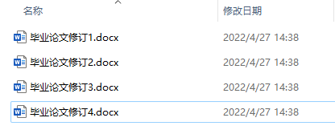
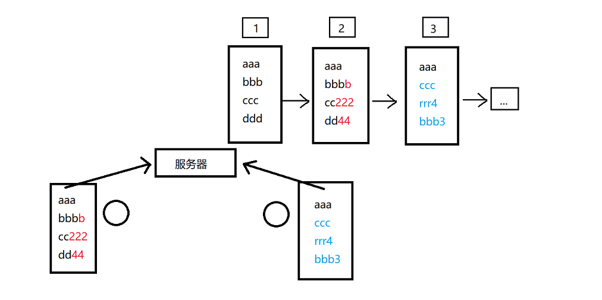
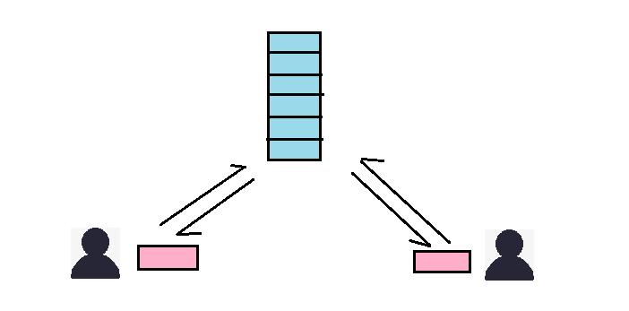
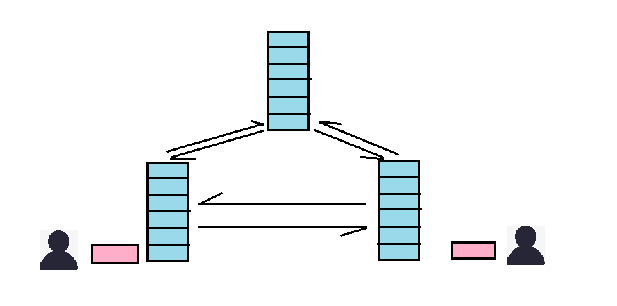
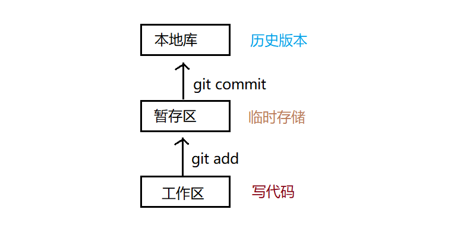
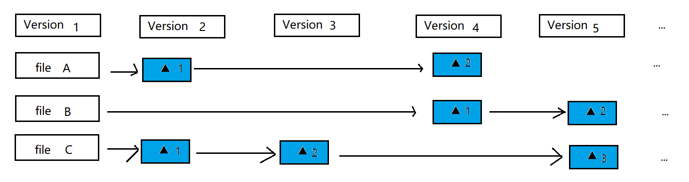

# 第一章：Git 概述
> What matters is what you do, not what you think.

## 什么是Git
&emsp;&emsp;Git 是一个免费的、开源的分布式版本控制系统，可以快速高效的处理从小型到大型的所有项目。

&emsp;&emsp;Git 易于学习，占用空间小，性能极快。其性能优于 SCM 工具，如 Subversion、CVS、Perforce 和 ClearCase，具有廉价的本地分支、方便的暂存区域和多个工作流等功能

&emsp;&emsp;从根本上讲，Git 是一个内容寻址的文件系统。

## 什么是版本控制
&emsp;&emsp;版本控制是一种记录文件内容变化，方便查阅特定版本修订情况的系统。

&emsp;&emsp;版本控制其实最重要的是可以记录文件修改历史记录，从而让用户能够查看历史版本，方便版本切换。

 

## 为什么需要版本控制
1. 实现跨区域多人协同开发
2. 追踪和记载一个或多个文件的历史记录
3. 组织和保护源代码和文档
4. 统计工作量
5. 并行开发，提高开发效率
6. 跟踪记录整个项目的开发过程

个人开发过渡到团队协作

 

## 版本控制工具
&emsp;&emsp;集中式版本控制工具的版本控制的位置在中央服务器。分布式版本控制工具的版本控制的位置在本地电脑。
### 集中式版本控制工具
&emsp;&emsp;主流产品: CVS、SVM(Subversion)、VSS ...

&emsp;&emsp;集中式版本控制系统的版本库是集中存放在中央服务器的。需要先从中央服务器取得最新的版本库，然后开始编写程序，再推给中央服务器。

工作原理：
1. 管理员搭建好项目框架
2. 在公司服务器创建一个远程仓库，并将代码提交到远程仓库
3. 团队成员拉取代码，并行开发
4. 每个人独立负责一个功能，开发完后将代码提交到远程仓库
5. 其他人随时拉去代码，保持同步

缺点：
1. 需要一台中央服务器(版本库)，如果中央服务器出现故障，所有人无法工作
2. 如果中央服务器不在局域网内的情况下，断网是不可以使用的

### 分布式版本控制工具
&emsp;&emsp;主流产品: Git、Mercurial、Bazaar、Darcs ...

&emsp;&emsp;像 Git 这种分布式版本控制工具是没有中央服务器的。中央服务器是集中式版本控制工具用来做版本控制的。而 Git 的版本控制在本地，所以没有中央服务器一说。客户端提取的不是最新版本的文件快照，而是拷贝仓库的完整镜像。这样任何一处协同工作用的文件发生故障，事后都可以通过其他客户端的本地仓库进行恢复。因为每个客户端的每一次文件提取操作，实际上都是一次对整个仓库的完整备份。

工作流程：
1. 管理员搭建好项目框架，并提交到代码仓库
2. 在公司服务器搭建一个远程仓库，并将项目提交推送到远程仓库
3. 其他人把远程仓库克隆到本地，各自拥有一套本地仓库，开始并行开发
4. 每个人独立负责一个功能，可以把每一个小改动提交到本地仓库
5. 功能开发完后，在将本地仓库的代码推送到远程仓库
6. 其他人可以选择把这些提交同步到自己的本地仓库，与本地仓库代码合并

特点：
1. 服务器断网的情况也可以进行开发，因为版本控制在本地进行
2. 克隆远程仓库之后，每一台机器都是一个独立的完整版本库，容错率高

## Git 工作机制

&emsp;&emsp;Git 和其他版本控制系统的差别在于，Git 只关心文件数据的整体是否发生变化，而大部分的版本控制系统只关心文件内容的具体差异。诸如CVS、Subversion、Bazaar 这类系统每次记录哪些文件做了更新，以及都更新了哪些行的什么内容。 再比如 SVN 存储的是 diff，而 Git 存储的是整个快照 commit 。

&emsp;&emsp;Git 并不保存这些前后的变化差异。Git 更像是把变化的文件提交快照后，记录再一个微型的文件系统中。每次提交更新时，它会遍历所有文件的指纹信息并对文件保存快照，然后保存一个指向这次快照的索引(经过算法得到的hash值)。为提高性能，若文件没有变化，Git 不会再次保存，而是只对上次保存的快照做一个引用。

